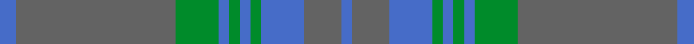

This is one **variant** — a specific cloth: this exact thread count and colourway, with its own
provenance below. It is one weaving of the [sett](/setts/b3n30g8b2g2b2g2b8n7b2/) (the scale-free proportion — the
same cloth at any scale or shade), whose colour order is pattern [BBBGBGBGBB](/stripes/bbbgbgbgbb/).

Part of the [Gray](/tartans/g/gr/gray-2/) tartan — the named design grouping this sett with its other cloths.

Sourced from weddslist.  It is a [10 stripe tartan](/stripes/stripes10/).

Original link [http://www.weddslist.com/cgi-bin/tartans/pg.pl?source=sts](http://www.weddslist.com/cgi-bin/tartans/pg.pl?source=sts)

Dataset <small>— provenance for this record, inherited from the source manifest</small>

<dl class="dataset-prov">
<dt>source</dt><dd><a href="/sources/weddslist/">Weddslist</a></dd>
<dt>data captured from</dt><dd><a href="https://github.com/thetartan/tartan-database/blob/master/data/weddslist/data.csv">https://github.com/thetartan/tartan-database/blob/master/data/weddslist/data.csv</a></dd>
<dt>data date</dt><dd>2016-11-17 <small>(dataset default)</small></dd>
<dt>licence</dt><dd><a href="https://creativecommons.org/licenses/by-nc-nd/4.0/">CC BY-NC-ND 4.0</a></dd>
</dl>

Capture chain <small>— the hands this data passed through, oldest first; each capture carries its own licence</small>

<ol class="capture-chain">
<li><a href="https://www.weddslist.com/tartans/">Weddslist</a> <small>the living privately compiled reference</small></li>
<li><a href="https://github.com/thetartan/tartan-database">thetartan/tartan-database</a> <small>2016-2017</small> · <a href="https://creativecommons.org/licenses/by-nc-nd/4.0/">CC BY-NC-ND 4.0</a> <small>Levko Kravets's frozen compilation — the capture we vendored, and where its CC licence text came from</small></li>
<li>this dictionary <small>captured 2026-06-10 · commit 5bf86c7566</small> <small>each re-capture is a git commit to data/sources</small></li>
</ol>

## Thread count
B/6 N60 G16 B4 G4 B4 G4 B16 N14 B/4

One full sett is **254 threads**.

## Palette
<table><thead><tr><th>Colour</th><th>Shade</th><th>OKLCh</th></tr></thead><tbody><tr><td>B</td><td><code style="background-color:#466CC8;">#466CC8</code> <small style="color:#888">#466CC8</small></td><td><small style="color:#888">oklch(55.1% 0.149 265.0)</small></td></tr><tr><td>G</td><td><code style="background-color:#008B2A;">#008B2A</code> <small style="color:#888">#008B2A</small></td><td><small style="color:#888">oklch(55.4% 0.170 145.9)</small></td></tr><tr><td>N</td><td><code style="background-color:#636363;">#636363</code> <small style="color:#888">#636363</small></td><td><small style="color:#888">oklch(50.0% 0.000 89.9)</small></td></tr></tbody></table>

# Sample pattern

## Nearest tartan variants

The nearest existing variants by ΔTartan distance, with this cloth at the top so the swatches line up against it.

ΔTartan

Threads

Variant

Sett

—

254

<a href="/variants/s10/b3n30g8b2g2b2g2b8n7b2~x2/">Gray</a>

<a href="/ttd/edit/#slug=do2n4dg12n3do6t2n24do2n2dg2~x2&amp;base=b3n30g8b2g2b2g2b8n7b2~x2" title="compare in the TTD">3.25</a>

228

<a href="/variants/s10/do2n4dg12n3do6t2n24do2n2dg2~x2/">Wicklow Irish County Tartan</a>

<a href="/ttd/edit/#slug=db2dp26dg26db2dg3db2dg3db14dp2db2~x2&amp;base=b3n30g8b2g2b2g2b8n7b2~x2" title="compare in the TTD">3.82</a>

320

<a href="/variants/s10/db2dp26dg26db2dg3db2dg3db14dp2db2~x2/">Wcwm 1527-2</a>

## Neighbour map

Every grey dot is one of 13621 variants placed by the first two principal components of the ΔTartan feature space (42% of its variance). Red is this tartan; blue dots are its nearest — click one to open its page. The map is a flat projection of a many-dimensional space — [how to read it](/posts/neighbourhood-maps/).

<svg viewBox="0 0 640 380" role="img" style="max-width:100%;height:auto;border:1px solid #e0e0e0;border-radius:4px;display:block" xmlns="http://www.w3.org/2000/svg"><image href="/nn/cloud.v1.png" width="640" height="380"/><a href="/variants/s10/do2n4dg12n3do6t2n24do2n2dg2~x2/"><circle cx="485.3" cy="233.2" r="4" fill="#3465a4"><title>Wicklow Irish County Tartan</title></circle></a><a href="/variants/s10/db2dp26dg26db2dg3db2dg3db14dp2db2~x2/"><circle cx="452.8" cy="249.4" r="4" fill="#3465a4"><title>Wcwm 1527-2</title></circle></a><circle cx="534.9" cy="241.1" r="5" fill="#c00000"/><text x="320" y="376" text-anchor="middle" font-size="11" fill="#999">ground</text><text x="11" y="190" text-anchor="middle" font-size="11" fill="#999" transform="rotate(-90 11 190)">complexity</text></svg>

ID: /variants/s10/b3n30g8b2g2b2g2b8n7b2~x2/
