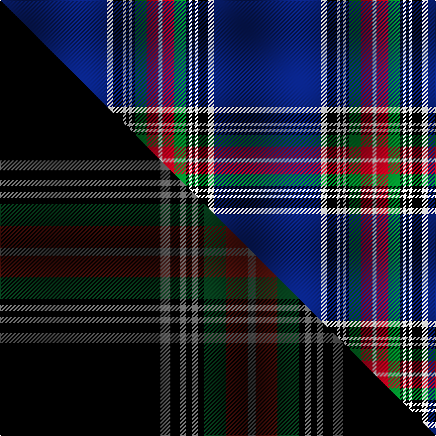

This page is one **sett** — a single exact thread-count. It belongs to the [tartan](/setts/db108w6k10w3k3w3k3g12r12w4/)
(the same proportion at any scale), whose colour order is pattern [BWKWKWKGRW](/stripes/bwkwkwkgrw/).

Part of the [Racing Stewart](/tartans/racing-stewart/) tartan — the named design grouping this sett with its other cloths.

Sourced from weddslist.  It is a [10 stripe tartan](/stripes/stripes10/).

Original link http://www.weddslist.com/cgi-bin/tartans/pg.pl?source=sts

## Provenance

Earliest known date: 1990 The tartan that appears on the Jackie Stewart formula one racing car.

2 attestations — the source records this cloth was collapsed from (oldest owns this page)

<ul>
<li>undated — Racing Stewart (weddslist, <a href="http://www.weddslist.com/cgi-bin/tartans/pg.pl?source=sts">record</a>) </li>
<li>undated — Racing Stewart Corporate Tartan (house-of-tartan, <a href="http://www.house-of-tartan.scotland.net/house/TartanViewjs.asp?colr=Def&tnam=2306">record</a>) </li>
</ul>

## Thread count
DB/108 W6 K10 W3 K3 W3 K3 G12 R12 W/4

One full sett is **216 threads**.

## Palette
<table><thead><tr><th>Colour</th><th>Shade</th><th>OKLCh</th></tr></thead><tbody><tr><td>DB</td><td><code style="background-color:#082077;">#082077</code> <small style="color:#888">#082077</small></td><td><small style="color:#888">oklch(30.0% 0.149 265.1)</small></td></tr><tr><td>G</td><td><code style="background-color:#008B2A;">#008B2A</code> <small style="color:#888">#008B2A</small></td><td><small style="color:#888">oklch(55.4% 0.170 145.9)</small></td></tr><tr><td>K</td><td><code style="background-color:#000000;">#000000</code> <small style="color:#888">#000000</small></td><td><small style="color:#888">oklch(0.0% 0.000 0.0)</small></td></tr><tr><td>W</td><td><code style="background-color:#F7F7F7;">#F7F7F7</code> <small style="color:#888">#F7F7F7</small></td><td><small style="color:#888">oklch(97.6% 0.000 89.9)</small></td></tr><tr><td>R</td><td><code style="background-color:#D60020;">#D60020</code> <small style="color:#888">#D60020</small></td><td><small style="color:#888">oklch(55.2% 0.224 25.5)</small></td></tr></tbody></table>

# Sample pattern

## Compared to the master

This cloth is one sett of its design; the master sett (the exemplar the design is anchored on) is below for comparison.

Its **ΔTartan distance** from the master is **1.19** — the same measure the nearest-tartans table ranks by (0 is identical; a re-scale of the same cloth is near 0, a recolour or a different proportion further).

<figure class="master-compare" style="margin:0">

this sett
master sett ★

<figcaption style="color:#888;font-size:smaller">One weave of this sett against the <a href="/setts/k81n5k5n3k3n3k3dg11dr11n4/">master sett ★</a>, split on the diagonal: a shared proportion runs seamlessly across it with only the shades shifting; a different proportion breaks on it.</figcaption>
</figure>

## Nearest tartan variants

The nearest existing variants by ΔTartan distance, with this cloth at the top so the swatches line up against it.

ΔTartan

Threads

Variant

Sett

—

216

<a href="/variants/s10/db108w6k10w3k3w3k3g12r12w4/">Racing Stewart</a>

<a href="/ttd/edit/#slug=db54lb3k5lb1k2lb1k2g8dr8lb2~x2&amp;base=db108w6k10w3k3w3k3g12r12w4" title="compare in the TTD">1.62</a>

232

<a href="/variants/s10/db54lb3k5lb1k2lb1k2g8dr8lb2~x2/">Racing Stewart</a>

<a href="/ttd/edit/#slug=db62k22w3k2w2k3r1~x2&amp;base=db108w6k10w3k3w3k3g12r12w4" title="compare in the TTD">1.62</a>

254

<a href="/variants/s7/db62k22w3k2w2k3r1~x2/">Tyneside Blue, North Tyneside Pipe Band</a>

<a href="/ttd/edit/#slug=g5w1r5k5db43r1~x2&amp;base=db108w6k10w3k3w3k3g12r12w4" title="compare in the TTD">1.78</a>

228

<a href="/variants/s6/g5w1r5k5db43r1~x2/">Michael (John) (Personal)</a>

<a href="/ttd/edit/#slug=k8dr26k22db110w4k5w4&amp;base=db108w6k10w3k3w3k3g12r12w4" title="compare in the TTD">1.79</a>

346

<a href="/variants/s7/k8dr26k22db110w4k5w4/">University of Edinburgh</a>

<a href="/ttd/edit/#slug=db90k10y2k4w2k4t14r12k2r5w4&amp;base=db108w6k10w3k3w3k3g12r12w4" title="compare in the TTD">1.79</a>

204

<a href="/variants/s11/db90k10y2k4w2k4t14r12k2r5w4/">Lanyard Blue (Fashion)</a>

<a href="/ttd/edit/#slug=db42k6lo2k3lo2g10dr7k2~x2&amp;base=db108w6k10w3k3w3k3g12r12w4" title="compare in the TTD">1.89</a>

208

<a href="/variants/s8/db42k6lo2k3lo2g10dr7k2~x2/">MacBeth (Fashion)</a>

<a href="/ttd/edit/#slug=db60w1y4k4w1lp8w2~x2&amp;base=db108w6k10w3k3w3k3g12r12w4" title="compare in the TTD">1.94</a>

196

<a href="/variants/s7/db60w1y4k4w1lp8w2~x2/">Nunavut Territory (District)</a>

<a href="/ttd/edit/#slug=db20k3y1w1g3r3k1r2w1~x2&amp;base=db108w6k10w3k3w3k3g12r12w4" title="compare in the TTD">1.95</a>

98

<a href="/variants/s9/db20k3y1w1g3r3k1r2w1~x2/">Stewart Blue MINI Tartan</a>

<a href="/ttd/edit/#slug=k4w1lb2w1k16db36lb4~x2&amp;base=db108w6k10w3k3w3k3g12r12w4" title="compare in the TTD">2.01</a>

240

<a href="/variants/s7/k4w1lb2w1k16db36lb4~x2/">NHS Grampian</a>

<a href="/ttd/edit/#slug=k4w1lb2w1k16t36lb4~x2~lb3203246-t2405244&amp;base=db108w6k10w3k3w3k3g12r12w4" title="compare in the TTD">2.01</a>

240

<a href="/variants/s7/k4w1lb2w1k16t36lb4~x2~lb3203246-t2405244/">NHS Grampian (Corporate)</a>

## Neighbour map

Every grey dot is one of 13620 variants placed by the first two principal components of the ΔTartan feature space (42% of its variance). Red is this tartan; blue dots are its nearest — click one to open its page.

<svg viewBox="0 0 640 380" role="img" style="max-width:100%;height:auto;border:1px solid #e0e0e0;border-radius:4px;display:block" xmlns="http://www.w3.org/2000/svg"><image href="/nn/cloud.v1.png" width="640" height="380"/><a href="/variants/s10/db54lb3k5lb1k2lb1k2g8dr8lb2~x2/"><circle cx="375.4" cy="52.5" r="4" fill="#3465a4"><title>Racing Stewart</title></circle></a><a href="/variants/s7/db62k22w3k2w2k3r1~x2/"><circle cx="411.9" cy="81.1" r="4" fill="#3465a4"><title>Tyneside Blue, North Tyneside Pipe Band</title></circle></a><a href="/variants/s6/g5w1r5k5db43r1~x2/"><circle cx="437.8" cy="85.7" r="4" fill="#3465a4"><title>Michael (John) (Personal)</title></circle></a><a href="/variants/s7/k8dr26k22db110w4k5w4/"><circle cx="373.2" cy="119.1" r="4" fill="#3465a4"><title>University of Edinburgh</title></circle></a><a href="/variants/s11/db90k10y2k4w2k4t14r12k2r5w4/"><circle cx="322.3" cy="29.7" r="4" fill="#3465a4"><title>Lanyard Blue (Fashion)</title></circle></a><a href="/variants/s8/db42k6lo2k3lo2g10dr7k2~x2/"><circle cx="299.2" cy="111.7" r="4" fill="#3465a4"><title>MacBeth (Fashion)</title></circle></a><a href="/variants/s7/db60w1y4k4w1lp8w2~x2/"><circle cx="456.9" cy="59.5" r="4" fill="#3465a4"><title>Nunavut Territory (District)</title></circle></a><a href="/variants/s9/db20k3y1w1g3r3k1r2w1~x2/"><circle cx="260.5" cy="78.4" r="4" fill="#3465a4"><title>Stewart Blue MINI Tartan</title></circle></a><a href="/variants/s7/k4w1lb2w1k16db36lb4~x2/"><circle cx="331.0" cy="107.9" r="4" fill="#3465a4"><title>NHS Grampian</title></circle></a><a href="/variants/s7/k4w1lb2w1k16t36lb4~x2~lb3203246-t2405244/"><circle cx="312.5" cy="107.4" r="4" fill="#3465a4"><title>NHS Grampian (Corporate)</title></circle></a><circle cx="360.9" cy="50.3" r="5" fill="#c00000"/><text x="320" y="376" text-anchor="middle" font-size="11" fill="#999">ground</text><text x="11" y="190" text-anchor="middle" font-size="11" fill="#999" transform="rotate(-90 11 190)">complexity</text></svg>

ID: /variants/s10/db108w6k10w3k3w3k3g12r12w4/
