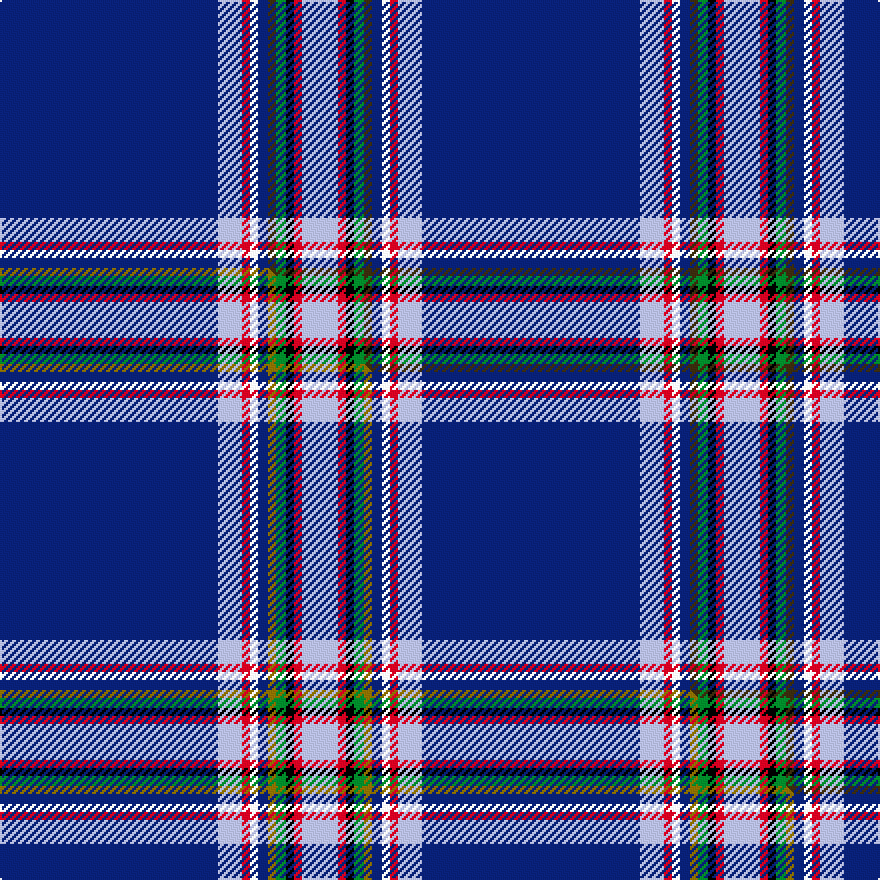

This page is one **sett** — a single exact thread-count. It belongs to the [tartan](/setts/db109lb12r4w4db5dy4g5k4r4lb18/)
(the same proportion at any scale), whose colour order is pattern [BWRWBGGKRW](/stripes/bwrwbggkrw/).

Part of the [Yorston](/tartans/yorston/) tartan — the named design grouping this sett with its other cloths.

Sourced from tartans-authority.  It is a [10 stripe tartan](/stripes/stripes10/).

Original link [https://www.tartanregister.gov.uk/tartanDetails.aspx?ref=10989](https://www.tartanregister.gov.uk/tartanDetails.aspx?ref=10989)

Dataset <small>— provenance for this record, inherited from the source manifest</small>

<dl class="dataset-prov">
<dt>source</dt><dd><a href="/sources/tartans-authority/">Scottish Tartans Authority</a></dd>
<dt>data captured from</dt><dd><a href="https://github.com/thetartan/tartan-database/blob/master/data/tartans-authority/data.csv">https://github.com/thetartan/tartan-database/blob/master/data/tartans-authority/data.csv</a></dd>
<dt>data date</dt><dd>2014 <small>(this record)</small></dd>
<dt>licence</dt><dd><a href="https://creativecommons.org/licenses/by-nc-nd/4.0/">CC BY-NC-ND 4.0</a></dd>
</dl>

Capture chain <small>— the hands this data passed through, oldest first; each capture carries its own licence</small>

<ol class="capture-chain">
<li><a href="https://www.tartansauthority.com/">Scottish Tartans Authority</a> <small>the heritage body's archive — its tartan-ferret record browser is retired (links repaired to the SRT, above)</small></li>
<li><a href="https://github.com/thetartan/tartan-database">thetartan/tartan-database</a> <small>2016-2017</small> · <a href="https://creativecommons.org/licenses/by-nc-nd/4.0/">CC BY-NC-ND 4.0</a> <small>Levko Kravets's frozen compilation — the capture we vendored, and where its CC licence text came from</small></li>
<li>this dictionary <small>captured 2026-06-10 · commit 5bf86c7566</small> <small>each re-capture is a git commit to data/sources</small></li>
</ol>

## Register references

External register numbers recorded for this tartan.

- Scottish Register of Tartans: [10989](https://www.tartanregister.gov.uk/tartanDetails?ref=10989)
- Scottish Tartans Authority (ITI): 10989

## Thread count
DB/109 LB12 R4 W4 DB5 DY4 G5 K4 R4 LB/18

One full sett is **211 threads**.

## Palette
<table><thead><tr><th>Colour</th><th>Shade</th><th>OKLCh</th></tr></thead><tbody><tr><td>DB</td><td><code style="background-color:#082077;">#082077</code> <small style="color:#888">#082077</small></td><td><small style="color:#888">oklch(30.0% 0.149 265.1)</small></td></tr><tr><td>G</td><td><code style="background-color:#008B2A;">#008B2A</code> <small style="color:#888">#008B2A</small></td><td><small style="color:#888">oklch(55.4% 0.170 145.9)</small></td></tr><tr><td>K</td><td><code style="background-color:#000000;">#000000</code> <small style="color:#888">#000000</small></td><td><small style="color:#888">oklch(0.0% 0.000 0.0)</small></td></tr><tr><td>LB</td><td><code style="background-color:#B5BBDE;">#B5BBDE</code> <small style="color:#888">#B5BBDE</small></td><td><small style="color:#888">oklch(79.9% 0.050 277.6)</small></td></tr><tr><td>R</td><td><code style="background-color:#D60020;">#D60020</code> <small style="color:#888">#D60020</small></td><td><small style="color:#888">oklch(55.2% 0.224 25.5)</small></td></tr><tr><td>W</td><td><code style="background-color:#F7F7F7;">#F7F7F7</code> <small style="color:#888">#F7F7F7</small></td><td><small style="color:#888">oklch(97.6% 0.000 89.9)</small></td></tr><tr><td>DY</td><td><code style="background-color:#3A2B0D;">#3A2B0D</code> <small style="color:#888">#3A2B0D</small></td><td><small style="color:#888">oklch(30.0% 0.049 82.0)</small></td></tr></tbody></table>

# Sample pattern

## Compared to the master

This cloth is one sett of its design; the master sett (the exemplar the design is anchored on) is below for comparison.

Its **ΔTartan distance** from the master is **0.01** — the same measure the nearest-tartans table ranks by (0 is identical; a re-scale of the same cloth is near 0, a recolour or a different proportion further).

<figure class="master-compare" style="margin:0">

this sett
master sett ★

<figcaption style="color:#888;font-size:smaller">One weave of this sett against the <a href="/setts/db109lb12r4w4db5y4g5k4r4lb18/">master sett ★</a>, split on the diagonal: a shared proportion runs seamlessly across it with only the shades shifting; a different proportion breaks on it.</figcaption>
</figure>

## Nearest tartan variants

The nearest existing variants by ΔTartan distance, with this cloth at the top so the swatches line up against it.

ΔTartan

Threads

Variant

Sett

—

211

<a href="/variants/s10/db109lb12r4w4db5dy4g5k4r4lb18/">Yorston (2014)</a>

<a href="/ttd/edit/#slug=db109lb12r4w4db5y4g5k4r4lb18&amp;base=db109lb12r4w4db5dy4g5k4r4lb18" title="compare in the TTD">0.01</a>

211

<a href="/variants/s10/db109lb12r4w4db5y4g5k4r4lb18/">Yorston (2014)</a>

<a href="/ttd/edit/#slug=db57lb3k9ly2k2w3k2g10db6k2db2r3~x2~lb3501240-ly3307090&amp;base=db109lb12r4w4db5dy4g5k4r4lb18" title="compare in the TTD">2.17</a>

284

<a href="/variants/s12/db57lb3k9ly2k2w3k2g10db6k2db2r3~x2~lb3501240-ly3307090/">O'Shaughnessy Memorial</a>

<a href="/ttd/edit/#slug=db57lb3k9y2k2w3k2g10db6k2db2r3~x2&amp;base=db109lb12r4w4db5dy4g5k4r4lb18" title="compare in the TTD">2.19</a>

284

<a href="/variants/s12/db57lb3k9y2k2w3k2g10db6k2db2r3~x2/">O'Shaughnessy Memorial (Corporate)</a>

<a href="/ttd/edit/#slug=y4db55n4k4db2y2db2w5db3r2n2k2~x2&amp;base=db109lb12r4w4db5dy4g5k4r4lb18" title="compare in the TTD">2.56</a>

336

<a href="/variants/s12/y4db55n4k4db2y2db2w5db3r2n2k2~x2/">London '88</a>

<a href="/ttd/edit/#slug=dy2g3k2dr1k9db3lb1db42dr1db2g3w2~x2&amp;base=db109lb12r4w4db5dy4g5k4r4lb18" title="compare in the TTD">2.81</a>

276

<a href="/variants/s12/dy2g3k2dr1k9db3lb1db42dr1db2g3w2~x2/">Sedge, Douglas (Personal)</a>

<a href="/ttd/edit/#slug=b84dr3k16ly4k4w4k4dg20b8k4b8w4&amp;base=db109lb12r4w4db5dy4g5k4r4lb18" title="compare in the TTD">2.96</a>

238

<a href="/variants/s12/b84dr3k16ly4k4w4k4dg20b8k4b8w4/">Wcwm 1105</a>

<a href="/ttd/edit/#slug=k5lb2k2t5db48lb7b6lb2dr2lb2~x2&amp;base=db109lb12r4w4db5dy4g5k4r4lb18" title="compare in the TTD">3.26</a>

310

<a href="/variants/s10/k5lb2k2t5db48lb7b6lb2dr2lb2~x2/">Gemmell Blue (2001) (Personal)</a>

<a href="/ttd/edit/#slug=db60w3dp8y2k2w2k2g14db4dy10w2~x2&amp;base=db109lb12r4w4db5dy4g5k4r4lb18" title="compare in the TTD">3.36</a>

312

<a href="/variants/s11/db60w3dp8y2k2w2k2g14db4dy10w2~x2/">O'Shaughnessy (Estimated threadcount)</a>

<a href="/ttd/edit/#slug=b38k4b2g6dp11db3dp2r2b11k1w2~x2~b1907270-db1003265&amp;base=db109lb12r4w4db5dy4g5k4r4lb18" title="compare in the TTD">3.43</a>

248

<a href="/variants/s11/b38k4b2g6dp11db3dp2r2b11k1w2~x2~b1907270-db1003265/">Blue Pride</a>

<a href="/ttd/edit/#slug=db90k10y2k4w2k4t14r12k2r5w4&amp;base=db109lb12r4w4db5dy4g5k4r4lb18" title="compare in the TTD">3.51</a>

204

<a href="/variants/s11/db90k10y2k4w2k4t14r12k2r5w4/">Lanyard Blue (Fashion)</a>

## Neighbour map

Every grey dot is one of 13621 variants placed by the first two principal components of the ΔTartan feature space (42% of its variance). Red is this tartan; blue dots are its nearest — click one to open its page.

<svg viewBox="0 0 640 380" role="img" style="max-width:100%;height:auto;border:1px solid #e0e0e0;border-radius:4px;display:block" xmlns="http://www.w3.org/2000/svg"><image href="/nn/cloud.v1.png" width="640" height="380"/><a href="/variants/s10/db109lb12r4w4db5y4g5k4r4lb18/"><circle cx="341.2" cy="37.2" r="4" fill="#3465a4"><title>Yorston (2014)</title></circle></a><a href="/variants/s12/db57lb3k9ly2k2w3k2g10db6k2db2r3~x2~lb3501240-ly3307090/"><circle cx="310.9" cy="32.6" r="4" fill="#3465a4"><title>O'Shaughnessy Memorial</title></circle></a><a href="/variants/s12/db57lb3k9y2k2w3k2g10db6k2db2r3~x2/"><circle cx="316.0" cy="33.7" r="4" fill="#3465a4"><title>O'Shaughnessy Memorial (Corporate)</title></circle></a><a href="/variants/s12/y4db55n4k4db2y2db2w5db3r2n2k2~x2/"><circle cx="396.8" cy="42.5" r="4" fill="#3465a4"><title>London '88</title></circle></a><a href="/variants/s12/dy2g3k2dr1k9db3lb1db42dr1db2g3w2~x2/"><circle cx="358.6" cy="20.4" r="4" fill="#3465a4"><title>Sedge, Douglas (Personal)</title></circle></a><a href="/variants/s12/b84dr3k16ly4k4w4k4dg20b8k4b8w4/"><circle cx="298.3" cy="53.1" r="4" fill="#3465a4"><title>Wcwm 1105</title></circle></a><a href="/variants/s10/k5lb2k2t5db48lb7b6lb2dr2lb2~x2/"><circle cx="303.9" cy="71.4" r="4" fill="#3465a4"><title>Gemmell Blue (2001) (Personal)</title></circle></a><a href="/variants/s11/db60w3dp8y2k2w2k2g14db4dy10w2~x2/"><circle cx="287.9" cy="47.1" r="4" fill="#3465a4"><title>O'Shaughnessy (Estimated threadcount)</title></circle></a><a href="/variants/s11/b38k4b2g6dp11db3dp2r2b11k1w2~x2~b1907270-db1003265/"><circle cx="332.2" cy="55.6" r="4" fill="#3465a4"><title>Blue Pride</title></circle></a><a href="/variants/s11/db90k10y2k4w2k4t14r12k2r5w4/"><circle cx="322.1" cy="29.6" r="4" fill="#3465a4"><title>Lanyard Blue (Fashion)</title></circle></a><circle cx="342.0" cy="37.4" r="5" fill="#c00000"/><text x="320" y="376" text-anchor="middle" font-size="11" fill="#999">ground</text><text x="11" y="190" text-anchor="middle" font-size="11" fill="#999" transform="rotate(-90 11 190)">complexity</text></svg>

ID: /variants/s10/db109lb12r4w4db5dy4g5k4r4lb18/
