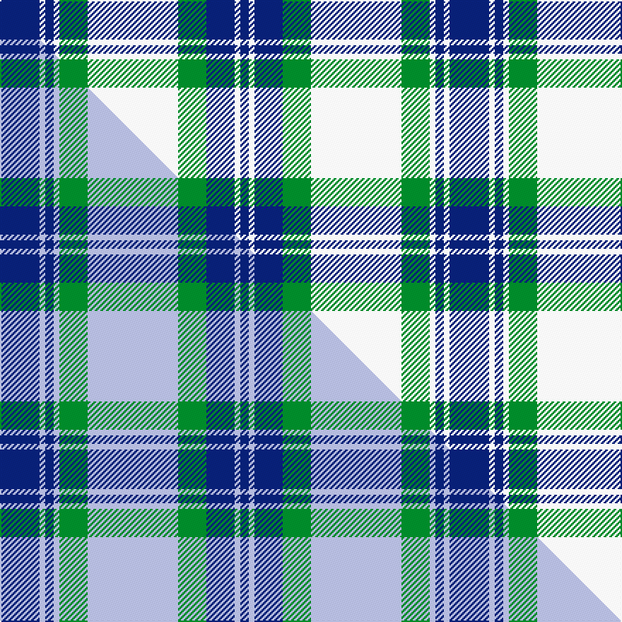

This is one **variant** — a specific cloth: this exact thread count and colourway, with its own
provenance below. It is one weaving of the [sett](/setts/db14w2db3w2g10w32g10db10w2db3/) (the scale-free proportion — the
same cloth at any scale or shade), whose colour order is pattern [BWBGWGWBWB](/stripes/bwbgwgwbwb/).

Part of the [Fraser Arisaid](/tartans/fraser-arisaid/) tartan — the named design grouping this sett with its other cloths.

Sourced from weddslist.  It is a [10 stripe tartan](/stripes/stripes10/).

Original link [http://www.weddslist.com/cgi-bin/tartans/pg.pl?source=sts](http://www.weddslist.com/cgi-bin/tartans/pg.pl?source=sts)

Dataset <small>— provenance for this record, inherited from the source manifest</small>

<dl class="dataset-prov">
<dt>source</dt><dd><a href="/sources/weddslist/">Weddslist</a></dd>
<dt>data captured from</dt><dd><a href="https://github.com/thetartan/tartan-database/blob/master/data/weddslist/data.csv">https://github.com/thetartan/tartan-database/blob/master/data/weddslist/data.csv</a></dd>
<dt>data date</dt><dd>2016-11-17 <small>(dataset default)</small></dd>
<dt>licence</dt><dd><a href="https://creativecommons.org/licenses/by-nc-nd/4.0/">CC BY-NC-ND 4.0</a></dd>
</dl>

Capture chain <small>— the hands this data passed through, oldest first; each capture carries its own licence</small>

<ol class="capture-chain">
<li><a href="https://www.weddslist.com/tartans/">Weddslist</a> <small>the living privately compiled reference</small></li>
<li><a href="https://github.com/thetartan/tartan-database">thetartan/tartan-database</a> <small>2016-2017</small> · <a href="https://creativecommons.org/licenses/by-nc-nd/4.0/">CC BY-NC-ND 4.0</a> <small>Levko Kravets's frozen compilation — the capture we vendored, and where its CC licence text came from</small></li>
<li>this dictionary <small>captured 2026-06-10 · commit 5bf86c7566</small> <small>each re-capture is a git commit to data/sources</small></li>
</ol>

## Thread count
DB/28 W4 DB6 W4 G20 W64 G20 DB20 W4 DB/6

One full sett is **318 threads**.

## Palette
<table><thead><tr><th>Colour</th><th>Shade</th><th>OKLCh</th></tr></thead><tbody><tr><td>DB</td><td><code style="background-color:#082077;">#082077</code> <small style="color:#888">#082077</small></td><td><small style="color:#888">oklch(30.0% 0.149 265.1)</small></td></tr><tr><td>G</td><td><code style="background-color:#008B2A;">#008B2A</code> <small style="color:#888">#008B2A</small></td><td><small style="color:#888">oklch(55.4% 0.170 145.9)</small></td></tr><tr><td>W</td><td><code style="background-color:#F7F7F7;">#F7F7F7</code> <small style="color:#888">#F7F7F7</small></td><td><small style="color:#888">oklch(97.6% 0.000 89.9)</small></td></tr></tbody></table>

# Sample pattern

## Compared to the master

This cloth is one sett of its design; the master sett (the exemplar the design is anchored on) is below for comparison.

Its **ΔTartan distance** from the master is **2.13** — the same measure the nearest-tartans table ranks by (0 is identical; a re-scale of the same cloth is near 0, a recolour or a different proportion further).

<figure class="master-compare" style="margin:0">

this sett
master sett ★

<figcaption style="color:#888;font-size:smaller">One weave of this sett against the <a href="/setts/db14lb2db3lb2g10lb32g10db10lb2db3/">master sett ★</a>, split on the diagonal: a shared proportion runs seamlessly across it with only the shades shifting; a different proportion breaks on it.</figcaption>
</figure>

## Nearest tartan variants

The nearest existing variants by ΔTartan distance, with this cloth at the top so the swatches line up against it.

ΔTartan

Threads

Variant

Sett

—

318

<a href="/variants/s10/db14w2db3w2g10w32g10db10w2db3~x2/">Fraser, Arisaid</a>

<a href="/ttd/edit/#slug=db14w2db3w2dr10w32dr10db10w2db3~x2&amp;base=db14w2db3w2g10w32g10db10w2db3~x2" title="compare in the TTD">2.00</a>

318

<a href="/variants/s10/db14w2db3w2dr10w32dr10db10w2db3~x2/">Fraser Arisaid Clan Tartan</a>

<a href="/ttd/edit/#slug=db14lb2db3lb2g10lb32g10db10lb2db3~x2&amp;base=db14w2db3w2g10w32g10db10w2db3~x2" title="compare in the TTD">2.13</a>

318

<a href="/variants/s10/db14lb2db3lb2g10lb32g10db10lb2db3~x2/">Fraser Arisaid</a>

<a href="/ttd/edit/#slug=g33db4g4db4g4db12w33db3w6~x2&amp;base=db14w2db3w2g10w32g10db10w2db3~x2" title="compare in the TTD">2.35</a>

334

<a href="/variants/s9/g33db4g4db4g4db12w33db3w6~x2/">Lindsay Dress, Green (Dance)</a>

<a href="/ttd/edit/#slug=g24w1g2w2db2w1db12w1db2w2db2w1db12&amp;base=db14w2db3w2g10w32g10db10w2db3~x2" title="compare in the TTD">2.67</a>

92

<a href="/variants/s13/g24w1g2w2db2w1db12w1db2w2db2w1db12/">MacDonald Lord of the Isles Hunting</a>

<a href="/ttd/edit/#slug=g24w1g2w2db2w1db12w1db2w2db2w1db12~x2&amp;base=db14w2db3w2g10w32g10db10w2db3~x2" title="compare in the TTD">2.67</a>

184

<a href="/variants/s13/g24w1g2w2db2w1db12w1db2w2db2w1db12~x2/">MacDonald Lord of the Isles Portrait Tartan</a>

<a href="/ttd/edit/#slug=lb14dg4w4lb1w2ly2w2dg12lb4w2lb2w2ly1~x4&amp;base=db14w2db3w2g10w32g10db10w2db3~x2" title="compare in the TTD">3.08</a>

356

<a href="/variants/s13/lb14dg4w4lb1w2ly2w2dg12lb4w2lb2w2ly1~x4/">Entrelacs</a>

<a href="/ttd/edit/#slug=lb11db1lb1db1lb1db8g8db1g8db8lb8db1lb1~x2&amp;base=db14w2db3w2g10w32g10db10w2db3~x2" title="compare in the TTD">3.08</a>

208

<a href="/variants/s13/lb11db1lb1db1lb1db8g8db1g8db8lb8db1lb1~x2/">Sutherland #3</a>

<a href="/ttd/edit/#slug=dr3dy1w12dy2db2dy2db14w2db2~x2~dy1603076-db1406275&amp;base=db14w2db3w2g10w32g10db10w2db3~x2" title="compare in the TTD">3.34</a>

150

<a href="/variants/s9/dr3dy1w12dy2db2dy2db14w2db2~x2~dy1603076-db1406275/">Lord Arran (Corporate)</a>

<a href="/ttd/edit/#slug=g19w1db12lb2db2lb2db2lb16~x2~db1004274&amp;base=db14w2db3w2g10w32g10db10w2db3~x2" title="compare in the TTD">3.38</a>

154

<a href="/variants/s8/g19w1db12lb2db2lb2db2lb16~x2~db1004274/">Norwich No.052</a>

<a href="/ttd/edit/#slug=g19w1db12lb2db2lb2db2lb16~x2&amp;base=db14w2db3w2g10w32g10db10w2db3~x2" title="compare in the TTD">3.38</a>

154

<a href="/variants/s8/g19w1db12lb2db2lb2db2lb16~x2/">Unidentified No 52</a>

## Neighbour map

Every grey dot is one of 13621 variants placed by the first two principal components of the ΔTartan feature space (42% of its variance). Red is this tartan; blue dots are its nearest — click one to open its page.

<svg viewBox="0 0 640 380" role="img" style="max-width:100%;height:auto;border:1px solid #e0e0e0;border-radius:4px;display:block" xmlns="http://www.w3.org/2000/svg"><image href="/nn/cloud.v1.png" width="640" height="380"/><a href="/variants/s10/db14w2db3w2dr10w32dr10db10w2db3~x2/"><circle cx="277.7" cy="194.9" r="4" fill="#3465a4"><title>Fraser Arisaid Clan Tartan</title></circle></a><a href="/variants/s10/db14lb2db3lb2g10lb32g10db10lb2db3~x2/"><circle cx="282.3" cy="195.0" r="4" fill="#3465a4"><title>Fraser Arisaid</title></circle></a><a href="/variants/s9/g33db4g4db4g4db12w33db3w6~x2/"><circle cx="242.0" cy="207.6" r="4" fill="#3465a4"><title>Lindsay Dress, Green (Dance)</title></circle></a><a href="/variants/s13/g24w1g2w2db2w1db12w1db2w2db2w1db12/"><circle cx="324.0" cy="147.1" r="4" fill="#3465a4"><title>MacDonald Lord of the Isles Hunting</title></circle></a><a href="/variants/s13/g24w1g2w2db2w1db12w1db2w2db2w1db12~x2/"><circle cx="324.0" cy="147.1" r="4" fill="#3465a4"><title>MacDonald Lord of the Isles Portrait Tartan</title></circle></a><a href="/variants/s13/lb14dg4w4lb1w2ly2w2dg12lb4w2lb2w2ly1~x4/"><circle cx="229.9" cy="178.0" r="4" fill="#3465a4"><title>Entrelacs</title></circle></a><a href="/variants/s13/lb11db1lb1db1lb1db8g8db1g8db8lb8db1lb1~x2/"><circle cx="233.9" cy="211.3" r="4" fill="#3465a4"><title>Sutherland #3</title></circle></a><a href="/variants/s9/dr3dy1w12dy2db2dy2db14w2db2~x2~dy1603076-db1406275/"><circle cx="249.8" cy="174.7" r="4" fill="#3465a4"><title>Lord Arran (Corporate)</title></circle></a><a href="/variants/s8/g19w1db12lb2db2lb2db2lb16~x2~db1004274/"><circle cx="248.5" cy="190.7" r="4" fill="#3465a4"><title>Norwich No.052</title></circle></a><a href="/variants/s8/g19w1db12lb2db2lb2db2lb16~x2/"><circle cx="251.6" cy="192.8" r="4" fill="#3465a4"><title>Unidentified No 52</title></circle></a><circle cx="257.1" cy="188.1" r="5" fill="#c00000"/><text x="320" y="376" text-anchor="middle" font-size="11" fill="#999">ground</text><text x="11" y="190" text-anchor="middle" font-size="11" fill="#999" transform="rotate(-90 11 190)">complexity</text></svg>

ID: /variants/s10/db14w2db3w2g10w32g10db10w2db3~x2/
