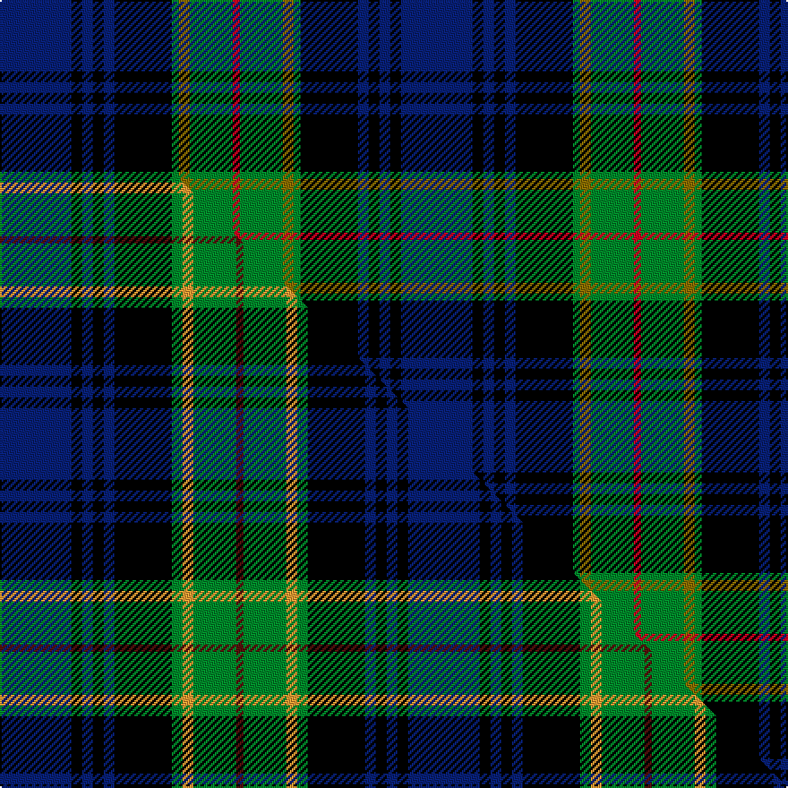

This page is one **sett** — a single exact thread-count. It belongs to the [tartan](/setts/db20k3db3k3db3k16g2y3g12r2/)
(the same proportion at any scale), whose colour order is pattern [BKBKBKGGGR](/stripes/bkbkbkgggr/).

Part of the [Barnes](/tartans/barnes/) tartan — the named design grouping this sett with its other cloths.

Sourced from weddslist.  It is a [10 stripe tartan](/stripes/stripes10/).

Original link [http://www.weddslist.com/cgi-bin/tartans/pg.pl?source=sts](http://www.weddslist.com/cgi-bin/tartans/pg.pl?source=sts)

Dataset <small>— provenance for this record, inherited from the source manifest</small>

<dl class="dataset-prov">
<dt>source</dt><dd><a href="/sources/weddslist/">Weddslist</a></dd>
<dt>data captured from</dt><dd><a href="https://github.com/thetartan/tartan-database/blob/master/data/weddslist/data.csv">https://github.com/thetartan/tartan-database/blob/master/data/weddslist/data.csv</a></dd>
<dt>data date</dt><dd>2016-11-17 <small>(dataset default)</small></dd>
<dt>licence</dt><dd><a href="https://creativecommons.org/licenses/by-nc-nd/4.0/">CC BY-NC-ND 4.0</a></dd>
</dl>

Capture chain <small>— the hands this data passed through, oldest first; each capture carries its own licence</small>

<ol class="capture-chain">
<li><a href="https://www.weddslist.com/tartans/">Weddslist</a> <small>the living privately compiled reference</small></li>
<li><a href="https://github.com/thetartan/tartan-database">thetartan/tartan-database</a> <small>2016-2017</small> · <a href="https://creativecommons.org/licenses/by-nc-nd/4.0/">CC BY-NC-ND 4.0</a> <small>Levko Kravets's frozen compilation — the capture we vendored, and where its CC licence text came from</small></li>
<li>this dictionary <small>captured 2026-06-10 · commit 5bf86c7566</small> <small>each re-capture is a git commit to data/sources</small></li>
</ol>

## Thread count
DB/40 K6 DB6 K6 DB6 K32 G4 Y6 G24 R/4

One full sett is **224 threads**.

## Palette
<table><thead><tr><th>Colour</th><th>Shade</th><th>OKLCh</th></tr></thead><tbody><tr><td>DB</td><td><code style="background-color:#082077;">#082077</code> <small style="color:#888">#082077</small></td><td><small style="color:#888">oklch(30.0% 0.149 265.1)</small></td></tr><tr><td>G</td><td><code style="background-color:#008B2A;">#008B2A</code> <small style="color:#888">#008B2A</small></td><td><small style="color:#888">oklch(55.4% 0.170 145.9)</small></td></tr><tr><td>K</td><td><code style="background-color:#000000;">#000000</code> <small style="color:#888">#000000</small></td><td><small style="color:#888">oklch(0.0% 0.000 0.0)</small></td></tr><tr><td>R</td><td><code style="background-color:#D60020;">#D60020</code> <small style="color:#888">#D60020</small></td><td><small style="color:#888">oklch(55.2% 0.224 25.5)</small></td></tr><tr><td>Y</td><td><code style="background-color:#8B6E00;">#8B6E00</code> <small style="color:#888">#8B6E00</small></td><td><small style="color:#888">oklch(55.1% 0.113 90.4)</small></td></tr></tbody></table>

# Sample pattern

## Compared to the master

This cloth is one sett of its design; the master sett (the exemplar the design is anchored on) is below for comparison.

Its **ΔTartan distance** from the master is **0.34** — the same measure the nearest-tartans table ranks by (0 is identical; a re-scale of the same cloth is near 0, a recolour or a different proportion further).

<figure class="master-compare" style="margin:0">

this sett
master sett ★

<figcaption style="color:#888;font-size:smaller">One weave of this sett against the <a href="/setts/db20k3db3k3db3k16g3lo3g12dr2/">master sett ★</a>, split on the diagonal: a shared proportion runs seamlessly across it with only the shades shifting; a different proportion breaks on it.</figcaption>
</figure>

## Nearest tartan variants

The nearest existing variants by ΔTartan distance, with this cloth at the top so the swatches line up against it.

ΔTartan

Threads

Variant

Sett

—

224

<a href="/variants/s10/db20k3db3k3db3k16g2y3g12r2~x2/">Barnes</a>

<a href="/ttd/edit/#slug=db20k3db3k3db3k16g3lo3g12dr2~x2&amp;base=db20k3db3k3db3k16g2y3g12r2~x2" title="compare in the TTD">0.34</a>

228

<a href="/variants/s10/db20k3db3k3db3k16g3lo3g12dr2~x2/">Barnes Hunting (Personal)</a>

<a href="/ttd/edit/#slug=db56k6db6k6db6k44g44y4g5y8&amp;base=db20k3db3k3db3k16g2y3g12r2~x2" title="compare in the TTD">0.80</a>

306

<a href="/variants/s10/db56k6db6k6db6k44g44y4g5y8/">Gordon #2</a>

<a href="/ttd/edit/#slug=y3k12db1g5db12r1k2r1~x4&amp;base=db20k3db3k3db3k16g2y3g12r2~x2" title="compare in the TTD">1.46</a>

280

<a href="/variants/s8/y3k12db1g5db12r1k2r1~x4/">Sandberg of Greenock (Personal)</a>

<a href="/ttd/edit/#slug=db11k1db1w1db1k8g8y1g8k8db8w1db1~x2&amp;base=db20k3db3k3db3k16g2y3g12r2~x2" title="compare in the TTD">1.71</a>

208

<a href="/variants/s13/db11k1db1w1db1k8g8y1g8k8db8w1db1~x2/">Logan Rogers Hunting</a>

<a href="/ttd/edit/#slug=db23k2dr2k2dr2k16g17k2g17k15db17k2r2~x2&amp;base=db20k3db3k3db3k16g2y3g12r2~x2" title="compare in the TTD">1.75</a>

426

<a href="/variants/s13/db23k2dr2k2dr2k16g17k2g17k15db17k2r2~x2/">The Red Hackle</a>

<a href="/ttd/edit/#slug=r1k1g7k5db10k1y1~x2&amp;base=db20k3db3k3db3k16g2y3g12r2~x2" title="compare in the TTD">1.76</a>

100

<a href="/variants/s7/r1k1g7k5db10k1y1~x2/">MacLeod Small Clan Tartan</a>

<a href="/ttd/edit/#slug=db11k1db1w1db1k8g8ly1g8k8db8w1db1~x2&amp;base=db20k3db3k3db3k16g2y3g12r2~x2" title="compare in the TTD">1.79</a>

208

<a href="/variants/s13/db11k1db1w1db1k8g8ly1g8k8db8w1db1~x2/">Logan Rogers Hunting (Personal)</a>

<a href="/ttd/edit/#slug=db24k2db2r2db2k20g16y2g2y3~x2&amp;base=db20k3db3k3db3k16g2y3g12r2~x2" title="compare in the TTD">1.82</a>

246

<a href="/variants/s10/db24k2db2r2db2k20g16y2g2y3~x2/">Watson (Name)</a>

<a href="/ttd/edit/#slug=db10k1db1k1db2k8g10w1~x4&amp;base=db20k3db3k3db3k16g2y3g12r2~x2" title="compare in the TTD">1.88</a>

228

<a href="/variants/s8/db10k1db1k1db2k8g10w1~x4/">Lamont</a>

<a href="/ttd/edit/#slug=db10k1db1k1db2k8g10w1~x2&amp;base=db20k3db3k3db3k16g2y3g12r2~x2" title="compare in the TTD">1.88</a>

114

<a href="/variants/s8/db10k1db1k1db2k8g10w1~x2/">Lamont</a>

## Neighbour map

Every grey dot is one of 13621 variants placed by the first two principal components of the ΔTartan feature space (42% of its variance). Red is this tartan; blue dots are its nearest — click one to open its page.

<svg viewBox="0 0 640 380" role="img" style="max-width:100%;height:auto;border:1px solid #e0e0e0;border-radius:4px;display:block" xmlns="http://www.w3.org/2000/svg"><image href="/nn/cloud.v1.png" width="640" height="380"/><a href="/variants/s10/db20k3db3k3db3k16g3lo3g12dr2~x2/"><circle cx="148.0" cy="157.5" r="4" fill="#3465a4"><title>Barnes Hunting (Personal)</title></circle></a><a href="/variants/s10/db56k6db6k6db6k44g44y4g5y8/"><circle cx="179.5" cy="151.0" r="4" fill="#3465a4"><title>Gordon #2</title></circle></a><a href="/variants/s8/y3k12db1g5db12r1k2r1~x4/"><circle cx="157.2" cy="152.9" r="4" fill="#3465a4"><title>Sandberg of Greenock (Personal)</title></circle></a><a href="/variants/s13/db11k1db1w1db1k8g8y1g8k8db8w1db1~x2/"><circle cx="133.5" cy="148.8" r="4" fill="#3465a4"><title>Logan Rogers Hunting</title></circle></a><a href="/variants/s13/db23k2dr2k2dr2k16g17k2g17k15db17k2r2~x2/"><circle cx="127.3" cy="147.2" r="4" fill="#3465a4"><title>The Red Hackle</title></circle></a><a href="/variants/s7/r1k1g7k5db10k1y1~x2/"><circle cx="152.7" cy="170.5" r="4" fill="#3465a4"><title>MacLeod Small Clan Tartan</title></circle></a><a href="/variants/s13/db11k1db1w1db1k8g8ly1g8k8db8w1db1~x2/"><circle cx="132.5" cy="148.9" r="4" fill="#3465a4"><title>Logan Rogers Hunting (Personal)</title></circle></a><a href="/variants/s10/db24k2db2r2db2k20g16y2g2y3~x2/"><circle cx="158.9" cy="138.1" r="4" fill="#3465a4"><title>Watson (Name)</title></circle></a><a href="/variants/s8/db10k1db1k1db2k8g10w1~x4/"><circle cx="171.8" cy="179.4" r="4" fill="#3465a4"><title>Lamont</title></circle></a><a href="/variants/s8/db10k1db1k1db2k8g10w1~x2/"><circle cx="171.8" cy="179.4" r="4" fill="#3465a4"><title>Lamont</title></circle></a><circle cx="155.7" cy="156.0" r="5" fill="#c00000"/><text x="320" y="376" text-anchor="middle" font-size="11" fill="#999">ground</text><text x="11" y="190" text-anchor="middle" font-size="11" fill="#999" transform="rotate(-90 11 190)">complexity</text></svg>

ID: /variants/s10/db20k3db3k3db3k16g2y3g12r2~x2/
