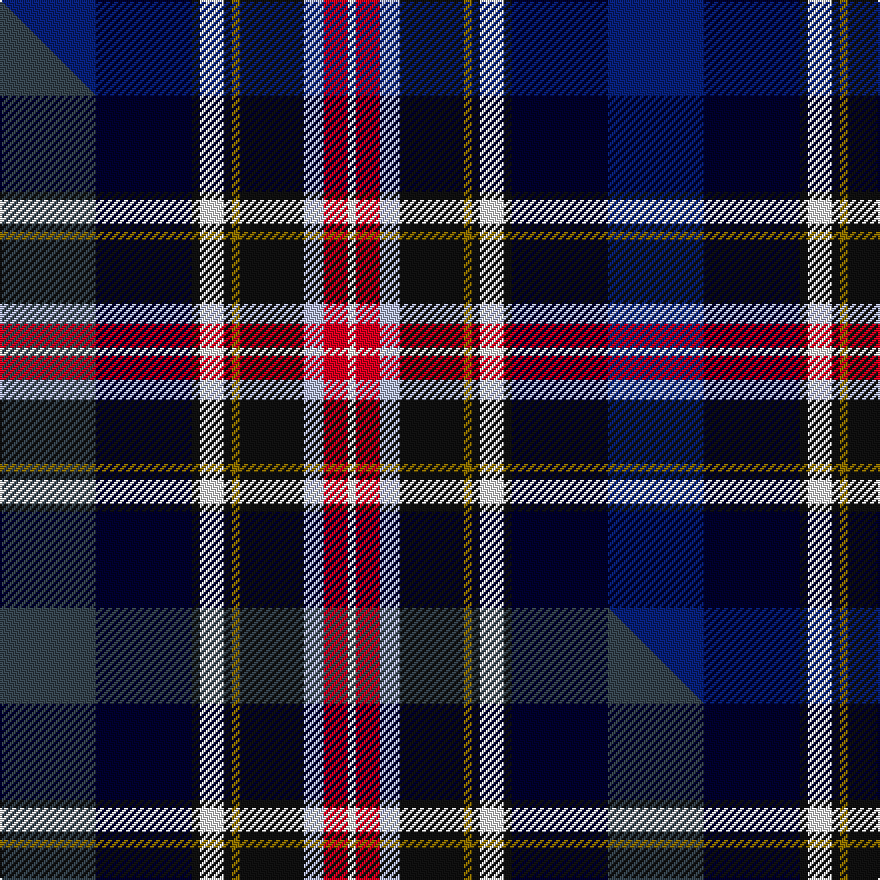

This page is one **sett** — a single exact thread-count. It belongs to the [tartan](/setts/db24k24ki2w6ki2y2ki16lb5r6w2/)
(the same proportion at any scale), whose colour order is pattern [BKKWKGKWRW](/stripes/bkkwkgkwrw/).

Part of the [Scotland's International](/tartans/scotland-s-international/) tartan — the named design grouping this sett with its other cloths.

Sourced from tartans-authority.  It is a [10 stripe tartan](/stripes/stripes10/).

Original link https://www.tartanregister.gov.uk/tartanDetails.aspx?ref=7842

Dataset <small>— provenance for this record, inherited from the source manifest</small>

<dl class="dataset-prov">
<dt>source</dt><dd><a href="/sources/tartans-authority/">Scottish Tartans Authority</a></dd>
<dt>data captured from</dt><dd><a href="https://github.com/thetartan/tartan-database/blob/master/data/tartans-authority/data.csv">https://github.com/thetartan/tartan-database/blob/master/data/tartans-authority/data.csv</a></dd>
<dt>data date</dt><dd>pre 2008 <small>(this record)</small></dd>
<dt>licence</dt><dd><a href="https://creativecommons.org/licenses/by-nc-nd/4.0/">CC BY-NC-ND 4.0</a></dd>
</dl>

Capture chain <small>— the hands this data passed through, oldest first; each capture carries its own licence</small>

<ol class="capture-chain">
<li><a href="https://www.tartansauthority.com/">Scottish Tartans Authority</a> <small>the heritage body's archive — its tartan-ferret record browser is retired (links repaired to the SRT, above)</small></li>
<li><a href="https://github.com/thetartan/tartan-database">thetartan/tartan-database</a> <small>2016-2017</small> · <a href="https://creativecommons.org/licenses/by-nc-nd/4.0/">CC BY-NC-ND 4.0</a> <small>Levko Kravets's frozen compilation — the capture we vendored, and where its CC licence text came from</small></li>
<li>this dictionary <small>captured 2026-06-10 · commit 5bf86c7566</small> <small>each re-capture is a git commit to data/sources</small></li>
</ol>

## Register references

External register numbers recorded for this tartan.

- Scottish Tartans Authority (ITI): 7842

## Thread count
DB/48 K48 Ki4 W12 Ki4 Y4 Ki32 LB10 R12 W/4

One full sett is **304 threads**.

## Palette
<table><thead><tr><th>Colour</th><th>Shade</th><th>OKLCh</th></tr></thead><tbody><tr><td>K</td><td><code style="background-color:#00002C;">#00002C</code> <small style="color:#888">#00002C</small></td><td><small style="color:#888">oklch(13.2% 0.092 264.1)</small></td></tr><tr><td>K</td><td><code style="background-color:#101010;">#101010</code> <small style="color:#888">#101010</small></td><td><small style="color:#888">oklch(17.3% 0.000 89.9)</small></td></tr><tr><td>LB</td><td><code style="background-color:#B5BBDE;">#B5BBDE</code> <small style="color:#888">#B5BBDE</small></td><td><small style="color:#888">oklch(79.9% 0.050 277.6)</small></td></tr><tr><td>W</td><td><code style="background-color:#F7F7F7;">#F7F7F7</code> <small style="color:#888">#F7F7F7</small></td><td><small style="color:#888">oklch(97.6% 0.000 89.9)</small></td></tr><tr><td>DB</td><td><code style="background-color:#082077;">#082077</code> <small style="color:#888">#082077</small></td><td><small style="color:#888">oklch(30.0% 0.149 265.1)</small></td></tr><tr><td>R</td><td><code style="background-color:#D60020;">#D60020</code> <small style="color:#888">#D60020</small></td><td><small style="color:#888">oklch(55.2% 0.224 25.5)</small></td></tr><tr><td>Y</td><td><code style="background-color:#8B6E00;">#8B6E00</code> <small style="color:#888">#8B6E00</small></td><td><small style="color:#888">oklch(55.1% 0.113 90.4)</small></td></tr></tbody></table>

# Sample pattern

## Compared to the master

This cloth is one sett of its design; the master sett (the exemplar the design is anchored on) is below for comparison.

Its **ΔTartan distance** from the master is **0.08** — the same measure the nearest-tartans table ranks by (0 is identical; a re-scale of the same cloth is near 0, a recolour or a different proportion further).

<figure class="master-compare" style="margin:0">

this sett
master sett ★

<figcaption style="color:#888;font-size:smaller">One weave of this sett against the <a href="/setts/dt24k24ki2w6ki2y2ki16lb5r6w2/">master sett ★</a>, split on the diagonal: a shared proportion runs seamlessly across it with only the shades shifting; a different proportion breaks on it.</figcaption>
</figure>

## Nearest tartan variants

The nearest existing variants by ΔTartan distance, with this cloth at the top so the swatches line up against it.

ΔTartan

Threads

Variant

Sett

—

304

<a href="/variants/s10/db24k24ki2w6ki2y2ki16lb5r6w2~x2~k0504259-ki0700000/">Scotland's International - Home (Fas</a>

<a href="/ttd/edit/#slug=dt24k24ki2w6ki2y2ki16lb5r6w2~x2~dt1501240-k0504259-ki0700000&amp;base=db24k24ki2w6ki2y2ki16lb5r6w2~x2~k0504259-ki0700000" title="compare in the TTD">0.08</a>

304

<a href="/variants/s10/dt24k24ki2w6ki2y2ki16lb5r6w2~x2~dt1501240-k0504259-ki0700000/">Scotland's International - Home</a>

<a href="/ttd/edit/#slug=dp27y2dp2k12g6o2g12k12db12r2db2~x2&amp;base=db24k24ki2w6ki2y2ki16lb5r6w2~x2~k0504259-ki0700000" title="compare in the TTD">2.49</a>

306

<a href="/variants/s11/dp27y2dp2k12g6o2g12k12db12r2db2~x2/">Boxell, Baron (Personal)</a>

<a href="/ttd/edit/#slug=dp27y2dp2k12g6o2g12k12db12r2db2~x2~dp1105325&amp;base=db24k24ki2w6ki2y2ki16lb5r6w2~x2~k0504259-ki0700000" title="compare in the TTD">2.60</a>

306

<a href="/variants/s11/dp27y2dp2k12g6o2g12k12db12r2db2~x2~dp1105325/">Boxell of West Niddry, Baron (Personal)</a>

<a href="/ttd/edit/#slug=k5lb5y2lb5k5db25k5lb3dg5r2dg5lb3k5~x2&amp;base=db24k24ki2w6ki2y2ki16lb5r6w2~x2~k0504259-ki0700000" title="compare in the TTD">2.69</a>

280

<a href="/variants/s13/k5lb5y2lb5k5db25k5lb3dg5r2dg5lb3k5~x2/">Liberton</a>

<a href="/ttd/edit/#slug=dt12k1lb2k1db9k7dp2k2dp2y1r2~x4~dt1204274-db1406275&amp;base=db24k24ki2w6ki2y2ki16lb5r6w2~x2~k0504259-ki0700000" title="compare in the TTD">2.76</a>

272

<a href="/variants/s11/db12k1lb2k1dbi9k7dp2k2dp2y1r2~x4~db1204274-dbi1406275/">Churchill (Personal)</a>

<a href="/ttd/edit/#slug=db40lb3db11k7g22k7db3w3n10k32y13~x2&amp;base=db24k24ki2w6ki2y2ki16lb5r6w2~x2~k0504259-ki0700000" title="compare in the TTD">2.81</a>

498

<a href="/variants/s11/db40lb3db11k7g22k7db3w3n10k32y13~x2/">Aurora House Check</a>

<a href="/ttd/edit/#slug=k2w1dp7k1g6k1db7lb1k1~x4&amp;base=db24k24ki2w6ki2y2ki16lb5r6w2~x2~k0504259-ki0700000" title="compare in the TTD">2.86</a>

204

<a href="/variants/s9/k2w1dp7k1g6k1db7lb1k1~x4/">South Lanarkshire (2002) (District)</a>

<a href="/ttd/edit/#slug=gi20r2g3db12k20r2lb3db4lb3~x2~gi2203152-g1903114&amp;base=db24k24ki2w6ki2y2ki16lb5r6w2~x2~k0504259-ki0700000" title="compare in the TTD">2.88</a>

230

<a href="/variants/s9/gi20r2g3db12k20r2lb3db4lb3~x2~gi2203152-g1903114/">Ithilien Heather (Personal)</a>

<a href="/ttd/edit/#slug=k6t3db28lo8k10lo2k2lb2k4g16dr12k2dr6lb2~x2&amp;base=db24k24ki2w6ki2y2ki16lb5r6w2~x2~k0504259-ki0700000" title="compare in the TTD">2.93</a>

396

<a href="/variants/s14/k6t3db28lo8k10lo2k2lb2k4g16dr12k2dr6lb2~x2/">Beatty</a>

<a href="/ttd/edit/#slug=dg4dr2db3dr1db3lo1k2lo1k2lb2k2n11dr1k1~x4&amp;base=db24k24ki2w6ki2y2ki16lb5r6w2~x2~k0504259-ki0700000" title="compare in the TTD">2.94</a>

268

<a href="/variants/s14/dg4dr2db3dr1db3lo1k2lo1k2lb2k2n11dr1k1~x4/">Ross Anderson (Fashion) #2</a>

## Neighbour map

Every grey dot is one of 13620 variants placed by the first two principal components of the ΔTartan feature space (42% of its variance). Red is this tartan; blue dots are its nearest — click one to open its page.

<svg viewBox="0 0 640 380" role="img" style="max-width:100%;height:auto;border:1px solid #e0e0e0;border-radius:4px;display:block" xmlns="http://www.w3.org/2000/svg"><image href="/nn/cloud.v1.png" width="640" height="380"/><a href="/variants/s10/dt24k24ki2w6ki2y2ki16lb5r6w2~x2~dt1501240-k0504259-ki0700000/"><circle cx="54.4" cy="117.0" r="4" fill="#3465a4"><title>Scotland's International - Home</title></circle></a><a href="/variants/s11/dp27y2dp2k12g6o2g12k12db12r2db2~x2/"><circle cx="94.3" cy="119.5" r="4" fill="#3465a4"><title>Boxell, Baron (Personal)</title></circle></a><a href="/variants/s11/dp27y2dp2k12g6o2g12k12db12r2db2~x2~dp1105325/"><circle cx="94.5" cy="119.4" r="4" fill="#3465a4"><title>Boxell of West Niddry, Baron (Personal)</title></circle></a><a href="/variants/s13/k5lb5y2lb5k5db25k5lb3dg5r2dg5lb3k5~x2/"><circle cx="87.3" cy="113.3" r="4" fill="#3465a4"><title>Liberton</title></circle></a><a href="/variants/s11/db12k1lb2k1dbi9k7dp2k2dp2y1r2~x4~db1204274-dbi1406275/"><circle cx="105.1" cy="126.1" r="4" fill="#3465a4"><title>Churchill (Personal)</title></circle></a><a href="/variants/s11/db40lb3db11k7g22k7db3w3n10k32y13~x2/"><circle cx="91.5" cy="119.8" r="4" fill="#3465a4"><title>Aurora House Check</title></circle></a><a href="/variants/s9/k2w1dp7k1g6k1db7lb1k1~x4/"><circle cx="52.5" cy="163.3" r="4" fill="#3465a4"><title>South Lanarkshire (2002) (District)</title></circle></a><a href="/variants/s9/gi20r2g3db12k20r2lb3db4lb3~x2~gi2203152-g1903114/"><circle cx="76.8" cy="144.8" r="4" fill="#3465a4"><title>Ithilien Heather (Personal)</title></circle></a><a href="/variants/s14/k6t3db28lo8k10lo2k2lb2k4g16dr12k2dr6lb2~x2/"><circle cx="46.0" cy="100.6" r="4" fill="#3465a4"><title>Beatty</title></circle></a><a href="/variants/s14/dg4dr2db3dr1db3lo1k2lo1k2lb2k2n11dr1k1~x4/"><circle cx="65.5" cy="113.6" r="4" fill="#3465a4"><title>Ross Anderson (Fashion) #2</title></circle></a><circle cx="53.1" cy="116.6" r="5" fill="#c00000"/><text x="320" y="376" text-anchor="middle" font-size="11" fill="#999">ground</text><text x="11" y="190" text-anchor="middle" font-size="11" fill="#999" transform="rotate(-90 11 190)">complexity</text></svg>

ID: /variants/s10/db24k24ki2w6ki2y2ki16lb5r6w2~x2~k0504259-ki0700000/
