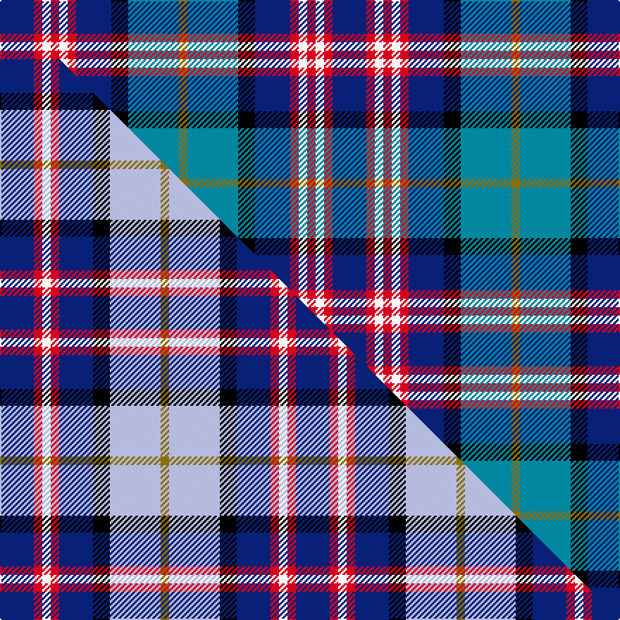

This page is one **sett** — a single exact thread-count. It belongs to the [tartan](/setts/db24r6w6r6w6r6db25k12t36y6/)
(the same proportion at any scale), whose colour order is pattern [BRWRWRBKBG](/stripes/brwrwrbkbg/).

Part of the [Lopatinsky](/tartans/lopatinsky/) tartan — the named design grouping this sett with its other cloths.

Sourced from tartans-authority.  It is a [10 stripe tartan](/stripes/stripes10/).

Original link http://www.tartansauthority.com/tartan-ferret/display/7770/

## Register references

External register numbers recorded for this tartan.

- Scottish Tartans Authority (ITI): 7770

## Thread count
DB/24 R6 W6 R6 W6 R6 DB25 K12 T36 Y/6

One full sett is **236 threads**.

## Palette
<table><thead><tr><th>Colour</th><th>Shade</th><th>OKLCh</th></tr></thead><tbody><tr><td>T</td><td><code style="background-color:#00879F;">#00879F</code> <small style="color:#888">#00879F</small></td><td><small style="color:#888">oklch(57.4% 0.102 216.1)</small></td></tr><tr><td>DB</td><td><code style="background-color:#082077;">#082077</code> <small style="color:#888">#082077</small></td><td><small style="color:#888">oklch(30.0% 0.149 265.1)</small></td></tr><tr><td>K</td><td><code style="background-color:#000000;">#000000</code> <small style="color:#888">#000000</small></td><td><small style="color:#888">oklch(0.0% 0.000 0.0)</small></td></tr><tr><td>W</td><td><code style="background-color:#F7F7F7;">#F7F7F7</code> <small style="color:#888">#F7F7F7</small></td><td><small style="color:#888">oklch(97.6% 0.000 89.9)</small></td></tr><tr><td>R</td><td><code style="background-color:#D60020;">#D60020</code> <small style="color:#888">#D60020</small></td><td><small style="color:#888">oklch(55.2% 0.224 25.5)</small></td></tr><tr><td>Y</td><td><code style="background-color:#8B6E00;">#8B6E00</code> <small style="color:#888">#8B6E00</small></td><td><small style="color:#888">oklch(55.1% 0.113 90.4)</small></td></tr></tbody></table>

# Sample pattern

## Compared to the master

This cloth is one sett of its design; the master sett (the exemplar the design is anchored on) is below for comparison.

Its **ΔTartan distance** from the master is **0.67** — the same measure the nearest-tartans table ranks by (0 is identical; a re-scale of the same cloth is near 0, a recolour or a different proportion further).

<figure class="master-compare" style="margin:0">

this sett
master sett ★

<figcaption style="color:#888;font-size:smaller">One weave of this sett against the <a href="/setts/db4r1w1r1db4k2lb6y1/">master sett ★</a>, split on the diagonal: a shared proportion runs seamlessly across it with only the shades shifting; a different proportion breaks on it.</figcaption>
</figure>

## Nearest tartan variants

The nearest existing variants by ΔTartan distance, with this cloth at the top so the swatches line up against it.

ΔTartan

Threads

Variant

Sett

—

236

<a href="/variants/s10/db24r6w6r6w6r6db25k12t36y6/">Lopatinsky (Personal)</a>

<a href="/ttd/edit/#slug=db28r3w3r3w3r3db28k12lb38wi8~w3600000-wi3905105&amp;base=db24r6w6r6w6r6db25k12t36y6" title="compare in the TTD">0.60</a>

222

<a href="/variants/s10/db28r3w3r3w3r3db28k12lb38wi8~w3600000-wi3905105/">GYL family (Personal)</a>

<a href="/ttd/edit/#slug=db28r3w3r3w3r3db14k12lb38y8&amp;base=db24r6w6r6w6r6db25k12t36y6" title="compare in the TTD">0.61</a>

194

<a href="/variants/s10/db28r3w3r3w3r3db14k12lb38y8/">GYL (Personal)</a>

<a href="/ttd/edit/#slug=db4r1w1r1db4k2lb6y1~x6&amp;base=db24r6w6r6w6r6db25k12t36y6" title="compare in the TTD">0.67</a>

210

<a href="/variants/s8/db4r1w1r1db4k2lb6y1~x6/">Lopatinsky</a>

<a href="/ttd/edit/#slug=n12k3w3k3w3k3n13t6db17dr3~x2~t1904230-db1003265&amp;base=db24r6w6r6w6r6db25k12t36y6" title="compare in the TTD">1.67</a>

234

<a href="/variants/s10/n12k3w3k3w3k3n13t6db17dr3~x2~t1904230-db1003265/">Mitsukoshi</a>

<a href="/ttd/edit/#slug=db4t13r2db2k2db2w5db2ly2db2t2~x2&amp;base=db24r6w6r6w6r6db25k12t36y6" title="compare in the TTD">2.09</a>

140

<a href="/variants/s11/db4t13r2db2k2db2w5db2ly2db2t2~x2/">Manchester City Football Club &quot;Blue</a>

<a href="/ttd/edit/#slug=lr4dr2db14k4lr4k3lr3k2dr2lb2~x2~lr3200000-lb3103284&amp;base=db24r6w6r6w6r6db25k12t36y6" title="compare in the TTD">2.36</a>

148

<a href="/variants/s10/lbi4dr2db14k4lbi4k3lbi3k2dr2lb2~x2~lbi3200000-lb3103284/">Naysmith, William A (Personal)</a>

<a href="/ttd/edit/#slug=db20dr3k10lo2lb15w2lb4w2lb15lo2k10dr3db20~x2&amp;base=db24r6w6r6w6r6db25k12t36y6" title="compare in the TTD">2.38</a>

352

<a href="/variants/s13/db20dr3k10lo2lb15w2lb4w2lb15lo2k10dr3db20~x2/">U.S. Forces Thurso</a>

<a href="/ttd/edit/#slug=bi5k15lb5n9lb2b2lb2b2n9k3~x2~bi2011271-b1610274&amp;base=db24r6w6r6w6r6db25k12t36y6" title="compare in the TTD">2.50</a>

200

<a href="/variants/s10/bi5k15lb5n9lb2b2lb2b2n9k3~x2~bi2011271-b1610274/">Ryukoku University Heian Senior High School</a>

<a href="/ttd/edit/#slug=k2db15w5db15r15w2k2g4y3g4k2~x2&amp;base=db24r6w6r6w6r6db25k12t36y6" title="compare in the TTD">2.50</a>

268

<a href="/variants/s11/k2db15w5db15r15w2k2g4y3g4k2~x2/">Pride, George (Personal)</a>

<a href="/ttd/edit/#slug=r1k1db4w1db1w1db4k1r1k1g4y1~x4&amp;base=db24r6w6r6w6r6db25k12t36y6" title="compare in the TTD">2.53</a>

160

<a href="/variants/s12/r1k1db4w1db1w1db4k1r1k1g4y1~x4/">Dunedin</a>

## Neighbour map

Every grey dot is one of 13620 variants placed by the first two principal components of the ΔTartan feature space (42% of its variance). Red is this tartan; blue dots are its nearest — click one to open its page.

<svg viewBox="0 0 640 380" role="img" style="max-width:100%;height:auto;border:1px solid #e0e0e0;border-radius:4px;display:block" xmlns="http://www.w3.org/2000/svg"><image href="/nn/cloud.v1.png" width="640" height="380"/><a href="/variants/s10/db28r3w3r3w3r3db28k12lb38wi8~w3600000-wi3905105/"><circle cx="143.1" cy="124.4" r="4" fill="#3465a4"><title>GYL family (Personal)</title></circle></a><a href="/variants/s10/db28r3w3r3w3r3db14k12lb38y8/"><circle cx="117.9" cy="124.1" r="4" fill="#3465a4"><title>GYL (Personal)</title></circle></a><a href="/variants/s8/db4r1w1r1db4k2lb6y1~x6/"><circle cx="95.0" cy="183.3" r="4" fill="#3465a4"><title>Lopatinsky</title></circle></a><a href="/variants/s10/n12k3w3k3w3k3n13t6db17dr3~x2~t1904230-db1003265/"><circle cx="95.8" cy="181.4" r="4" fill="#3465a4"><title>Mitsukoshi</title></circle></a><a href="/variants/s11/db4t13r2db2k2db2w5db2ly2db2t2~x2/"><circle cx="110.4" cy="158.5" r="4" fill="#3465a4"><title>Manchester City Football Club &quot;Blue</title></circle></a><a href="/variants/s10/lbi4dr2db14k4lbi4k3lbi3k2dr2lb2~x2~lbi3200000-lb3103284/"><circle cx="98.8" cy="171.3" r="4" fill="#3465a4"><title>Naysmith, William A (Personal)</title></circle></a><a href="/variants/s13/db20dr3k10lo2lb15w2lb4w2lb15lo2k10dr3db20~x2/"><circle cx="92.8" cy="137.1" r="4" fill="#3465a4"><title>U.S. Forces Thurso</title></circle></a><a href="/variants/s10/bi5k15lb5n9lb2b2lb2b2n9k3~x2~bi2011271-b1610274/"><circle cx="90.5" cy="177.0" r="4" fill="#3465a4"><title>Ryukoku University Heian Senior High School</title></circle></a><a href="/variants/s11/k2db15w5db15r15w2k2g4y3g4k2~x2/"><circle cx="107.6" cy="142.5" r="4" fill="#3465a4"><title>Pride, George (Personal)</title></circle></a><a href="/variants/s12/r1k1db4w1db1w1db4k1r1k1g4y1~x4/"><circle cx="70.4" cy="177.2" r="4" fill="#3465a4"><title>Dunedin</title></circle></a><circle cx="84.4" cy="174.3" r="5" fill="#c00000"/><text x="320" y="376" text-anchor="middle" font-size="11" fill="#999">ground</text><text x="11" y="190" text-anchor="middle" font-size="11" fill="#999" transform="rotate(-90 11 190)">complexity</text></svg>

ID: /variants/s10/db24r6w6r6w6r6db25k12t36y6/
