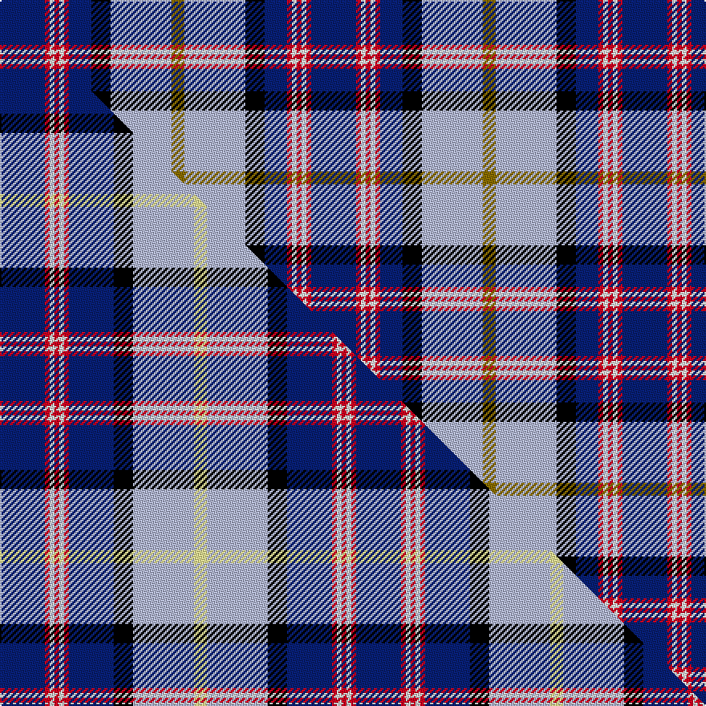

This page is one **sett** — a single exact thread-count. It belongs to the [tartan](/setts/db28r3w3r3w3r3db14k12lb38y8/)
(the same proportion at any scale), whose colour order is pattern [BRWRWRBKWG](/stripes/brwrwrbkwg/).

Part of the [GYL](/tartans/gyl/) tartan — the named design grouping this sett with its other cloths.

Sourced from tartans-authority.  It is a [10 stripe tartan](/stripes/stripes10/).

Original link http://www.tartansauthority.com/tartan-ferret/display/7367/

## Register references

External register numbers recorded for this tartan.

- Scottish Tartans Authority (ITI): 7367

## Thread count
DB/28 R3 W3 R3 W3 R3 DB14 K12 LB38 Y/8

One full sett is **194 threads**.

## Palette
<table><thead><tr><th>Colour</th><th>Shade</th><th>OKLCh</th></tr></thead><tbody><tr><td>LB</td><td><code style="background-color:#B5BBDE;">#B5BBDE</code> <small style="color:#888">#B5BBDE</small></td><td><small style="color:#888">oklch(79.9% 0.050 277.6)</small></td></tr><tr><td>DB</td><td><code style="background-color:#082077;">#082077</code> <small style="color:#888">#082077</small></td><td><small style="color:#888">oklch(30.0% 0.149 265.1)</small></td></tr><tr><td>K</td><td><code style="background-color:#000000;">#000000</code> <small style="color:#888">#000000</small></td><td><small style="color:#888">oklch(0.0% 0.000 0.0)</small></td></tr><tr><td>W</td><td><code style="background-color:#F7F7F7;">#F7F7F7</code> <small style="color:#888">#F7F7F7</small></td><td><small style="color:#888">oklch(97.6% 0.000 89.9)</small></td></tr><tr><td>R</td><td><code style="background-color:#D60020;">#D60020</code> <small style="color:#888">#D60020</small></td><td><small style="color:#888">oklch(55.2% 0.224 25.5)</small></td></tr><tr><td>Y</td><td><code style="background-color:#8B6E00;">#8B6E00</code> <small style="color:#888">#8B6E00</small></td><td><small style="color:#888">oklch(55.1% 0.113 90.4)</small></td></tr></tbody></table>

# Sample pattern

## Compared to the master

This cloth is one sett of its design; the master sett (the exemplar the design is anchored on) is below for comparison.

Its **ΔTartan distance** from the master is **0.34** — the same measure the nearest-tartans table ranks by (0 is identical; a re-scale of the same cloth is near 0, a recolour or a different proportion further).

<figure class="master-compare" style="margin:0">

this sett
master sett ★

<figcaption style="color:#888;font-size:smaller">One weave of this sett against the <a href="/setts/db28r3w3r3w3r3db28k12lb38wi8/">master sett ★</a>, split on the diagonal: a shared proportion runs seamlessly across it with only the shades shifting; a different proportion breaks on it.</figcaption>
</figure>

## Nearest tartan variants

The nearest existing variants by ΔTartan distance, with this cloth at the top so the swatches line up against it.

ΔTartan

Threads

Variant

Sett

—

194

<a href="/variants/s10/db28r3w3r3w3r3db14k12lb38y8/">GYL (Personal)</a>

<a href="/ttd/edit/#slug=db28r3w3r3w3r3db28k12lb38wi8~w3600000-wi3905105&amp;base=db28r3w3r3w3r3db14k12lb38y8" title="compare in the TTD">0.34</a>

222

<a href="/variants/s10/db28r3w3r3w3r3db28k12lb38wi8~w3600000-wi3905105/">GYL family (Personal)</a>

<a href="/ttd/edit/#slug=db24r6w6r6w6r6db25k12t36y6&amp;base=db28r3w3r3w3r3db14k12lb38y8" title="compare in the TTD">0.61</a>

236

<a href="/variants/s10/db24r6w6r6w6r6db25k12t36y6/">Lopatinsky (Personal)</a>

<a href="/ttd/edit/#slug=w4dbi8dr3dbi25k13db4lb29dbi3lb8dbi2dr3~x2~dbi1406275-db1106275&amp;base=db28r3w3r3w3r3db14k12lb38y8" title="compare in the TTD">1.18</a>

394

<a href="/variants/s11/w4dbi8dr3dbi25k13db4lb29dbi3lb8dbi2dr3~x2~dbi1406275-db1106275/">Royal Air Force Regimental Tartan</a>

<a href="/ttd/edit/#slug=w4db8dr3db25k13b4lb29db3lb8db2dr3~x2&amp;base=db28r3w3r3w3r3db14k12lb38y8" title="compare in the TTD">1.41</a>

394

<a href="/variants/s11/w4db8dr3db25k13b4lb29db3lb8db2dr3~x2/">Air Force</a>

<a href="/ttd/edit/#slug=dp4k2w3k2db30g9k4w20dy3~x2&amp;base=db28r3w3r3w3r3db14k12lb38y8" title="compare in the TTD">1.73</a>

294

<a href="/variants/s9/dp4k2w3k2db30g9k4w20dy3~x2/">Minnesota Dress</a>

<a href="/ttd/edit/#slug=dp4k2w3k2db30g9k4w20dy3~x2~g2408144&amp;base=db28r3w3r3w3r3db14k12lb38y8" title="compare in the TTD">1.79</a>

294

<a href="/variants/s9/dp4k2w3k2db30g9k4w20dy3~x2~g2408144/">Minnesota Dress American District Tartan</a>

<a href="/ttd/edit/#slug=w3lb26db13k13w2g8k5r3lb3~x2&amp;base=db28r3w3r3w3r3db14k12lb38y8" title="compare in the TTD">1.93</a>

292

<a href="/variants/s9/w3lb26db13k13w2g8k5r3lb3~x2/">Moran (Virgin Islands) (Personal)</a>

<a href="/ttd/edit/#slug=b2w1b12db6k3dg1w1dg4w2k1w1r1~x4&amp;base=db28r3w3r3w3r3db14k12lb38y8" title="compare in the TTD">2.03</a>

268

<a href="/variants/s12/b2w1b12db6k3dg1w1dg4w2k1w1r1~x4/">Diana Princess of Wales Memorial, The</a>

<a href="/ttd/edit/#slug=r3w2db27k19w27dp2y3~x2&amp;base=db28r3w3r3w3r3db14k12lb38y8" title="compare in the TTD">2.06</a>

320

<a href="/variants/s7/r3w2db27k19w27dp2y3~x2/">Christian Dress (Personal)</a>

<a href="/ttd/edit/#slug=db1w2lb12k2db2k2dp15db2ly1~x2&amp;base=db28r3w3r3w3r3db14k12lb38y8" title="compare in the TTD">2.10</a>

152

<a href="/variants/s9/db1w2lb12k2db2k2dp15db2ly1~x2/">Hek (Name)</a>

## Neighbour map

Every grey dot is one of 13620 variants placed by the first two principal components of the ΔTartan feature space (42% of its variance). Red is this tartan; blue dots are its nearest — click one to open its page.

<svg viewBox="0 0 640 380" role="img" style="max-width:100%;height:auto;border:1px solid #e0e0e0;border-radius:4px;display:block" xmlns="http://www.w3.org/2000/svg"><image href="/nn/cloud.v1.png" width="640" height="380"/><a href="/variants/s10/db28r3w3r3w3r3db28k12lb38wi8~w3600000-wi3905105/"><circle cx="143.1" cy="124.4" r="4" fill="#3465a4"><title>GYL family (Personal)</title></circle></a><a href="/variants/s10/db24r6w6r6w6r6db25k12t36y6/"><circle cx="84.4" cy="174.3" r="4" fill="#3465a4"><title>Lopatinsky (Personal)</title></circle></a><a href="/variants/s11/w4dbi8dr3dbi25k13db4lb29dbi3lb8dbi2dr3~x2~dbi1406275-db1106275/"><circle cx="131.0" cy="119.9" r="4" fill="#3465a4"><title>Royal Air Force Regimental Tartan</title></circle></a><a href="/variants/s11/w4db8dr3db25k13b4lb29db3lb8db2dr3~x2/"><circle cx="127.7" cy="120.2" r="4" fill="#3465a4"><title>Air Force</title></circle></a><a href="/variants/s9/dp4k2w3k2db30g9k4w20dy3~x2/"><circle cx="123.2" cy="113.9" r="4" fill="#3465a4"><title>Minnesota Dress</title></circle></a><a href="/variants/s9/dp4k2w3k2db30g9k4w20dy3~x2~g2408144/"><circle cx="122.6" cy="113.9" r="4" fill="#3465a4"><title>Minnesota Dress American District Tartan</title></circle></a><a href="/variants/s9/w3lb26db13k13w2g8k5r3lb3~x2/"><circle cx="95.1" cy="132.8" r="4" fill="#3465a4"><title>Moran (Virgin Islands) (Personal)</title></circle></a><a href="/variants/s12/b2w1b12db6k3dg1w1dg4w2k1w1r1~x4/"><circle cx="120.1" cy="117.3" r="4" fill="#3465a4"><title>Diana Princess of Wales Memorial, The</title></circle></a><a href="/variants/s7/r3w2db27k19w27dp2y3~x2/"><circle cx="111.1" cy="138.7" r="4" fill="#3465a4"><title>Christian Dress (Personal)</title></circle></a><a href="/variants/s9/db1w2lb12k2db2k2dp15db2ly1~x2/"><circle cx="143.3" cy="109.7" r="4" fill="#3465a4"><title>Hek (Name)</title></circle></a><circle cx="117.9" cy="124.1" r="5" fill="#c00000"/><text x="320" y="376" text-anchor="middle" font-size="11" fill="#999">ground</text><text x="11" y="190" text-anchor="middle" font-size="11" fill="#999" transform="rotate(-90 11 190)">complexity</text></svg>

ID: /variants/s10/db28r3w3r3w3r3db14k12lb38y8/
