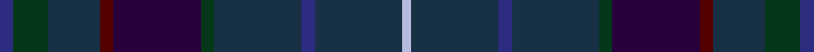

This is one **variant** — a specific cloth: this exact thread count and colourway, with its own
provenance below. It is one weaving of the [sett](/setts/db3dg8dt12dr3dp20dg3dt20db3dt20lb2/) (the scale-free proportion — the
same cloth at any scale or shade), whose colour order is pattern [BGBBBGBBBW](/stripes/bgbbbgbbbw/).

Sourced from house-of-tartan.  It is a [10 stripe tartan](/stripes/stripes10/).

Original link [http://www.house-of-tartan.scotland.net/house/TartanViewjs.asp?colr=Def&tnam=4101](http://www.house-of-tartan.scotland.net/house/TartanViewjs.asp?colr=Def&tnam=4101)

## Provenance

Earliest known date: 2002 Designed by David Cowley and Arther MacKie of the Strathmore Woollen Company to reflect the colours of the Angus glen.

Dataset <small>— provenance for this record, inherited from the source manifest</small>

<dl class="dataset-prov">
<dt>source</dt><dd><a href="/sources/house-of-tartan/">House of Tartan</a></dd>
<dt>data captured from</dt><dd><a href="https://github.com/thetartan/tartan-database/blob/master/data/house-of-tartan/data.csv">https://github.com/thetartan/tartan-database/blob/master/data/house-of-tartan/data.csv</a></dd>
<dt>data date</dt><dd>2002 <small>(this record)</small></dd>
<dt>licence</dt><dd><a href="https://creativecommons.org/licenses/by-nc-nd/4.0/">CC BY-NC-ND 4.0</a></dd>
</dl>

Capture chain <small>— the hands this data passed through, oldest first; each capture carries its own licence</small>

<ol class="capture-chain">
<li><a href="http://www.house-of-tartan.scotland.net/">House of Tartan</a> <small>the weaver/retailer's database — the site is now offline; the URL is kept as the ultimate source's identity</small></li>
<li><a href="https://github.com/thetartan/tartan-database">thetartan/tartan-database</a> <small>2016-2017</small> · <a href="https://creativecommons.org/licenses/by-nc-nd/4.0/">CC BY-NC-ND 4.0</a> <small>Levko Kravets's frozen compilation — the capture we vendored, and where its CC licence text came from</small></li>
<li>this dictionary <small>captured 2026-06-10 · commit 5bf86c7566</small> <small>each re-capture is a git commit to data/sources</small></li>
</ol>

## Thread count
DB/6 DG16 DT24 DR6 DP40 DG6 DT40 DB6 DT40 LB/4

One full sett is **366 threads**.

## Palette
<table><thead><tr><th>Colour</th><th>Shade</th><th>OKLCh</th></tr></thead><tbody><tr><td>DB</td><td><code style="background-color:#00008C;">#00008C</code> <small style="color:#888">#00008C</small></td><td><small style="color:#888">oklch(28.9% 0.200 264.1)</small></td></tr><tr><td>DB</td><td><code style="background-color:#2C2C80;">#2C2C80</code> <small style="color:#888">#2C2C80</small></td><td><small style="color:#888">oklch(35.0% 0.138 276.6)</small></td></tr><tr><td>DG</td><td><code style="background-color:#053819;">#053819</code> <small style="color:#888">#053819</small></td><td><small style="color:#888">oklch(30.0% 0.075 151.3)</small></td></tr><tr><td>G</td><td><code style="background-color:#008B2A;">#008B2A</code> <small style="color:#888">#008B2A</small></td><td><small style="color:#888">oklch(55.4% 0.170 145.9)</small></td></tr><tr><td>DT</td><td><code style="background-color:#183044;">#183044</code> <small style="color:#888">#183044</small></td><td><small style="color:#888">oklch(30.0% 0.047 245.4)</small></td></tr><tr><td>DP</td><td><code style="background-color:#28003C;">#28003C</code> <small style="color:#888">#28003C</small></td><td><small style="color:#888">oklch(21.3% 0.107 310.6)</small></td></tr><tr><td>DP</td><td><code style="background-color:#400040;">#400040</code> <small style="color:#888">#400040</small></td><td><small style="color:#888">oklch(26.1% 0.120 328.4)</small></td></tr><tr><td>DR</td><td><code style="background-color:#4C0C28;">#4C0C28</code> <small style="color:#888">#4C0C28</small></td><td><small style="color:#888">oklch(28.2% 0.097 359.3)</small></td></tr><tr><td>DR</td><td><code style="background-color:#540000;">#540000</code> <small style="color:#888">#540000</small></td><td><small style="color:#888">oklch(28.0% 0.115 29.2)</small></td></tr><tr><td>LB</td><td><code style="background-color:#B5BBDE;">#B5BBDE</code> <small style="color:#888">#B5BBDE</small></td><td><small style="color:#888">oklch(79.9% 0.050 277.6)</small></td></tr></tbody></table>

# Sample pattern

## Nearest tartan variants

The nearest existing variants by ΔTartan distance, with this cloth at the top so the swatches line up against it.

ΔTartan

Threads

Variant

Sett

—

366

<a href="/variants/s10/db3dg8dt12dr3dp20dg3dt20db3dt20lb2~x2~db1406275-dt1202249-dr1105035-dp0904317/">Strathisla District Tartan</a>

<a href="/ttd/edit/#slug=dt5dg2dt2dg2dt2db5dg2db1lb1db1dg10dr3~x4~dt1204274-db1404245&amp;base=db3dg8dt12dr3dp20dg3dt20db3dt20lb2~x2~db1406275-dt1202249-dr1105035-dp0904317" title="compare in the TTD">3.52</a>

256

<a href="/variants/s12/db5dg2db2dg2db2dbi5dg2dbi1lb1dbi1dg10dr3~x4~db1204274-dbi1404245/">Richard of Wales</a>

## Neighbour map

Every grey dot is one of 13621 variants placed by the first two principal components of the ΔTartan feature space (42% of its variance). Red is this tartan; blue dots are its nearest — click one to open its page.

<svg viewBox="0 0 640 380" role="img" style="max-width:100%;height:auto;border:1px solid #e0e0e0;border-radius:4px;display:block" xmlns="http://www.w3.org/2000/svg"><image href="/nn/cloud.v1.png" width="640" height="380"/><a href="/variants/s12/db5dg2db2dg2db2dbi5dg2dbi1lb1dbi1dg10dr3~x4~db1204274-dbi1404245/"><circle cx="389.4" cy="253.9" r="4" fill="#3465a4"><title>Richard of Wales</title></circle></a><circle cx="454.1" cy="252.8" r="5" fill="#c00000"/><text x="320" y="376" text-anchor="middle" font-size="11" fill="#999">ground</text><text x="11" y="190" text-anchor="middle" font-size="11" fill="#999" transform="rotate(-90 11 190)">complexity</text></svg>

ID: /variants/s10/db3dg8dt12dr3dp20dg3dt20db3dt20lb2~x2~db1406275-dt1202249-dr1105035-dp0904317/
