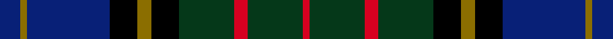

This is one **variant** — a specific cloth: this exact thread count and colourway, with its own
provenance below. It is one weaving of the [sett](/setts/db3y1db12k4y2k4dg8r2dg8r1/) (the scale-free proportion — the
same cloth at any scale or shade), whose colour order is pattern [BGBKGKGRGRGRGKGKBG](/stripes/bgbkgkgrgrgrgkgkbg/).

Part of the [MacMillan Hunting](/tartans/m/ma/macmillan-hunting-2/) tartan — the named design grouping this sett with its other cloths.

Sourced from register-of-tartans.  It is a [18 stripe tartan](/stripes/stripes18/).

Original link [https://www.tartanregister.gov.uk/tartanDetails.aspx?ref=2660](https://www.tartanregister.gov.uk/tartanDetails.aspx?ref=2660)

2 attestations — the source records this cloth was collapsed from (oldest owns this page)

<ul>
<li>01/01/1890 — MacMillan Hunting #2 (register-of-tartans, <a href="https://www.tartanregister.gov.uk/tartanDetails.aspx?ref=2660">record</a>)  <em>W & A K Johnstons' 1906 book explains that this tartan was designed and manufactured in 1890 by Baillie Donald Macmillan, J.P. of Partick, a representataive of the Loch Arkaig branch of the clan, and Chieftain of the Clan Macmillan Society. Patented and registered as Breacanseilgmhicgillemhaoil 'it has already attained great popularity, almost completely supplanting the old clan tartan.' Apparently the former President of the Clan MacMillan Society, Major Cameron Macmillan, always referred to this as Baillie Macmillan's tartan. Cameron was a boy in the 1890s when this tartan was a new product issuing from the Baillie's highland outfitting establishment in Partick. It's said that it did not really catch on until the late Chief, General Sir Gordon MacMillan, decided to dress all his family in it to make them easily identifiable from the rest of the clan who wore the Ancient. An idea which rather collapsed by Sir Gordon's move popularising the Hunting sett. A slightly different story is told in the 1906 Johnstons book.</em></li>
<li>1906 — MacMillan Htg (1906) (Clan) (tartans-authority, <a href="https://www.tartanregister.gov.uk/tartanDetails.aspx?ref=668">record</a>)  <em>STS has ref of "Adam No 75. ".</em></li>
</ul>

Dataset <small>— provenance for this record, inherited from the source manifest</small>

<dl class="dataset-prov">
<dt>source</dt><dd><a href="/sources/register-of-tartans/">Scottish Register of Tartans</a></dd>
<dt>data captured from</dt><dd><a href="https://github.com/thetartan/tartan-database/blob/master/data/register-of-tartans/data.csv">https://github.com/thetartan/tartan-database/blob/master/data/register-of-tartans/data.csv</a></dd>
<dt>data date</dt><dd>1890 <small>(this record)</small></dd>
<dt>licence</dt><dd><a href="https://www.tartanregister.gov.uk/copyright">Crown copyright</a></dd>
</dl>

Capture chain <small>— the hands this data passed through, oldest first; each capture carries its own licence</small>

<ol class="capture-chain">
<li><a href="https://www.tartanregister.gov.uk/">Scottish Register of Tartans</a> · <a href="https://www.tartanregister.gov.uk/copyright">Crown copyright</a> <small>the living register — still published by National Records of Scotland</small></li>
<li><a href="https://github.com/thetartan/tartan-database">thetartan/tartan-database</a> <small>2016-2017</small> · <a href="https://creativecommons.org/licenses/by-nc-nd/4.0/">CC BY-NC-ND 4.0</a> <small>Levko Kravets's frozen compilation — the capture we vendored, and where its CC licence text came from</small></li>
<li>this dictionary <small>captured 2026-06-10 · commit 5bf86c7566</small> <small>each re-capture is a git commit to data/sources</small></li>
</ol>

## Register references

External register numbers recorded for this tartan.

- Scottish Register of Tartans: [2660](https://www.tartanregister.gov.uk/tartanDetails.aspx?ref=2660)
- Scottish Tartans Authority (ITI): 668
- Scottish Tartans World Register: 668

## Thread count
DB/12 Y4 DB48 K16 Y8 K16 DG32 R8 DG32 R4 DG32 R8 DG32 K16 Y8 K16 DB48 Y/4

One full sett is **672 threads**.

## Palette
<table><thead><tr><th>Colour</th><th>Shade</th><th>OKLCh</th></tr></thead><tbody><tr><td>DB</td><td><code style="background-color:#082077;">#082077</code> <small style="color:#888">#082077</small></td><td><small style="color:#888">oklch(30.0% 0.149 265.1)</small></td></tr><tr><td>DG</td><td><code style="background-color:#053819;">#053819</code> <small style="color:#888">#053819</small></td><td><small style="color:#888">oklch(30.0% 0.075 151.3)</small></td></tr><tr><td>K</td><td><code style="background-color:#000000;">#000000</code> <small style="color:#888">#000000</small></td><td><small style="color:#888">oklch(0.0% 0.000 0.0)</small></td></tr><tr><td>R</td><td><code style="background-color:#D60020;">#D60020</code> <small style="color:#888">#D60020</small></td><td><small style="color:#888">oklch(55.2% 0.224 25.5)</small></td></tr><tr><td>Y</td><td><code style="background-color:#8B6E00;">#8B6E00</code> <small style="color:#888">#8B6E00</small></td><td><small style="color:#888">oklch(55.1% 0.113 90.4)</small></td></tr></tbody></table>

# Sample pattern

## Nearest tartan variants

The nearest existing variants by ΔTartan distance, with this cloth at the top so the swatches line up against it.

ΔTartan

Threads

Variant

Sett

—

672

<a href="/variants/s10/db3y1db12k4y2k4dg8r2dg8r1~x4/">MacMillan Hunting #2</a>

<a href="/ttd/edit/#slug=dg17k2dg2k2dg2k15db15r7db15k15dg2k2dg2k2dg17lo2~x2&amp;base=db3y1db12k4y2k4dg8r2dg8r1~x4" title="compare in the TTD">1.97</a>

438

<a href="/variants/s16/dg17k2dg2k2dg2k15db15r7db15k15dg2k2dg2k2dg17lo2~x2/">Thormanby Buccaneer Bay</a>

<a href="/ttd/edit/#slug=db12k2db2k2db2k12dg12k1w2k1dg12k12db12k1r2~x2&amp;base=db3y1db12k4y2k4dg8r2dg8r1~x4" title="compare in the TTD">2.15</a>

320

<a href="/variants/s15/db12k2db2k2db2k12dg12k1w2k1dg12k12db12k1r2~x2/">MacKenzie - 1780 (Clan) as 78th</a>

<a href="/ttd/edit/#slug=db11k3db3k3db3k9dg9k1dy3k1dg9k9db9k1w3~x2&amp;base=db3y1db12k4y2k4dg8r2dg8r1~x4" title="compare in the TTD">2.16</a>

280

<a href="/variants/s15/db11k3db3k3db3k9dg9k1dy3k1dg9k9db9k1w3~x2/">Glengoyne Distillery Corporate Tartan</a>

<a href="/ttd/edit/#slug=dt30k5dt5k5dt5k31dg31k3w7k3dg31k31dt31k3r7&amp;base=db3y1db12k4y2k4dg8r2dg8r1~x4" title="compare in the TTD">2.20</a>

419

<a href="/variants/s15/dt30k5dt5k5dt5k31dg31k3w7k3dg31k31dt31k3r7/">78th Regiment (Highlanders) (Mil.)</a>

<a href="/ttd/edit/#slug=dg13db2k2db2dg13g4db14dp2db14g4k12db2dg2db2dg2db2k12~x2&amp;base=db3y1db12k4y2k4dg8r2dg8r1~x4" title="compare in the TTD">2.26</a>

366

<a href="/variants/s17/dg13db2k2db2dg13g4db14dp2db14g4k12db2dg2db2dg2db2k12~x2/">National Trust for Scotland (Corpora</a>

<a href="/ttd/edit/#slug=dg10k9db11lb1db3lo1db10k9dg11lb1dg3lo1~x4&amp;base=db3y1db12k4y2k4dg8r2dg8r1~x4" title="compare in the TTD">2.27</a>

516

<a href="/variants/s12/dg10k9db11lb1db3lo1db10k9dg11lb1dg3lo1~x4/">Scottish Womens Rural Institute (Cor</a>

<a href="/ttd/edit/#slug=db9k1db1k1db1k7dr8k1y3k1dr8k7db8k1g3~x4&amp;base=db3y1db12k4y2k4dg8r2dg8r1~x4" title="compare in the TTD">2.30</a>

432

<a href="/variants/s15/db9k1db1k1db1k7dr8k1y3k1dr8k7db8k1g3~x4/">Dryer (Personal)</a>

<a href="/ttd/edit/#slug=dt4lo3dt24k18dg24t3dg4lo3dg24k18dt24t3~x2~dt1204274-t2503227&amp;base=db3y1db12k4y2k4dg8r2dg8r1~x4" title="compare in the TTD">2.31</a>

594

<a href="/variants/s12/db4lo3db24k18dg24t3dg4lo3dg24k18db24t3~x2~db1204274-t2503227/">Scottish Women's Rural Institutes, The</a>

<a href="/ttd/edit/#slug=db17k3db3k3db3k17dg17k2w3k2dg17k17db17k2r3~x2&amp;base=db3y1db12k4y2k4dg8r2dg8r1~x4" title="compare in the TTD">2.36</a>

464

<a href="/variants/s15/db17k3db3k3db3k17dg17k2w3k2dg17k17db17k2r3~x2/">Cumbernauld District Tartan</a>

<a href="/ttd/edit/#slug=db11k4db4w2db4k4db11dr26k4w3k4w2k14dg10db16dg6~x2&amp;base=db3y1db12k4y2k4dg8r2dg8r1~x4" title="compare in the TTD">2.38</a>

466

<a href="/variants/s16/db11k4db4w2db4k4db11dr26k4w3k4w2k14dg10db16dg6~x2/">Stuart-Houghton Family Tartan</a>

## Neighbour map

Every grey dot is one of 13621 variants placed by the first two principal components of the ΔTartan feature space (42% of its variance). Red is this tartan; blue dots are its nearest — click one to open its page.

<svg viewBox="0 0 640 380" role="img" style="max-width:100%;height:auto;border:1px solid #e0e0e0;border-radius:4px;display:block" xmlns="http://www.w3.org/2000/svg"><image href="/nn/cloud.v1.png" width="640" height="380"/><a href="/variants/s16/dg17k2dg2k2dg2k15db15r7db15k15dg2k2dg2k2dg17lo2~x2/"><circle cx="151.8" cy="158.3" r="4" fill="#3465a4"><title>Thormanby Buccaneer Bay</title></circle></a><a href="/variants/s15/db12k2db2k2db2k12dg12k1w2k1dg12k12db12k1r2~x2/"><circle cx="162.3" cy="145.6" r="4" fill="#3465a4"><title>MacKenzie - 1780 (Clan) as 78th</title></circle></a><a href="/variants/s15/db11k3db3k3db3k9dg9k1dy3k1dg9k9db9k1w3~x2/"><circle cx="135.5" cy="165.7" r="4" fill="#3465a4"><title>Glengoyne Distillery Corporate Tartan</title></circle></a><a href="/variants/s15/dt30k5dt5k5dt5k31dg31k3w7k3dg31k31dt31k3r7/"><circle cx="158.5" cy="157.7" r="4" fill="#3465a4"><title>78th Regiment (Highlanders) (Mil.)</title></circle></a><a href="/variants/s17/dg13db2k2db2dg13g4db14dp2db14g4k12db2dg2db2dg2db2k12~x2/"><circle cx="160.4" cy="174.8" r="4" fill="#3465a4"><title>National Trust for Scotland (Corpora</title></circle></a><a href="/variants/s12/dg10k9db11lb1db3lo1db10k9dg11lb1dg3lo1~x4/"><circle cx="156.6" cy="176.1" r="4" fill="#3465a4"><title>Scottish Womens Rural Institute (Cor</title></circle></a><a href="/variants/s15/db9k1db1k1db1k7dr8k1y3k1dr8k7db8k1g3~x4/"><circle cx="136.5" cy="163.4" r="4" fill="#3465a4"><title>Dryer (Personal)</title></circle></a><a href="/variants/s12/db4lo3db24k18dg24t3dg4lo3dg24k18db24t3~x2~db1204274-t2503227/"><circle cx="154.6" cy="187.6" r="4" fill="#3465a4"><title>Scottish Women's Rural Institutes, The</title></circle></a><a href="/variants/s15/db17k3db3k3db3k17dg17k2w3k2dg17k17db17k2r3~x2/"><circle cx="150.4" cy="160.7" r="4" fill="#3465a4"><title>Cumbernauld District Tartan</title></circle></a><a href="/variants/s16/db11k4db4w2db4k4db11dr26k4w3k4w2k14dg10db16dg6~x2/"><circle cx="137.9" cy="142.5" r="4" fill="#3465a4"><title>Stuart-Houghton Family Tartan</title></circle></a><circle cx="162.3" cy="157.6" r="5" fill="#c00000"/><text x="320" y="376" text-anchor="middle" font-size="11" fill="#999">ground</text><text x="11" y="190" text-anchor="middle" font-size="11" fill="#999" transform="rotate(-90 11 190)">complexity</text></svg>

ID: /variants/s10/db3y1db12k4y2k4dg8r2dg8r1~x4/
