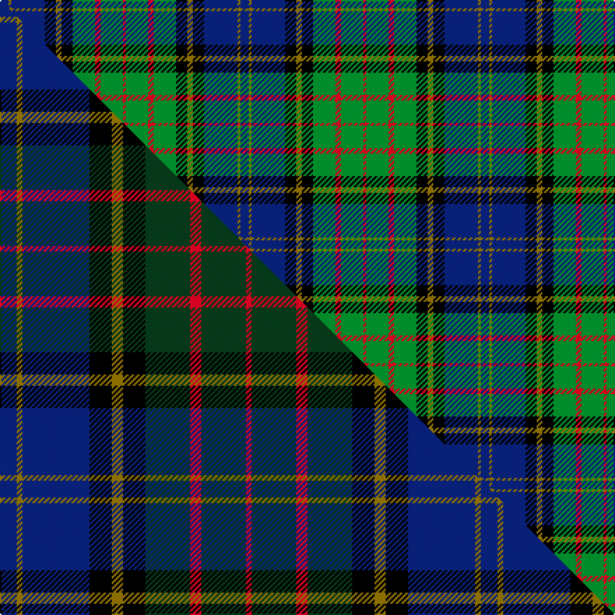

This is one **variant** — a specific cloth: this exact thread count and colourway, with its own
provenance below. It is one weaving of the [sett](/setts/db3y1db12k4y2k4g8r2g8r1/) (the scale-free proportion — the
same cloth at any scale or shade), whose colour order is pattern [BGBKGKGRGR](/stripes/bgbkgkgrgr/).

Part of the [MacMillan Hunting](/tartans/m/ma/macmillan-hunting-2/) tartan — the named design grouping this sett with its other cloths.

Sourced from weddslist.  It is a [10 stripe tartan](/stripes/stripes10/).

Original link [http://www.weddslist.com/cgi-bin/tartans/pg.pl?source=rb](http://www.weddslist.com/cgi-bin/tartans/pg.pl?source=rb)

4 attestations — the source records this cloth was collapsed from (oldest owns this page)

<ul>
<li>undated — MacMillan Hunting (weddslist, <a href="http://www.weddslist.com/cgi-bin/tartans/pg.pl?source=rb">record</a>) </li>
<li>undated — MacMillan, hunting (weddslist, <a href="http://www.weddslist.com/cgi-bin/tartans/pg.pl?source=sts">record</a>) </li>
<li>undated — MacMillan Hunting (weddslist, <a href="http://www.weddslist.com/cgi-bin/tartans/pg.pl?source=tinsel">record</a>) </li>
<li>undated — MacMillan Hunting (weddslist, <a href="http://www.weddslist.com/cgi-bin/tartans/pg.pl?source=x">record</a>) </li>
</ul>

Dataset <small>— provenance for this record, inherited from the source manifest</small>

<dl class="dataset-prov">
<dt>source</dt><dd><a href="/sources/weddslist/">Weddslist</a></dd>
<dt>data captured from</dt><dd><a href="https://github.com/thetartan/tartan-database/blob/master/data/weddslist/data.csv">https://github.com/thetartan/tartan-database/blob/master/data/weddslist/data.csv</a></dd>
<dt>data date</dt><dd>2016-11-17 <small>(dataset default)</small></dd>
<dt>licence</dt><dd><a href="https://creativecommons.org/licenses/by-nc-nd/4.0/">CC BY-NC-ND 4.0</a></dd>
</dl>

Capture chain <small>— the hands this data passed through, oldest first; each capture carries its own licence</small>

<ol class="capture-chain">
<li><a href="https://www.weddslist.com/tartans/">Weddslist</a> <small>the living privately compiled reference</small></li>
<li><a href="https://github.com/thetartan/tartan-database">thetartan/tartan-database</a> <small>2016-2017</small> · <a href="https://creativecommons.org/licenses/by-nc-nd/4.0/">CC BY-NC-ND 4.0</a> <small>Levko Kravets's frozen compilation — the capture we vendored, and where its CC licence text came from</small></li>
<li>this dictionary <small>captured 2026-06-10 · commit 5bf86c7566</small> <small>each re-capture is a git commit to data/sources</small></li>
</ol>

## Thread count
DB/6 Y2 DB24 K8 Y4 K8 G16 R4 G16 R/2

One full sett is **172 threads**.

## Palette
<table><thead><tr><th>Colour</th><th>Shade</th><th>OKLCh</th></tr></thead><tbody><tr><td>DB</td><td><code style="background-color:#082077;">#082077</code> <small style="color:#888">#082077</small></td><td><small style="color:#888">oklch(30.0% 0.149 265.1)</small></td></tr><tr><td>G</td><td><code style="background-color:#008B2A;">#008B2A</code> <small style="color:#888">#008B2A</small></td><td><small style="color:#888">oklch(55.4% 0.170 145.9)</small></td></tr><tr><td>K</td><td><code style="background-color:#000000;">#000000</code> <small style="color:#888">#000000</small></td><td><small style="color:#888">oklch(0.0% 0.000 0.0)</small></td></tr><tr><td>R</td><td><code style="background-color:#D60020;">#D60020</code> <small style="color:#888">#D60020</small></td><td><small style="color:#888">oklch(55.2% 0.224 25.5)</small></td></tr><tr><td>Y</td><td><code style="background-color:#8B6E00;">#8B6E00</code> <small style="color:#888">#8B6E00</small></td><td><small style="color:#888">oklch(55.1% 0.113 90.4)</small></td></tr></tbody></table>

# Sample pattern

## Compared to the master

This cloth is one sett of its design; the master sett (the exemplar the design is anchored on) is below for comparison.

Its **ΔTartan distance** from the master is **0.15** — the same measure the nearest-tartans table ranks by (0 is identical; a re-scale of the same cloth is near 0, a recolour or a different proportion further).

<figure class="master-compare" style="margin:0">

this sett
master sett ★

<figcaption style="color:#888;font-size:smaller">One weave of this sett against the <a href="/setts/db3y1db12k4y2k4dg8r2dg8r1/">master sett ★</a>, split on the diagonal: a shared proportion runs seamlessly across it with only the shades shifting; a different proportion breaks on it.</figcaption>
</figure>

## Nearest tartan variants

The nearest existing variants by ΔTartan distance, with this cloth at the top so the swatches line up against it.

ΔTartan

Threads

Variant

Sett

—

172

<a href="/variants/s10/db3y1db12k4y2k4g8r2g8r1~x2/">MacMillan Hunting</a>

<a href="/ttd/edit/#slug=db6dy2db18k6dy3k6g14r3g10r2~x2&amp;base=db3y1db12k4y2k4g8r2g8r1~x2" title="compare in the TTD">0.34</a>

264

<a href="/variants/s10/db6dy2db18k6dy3k6g14r3g10r2~x2/">MacMillan Hunting Clan Tartan</a>

<a href="/ttd/edit/#slug=t5dr3t30k6w4k6dg24dr4dg6dr3&amp;base=db3y1db12k4y2k4g8r2g8r1~x2" title="compare in the TTD">1.09</a>

174

<a href="/variants/s10/t5dr3t30k6w4k6dg24dr4dg6dr3/">Law Society of Scotland</a>

<a href="/ttd/edit/#slug=db10y3db30y5k8g16r4g16r2~x2&amp;base=db3y1db12k4y2k4g8r2g8r1~x2" title="compare in the TTD">1.32</a>

352

<a href="/variants/s9/db10y3db30y5k8g16r4g16r2~x2/">MacMillan Hunting Clan Tartan</a>

<a href="/ttd/edit/#slug=db8r4db12r1k12g12r3g2r1g4w1~x2&amp;base=db3y1db12k4y2k4g8r2g8r1~x2" title="compare in the TTD">1.43</a>

222

<a href="/variants/s11/db8r4db12r1k12g12r3g2r1g4w1~x2/">MacDonell of Glengarry #2</a>

<a href="/ttd/edit/#slug=db6lb2db20k15g20y2g6lb2g20k15db20y4~x2&amp;base=db3y1db12k4y2k4g8r2g8r1~x2" title="compare in the TTD">1.54</a>

508

<a href="/variants/s12/db6lb2db20k15g20y2g6lb2g20k15db20y4~x2/">Scottish Women's Rural Institutes</a>

<a href="/ttd/edit/#slug=r7db2g5db18g10db2k24db2g10y3~x2&amp;base=db3y1db12k4y2k4g8r2g8r1~x2" title="compare in the TTD">1.63</a>

312

<a href="/variants/s10/r7db2g5db18g10db2k24db2g10y3~x2/">Offally</a>

<a href="/ttd/edit/#slug=db4k1db2k1db6o2k4o2k8lb2g12o2g4~x2&amp;base=db3y1db12k4y2k4g8r2g8r1~x2" title="compare in the TTD">1.64</a>

184

<a href="/variants/s13/db4k1db2k1db6o2k4o2k8lb2g12o2g4~x2/">MacKusick (Piper) #1 (Personal)</a>

<a href="/ttd/edit/#slug=y3k1g10k7db10g2db2g2db10k7g10k1lb3~x2&amp;base=db3y1db12k4y2k4g8r2g8r1~x2" title="compare in the TTD">1.66</a>

260

<a href="/variants/s13/y3k1g10k7db10g2db2g2db10k7g10k1lb3~x2/">Doon Valley Crafters</a>

<a href="/ttd/edit/#slug=db12r4db18r2k19g18r4g3y2g8~x2&amp;base=db3y1db12k4y2k4g8r2g8r1~x2" title="compare in the TTD">1.69</a>

320

<a href="/variants/s10/db12r4db18r2k19g18r4g3y2g8~x2/">Biskup (Personal)</a>

<a href="/ttd/edit/#slug=w4db20g5k6g2w3g2k6g13dp8g2~x2&amp;base=db3y1db12k4y2k4g8r2g8r1~x2" title="compare in the TTD">1.69</a>

272

<a href="/variants/s11/w4db20g5k6g2w3g2k6g13dp8g2~x2/">Bowlers (Commemorative)</a>

## Neighbour map

Every grey dot is one of 13621 variants placed by the first two principal components of the ΔTartan feature space (42% of its variance). Red is this tartan; blue dots are its nearest — click one to open its page.

<svg viewBox="0 0 640 380" role="img" style="max-width:100%;height:auto;border:1px solid #e0e0e0;border-radius:4px;display:block" xmlns="http://www.w3.org/2000/svg"><image href="/nn/cloud.v1.png" width="640" height="380"/><a href="/variants/s10/db6dy2db18k6dy3k6g14r3g10r2~x2/"><circle cx="115.5" cy="181.5" r="4" fill="#3465a4"><title>MacMillan Hunting Clan Tartan</title></circle></a><a href="/variants/s10/t5dr3t30k6w4k6dg24dr4dg6dr3/"><circle cx="158.8" cy="157.9" r="4" fill="#3465a4"><title>Law Society of Scotland</title></circle></a><a href="/variants/s9/db10y3db30y5k8g16r4g16r2~x2/"><circle cx="186.8" cy="161.4" r="4" fill="#3465a4"><title>MacMillan Hunting Clan Tartan</title></circle></a><a href="/variants/s11/db8r4db12r1k12g12r3g2r1g4w1~x2/"><circle cx="108.9" cy="152.9" r="4" fill="#3465a4"><title>MacDonell of Glengarry #2</title></circle></a><a href="/variants/s12/db6lb2db20k15g20y2g6lb2g20k15db20y4~x2/"><circle cx="113.3" cy="174.2" r="4" fill="#3465a4"><title>Scottish Women's Rural Institutes</title></circle></a><a href="/variants/s10/r7db2g5db18g10db2k24db2g10y3~x2/"><circle cx="112.2" cy="159.0" r="4" fill="#3465a4"><title>Offally</title></circle></a><a href="/variants/s13/db4k1db2k1db6o2k4o2k8lb2g12o2g4~x2/"><circle cx="91.4" cy="148.8" r="4" fill="#3465a4"><title>MacKusick (Piper) #1 (Personal)</title></circle></a><a href="/variants/s13/y3k1g10k7db10g2db2g2db10k7g10k1lb3~x2/"><circle cx="106.3" cy="168.7" r="4" fill="#3465a4"><title>Doon Valley Crafters</title></circle></a><a href="/variants/s10/db12r4db18r2k19g18r4g3y2g8~x2/"><circle cx="106.0" cy="173.3" r="4" fill="#3465a4"><title>Biskup (Personal)</title></circle></a><a href="/variants/s11/w4db20g5k6g2w3g2k6g13dp8g2~x2/"><circle cx="92.8" cy="161.5" r="4" fill="#3465a4"><title>Bowlers (Commemorative)</title></circle></a><circle cx="128.1" cy="166.3" r="5" fill="#c00000"/><text x="320" y="376" text-anchor="middle" font-size="11" fill="#999">ground</text><text x="11" y="190" text-anchor="middle" font-size="11" fill="#999" transform="rotate(-90 11 190)">complexity</text></svg>

ID: /variants/s10/db3y1db12k4y2k4g8r2g8r1~x2/
