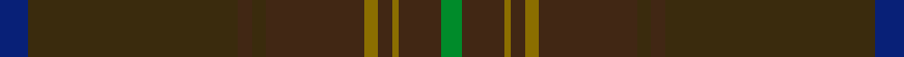

This is one **variant** — a specific cloth: this exact thread count and colourway, with its own
provenance below. It is one weaving of the [sett](/setts/db4dy30do2dy2do14y2do2y1do6g3/) (the scale-free proportion — the
same cloth at any scale or shade), whose colour order is pattern [BGBGBGBGBG](/stripes/bgbgbgbgbg/).

Part of the [Hickory](/tartans/h/hi/hickory/) tartan — the named design grouping this sett with its other cloths.

Sourced from register-of-tartans.  It is a [10 stripe tartan](/stripes/stripes10/).

Original link [https://www.tartanregister.gov.uk/tartanDetails.aspx?ref=11260](https://www.tartanregister.gov.uk/tartanDetails.aspx?ref=11260)

Dataset <small>— provenance for this record, inherited from the source manifest</small>

<dl class="dataset-prov">
<dt>source</dt><dd><a href="/sources/register-of-tartans/">Scottish Register of Tartans</a></dd>
<dt>data captured from</dt><dd><a href="https://github.com/thetartan/tartan-database/blob/master/data/register-of-tartans/data.csv">https://github.com/thetartan/tartan-database/blob/master/data/register-of-tartans/data.csv</a></dd>
<dt>data date</dt><dd>10/03/2015 <small>(this record)</small></dd>
<dt>licence</dt><dd><a href="https://www.tartanregister.gov.uk/copyright">Crown copyright</a></dd>
</dl>

Capture chain <small>— the hands this data passed through, oldest first; each capture carries its own licence</small>

<ol class="capture-chain">
<li><a href="https://www.tartanregister.gov.uk/">Scottish Register of Tartans</a> · <a href="https://www.tartanregister.gov.uk/copyright">Crown copyright</a> <small>the living register — still published by National Records of Scotland</small></li>
<li><a href="https://github.com/thetartan/tartan-database">thetartan/tartan-database</a> <small>2016-2017</small> · <a href="https://creativecommons.org/licenses/by-nc-nd/4.0/">CC BY-NC-ND 4.0</a> <small>Levko Kravets's frozen compilation — the capture we vendored, and where its CC licence text came from</small></li>
<li>this dictionary <small>captured 2026-06-10 · commit 5bf86c7566</small> <small>each re-capture is a git commit to data/sources</small></li>
</ol>

## Register references

External register numbers recorded for this tartan.

- Scottish Register of Tartans: [11260](https://www.tartanregister.gov.uk/tartanDetails.aspx?ref=11260)

## Thread count
DB/8 DY60 DO4 DY4 DO28 Y4 DO4 Y2 DO12 G/6

One full sett is **250 threads**.

## Palette
<table><thead><tr><th>Colour</th><th>Shade</th><th>OKLCh</th></tr></thead><tbody><tr><td>DB</td><td><code style="background-color:#082077;">#082077</code> <small style="color:#888">#082077</small></td><td><small style="color:#888">oklch(30.0% 0.149 265.1)</small></td></tr><tr><td>G</td><td><code style="background-color:#008B2A;">#008B2A</code> <small style="color:#888">#008B2A</small></td><td><small style="color:#888">oklch(55.4% 0.170 145.9)</small></td></tr><tr><td>DY</td><td><code style="background-color:#3A2B0D;">#3A2B0D</code> <small style="color:#888">#3A2B0D</small></td><td><small style="color:#888">oklch(30.0% 0.049 82.0)</small></td></tr><tr><td>DO</td><td><code style="background-color:#412714;">#412714</code> <small style="color:#888">#412714</small></td><td><small style="color:#888">oklch(30.1% 0.050 55.7)</small></td></tr><tr><td>Y</td><td><code style="background-color:#8B6E00;">#8B6E00</code> <small style="color:#888">#8B6E00</small></td><td><small style="color:#888">oklch(55.1% 0.113 90.4)</small></td></tr></tbody></table>

# Sample pattern

## Nearest tartan variants

The nearest existing variants by ΔTartan distance, with this cloth at the top so the swatches line up against it.

ΔTartan

Threads

Variant

Sett

—

250

<a href="/variants/s10/db4dy30do2dy2do14y2do2y1do6g3~x2/">Hickory</a>

<a href="/ttd/edit/#slug=dy50do6o3do3y3do3dt10dy8do3dy6y3~x2&amp;base=db4dy30do2dy2do14y2do2y1do6g3~x2" title="compare in the TTD">3.80</a>

286

<a href="/variants/s11/dy50do6o3do3y3do3dt10dy8do3dy6y3~x2/">Williams (Fashion)</a>

<a href="/ttd/edit/#slug=dy62do12lg1g4dg2g4lg1do12dg12~x2~lg3304130-g1903152&amp;base=db4dy30do2dy2do14y2do2y1do6g3~x2" title="compare in the TTD">3.97</a>

292

<a href="/variants/s9/dy62do12lg1g4dg2g4lg1do12dg12~x2~lg3304130-g1903152/">Roast Den, The</a>

## Neighbour map

Every grey dot is one of 13621 variants placed by the first two principal components of the ΔTartan feature space (42% of its variance). Red is this tartan; blue dots are its nearest — click one to open its page. The map is a flat projection of a many-dimensional space — [how to read it](/posts/neighbourhood-maps/).

<svg viewBox="0 0 640 380" role="img" style="max-width:100%;height:auto;border:1px solid #e0e0e0;border-radius:4px;display:block" xmlns="http://www.w3.org/2000/svg"><image href="/nn/cloud.v1.png" width="640" height="380"/><a href="/variants/s11/dy50do6o3do3y3do3dt10dy8do3dy6y3~x2/"><circle cx="626.0" cy="217.6" r="4" fill="#3465a4"><title>Williams (Fashion)</title></circle></a><a href="/variants/s9/dy62do12lg1g4dg2g4lg1do12dg12~x2~lg3304130-g1903152/"><circle cx="626.0" cy="203.7" r="4" fill="#3465a4"><title>Roast Den, The</title></circle></a><circle cx="573.6" cy="216.1" r="5" fill="#c00000"/><text x="320" y="376" text-anchor="middle" font-size="11" fill="#999">ground</text><text x="11" y="190" text-anchor="middle" font-size="11" fill="#999" transform="rotate(-90 11 190)">complexity</text></svg>

ID: /variants/s10/db4dy30do2dy2do14y2do2y1do6g3~x2/
