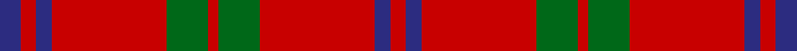

This page is one **sett** — a single exact thread-count. It belongs to the [tartan](/setts/db4r3db3r22g8r2/)
(the same proportion at any scale), whose colour order is pattern [BRBRGRGRBR](/stripes/brbrgrgrbr/).

Sourced from house-of-tartan.  It is a [10 stripe tartan](/stripes/stripes10/).

Original link http://www.house-of-tartan.scotland.net/house/TartanViewjs.asp?colr=Def&tnam=2381

## Provenance

Earliest known date: Pre 1997 Produced by or for Barkraft Lt for use as a blanket or rug.

## Thread count
DBa/8 Ra6 DBa6 Ra44 G16 Ra4 G16 Ra44 DBa6 Ra/6

One full sett is **298 threads**.

## Palette

Palette: <strong>Tartan Register</strong>
<table><thead><tr><th>Colour</th><th>Threads</th><th>Shade</th><th>Base</th><th>OKLCh</th></tr></thead><tbody><tr><td>DBa/</td><td style="text-align:right;font-variant-numeric:tabular-nums">8</td><td><code style="background-color:#2C2C80;">#2C2C80</code> <small style="color:#888">#2C2C80</small></td><td>B <code style="background-color:#2A418A;">#2A418A</code></td><td><small style="color:#888">oklch(35.0% 0.138 276.6)</small></td></tr><tr><td>Ra</td><td style="text-align:right;font-variant-numeric:tabular-nums">6</td><td><code style="background-color:#C80000;">#C80000</code> <small style="color:#888">#C80000</small></td><td>R <code style="background-color:#CC0000;">#CC0000</code></td><td><small style="color:#888">oklch(52.3% 0.215 29.2)</small></td></tr><tr><td>DBa</td><td style="text-align:right;font-variant-numeric:tabular-nums">6</td><td><code style="background-color:#2C2C80;">#2C2C80</code> <small style="color:#888">#2C2C80</small></td><td>B <code style="background-color:#2A418A;">#2A418A</code></td><td><small style="color:#888">oklch(35.0% 0.138 276.6)</small></td></tr><tr><td>Ra</td><td style="text-align:right;font-variant-numeric:tabular-nums">44</td><td><code style="background-color:#C80000;">#C80000</code> <small style="color:#888">#C80000</small></td><td>R <code style="background-color:#CC0000;">#CC0000</code></td><td><small style="color:#888">oklch(52.3% 0.215 29.2)</small></td></tr><tr><td>G</td><td style="text-align:right;font-variant-numeric:tabular-nums">16</td><td><code style="background-color:#006818;">#006818</code> <small style="color:#888">#006818</small></td><td>G <code style="background-color:#006100;">#006100</code></td><td><small style="color:#888">oklch(45.0% 0.142 145.0)</small></td></tr><tr><td>Ra</td><td style="text-align:right;font-variant-numeric:tabular-nums">4</td><td><code style="background-color:#C80000;">#C80000</code> <small style="color:#888">#C80000</small></td><td>R <code style="background-color:#CC0000;">#CC0000</code></td><td><small style="color:#888">oklch(52.3% 0.215 29.2)</small></td></tr><tr><td>G</td><td style="text-align:right;font-variant-numeric:tabular-nums">16</td><td><code style="background-color:#006818;">#006818</code> <small style="color:#888">#006818</small></td><td>G <code style="background-color:#006100;">#006100</code></td><td><small style="color:#888">oklch(45.0% 0.142 145.0)</small></td></tr><tr><td>Ra</td><td style="text-align:right;font-variant-numeric:tabular-nums">44</td><td><code style="background-color:#C80000;">#C80000</code> <small style="color:#888">#C80000</small></td><td>R <code style="background-color:#CC0000;">#CC0000</code></td><td><small style="color:#888">oklch(52.3% 0.215 29.2)</small></td></tr><tr><td>DBa</td><td style="text-align:right;font-variant-numeric:tabular-nums">6</td><td><code style="background-color:#2C2C80;">#2C2C80</code> <small style="color:#888">#2C2C80</small></td><td>B <code style="background-color:#2A418A;">#2A418A</code></td><td><small style="color:#888">oklch(35.0% 0.138 276.6)</small></td></tr><tr><td>Ra/</td><td style="text-align:right;font-variant-numeric:tabular-nums">6</td><td><code style="background-color:#C80000;">#C80000</code> <small style="color:#888">#C80000</small></td><td>R <code style="background-color:#CC0000;">#CC0000</code></td><td><small style="color:#888">oklch(52.3% 0.215 29.2)</small></td></tr></tbody></table>

## Nearest tartans

The nearest existing variants by ΔTartan distance, with this tartan at the top so the swatches line up against it.

ΔTartan

Tartan

Sett

—

<a href="/ttd/edit/#slug=db4r3db3r22g8r2~x2">Auld Reekie Trade Tartan</a> <a class="nn-out" href="/variants/s10/db4r3db3r22g8r2~x2/" title="open its dictionary page">↗</a>

0.92

<a href="/ttd/edit/#slug=r8dg2r6db1r2db1r8dg12r14db1r2~x2&amp;base=db4r3db3r22g8r2~x2">MacDonell of Keppoch #2</a> <a class="nn-out" href="/variants/s11/r8dg2r6db1r2db1r8dg12r14db1r2~x2/" title="open its dictionary page">↗</a>

0.93

<a href="/ttd/edit/#slug=r9dg4r6k2r4k2r8dg14r24k2r4~x2&amp;base=db4r3db3r22g8r2~x2">MacDonell of Keppach</a> <a class="nn-out" href="/variants/s11/r9dg4r6k2r4k2r8dg14r24k2r4~x2/" title="open its dictionary page">↗</a>

0.95

<a href="/ttd/edit/#slug=r8g2r6db1r2db1r8g12r14db1r2~x2&amp;base=db4r3db3r22g8r2~x2">MacDonell of Keppoch</a> <a class="nn-out" href="/variants/s11/r8g2r6db1r2db1r8g12r14db1r2~x2/" title="open its dictionary page">↗</a>

1.04

<a href="/ttd/edit/#slug=k8g4r4g3r32g3r4g3r4k4~x2&amp;base=db4r3db3r22g8r2~x2">MacDonald of Belfinlay</a> <a class="nn-out" href="/variants/s10/k8g4r4g3r32g3r4g3r4k4~x2/" title="open its dictionary page">↗</a>

1.09

<a href="/ttd/edit/#slug=r4g14r5k6r24g2r4~x2&amp;base=db4r3db3r22g8r2~x2">Auld Lang Syne (red) Tartan</a> <a class="nn-out" href="/variants/s7/r4g14r5k6r24g2r4~x2/" title="open its dictionary page">↗</a>

1.11

<a href="/ttd/edit/#slug=db4r3db3r22g8r2~x2">Auld Reekie</a> <a class="nn-out" href="/variants/s6/db4r3db3r22g8r2~x2/" title="open its dictionary page">↗</a>

1.14

<a href="/ttd/edit/#slug=r12db1r1g8r2db1r1db3r1db1r12g1r1g4~x4&amp;base=db4r3db3r22g8r2~x2">MacColl</a> <a class="nn-out" href="/variants/s14/r12db1r1g8r2db1r1db3r1db1r12g1r1g4~x4/" title="open its dictionary page">↗</a>

1.17

<a href="/ttd/edit/#slug=r9g4r6k2r4k2r8g14r24k2r4~x2&amp;base=db4r3db3r22g8r2~x2">MacDonell of Keppach</a> <a class="nn-out" href="/variants/s11/r9g4r6k2r4k2r8g14r24k2r4~x2/" title="open its dictionary page">↗</a>

1.20

<a href="/ttd/edit/#slug=r6lb2r30dg12r3dg12r3&amp;base=db4r3db3r22g8r2~x2">Crawford</a> <a class="nn-out" href="/variants/s7/r6lb2r30dg12r3dg12r3/" title="open its dictionary page">↗</a>

1.23

<a href="/ttd/edit/#slug=r12db1r1g8r2db1r1db3r1db1r12g1r1g4~x2&amp;base=db4r3db3r22g8r2~x2">MacColl</a> <a class="nn-out" href="/variants/s14/r12db1r1g8r2db1r1db3r1db1r12g1r1g4~x2/" title="open its dictionary page">↗</a>

## Neighbour map

Every grey dot is one of 14360 variants placed by the first two principal components of the ΔTartan feature space (44% of its variance). Red is this tartan; blue dots are its nearest — click one to open its page.

<svg viewBox="0 0 640 380" role="img" style="max-width:100%;height:auto;border:1px solid #e0e0e0;border-radius:4px;display:block" xmlns="http://www.w3.org/2000/svg"><image href="/nn/cloud.v1.png" width="640" height="380"/><a href="/variants/s11/r8dg2r6db1r2db1r8dg12r14db1r2~x2/"><circle cx="453.1" cy="180.8" r="4" fill="#3465a4"><title>MacDonell of Keppoch #2</title></circle></a><a href="/variants/s11/r9dg4r6k2r4k2r8dg14r24k2r4~x2/"><circle cx="432.0" cy="180.0" r="4" fill="#3465a4"><title>MacDonell of Keppach</title></circle></a><a href="/variants/s11/r8g2r6db1r2db1r8g12r14db1r2~x2/"><circle cx="461.1" cy="189.5" r="4" fill="#3465a4"><title>MacDonell of Keppoch</title></circle></a><a href="/variants/s10/k8g4r4g3r32g3r4g3r4k4~x2/"><circle cx="404.6" cy="166.6" r="4" fill="#3465a4"><title>MacDonald of Belfinlay</title></circle></a><a href="/variants/s7/r4g14r5k6r24g2r4~x2/"><circle cx="393.5" cy="206.4" r="4" fill="#3465a4"><title>Auld Lang Syne (red) Tartan</title></circle></a><a href="/variants/s6/db4r3db3r22g8r2~x2/"><circle cx="416.2" cy="207.8" r="4" fill="#3465a4"><title>Auld Reekie</title></circle></a><a href="/variants/s14/r12db1r1g8r2db1r1db3r1db1r12g1r1g4~x4/"><circle cx="389.1" cy="160.2" r="4" fill="#3465a4"><title>MacColl</title></circle></a><a href="/variants/s11/r9g4r6k2r4k2r8g14r24k2r4~x2/"><circle cx="419.0" cy="179.0" r="4" fill="#3465a4"><title>MacDonell of Keppach</title></circle></a><a href="/variants/s7/r6lb2r30dg12r3dg12r3/"><circle cx="416.0" cy="194.0" r="4" fill="#3465a4"><title>Crawford</title></circle></a><a href="/variants/s14/r12db1r1g8r2db1r1db3r1db1r12g1r1g4~x2/"><circle cx="392.8" cy="163.0" r="4" fill="#3465a4"><title>MacColl</title></circle></a><circle cx="423.0" cy="191.7" r="5" fill="#c00000"/></svg>

ID: /variants/s10/db4r3db3r22g8r2~x2/
