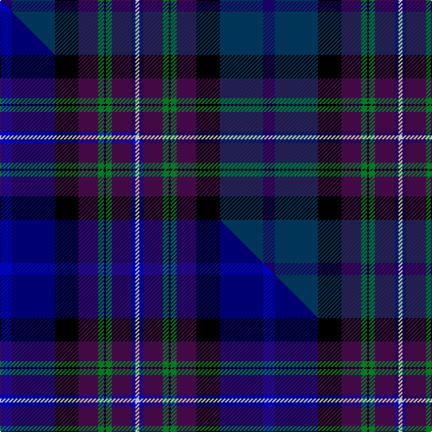

This is one **variant** — a specific cloth: this exact thread count and colourway, with its own
provenance below. It is one weaving of the [sett](/tartans/c/co/cowal/) (the scale-free proportion — the
same cloth at any scale or shade), whose colour order is pattern [BBKBGKGBBW](/stripes/bbkbgkgbbw/).

Part of the [Cowal](/tartans/c/co/cowal/) tartan — the named design grouping this sett with its other cloths.

Sourced from tartans-authority.  It is a [10 stripe tartan](/stripes/stripes10/).

Original link <code>http://www.tartansauthority.com/tartan-ferret/display/10157/</code> — retired · [Internet Archive copy](https://web.archive.org/web/*/http://www.tartansauthority.com/tartan-ferret/display/10157/*)

Dataset <small>— provenance for this record, inherited from the source manifest</small>

<dl class="dataset-prov">
<dt>source</dt><dd><a href="/sources/tartans-authority/">Scottish Tartans Authority</a></dd>
<dt>data captured from</dt><dd><a href="https://github.com/thetartan/tartan-database/blob/master/data/tartans-authority/data.csv">https://github.com/thetartan/tartan-database/blob/master/data/tartans-authority/data.csv</a></dd>
<dt>data date</dt><dd>pre 2010 <small>(this record)</small></dd>
<dt>licence</dt><dd><a href="https://creativecommons.org/licenses/by-nc-nd/4.0/">CC BY-NC-ND 4.0</a></dd>
</dl>

Capture chain <small>— the hands this data passed through, oldest first; each capture carries its own licence</small>

<ol class="capture-chain">
<li><a href="https://www.tartansauthority.com/">Scottish Tartans Authority</a> <small>the heritage body’s archive — its tartan-ferret record browser is retired; dead record links are shown unlinked, with an Internet Archive copy (ITI numbers are not SRT references)</small></li>
<li><a href="https://github.com/thetartan/tartan-database">thetartan/tartan-database</a> <small>2016-2017</small> · <a href="https://creativecommons.org/licenses/by-nc-nd/4.0/">CC BY-NC-ND 4.0</a> <small>Levko Kravets's frozen compilation — the capture we vendored, and where its CC licence text came from</small></li>
<li>this dictionary <small>captured 2026-06-10 · commit 5bf86c7566</small> <small>each re-capture is a git commit to data/sources</small></li>
</ol>

## Register references

External register numbers recorded for this tartan.

- Scottish Register of Tartans: [10157](https://www.tartanregister.gov.uk/tartanDetails?ref=10157)
- Scottish Tartans Authority (ITI): 10157

## Thread count
DB/12 DBi44 K24 DP20 G6 K2 G6 DP20 DB4 W/4

One full sett is **268 threads**.

## Palette
<table><thead><tr><th>Colour</th><th>Shade</th><th>OKLCh</th></tr></thead><tbody><tr><td>DB</td><td><code style="background-color:#003C64;">#003C64</code> <small style="color:#888">#003C64</small></td><td><small style="color:#888">oklch(34.5% 0.089 246.0)</small></td></tr><tr><td>DB</td><td><code style="background-color:#1C0070;">#1C0070</code> <small style="color:#888">#1C0070</small></td><td><small style="color:#888">oklch(26.3% 0.162 277.1)</small></td></tr><tr><td>G</td><td><code style="background-color:#008B2A;">#008B2A</code> <small style="color:#888">#008B2A</small></td><td><small style="color:#888">oklch(55.4% 0.170 145.9)</small></td></tr><tr><td>K</td><td><code style="background-color:#000000;">#000000</code> <small style="color:#888">#000000</small></td><td><small style="color:#888">oklch(0.0% 0.000 0.0)</small></td></tr><tr><td>W</td><td><code style="background-color:#F7F7F7;">#F7F7F7</code> <small style="color:#888">#F7F7F7</small></td><td><small style="color:#888">oklch(97.6% 0.000 89.9)</small></td></tr><tr><td>DP</td><td><code style="background-color:#4B0B4F;">#4B0B4F</code> <small style="color:#888">#4B0B4F</small></td><td><small style="color:#888">oklch(30.1% 0.125 325.4)</small></td></tr></tbody></table>

# Sample pattern

[Sample sheet (PDF)](swatch.pdf) — the woven sample, thread count and palette on one printable A4, rendered on demand (the same sheet the TTD print page downloads).

## Compared to the master

This cloth is one sett of its design; the master sett (the exemplar the design is anchored on) is below for comparison.

Its **ΔTartan distance** from the master is **2.00** — the same measure the nearest-tartans table ranks by (0 is identical; a re-scale of the same cloth is near 0, a recolour or a different proportion further).

<figure class="master-compare" style="margin:0">

this sett
master sett ★

<figcaption style="color:#888;font-size:smaller">One weave of this sett against the <a href="/setts/b6db22k12dp10g3k1g3dp10b2w2/">master sett ★</a>, split on the diagonal: a shared proportion runs seamlessly across it with only the shades shifting; a different proportion breaks on it.</figcaption>
</figure>

## Nearest tartan variants

The nearest existing variants by ΔTartan distance, with this cloth at the top so the swatches line up against it.

ΔTartan

Threads

Variant

Sett

—

268

<a href="/variants/s10/db6dbi22k12dp10g3k1g3dp10db2w2~x2~db2616276-dbi3409246/">Cowal (Corporate)</a>

<a href="/ttd/edit/#slug=dg10y2k2dg2k13dg2k2dg1dp13db24w2~x2&amp;base=db6dbi22k12dp10g3k1g3dp10db2w2~x2~db2616276-dbi3409246" title="compare in the TTD">1.57</a>

268

<a href="/variants/s11/dg10y2k2dg2k13dg2k2dg1dp13db24w2~x2/">Lang of Sherbrooke (Personal)</a>

<a href="/ttd/edit/#slug=dg10y2dp2dg2dp13dg2dp2dg1k13db24w2~x2&amp;base=db6dbi22k12dp10g3k1g3dp10db2w2~x2~db2616276-dbi3409246" title="compare in the TTD">1.59</a>

268

<a href="/variants/s11/dg10y2dp2dg2dp13dg2dp2dg1k13db24w2~x2/">Lang of Sherbrooke (Personal)</a>

<a href="/ttd/edit/#slug=db13w2dt38k13dt8k8dp17dg2dp17k4db11~db2911276-dp4018327&amp;base=db6dbi22k12dp10g3k1g3dp10db2w2~x2~db2616276-dbi3409246" title="compare in the TTD">1.91</a>

242

<a href="/variants/s11/db13w2dt38k13dt8k8dp17dg2dp17k4db11~db2911276-dp4018327/">Bute Heather</a>

<a href="/ttd/edit/#slug=b6db22k12dp10g3k1g3dp10b2w2~x2~b3826264-db2719264&amp;base=db6dbi22k12dp10g3k1g3dp10db2w2~x2~db2616276-dbi3409246" title="compare in the TTD">2.00</a>

268

<a href="/variants/s10/b6db22k12dp10g3k1g3dp10b2w2~x2~b3826264-db2719264/">Cowal</a>

<a href="/ttd/edit/#slug=dg8dpi2dp2dg3dp16dg2k2dg1k16db30w2~x2~dpi4018327-dp3708327&amp;base=db6dbi22k12dp10g3k1g3dp10db2w2~x2~db2616276-dbi3409246" title="compare in the TTD">2.36</a>

316

<a href="/variants/s11/dg8dpi2dp2dg3dp16dg2k2dg1k16db30w2~x2~dpi4018327-dp3708327/">Pride of Scotland General Tartan</a>

<a href="/ttd/edit/#slug=k3dp16dg5dp3o2dp2k12db23w2~x2&amp;base=db6dbi22k12dp10g3k1g3dp10db2w2~x2~db2616276-dbi3409246" title="compare in the TTD">2.59</a>

262

<a href="/variants/s9/k3dp16dg5dp3o2dp2k12db23w2~x2/">Crieff Highland Gathering Corporate Tartan</a>

<a href="/ttd/edit/#slug=k3dp16g5dp3b2dp2k12db23w2~x2&amp;base=db6dbi22k12dp10g3k1g3dp10db2w2~x2~db2616276-dbi3409246" title="compare in the TTD">2.65</a>

262

<a href="/variants/s9/k3dp16g5dp3b2dp2k12db23w2~x2/">Creiff Highland Gathering</a>

<a href="/ttd/edit/#slug=dg19w2dg5k4db21k4w2dg5w1y1w1dr14~x2&amp;base=db6dbi22k12dp10g3k1g3dp10db2w2~x2~db2616276-dbi3409246" title="compare in the TTD">2.76</a>

250

<a href="/variants/s12/dg19w2dg5k4db21k4w2dg5w1y1w1dr14~x2/">Womack (2014)</a>

<a href="/ttd/edit/#slug=n6k1n2k2n1k4db10dy4dp1dy3lb1~x4&amp;base=db6dbi22k12dp10g3k1g3dp10db2w2~x2~db2616276-dbi3409246" title="compare in the TTD">2.78</a>

252

<a href="/variants/s11/n6k1n2k2n1k4db10dy4dp1dy3lb1~x4/">Wcwm 1893-2</a>

<a href="/ttd/edit/#slug=dg19w2dg5k4db21k4w2dg5w1y1w1do14~x2&amp;base=db6dbi22k12dp10g3k1g3dp10db2w2~x2~db2616276-dbi3409246" title="compare in the TTD">2.82</a>

250

<a href="/variants/s12/dg19w2dg5k4db21k4w2dg5w1y1w1do14~x2/">Womack (2014)</a>

## Neighbour map

Every grey dot is one of 13662 variants placed by the first two principal components of the ΔTartan feature space (42% of its variance). Red is this tartan; blue dots are its nearest — click one to open its page. The map is a flat projection of a many-dimensional space — [how to read it](/posts/neighbourhood-maps/).

<svg viewBox="0 0 640 380" role="img" style="max-width:100%;height:auto;border:1px solid #e0e0e0;border-radius:4px;display:block" xmlns="http://www.w3.org/2000/svg"><image href="/nn/cloud.v1.png" width="640" height="380"/><a href="/variants/s11/dg10y2k2dg2k13dg2k2dg1dp13db24w2~x2/"><circle cx="167.2" cy="109.3" r="4" fill="#3465a4"><title>Lang of Sherbrooke (Personal)</title></circle></a><a href="/variants/s11/dg10y2dp2dg2dp13dg2dp2dg1k13db24w2~x2/"><circle cx="178.1" cy="113.3" r="4" fill="#3465a4"><title>Lang of Sherbrooke (Personal)</title></circle></a><a href="/variants/s11/db13w2dt38k13dt8k8dp17dg2dp17k4db11~db2911276-dp4018327/"><circle cx="176.9" cy="144.9" r="4" fill="#3465a4"><title>Bute Heather</title></circle></a><a href="/variants/s10/b6db22k12dp10g3k1g3dp10b2w2~x2~b3826264-db2719264/"><circle cx="132.2" cy="126.0" r="4" fill="#3465a4"><title>Cowal</title></circle></a><a href="/variants/s11/dg8dpi2dp2dg3dp16dg2k2dg1k16db30w2~x2~dpi4018327-dp3708327/"><circle cx="199.6" cy="97.6" r="4" fill="#3465a4"><title>Pride of Scotland General Tartan</title></circle></a><a href="/variants/s9/k3dp16dg5dp3o2dp2k12db23w2~x2/"><circle cx="162.7" cy="152.7" r="4" fill="#3465a4"><title>Crieff Highland Gathering Corporate Tartan</title></circle></a><a href="/variants/s9/k3dp16g5dp3b2dp2k12db23w2~x2/"><circle cx="146.8" cy="148.3" r="4" fill="#3465a4"><title>Creiff Highland Gathering</title></circle></a><a href="/variants/s12/dg19w2dg5k4db21k4w2dg5w1y1w1dr14~x2/"><circle cx="160.3" cy="108.8" r="4" fill="#3465a4"><title>Womack (2014)</title></circle></a><a href="/variants/s11/n6k1n2k2n1k4db10dy4dp1dy3lb1~x4/"><circle cx="112.7" cy="162.1" r="4" fill="#3465a4"><title>Wcwm 1893-2</title></circle></a><a href="/variants/s12/dg19w2dg5k4db21k4w2dg5w1y1w1do14~x2/"><circle cx="164.1" cy="111.8" r="4" fill="#3465a4"><title>Womack (2014)</title></circle></a><circle cx="145.9" cy="130.8" r="5" fill="#c00000"/><text x="320" y="376" text-anchor="middle" font-size="11" fill="#999">ground</text><text x="11" y="190" text-anchor="middle" font-size="11" fill="#999" transform="rotate(-90 11 190)">complexity</text></svg>

ID: /variants/s10/db6dbi22k12dp10g3k1g3dp10db2w2~x2~db2616276-dbi3409246/
