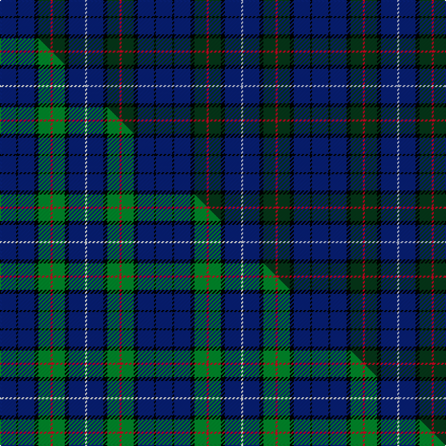

This page is one **sett** — a single exact thread-count. It belongs to the [tartan](/setts/db8k1db8k2dg6r1dg6k2db8lb1/)
(the same proportion at any scale), whose colour order is pattern [BKBKGRGKBW](/stripes/bkbkgrgkbw/).

Part of the [Dalmeny](/tartans/dalmeny-2/) tartan — the named design grouping this sett with its other cloths.

Sourced from tartans-authority.  It is a [10 stripe tartan](/stripes/stripes10/).

Original link https://www.tartanregister.gov.uk/tartanDetails.aspx?ref=289

Dataset <small>— provenance for this record, inherited from the source manifest</small>

<dl class="dataset-prov">
<dt>source</dt><dd><a href="/sources/tartans-authority/">Scottish Tartans Authority</a></dd>
<dt>data captured from</dt><dd><a href="https://github.com/thetartan/tartan-database/blob/master/data/tartans-authority/data.csv">https://github.com/thetartan/tartan-database/blob/master/data/tartans-authority/data.csv</a></dd>
<dt>data date</dt><dd>pre 1965 <small>(this record)</small></dd>
<dt>licence</dt><dd><a href="https://creativecommons.org/licenses/by-nc-nd/4.0/">CC BY-NC-ND 4.0</a></dd>
</dl>

Capture chain <small>— the hands this data passed through, oldest first; each capture carries its own licence</small>

<ol class="capture-chain">
<li><a href="https://www.tartansauthority.com/">Scottish Tartans Authority</a> <small>the heritage body's archive — its tartan-ferret record browser is retired (links repaired to the SRT, above)</small></li>
<li><a href="https://github.com/thetartan/tartan-database">thetartan/tartan-database</a> <small>2016-2017</small> · <a href="https://creativecommons.org/licenses/by-nc-nd/4.0/">CC BY-NC-ND 4.0</a> <small>Levko Kravets's frozen compilation — the capture we vendored, and where its CC licence text came from</small></li>
<li>this dictionary <small>captured 2026-06-10 · commit 5bf86c7566</small> <small>each re-capture is a git commit to data/sources</small></li>
</ol>

## Register references

External register numbers recorded for this tartan.

- Scottish Tartans Authority (ITI): 289

## Thread count
DB/16 K2 DB16 K4 DG12 R2 DG12 K4 DB16 LB/2

One full sett is **154 threads**.

## Palette
<table><thead><tr><th>Colour</th><th>Shade</th><th>OKLCh</th></tr></thead><tbody><tr><td>DB</td><td><code style="background-color:#082077;">#082077</code> <small style="color:#888">#082077</small></td><td><small style="color:#888">oklch(30.0% 0.149 265.1)</small></td></tr><tr><td>DG</td><td><code style="background-color:#053819;">#053819</code> <small style="color:#888">#053819</small></td><td><small style="color:#888">oklch(30.0% 0.075 151.3)</small></td></tr><tr><td>K</td><td><code style="background-color:#000000;">#000000</code> <small style="color:#888">#000000</small></td><td><small style="color:#888">oklch(0.0% 0.000 0.0)</small></td></tr><tr><td>LB</td><td><code style="background-color:#B5BBDE;">#B5BBDE</code> <small style="color:#888">#B5BBDE</small></td><td><small style="color:#888">oklch(79.9% 0.050 277.6)</small></td></tr><tr><td>R</td><td><code style="background-color:#D60020;">#D60020</code> <small style="color:#888">#D60020</small></td><td><small style="color:#888">oklch(55.2% 0.224 25.5)</small></td></tr></tbody></table>

# Sample pattern

## Compared to the master

This cloth is one sett of its design; the master sett (the exemplar the design is anchored on) is below for comparison.

Its **ΔTartan distance** from the master is **0.39** — the same measure the nearest-tartans table ranks by (0 is identical; a re-scale of the same cloth is near 0, a recolour or a different proportion further).

<figure class="master-compare" style="margin:0">

this sett
master sett ★

<figcaption style="color:#888;font-size:smaller">One weave of this sett against the <a href="/setts/db8k1db8k2g6r1g6k2db8w1/">master sett ★</a>, split on the diagonal: a shared proportion runs seamlessly across it with only the shades shifting; a different proportion breaks on it.</figcaption>
</figure>

## Nearest tartan variants

The nearest existing variants by ΔTartan distance, with this cloth at the top so the swatches line up against it.

ΔTartan

Threads

Variant

Sett

—

154

<a href="/variants/s10/db8k1db8k2dg6r1dg6k2db8lb1~x2/">Dalmeny - 1965 (Fashion)</a>

<a href="/ttd/edit/#slug=db8k1db8k2g6r1g6k2db8w1~x2&amp;base=db8k1db8k2dg6r1dg6k2db8lb1~x2" title="compare in the TTD">0.39</a>

154

<a href="/variants/s10/db8k1db8k2g6r1g6k2db8w1~x2/">Dalmeny</a>

<a href="/ttd/edit/#slug=dg24lb4dg3db11dp8db37k3db2r4~x2&amp;base=db8k1db8k2dg6r1dg6k2db8lb1~x2" title="compare in the TTD">1.77</a>

328

<a href="/variants/s9/dg24lb4dg3db11dp8db37k3db2r4~x2/">Stewmann (Personal)</a>

<a href="/ttd/edit/#slug=dg24lb4dg3db11dp8db37k3db2o4~x2&amp;base=db8k1db8k2dg6r1dg6k2db8lb1~x2" title="compare in the TTD">1.77</a>

328

<a href="/variants/s9/dg24lb4dg3db11dp8db37k3db2o4~x2/">Stewmann (2009) (Personal)</a>

<a href="/ttd/edit/#slug=lb6db10dp4db12dg19dp4dg8k20db50lb4&amp;base=db8k1db8k2dg6r1dg6k2db8lb1~x2" title="compare in the TTD">1.84</a>

264

<a href="/variants/s10/lb6db10dp4db12dg19dp4dg8k20db50lb4/">Spirit of Alva</a>

<a href="/ttd/edit/#slug=db16k11db24g10y3g17db15k5r6~x2&amp;base=db8k1db8k2dg6r1dg6k2db8lb1~x2" title="compare in the TTD">1.86</a>

384

<a href="/variants/s9/db16k11db24g10y3g17db15k5r6~x2/">Glackin-McColgan (Personal)</a>

<a href="/ttd/edit/#slug=r2db8k1g2k1g4k1g2k1db8y2~x2&amp;base=db8k1db8k2dg6r1dg6k2db8lb1~x2" title="compare in the TTD">2.26</a>

120

<a href="/variants/s11/r2db8k1g2k1g4k1g2k1db8y2~x2/">MacCainsh</a>

<a href="/ttd/edit/#slug=db16k2db2k2db2k6dg13ly2dg3~x2&amp;base=db8k1db8k2dg6r1dg6k2db8lb1~x2" title="compare in the TTD">2.41</a>

154

<a href="/variants/s9/db16k2db2k2db2k6dg13ly2dg3~x2/">Christian Dewar (Personal)</a>

<a href="/ttd/edit/#slug=db3n1db10g3r1k3db5n2lb1~x4&amp;base=db8k1db8k2dg6r1dg6k2db8lb1~x2" title="compare in the TTD">2.73</a>

216

<a href="/variants/s9/db3n1db10g3r1k3db5n2lb1~x4/">Lochranza</a>

<a href="/ttd/edit/#slug=db1k1db8k2ly1dg12ly1db8k1db1~x4&amp;base=db8k1db8k2dg6r1dg6k2db8lb1~x2" title="compare in the TTD">2.79</a>

280

<a href="/variants/s10/db1k1db8k2ly1dg12ly1db8k1db1~x4/">Rowan (Name)</a>

<a href="/ttd/edit/#slug=dg15db20k2r4k2db20dg15k2dy2~x2&amp;base=db8k1db8k2dg6r1dg6k2db8lb1~x2" title="compare in the TTD">2.84</a>

294

<a href="/variants/s9/dg15db20k2r4k2db20dg15k2dy2~x2/">Manroth (Personal)</a>

## Neighbour map

Every grey dot is one of 13620 variants placed by the first two principal components of the ΔTartan feature space (42% of its variance). Red is this tartan; blue dots are its nearest — click one to open its page.

<svg viewBox="0 0 640 380" role="img" style="max-width:100%;height:auto;border:1px solid #e0e0e0;border-radius:4px;display:block" xmlns="http://www.w3.org/2000/svg"><image href="/nn/cloud.v1.png" width="640" height="380"/><a href="/variants/s10/db8k1db8k2g6r1g6k2db8w1~x2/"><circle cx="220.2" cy="185.4" r="4" fill="#3465a4"><title>Dalmeny</title></circle></a><a href="/variants/s9/dg24lb4dg3db11dp8db37k3db2r4~x2/"><circle cx="305.0" cy="139.0" r="4" fill="#3465a4"><title>Stewmann (Personal)</title></circle></a><a href="/variants/s9/dg24lb4dg3db11dp8db37k3db2o4~x2/"><circle cx="310.8" cy="141.8" r="4" fill="#3465a4"><title>Stewmann (2009) (Personal)</title></circle></a><a href="/variants/s10/lb6db10dp4db12dg19dp4dg8k20db50lb4/"><circle cx="258.1" cy="155.0" r="4" fill="#3465a4"><title>Spirit of Alva</title></circle></a><a href="/variants/s9/db16k11db24g10y3g17db15k5r6~x2/"><circle cx="179.6" cy="206.8" r="4" fill="#3465a4"><title>Glackin-McColgan (Personal)</title></circle></a><a href="/variants/s11/r2db8k1g2k1g4k1g2k1db8y2~x2/"><circle cx="194.4" cy="167.0" r="4" fill="#3465a4"><title>MacCainsh</title></circle></a><a href="/variants/s9/db16k2db2k2db2k6dg13ly2dg3~x2/"><circle cx="228.5" cy="195.5" r="4" fill="#3465a4"><title>Christian Dewar (Personal)</title></circle></a><a href="/variants/s9/db3n1db10g3r1k3db5n2lb1~x4/"><circle cx="267.1" cy="155.8" r="4" fill="#3465a4"><title>Lochranza</title></circle></a><a href="/variants/s10/db1k1db8k2ly1dg12ly1db8k1db1~x4/"><circle cx="293.2" cy="168.6" r="4" fill="#3465a4"><title>Rowan (Name)</title></circle></a><a href="/variants/s9/dg15db20k2r4k2db20dg15k2dy2~x2/"><circle cx="297.0" cy="194.7" r="4" fill="#3465a4"><title>Manroth (Personal)</title></circle></a><circle cx="284.0" cy="204.2" r="5" fill="#c00000"/><text x="320" y="376" text-anchor="middle" font-size="11" fill="#999">ground</text><text x="11" y="190" text-anchor="middle" font-size="11" fill="#999" transform="rotate(-90 11 190)">complexity</text></svg>

ID: /variants/s10/db8k1db8k2dg6r1dg6k2db8lb1~x2/
