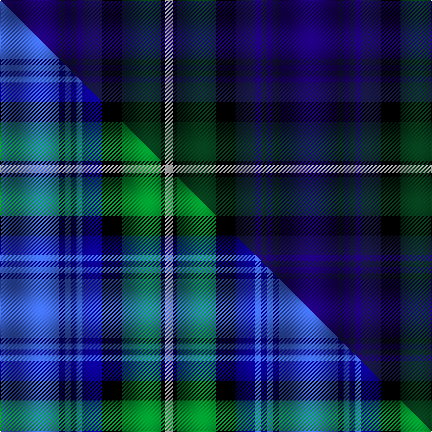

This page is one **sett** — a single exact thread-count. It belongs to the [tartan](/setts/dbi30db3dbi3db3dbi3db10k10dg20k2w4/)
(the same proportion at any scale), whose colour order is pattern [BBBBBBKGKW](/stripes/bbbbbbkgkw/).

Part of the [St Kentigern College](/tartans/st-kentigern-college/) tartan — the named design grouping this sett with its other cloths.

Sourced from tartans-authority.  It is a [10 stripe tartan](/stripes/stripes10/).

Original link [https://www.tartanregister.gov.uk/tartanDetails.aspx?ref=7756](https://www.tartanregister.gov.uk/tartanDetails.aspx?ref=7756)

Dataset <small>— provenance for this record, inherited from the source manifest</small>

<dl class="dataset-prov">
<dt>source</dt><dd><a href="/sources/tartans-authority/">Scottish Tartans Authority</a></dd>
<dt>data captured from</dt><dd><a href="https://github.com/thetartan/tartan-database/blob/master/data/tartans-authority/data.csv">https://github.com/thetartan/tartan-database/blob/master/data/tartans-authority/data.csv</a></dd>
<dt>data date</dt><dd>pre 2008 <small>(this record)</small></dd>
<dt>licence</dt><dd><a href="https://creativecommons.org/licenses/by-nc-nd/4.0/">CC BY-NC-ND 4.0</a></dd>
</dl>

Capture chain <small>— the hands this data passed through, oldest first; each capture carries its own licence</small>

<ol class="capture-chain">
<li><a href="https://www.tartansauthority.com/">Scottish Tartans Authority</a> <small>the heritage body's archive — its tartan-ferret record browser is retired (links repaired to the SRT, above)</small></li>
<li><a href="https://github.com/thetartan/tartan-database">thetartan/tartan-database</a> <small>2016-2017</small> · <a href="https://creativecommons.org/licenses/by-nc-nd/4.0/">CC BY-NC-ND 4.0</a> <small>Levko Kravets's frozen compilation — the capture we vendored, and where its CC licence text came from</small></li>
<li>this dictionary <small>captured 2026-06-10 · commit 5bf86c7566</small> <small>each re-capture is a git commit to data/sources</small></li>
</ol>

## Register references

External register numbers recorded for this tartan.

- Scottish Tartans Authority (ITI): 7756

## Thread count
DBi/60 DB6 DBi6 DB6 DBi6 DB20 K20 DG40 K4 W/8

One full sett is **284 threads**.

## Palette
<table><thead><tr><th>Colour</th><th>Shade</th><th>OKLCh</th></tr></thead><tbody><tr><td>DB</td><td><code style="background-color:#14143C;">#14143C</code> <small style="color:#888">#14143C</small></td><td><small style="color:#888">oklch(21.9% 0.075 278.3)</small></td></tr><tr><td>DB</td><td><code style="background-color:#1C0070;">#1C0070</code> <small style="color:#888">#1C0070</small></td><td><small style="color:#888">oklch(26.3% 0.162 277.1)</small></td></tr><tr><td>DG</td><td><code style="background-color:#053819;">#053819</code> <small style="color:#888">#053819</small></td><td><small style="color:#888">oklch(30.0% 0.075 151.3)</small></td></tr><tr><td>K</td><td><code style="background-color:#000000;">#000000</code> <small style="color:#888">#000000</small></td><td><small style="color:#888">oklch(0.0% 0.000 0.0)</small></td></tr><tr><td>W</td><td><code style="background-color:#F7F7F7;">#F7F7F7</code> <small style="color:#888">#F7F7F7</small></td><td><small style="color:#888">oklch(97.6% 0.000 89.9)</small></td></tr></tbody></table>

# Sample pattern

## Compared to the master

This cloth is one sett of its design; the master sett (the exemplar the design is anchored on) is below for comparison.

Its **ΔTartan distance** from the master is **0.22** — the same measure the nearest-tartans table ranks by (0 is identical; a re-scale of the same cloth is near 0, a recolour or a different proportion further).

<figure class="master-compare" style="margin:0">

this sett
master sett ★

<figcaption style="color:#888;font-size:smaller">One weave of this sett against the <a href="/setts/b30db3b3db3b3db10k10g20k2w4/">master sett ★</a>, split on the diagonal: a shared proportion runs seamlessly across it with only the shades shifting; a different proportion breaks on it.</figcaption>
</figure>

## Nearest tartan variants

The nearest existing variants by ΔTartan distance, with this cloth at the top so the swatches line up against it.

ΔTartan

Threads

Variant

Sett

—

284

<a href="/variants/s10/dbi30db3dbi3db3dbi3db10k10dg20k2w4~x2~dbi1106275-db0903284/">St. Kentigern College (Corporate)</a>

<a href="/ttd/edit/#slug=dp4db40k15dg10dp2dg10dp2dg10w4~x2&amp;base=dbi30db3dbi3db3dbi3db10k10dg20k2w4~x2~dbi1106275-db0903284" title="compare in the TTD">1.67</a>

372

<a href="/variants/s9/dp4db40k15dg10dp2dg10dp2dg10w4~x2/">Ebdon-Muir (Personal)</a>

<a href="/ttd/edit/#slug=dg28k2db3k11db3k2db17b4lb2~x2~db1108266-b1611266&amp;base=dbi30db3dbi3db3dbi3db10k10dg20k2w4~x2~dbi1106275-db0903284" title="compare in the TTD">2.31</a>

228

<a href="/variants/s9/dg28k2db3k11db3k2db17b4lb2~x2~db1108266-b1511266/">West of Wells</a>

<a href="/ttd/edit/#slug=dp4db7dp2db25k19w2dg23k2dy3~x2&amp;base=dbi30db3dbi3db3dbi3db10k10dg20k2w4~x2~dbi1106275-db0903284" title="compare in the TTD">2.43</a>

334

<a href="/variants/s9/dp4db7dp2db25k19w2dg23k2dy3~x2/">Leung (Personal)</a>

<a href="/ttd/edit/#slug=dr2db6lr2db2k9dbi30k9db5lr4db2dr2~x2~db1106275-dbi1406275&amp;base=dbi30db3dbi3db3dbi3db10k10dg20k2w4~x2~dbi1106275-db0903284" title="compare in the TTD">2.53</a>

284

<a href="/variants/s11/dr2db6lr2db2k9dbi30k9db5lr4db2dr2~x2~db1106275-dbi1406275/">Rangers Football Club Dress</a>

<a href="/ttd/edit/#slug=k4dp30k3dp2db2r2g12k3db18r3~x2&amp;base=dbi30db3dbi3db3dbi3db10k10dg20k2w4~x2~dbi1106275-db0903284" title="compare in the TTD">2.53</a>

302

<a href="/variants/s10/k4dp30k3dp2db2r2g12k3db18r3~x2/">Wardlaw</a>

<a href="/ttd/edit/#slug=dp24k2dp2lo2dp2k20db16n2db2n3~x2&amp;base=dbi30db3dbi3db3dbi3db10k10dg20k2w4~x2~dbi1106275-db0903284" title="compare in the TTD">2.54</a>

246

<a href="/variants/s10/dp24k2dp2lo2dp2k20db16n2db2n3~x2/">D'Souza (Personal)</a>

<a href="/ttd/edit/#slug=r2k3db30k2db4k2db30k36dr30k2lb2&amp;base=dbi30db3dbi3db3dbi3db10k10dg20k2w4~x2~dbi1106275-db0903284" title="compare in the TTD">2.62</a>

282

<a href="/variants/s11/r2k3db30k2db4k2db30k36dr30k2lb2/">Evans (Welsh Name)</a>

<a href="/ttd/edit/#slug=db15dp3db30k22dg18dp3dg3w3~x2&amp;base=dbi30db3dbi3db3dbi3db10k10dg20k2w4~x2~dbi1106275-db0903284" title="compare in the TTD">2.65</a>

352

<a href="/variants/s8/db15dp3db30k22dg18dp3dg3w3~x2/">Moray (Corporate)</a>

<a href="/ttd/edit/#slug=k5dbi26k2dbi4k2dbi26k3lr36k3db30k3t2~k0700000-dbi0806265-lr2800000-t2503227&amp;base=dbi30db3dbi3db3dbi3db10k10dg20k2w4~x2~dbi1106275-db0903284" title="compare in the TTD">2.67</a>

277

<a href="/variants/s12/k5dbi26k2dbi4k2dbi26k3lr36k3db30k3t2~k0700000-dbi0806265-lr2800000-t2503227/">Daniel (Welsh Name)</a>

<a href="/ttd/edit/#slug=r3db16k12dbi34k12db2k2db2k2db7r3~x2~db0906265-dbi1605267&amp;base=dbi30db3dbi3db3dbi3db10k10dg20k2w4~x2~dbi1106275-db0903284" title="compare in the TTD">2.70</a>

368

<a href="/variants/s11/r3db16k12dbi34k12db2k2db2k2db7r3~x2~db0906265-dbi1605267/">Rangers Football Club</a>

## Neighbour map

Every grey dot is one of 13621 variants placed by the first two principal components of the ΔTartan feature space (42% of its variance). Red is this tartan; blue dots are its nearest — click one to open its page.

<svg viewBox="0 0 640 380" role="img" style="max-width:100%;height:auto;border:1px solid #e0e0e0;border-radius:4px;display:block" xmlns="http://www.w3.org/2000/svg"><image href="/nn/cloud.v1.png" width="640" height="380"/><a href="/variants/s9/dp4db40k15dg10dp2dg10dp2dg10w4~x2/"><circle cx="228.4" cy="141.0" r="4" fill="#3465a4"><title>Ebdon-Muir (Personal)</title></circle></a><a href="/variants/s9/dg28k2db3k11db3k2db17b4lb2~x2~db1108266-b1511266/"><circle cx="219.2" cy="155.3" r="4" fill="#3465a4"><title>West of Wells</title></circle></a><a href="/variants/s9/dp4db7dp2db25k19w2dg23k2dy3~x2/"><circle cx="178.6" cy="154.3" r="4" fill="#3465a4"><title>Leung (Personal)</title></circle></a><a href="/variants/s11/dr2db6lr2db2k9dbi30k9db5lr4db2dr2~x2~db1106275-dbi1406275/"><circle cx="204.2" cy="125.6" r="4" fill="#3465a4"><title>Rangers Football Club Dress</title></circle></a><a href="/variants/s10/k4dp30k3dp2db2r2g12k3db18r3~x2/"><circle cx="206.5" cy="132.6" r="4" fill="#3465a4"><title>Wardlaw</title></circle></a><a href="/variants/s10/dp24k2dp2lo2dp2k20db16n2db2n3~x2/"><circle cx="210.9" cy="148.4" r="4" fill="#3465a4"><title>D'Souza (Personal)</title></circle></a><a href="/variants/s11/r2k3db30k2db4k2db30k36dr30k2lb2/"><circle cx="254.9" cy="128.3" r="4" fill="#3465a4"><title>Evans (Welsh Name)</title></circle></a><a href="/variants/s8/db15dp3db30k22dg18dp3dg3w3~x2/"><circle cx="218.4" cy="185.4" r="4" fill="#3465a4"><title>Moray (Corporate)</title></circle></a><a href="/variants/s12/k5dbi26k2dbi4k2dbi26k3lr36k3db30k3t2~k0700000-dbi0806265-lr2800000-t2503227/"><circle cx="194.5" cy="126.6" r="4" fill="#3465a4"><title>Daniel (Welsh Name)</title></circle></a><a href="/variants/s11/r3db16k12dbi34k12db2k2db2k2db7r3~x2~db0906265-dbi1605267/"><circle cx="222.7" cy="147.5" r="4" fill="#3465a4"><title>Rangers Football Club</title></circle></a><circle cx="211.7" cy="150.2" r="5" fill="#c00000"/><text x="320" y="376" text-anchor="middle" font-size="11" fill="#999">ground</text><text x="11" y="190" text-anchor="middle" font-size="11" fill="#999" transform="rotate(-90 11 190)">complexity</text></svg>

ID: /variants/s10/dbi30db3dbi3db3dbi3db10k10dg20k2w4~x2~dbi1106275-db0903284/
