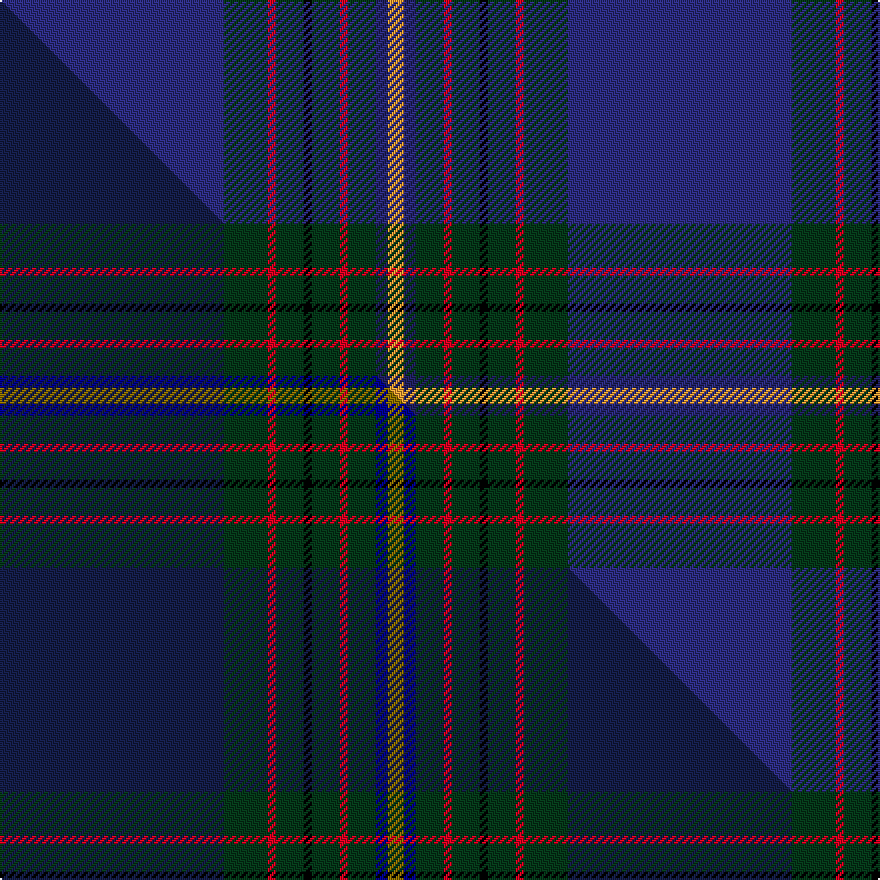

This is one **variant** — a specific cloth: this exact thread count and colourway, with its own
provenance below. It is one weaving of the [sett](/tartans/c/ca/cal-fire-local-2881/) (the scale-free proportion — the
same cloth at any scale or shade), whose colour order is pattern [BGRGKGRGBY](/stripes/bgrgkgrgby/).

Part of the [CAL FIRE Local 2881](/tartans/c/ca/cal-fire-local-2881/) tartan — the named design grouping this sett with its other cloths.

Sourced from tartans-authority.  It is a [10 stripe tartan](/stripes/stripes10/).

Original link <code>http://www.tartansauthority.com/tartan-ferret/display/11174/</code> — retired · [Internet Archive copy](https://web.archive.org/web/*/http://www.tartansauthority.com/tartan-ferret/display/11174/*)

Dataset <small>— provenance for this record, inherited from the source manifest</small>

<dl class="dataset-prov">
<dt>source</dt><dd><a href="/sources/tartans-authority/">Scottish Tartans Authority</a></dd>
<dt>data captured from</dt><dd><a href="https://github.com/thetartan/tartan-database/blob/master/data/tartans-authority/data.csv">https://github.com/thetartan/tartan-database/blob/master/data/tartans-authority/data.csv</a></dd>
<dt>data date</dt><dd>2014 <small>(this record)</small></dd>
<dt>licence</dt><dd><a href="https://creativecommons.org/licenses/by-nc-nd/4.0/">CC BY-NC-ND 4.0</a></dd>
</dl>

Capture chain <small>— the hands this data passed through, oldest first; each capture carries its own licence</small>

<ol class="capture-chain">
<li><a href="https://www.tartansauthority.com/">Scottish Tartans Authority</a> <small>the heritage body’s archive — its tartan-ferret record browser is retired; dead record links are shown unlinked, with an Internet Archive copy (ITI numbers are not SRT references)</small></li>
<li><a href="https://github.com/thetartan/tartan-database">thetartan/tartan-database</a> <small>2016-2017</small> · <a href="https://creativecommons.org/licenses/by-nc-nd/4.0/">CC BY-NC-ND 4.0</a> <small>Levko Kravets's frozen compilation — the capture we vendored, and where its CC licence text came from</small></li>
<li>this dictionary <small>captured 2026-06-10 · commit 5bf86c7566</small> <small>each re-capture is a git commit to data/sources</small></li>
</ol>

## Register references

External register numbers recorded for this tartan.

- Scottish Register of Tartans: [11174](https://www.tartanregister.gov.uk/tartanDetails?ref=11174)
- Scottish Tartans Authority (ITI): 11174

## Thread count
DBi/112 DG22 R4 DG14 K4 DG14 R4 DG14 DB6 LO/8

One full sett is **284 threads**.

## Palette
<table><thead><tr><th>Colour</th><th>Shade</th><th>OKLCh</th></tr></thead><tbody><tr><td>DB</td><td><code style="background-color:#2C2C80;">#2C2C80</code> <small style="color:#888">#2C2C80</small></td><td><small style="color:#888">oklch(35.0% 0.138 276.6)</small></td></tr><tr><td>DB</td><td><code style="background-color:#202060;">#202060</code> <small style="color:#888">#202060</small></td><td><small style="color:#888">oklch(28.9% 0.111 276.9)</small></td></tr><tr><td>DG</td><td><code style="background-color:#053819;">#053819</code> <small style="color:#888">#053819</small></td><td><small style="color:#888">oklch(30.0% 0.075 151.3)</small></td></tr><tr><td>LO</td><td><code style="background-color:#FF9C34;">#FF9C34</code> <small style="color:#888">#FF9C34</small></td><td><small style="color:#888">oklch(77.9% 0.161 61.8)</small></td></tr><tr><td>K</td><td><code style="background-color:#000000;">#000000</code> <small style="color:#888">#000000</small></td><td><small style="color:#888">oklch(0.0% 0.000 0.0)</small></td></tr><tr><td>R</td><td><code style="background-color:#D60020;">#D60020</code> <small style="color:#888">#D60020</small></td><td><small style="color:#888">oklch(55.2% 0.224 25.5)</small></td></tr></tbody></table>

# Sample pattern

[Sample sheet (PDF)](swatch.pdf) — the woven sample, thread count and palette on one printable A4, rendered on demand (the same sheet the TTD print page downloads).

## Compared to the master

This cloth is one sett of its design; the master sett (the exemplar the design is anchored on) is below for comparison.

Its **ΔTartan distance** from the master is **1.29** — the same measure the nearest-tartans table ranks by (0 is identical; a re-scale of the same cloth is near 0, a recolour or a different proportion further).

<figure class="master-compare" style="margin:0">

this sett
master sett ★

<figcaption style="color:#888;font-size:smaller">One weave of this sett against the <a href="/setts/db56dg11r2dg7k2dg7r2dg7dbi3y4/">master sett ★</a>, split on the diagonal: a shared proportion runs seamlessly across it with only the shades shifting; a different proportion breaks on it.</figcaption>
</figure>

## Nearest tartan variants

The nearest existing variants by ΔTartan distance, with this cloth at the top so the swatches line up against it.

ΔTartan

Threads

Variant

Sett

—

284

<a href="/variants/s10/dbi56dg11r2dg7k2dg7r2dg7db3lo4~x2~dbi3514276-db2911276/">CAL FIRE Local 2881</a>

<a href="/ttd/edit/#slug=db56dg11r2dg7k2dg7r2dg7dbi3y4~x2~db2508270-dbi2920264&amp;base=dbi56dg11r2dg7k2dg7r2dg7db3lo4~x2~dbi3514276-db2911276" title="compare in the TTD">1.29</a>

284

<a href="/variants/s10/db56dg11r2dg7k2dg7r2dg7dbi3y4~x2~db2508270-dbi2920264/">CAL FIRE Local 2881</a>

<a href="/ttd/edit/#slug=db3n3db36dbi7k3dbi6g5k1y3~x2~db2616276-dbi3514276&amp;base=dbi56dg11r2dg7k2dg7r2dg7db3lo4~x2~dbi3514276-db2911276" title="compare in the TTD">2.65</a>

256

<a href="/variants/s9/db3n3db36dbi7k3dbi6g5k1y3~x2~db2616276-dbi3514276/">Incorporation of Weavers (Glasgow)</a>

<a href="/ttd/edit/#slug=r1db2dt1k3dt19db3y1db2y1~x4~db2920264-dt2705249&amp;base=dbi56dg11r2dg7k2dg7r2dg7db3lo4~x2~dbi3514276-db2911276" title="compare in the TTD">2.78</a>

256

<a href="/variants/s9/r1db2dt1k3dt19db3y1db2y1~x4~db2920264-dt2705249/">Pagus Wasia</a>

<a href="/ttd/edit/#slug=db2ki3db33k11ki3db3dp15db4lb1db2~x2~db3409246-ki1207288&amp;base=dbi56dg11r2dg7k2dg7r2dg7db3lo4~x2~dbi3514276-db2911276" title="compare in the TTD">2.82</a>

300

<a href="/variants/s10/db2ki3db33k11ki3db3dp15db4lb1db2~x2~db3409246-ki1207288/">Scottish Thistle</a>

<a href="/ttd/edit/#slug=t6k3n10db2k2dt45lr2~x2~t6107234-db2609279-dt2705249-lr70&amp;base=dbi56dg11r2dg7k2dg7r2dg7db3lo4~x2~dbi3514276-db2911276" title="compare in the TTD">2.87</a>

264

<a href="/variants/s7/t6k3n10db2k2dt45lr2~x2~t6107234-db2609279-dt2705249-lr70/">Vonarb, Alfred (Personal)</a>

<a href="/ttd/edit/#slug=db6w1db40o1k12dg12o6dg2dp2dg4~x2&amp;base=dbi56dg11r2dg7k2dg7r2dg7db3lo4~x2~dbi3514276-db2911276" title="compare in the TTD">2.94</a>

324

<a href="/variants/s10/db6w1db40o1k12dg12o6dg2dp2dg4~x2/">Scotland the Brave (Fashion)</a>

<a href="/ttd/edit/#slug=k1ri1db14lo1db1r1db1r2db1dg6db1dg1db1~x4~ri5221030-r4418030&amp;base=dbi56dg11r2dg7k2dg7r2dg7db3lo4~x2~dbi3514276-db2911276" title="compare in the TTD">2.94</a>

248

<a href="/variants/s13/k1ri1db14lo1db1r1db1r2db1dg6db1dg1db1~x4~ri5221030-r4418030/">Merchant Company, The</a>

<a href="/ttd/edit/#slug=dt19k4dt4db1dt1db1dt1dg5b3k1b4~x6~dt2506264-dg3210147&amp;base=dbi56dg11r2dg7k2dg7r2dg7db3lo4~x2~dbi3514276-db2911276" title="compare in the TTD">3.02</a>

390

<a href="/variants/s11/dbi19k4dbi4db1dbi1db1dbi1dg5b3k1b4~x6~dbi2506264-dg3210147/">Spirit of Scotland</a>

<a href="/ttd/edit/#slug=dg24lb4dg3db11dp8db37k3db2r4~x2&amp;base=dbi56dg11r2dg7k2dg7r2dg7db3lo4~x2~dbi3514276-db2911276" title="compare in the TTD">3.02</a>

328

<a href="/variants/s9/dg24lb4dg3db11dp8db37k3db2r4~x2/">Stewmann (Personal)</a>

<a href="/ttd/edit/#slug=dg24lb4dg3db11dp8db37k3db2o4~x2&amp;base=dbi56dg11r2dg7k2dg7r2dg7db3lo4~x2~dbi3514276-db2911276" title="compare in the TTD">3.03</a>

328

<a href="/variants/s9/dg24lb4dg3db11dp8db37k3db2o4~x2/">Stewmann (2009) (Personal)</a>

## Neighbour map

Every grey dot is one of 13662 variants placed by the first two principal components of the ΔTartan feature space (42% of its variance). Red is this tartan; blue dots are its nearest — click one to open its page. The map is a flat projection of a many-dimensional space — [how to read it](/posts/neighbourhood-maps/).

<svg viewBox="0 0 640 380" role="img" style="max-width:100%;height:auto;border:1px solid #e0e0e0;border-radius:4px;display:block" xmlns="http://www.w3.org/2000/svg"><image href="/nn/cloud.v1.png" width="640" height="380"/><a href="/variants/s10/db56dg11r2dg7k2dg7r2dg7dbi3y4~x2~db2508270-dbi2920264/"><circle cx="424.8" cy="114.3" r="4" fill="#3465a4"><title>CAL FIRE Local 2881</title></circle></a><a href="/variants/s9/db3n3db36dbi7k3dbi6g5k1y3~x2~db2616276-dbi3514276/"><circle cx="371.3" cy="94.5" r="4" fill="#3465a4"><title>Incorporation of Weavers (Glasgow)</title></circle></a><a href="/variants/s9/r1db2dt1k3dt19db3y1db2y1~x4~db2920264-dt2705249/"><circle cx="403.0" cy="129.7" r="4" fill="#3465a4"><title>Pagus Wasia</title></circle></a><a href="/variants/s10/db2ki3db33k11ki3db3dp15db4lb1db2~x2~db3409246-ki1207288/"><circle cx="377.7" cy="114.0" r="4" fill="#3465a4"><title>Scottish Thistle</title></circle></a><a href="/variants/s7/t6k3n10db2k2dt45lr2~x2~t6107234-db2609279-dt2705249-lr70/"><circle cx="396.2" cy="114.9" r="4" fill="#3465a4"><title>Vonarb, Alfred (Personal)</title></circle></a><a href="/variants/s10/db6w1db40o1k12dg12o6dg2dp2dg4~x2/"><circle cx="309.7" cy="80.1" r="4" fill="#3465a4"><title>Scotland the Brave (Fashion)</title></circle></a><a href="/variants/s13/k1ri1db14lo1db1r1db1r2db1dg6db1dg1db1~x4~ri5221030-r4418030/"><circle cx="327.3" cy="101.6" r="4" fill="#3465a4"><title>Merchant Company, The</title></circle></a><a href="/variants/s11/dbi19k4dbi4db1dbi1db1dbi1dg5b3k1b4~x6~dbi2506264-dg3210147/"><circle cx="347.5" cy="132.9" r="4" fill="#3465a4"><title>Spirit of Scotland</title></circle></a><a href="/variants/s9/dg24lb4dg3db11dp8db37k3db2r4~x2/"><circle cx="304.6" cy="139.3" r="4" fill="#3465a4"><title>Stewmann (Personal)</title></circle></a><a href="/variants/s9/dg24lb4dg3db11dp8db37k3db2o4~x2/"><circle cx="310.4" cy="142.1" r="4" fill="#3465a4"><title>Stewmann (2009) (Personal)</title></circle></a><circle cx="367.2" cy="92.4" r="5" fill="#c00000"/><text x="320" y="376" text-anchor="middle" font-size="11" fill="#999">ground</text><text x="11" y="190" text-anchor="middle" font-size="11" fill="#999" transform="rotate(-90 11 190)">complexity</text></svg>

ID: /variants/s10/dbi56dg11r2dg7k2dg7r2dg7db3lo4~x2~dbi3514276-db2911276/
