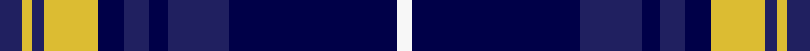

This page is one **sett** — a single exact thread-count. It belongs to the [tartan](/setts/dbi6ly3dbi3ly15db7dbi7db5dbi17db46w4/)
(the same proportion at any scale), whose colour order is pattern [BYBYBBBBBW](/stripes/bybybbbbbw/).

Sourced from house-of-tartan.  It is a [10 stripe tartan](/stripes/stripes10/).

Original link http://www.house-of-tartan.scotland.net/house/TartanViewjs.asp?colr=Def&tnam=5753

## Provenance

Earliest known date: 2002 The tartan for this Welsh surname and its variations, Rees, Preece, Reese, is actually woven in Wales at the Cambrian Woollen Mill, weaving on the same site since 1830. This tartan differs from many traditional patterns in that the warp and weft differ, giving the finished worsted wool cloth more of a predominant stripe, vertically noticeable in the finished Kilt, or Cilt in Wales.

## Thread count
DBi/6 LY3 DBi3 LY15 DB7 DBi7 DB5 DBi17 DB46 W/4

One full sett is **216 threads**.

## Palette
<table><thead><tr><th>Colour</th><th>Shade</th><th>OKLCh</th></tr></thead><tbody><tr><td>DB</td><td><code style="background-color:#003C64;">#003C64</code> <small style="color:#888">#003C64</small></td><td><small style="color:#888">oklch(34.5% 0.089 246.0)</small></td></tr><tr><td>DBa</td><td><code style="background-color:#202060;">#202060</code> <small style="color:#888">#202060</small></td><td><small style="color:#888">oklch(28.9% 0.111 276.9)</small></td></tr><tr><td>DBb</td><td><code style="background-color:#000048;">#000048</code> <small style="color:#888">#000048</small></td><td><small style="color:#888">oklch(18.2% 0.126 264.1)</small></td></tr><tr><td>LN</td><td><code style="background-color:#F7F7F7;">#F7F7F7</code> <small style="color:#888">#F7F7F7</small></td><td><small style="color:#888">oklch(97.6% 0.000 89.9)</small></td></tr><tr><td>LT</td><td><code style="background-color:#DCBC32;">#DCBC32</code> <small style="color:#888">#DCBC32</small></td><td><small style="color:#888">oklch(80.0% 0.150 95.2)</small></td></tr></tbody></table>

# Sample pattern

## Nearest variants

The nearest existing variants by ΔTartan distance, with this cloth at the top so the swatches line up against it.

ΔTartan

Threads

Variant

Sett

—

216

<a href="/variants/s10/dbi6ly3dbi3ly15db7dbi7db5dbi17db46w4~dbi1204274-db0705267/">Rhys Welsh Name Tartan</a>

2.96

—

<a href="/variants/s8/y12dbi2y2dbi30db3dbi2db13w4~x2~dbi1604274-db0805267/">Highlands School, (North Carolina)</a>

## Neighbour map

Every grey dot is one of 13620 variants placed by the first two principal components of the ΔTartan feature space (42% of its variance). Red is this tartan; blue dots are its nearest — click one to open its page.

<svg viewBox="0 0 640 380" role="img" style="max-width:100%;height:auto;border:1px solid #e0e0e0;border-radius:4px;display:block" xmlns="http://www.w3.org/2000/svg"><image href="/nn/cloud.v1.png" width="640" height="380"/><a href="/variants/s8/y12dbi2y2dbi30db3dbi2db13w4~x2~dbi1604274-db0805267/"><circle cx="320.9" cy="189.3" r="4" fill="#3465a4"><title>Highlands School, (North Carolina)</title></circle></a><circle cx="318.6" cy="180.9" r="5" fill="#c00000"/><text x="320" y="376" text-anchor="middle" font-size="11" fill="#999">ground</text><text x="11" y="190" text-anchor="middle" font-size="11" fill="#999" transform="rotate(-90 11 190)">complexity</text></svg>

ID: /variants/s10/dbi6ly3dbi3ly15db7dbi7db5dbi17db46w4~dbi1204274-db0705267/
