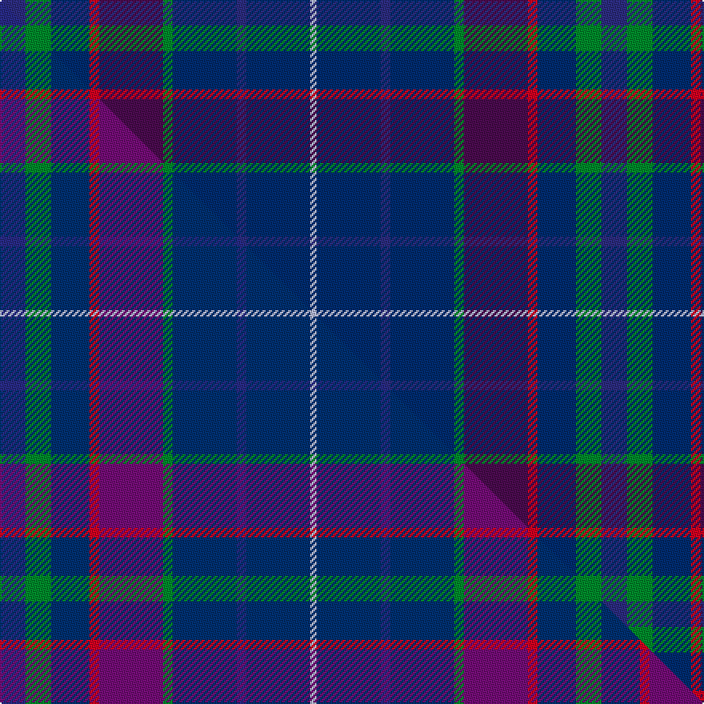

This is one **variant** — a specific cloth: this exact thread count and colourway, with its own
provenance below. It is one weaving of the [sett](/tartans/s/st/strathisla-2/) (the scale-free proportion — the
same cloth at any scale or shade), whose colour order is pattern [BGBRBGBBBW](/stripes/bgbrbgbbbw/).

Part of the [Strathisla](/tartans/s/st/strathisla-2/) tartan — the named design grouping this sett with its other cloths.

Sourced from tartans-authority.  It is a [10 stripe tartan](/stripes/stripes10/).

Original link <code>http://www.tartansauthority.com/tartan-ferret/display/4101/</code> — retired · [Internet Archive copy](https://web.archive.org/web/*/http://www.tartansauthority.com/tartan-ferret/display/4101/*)

Dataset <small>— provenance for this record, inherited from the source manifest</small>

<dl class="dataset-prov">
<dt>source</dt><dd><a href="/sources/tartans-authority/">Scottish Tartans Authority</a></dd>
<dt>data captured from</dt><dd><a href="https://github.com/thetartan/tartan-database/blob/master/data/tartans-authority/data.csv">https://github.com/thetartan/tartan-database/blob/master/data/tartans-authority/data.csv</a></dd>
<dt>data date</dt><dd>pre 2002 <small>(this record)</small></dd>
<dt>licence</dt><dd><a href="https://creativecommons.org/licenses/by-nc-nd/4.0/">CC BY-NC-ND 4.0</a></dd>
</dl>

Capture chain <small>— the hands this data passed through, oldest first; each capture carries its own licence</small>

<ol class="capture-chain">
<li><a href="https://www.tartansauthority.com/">Scottish Tartans Authority</a> <small>the heritage body’s archive — its tartan-ferret record browser is retired; dead record links are shown unlinked, with an Internet Archive copy (ITI numbers are not SRT references)</small></li>
<li><a href="https://github.com/thetartan/tartan-database">thetartan/tartan-database</a> <small>2016-2017</small> · <a href="https://creativecommons.org/licenses/by-nc-nd/4.0/">CC BY-NC-ND 4.0</a> <small>Levko Kravets's frozen compilation — the capture we vendored, and where its CC licence text came from</small></li>
<li>this dictionary <small>captured 2026-06-10 · commit 5bf86c7566</small> <small>each re-capture is a git commit to data/sources</small></li>
</ol>

## Register references

External register numbers recorded for this tartan.

- Scottish Tartans Authority (ITI): 4101

## Thread count
DBi/16 G16 DB24 R6 DP40 G6 DB40 DBi6 DB40 LB/4

One full sett is **376 threads**.

## Palette
<table><thead><tr><th>Colour</th><th>Shade</th><th>OKLCh</th></tr></thead><tbody><tr><td>DB</td><td><code style="background-color:#2C2C80;">#2C2C80</code> <small style="color:#888">#2C2C80</small></td><td><small style="color:#888">oklch(35.0% 0.138 276.6)</small></td></tr><tr><td>DB</td><td><code style="background-color:#002C70;">#002C70</code> <small style="color:#888">#002C70</small></td><td><small style="color:#888">oklch(31.5% 0.126 259.7)</small></td></tr><tr><td>G</td><td><code style="background-color:#008B2A;">#008B2A</code> <small style="color:#888">#008B2A</small></td><td><small style="color:#888">oklch(55.4% 0.170 145.9)</small></td></tr><tr><td>LB</td><td><code style="background-color:#B5BBDE;">#B5BBDE</code> <small style="color:#888">#B5BBDE</small></td><td><small style="color:#888">oklch(79.9% 0.050 277.6)</small></td></tr><tr><td>DP</td><td><code style="background-color:#4B0B4F;">#4B0B4F</code> <small style="color:#888">#4B0B4F</small></td><td><small style="color:#888">oklch(30.1% 0.125 325.4)</small></td></tr><tr><td>R</td><td><code style="background-color:#D60020;">#D60020</code> <small style="color:#888">#D60020</small></td><td><small style="color:#888">oklch(55.2% 0.224 25.5)</small></td></tr></tbody></table>

# Sample pattern

## Compared to the master

This cloth is one sett of its design; the master sett (the exemplar the design is anchored on) is below for comparison.

Its **ΔTartan distance** from the master is **0.07** — the same measure the nearest-tartans table ranks by (0 is identical; a re-scale of the same cloth is near 0, a recolour or a different proportion further).

<figure class="master-compare" style="margin:0">

this sett
master sett ★

<figcaption style="color:#888;font-size:smaller">One weave of this sett against the <a href="/setts/dbi8g8db12r3dp20g3db20dbi3db20lb2db20dbi3db20g3dp20r3db12g8/">master sett ★</a>, split on the diagonal: a shared proportion runs seamlessly across it with only the shades shifting; a different proportion breaks on it.</figcaption>
</figure>

## Nearest tartan variants

The nearest existing variants by ΔTartan distance, with this cloth at the top so the swatches line up against it.

ΔTartan

Threads

Variant

Sett

—

376

<a href="/variants/s10/dbi8g8db12r3dp20g3db20dbi3db20lb2~x2~dbi1406275-db1305255/">Strathisla (District)</a>

<a href="/ttd/edit/#slug=dp30db30n4db4n4db5r6~x2&amp;base=dbi8g8db12r3dp20g3db20dbi3db20lb2~x2~dbi1406275-db1305255" title="compare in the TTD">2.53</a>

260

<a href="/variants/s7/dp30db30n4db4n4db5r6~x2/">Komissarov, Dmitry (Personal)</a>

<a href="/ttd/edit/#slug=lb8n4db30dt30r3dt4~x2~db1406275&amp;base=dbi8g8db12r3dp20g3db20dbi3db20lb2~x2~dbi1406275-db1305255" title="compare in the TTD">2.83</a>

292

<a href="/variants/s6/lb8n4db30dt30r3dt4~x2~db1406275/">Hutchesons' Grammar School</a>

<a href="/ttd/edit/#slug=dbi12lb6dbi52db41o12dp6o12~dbi1406275-db1404245&amp;base=dbi8g8db12r3dp20g3db20dbi3db20lb2~x2~dbi1406275-db1305255" title="compare in the TTD">2.85</a>

258

<a href="/variants/s7/dbi12lb6dbi52db41o12dp6o12~dbi1406275-db1404245/">Great Scot</a>

<a href="/ttd/edit/#slug=dbi8g8db12r3dp20g3db20dbi3db20lb2~x2~dbi1406275-db1305255-dp1607327&amp;base=dbi8g8db12r3dp20g3db20dbi3db20lb2~x2~dbi1406275-db1305255" title="compare in the TTD">3.14</a>

720

<a href="/variants/s18/dbi8g8db12r3dp20g3db20dbi3db20lb2db20dbi3db20g3dp20r3db12g8~x2~dbi1406275-db1305255-dp1607327/">Strathisla</a>

<a href="/ttd/edit/#slug=dt3r1db12dg2db2dt4db2dg2db2dg9dt1ly2~x4~dt1204274-db1406275&amp;base=dbi8g8db12r3dp20g3db20dbi3db20lb2~x2~dbi1406275-db1305255" title="compare in the TTD">3.25</a>

316

<a href="/variants/s12/db3r1dbi12dg2dbi2db4dbi2dg2dbi2dg9db1ly2~x4~db1204274-dbi1406275/">St. Andrew's Soc. of Philadelphia (C</a>

<a href="/ttd/edit/#slug=ly3dbi24db4dbi4db20g4dp4ly2~x2~dbi1706275-db1404245&amp;base=dbi8g8db12r3dp20g3db20dbi3db20lb2~x2~dbi1406275-db1305255" title="compare in the TTD">3.38</a>

250

<a href="/variants/s8/ly3dbi24db4dbi4db20g4dp4ly2~x2~dbi1706275-db1404245/">Blue Peter</a>

<a href="/ttd/edit/#slug=dr4db16lb2db16r4dp7dg21r3dg4do3~x2~dr1305012-r1606028&amp;base=dbi8g8db12r3dp20g3db20dbi3db20lb2~x2~dbi1406275-db1305255" title="compare in the TTD">3.52</a>

306

<a href="/variants/s10/dr4db16lb2db16r4dp7dg21r3dg4do3~x2~dr1305012-r1606028/">Scottish Lion (Corporate)</a>

<a href="/ttd/edit/#slug=db4n32db4n4db32m6db32dg4db3dg32w4&amp;base=dbi8g8db12r3dp20g3db20dbi3db20lb2~x2~dbi1406275-db1305255" title="compare in the TTD">3.57</a>

306

<a href="/variants/s11/db4n32db4n4db32m6db32dg4db3dg32w4/">American Society of Travel Agents, The (2001)</a>

<a href="/ttd/edit/#slug=dt16dg8db8dg8dt16r3dy3g3~x2~dt1204274-dg1806142-db1406275-g2408144&amp;base=dbi8g8db12r3dp20g3db20dbi3db20lb2~x2~dbi1406275-db1305255" title="compare in the TTD">3.60</a>

222

<a href="/variants/s8/db16dg8dbi8dg8db16r3dy3g3~x2~db1204274-dg1806142-dbi1406275-g2408144/">Glen Erin Canadian Tartan</a>

<a href="/ttd/edit/#slug=db30b10n10db5r3y3g3~x2&amp;base=dbi8g8db12r3dp20g3db20dbi3db20lb2~x2~dbi1406275-db1305255" title="compare in the TTD">3.61</a>

190

<a href="/variants/s7/db30b10n10db5r3y3g3~x2/">Wrigglesworth Family Canada (Personal)</a>

## Neighbour map

Every grey dot is one of 13656 variants placed by the first two principal components of the ΔTartan feature space (42% of its variance). Red is this tartan; blue dots are its nearest — click one to open its page. The map is a flat projection of a many-dimensional space — [how to read it](/posts/neighbourhood-maps/).

<svg viewBox="0 0 640 380" role="img" style="max-width:100%;height:auto;border:1px solid #e0e0e0;border-radius:4px;display:block" xmlns="http://www.w3.org/2000/svg"><image href="/nn/cloud.v1.png" width="640" height="380"/><a href="/variants/s7/dp30db30n4db4n4db5r6~x2/"><circle cx="380.4" cy="246.8" r="4" fill="#3465a4"><title>Komissarov, Dmitry (Personal)</title></circle></a><a href="/variants/s6/lb8n4db30dt30r3dt4~x2~db1406275/"><circle cx="311.8" cy="211.2" r="4" fill="#3465a4"><title>Hutchesons' Grammar School</title></circle></a><a href="/variants/s7/dbi12lb6dbi52db41o12dp6o12~dbi1406275-db1404245/"><circle cx="309.8" cy="217.5" r="4" fill="#3465a4"><title>Great Scot</title></circle></a><a href="/variants/s18/dbi8g8db12r3dp20g3db20dbi3db20lb2db20dbi3db20g3dp20r3db12g8~x2~dbi1406275-db1305255-dp1607327/"><circle cx="294.1" cy="180.9" r="4" fill="#3465a4"><title>Strathisla</title></circle></a><a href="/variants/s12/db3r1dbi12dg2dbi2db4dbi2dg2dbi2dg9db1ly2~x4~db1204274-dbi1406275/"><circle cx="303.6" cy="195.4" r="4" fill="#3465a4"><title>St. Andrew's Soc. of Philadelphia (C</title></circle></a><a href="/variants/s8/ly3dbi24db4dbi4db20g4dp4ly2~x2~dbi1706275-db1404245/"><circle cx="330.2" cy="216.7" r="4" fill="#3465a4"><title>Blue Peter</title></circle></a><a href="/variants/s10/dr4db16lb2db16r4dp7dg21r3dg4do3~x2~dr1305012-r1606028/"><circle cx="249.3" cy="190.3" r="4" fill="#3465a4"><title>Scottish Lion (Corporate)</title></circle></a><a href="/variants/s11/db4n32db4n4db32m6db32dg4db3dg32w4/"><circle cx="288.7" cy="189.1" r="4" fill="#3465a4"><title>American Society of Travel Agents, The (2001)</title></circle></a><a href="/variants/s8/db16dg8dbi8dg8db16r3dy3g3~x2~db1204274-dg1806142-dbi1406275-g2408144/"><circle cx="244.4" cy="244.9" r="4" fill="#3465a4"><title>Glen Erin Canadian Tartan</title></circle></a><a href="/variants/s7/db30b10n10db5r3y3g3~x2/"><circle cx="309.9" cy="188.1" r="4" fill="#3465a4"><title>Wrigglesworth Family Canada (Personal)</title></circle></a><circle cx="307.4" cy="209.5" r="5" fill="#c00000"/><text x="320" y="376" text-anchor="middle" font-size="11" fill="#999">ground</text><text x="11" y="190" text-anchor="middle" font-size="11" fill="#999" transform="rotate(-90 11 190)">complexity</text></svg>

ID: /variants/s10/dbi8g8db12r3dp20g3db20dbi3db20lb2~x2~dbi1406275-db1305255/
