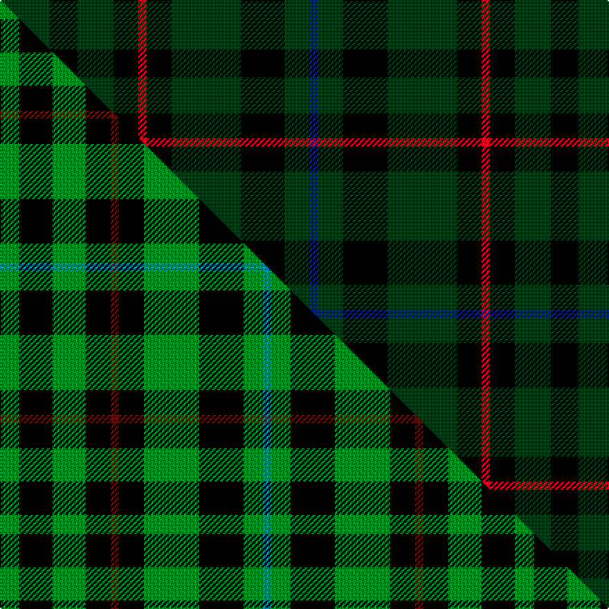

This is one **variant** — a specific cloth: this exact thread count and colourway, with its own
provenance below. It is one weaving of the [sett](/tartans/h/ho/holman/) (the scale-free proportion — the
same cloth at any scale or shade), whose colour order is pattern [BGKGKRKGKG](/stripes/bgkgkrkgkg/).

Part of the [Holman](/tartans/h/ho/holman/) tartan — the named design grouping this sett with its other cloths.

Sourced from weddslist.  It is a [10 stripe tartan](/stripes/stripes10/).

Original link [http://www.weddslist.com/cgi-bin/tartans/pg.pl?source=sts](http://www.weddslist.com/cgi-bin/tartans/pg.pl?source=sts)

Dataset <small>— provenance for this record, inherited from the source manifest</small>

<dl class="dataset-prov">
<dt>source</dt><dd><a href="/sources/weddslist/">Weddslist</a></dd>
<dt>data captured from</dt><dd><a href="https://github.com/thetartan/tartan-database/blob/master/data/weddslist/data.csv">https://github.com/thetartan/tartan-database/blob/master/data/weddslist/data.csv</a></dd>
<dt>data date</dt><dd>2016-11-17 <small>(dataset default)</small></dd>
<dt>licence</dt><dd><a href="https://creativecommons.org/licenses/by-nc-nd/4.0/">CC BY-NC-ND 4.0</a></dd>
</dl>

Capture chain <small>— the hands this data passed through, oldest first; each capture carries its own licence</small>

<ol class="capture-chain">
<li><a href="https://www.weddslist.com/tartans/">Weddslist</a> <small>the living privately compiled reference</small></li>
<li><a href="https://github.com/thetartan/tartan-database">thetartan/tartan-database</a> <small>2016-2017</small> · <a href="https://creativecommons.org/licenses/by-nc-nd/4.0/">CC BY-NC-ND 4.0</a> <small>Levko Kravets's frozen compilation — the capture we vendored, and where its CC licence text came from</small></li>
<li>this dictionary <small>captured 2026-06-10 · commit 5bf86c7566</small> <small>each re-capture is a git commit to data/sources</small></li>
</ol>

## Thread count
DG/36 K20 DG26 K18 R6 K18 DG50 K32 DG18 DB/6

One full sett is **418 threads**.

## Palette
<table><thead><tr><th>Colour</th><th>Shade</th><th>OKLCh</th></tr></thead><tbody><tr><td>DB</td><td><code style="background-color:#082077;">#082077</code> <small style="color:#888">#082077</small></td><td><small style="color:#888">oklch(30.0% 0.149 265.1)</small></td></tr><tr><td>K</td><td><code style="background-color:#000000;">#000000</code> <small style="color:#888">#000000</small></td><td><small style="color:#888">oklch(0.0% 0.000 0.0)</small></td></tr><tr><td>DG</td><td><code style="background-color:#053819;">#053819</code> <small style="color:#888">#053819</small></td><td><small style="color:#888">oklch(30.0% 0.075 151.3)</small></td></tr><tr><td>R</td><td><code style="background-color:#D60020;">#D60020</code> <small style="color:#888">#D60020</small></td><td><small style="color:#888">oklch(55.2% 0.224 25.5)</small></td></tr></tbody></table>

# Sample pattern

## Compared to the master

This cloth is one sett of its design; the master sett (the exemplar the design is anchored on) is below for comparison.

Its **ΔTartan distance** from the master is **0.54** — the same measure the nearest-tartans table ranks by (0 is identical; a re-scale of the same cloth is near 0, a recolour or a different proportion further).

<figure class="master-compare" style="margin:0">

this sett
master sett ★

<figcaption style="color:#888;font-size:smaller">One weave of this sett against the <a href="/setts/g7k12g12k9dr3k9g20k16g7t3/">master sett ★</a>, split on the diagonal: a shared proportion runs seamlessly across it with only the shades shifting; a different proportion breaks on it.</figcaption>
</figure>

## Nearest tartan variants

The nearest existing variants by ΔTartan distance, with this cloth at the top so the swatches line up against it.

ΔTartan

Threads

Variant

Sett

—

418

<a href="/variants/s10/dg18k10dg13k9r3k9dg25k16dg9db3~x2/">Holman</a>

<a href="/ttd/edit/#slug=dg18k3dg3k3dg3k21g2k21dg21k4~x2~dg1806142-g2408144&amp;base=dg18k10dg13k9r3k9dg25k16dg9db3~x2" title="compare in the TTD">2.14</a>

352

<a href="/variants/s10/dg18k3dg3k3dg3k21g2k21dg21k4~x2~dg1806142-g2408144/">Guildry of Stirling</a>

<a href="/ttd/edit/#slug=dg3k6w2k6dg2k2dg16k2~x2&amp;base=dg18k10dg13k9r3k9dg25k16dg9db3~x2" title="compare in the TTD">2.19</a>

146

<a href="/variants/s8/dg3k6w2k6dg2k2dg16k2~x2/">MacLean of Duart Hunting</a>

<a href="/ttd/edit/#slug=dg5k15dg5k15dg19r2dg10b4~x2&amp;base=dg18k10dg13k9r3k9dg25k16dg9db3~x2" title="compare in the TTD">2.54</a>

282

<a href="/variants/s8/dg5k15dg5k15dg19r2dg10b4~x2/">Strath Halladale (Sutherland)</a>

<a href="/ttd/edit/#slug=w2dg12k3dg3k16dg3k3dg12ly2~x2&amp;base=dg18k10dg13k9r3k9dg25k16dg9db3~x2" title="compare in the TTD">2.69</a>

216

<a href="/variants/s9/w2dg12k3dg3k16dg3k3dg12ly2~x2/">MacIver Hunting</a>

<a href="/ttd/edit/#slug=k46dg6k6dg6k42dg47k12&amp;base=dg18k10dg13k9r3k9dg25k16dg9db3~x2" title="compare in the TTD">3.05</a>

272

<a href="/variants/s7/k46dg6k6dg6k42dg47k12/">Taiheiyo Club, Inc.</a>

<a href="/ttd/edit/#slug=do20db2do5db5k18g5do5g2do15~x2&amp;base=dg18k10dg13k9r3k9dg25k16dg9db3~x2" title="compare in the TTD">3.05</a>

238

<a href="/variants/s9/do20db2do5db5k18g5do5g2do15~x2/">Laois</a>

<a href="/ttd/edit/#slug=dg5k2dg2k2dg2k12r2k12dg6k2dg2~x2&amp;base=dg18k10dg13k9r3k9dg25k16dg9db3~x2" title="compare in the TTD">3.29</a>

182

<a href="/variants/s11/dg5k2dg2k2dg2k12r2k12dg6k2dg2~x2/">MacLoughlin of Ardmarnoch (Personal)</a>

<a href="/ttd/edit/#slug=dg10k3dg3k20dp3k5g3k20dg3k3dg10~x2~dg1806142-g2408144&amp;base=dg18k10dg13k9r3k9dg25k16dg9db3~x2" title="compare in the TTD">3.40</a>

292

<a href="/variants/s11/dg10k3dg3k20dp3k5g3k20dg3k3dg10~x2~dg1806142-g2408144/">Pike (Personal)</a>

<a href="/ttd/edit/#slug=k25dy5k5dg25k25db3k10~x2&amp;base=dg18k10dg13k9r3k9dg25k16dg9db3~x2" title="compare in the TTD">3.44</a>

322

<a href="/variants/s7/k25dy5k5dg25k25db3k10~x2/">London Community Gospel Choir, The</a>

<a href="/ttd/edit/#slug=k10dg2k2db2dg14ly1dg14db2k10dg4k2dg2k2~x2&amp;base=dg18k10dg13k9r3k9dg25k16dg9db3~x2" title="compare in the TTD">3.63</a>

244

<a href="/variants/s13/k10dg2k2db2dg14ly1dg14db2k10dg4k2dg2k2~x2/">Sawicki, Peter (Personal)</a>

## Neighbour map

Every grey dot is one of 13656 variants placed by the first two principal components of the ΔTartan feature space (42% of its variance). Red is this tartan; blue dots are its nearest — click one to open its page. The map is a flat projection of a many-dimensional space — [how to read it](/posts/neighbourhood-maps/).

<svg viewBox="0 0 640 380" role="img" style="max-width:100%;height:auto;border:1px solid #e0e0e0;border-radius:4px;display:block" xmlns="http://www.w3.org/2000/svg"><image href="/nn/cloud.v1.png" width="640" height="380"/><a href="/variants/s10/dg18k3dg3k3dg3k21g2k21dg21k4~x2~dg1806142-g2408144/"><circle cx="283.1" cy="185.0" r="4" fill="#3465a4"><title>Guildry of Stirling</title></circle></a><a href="/variants/s8/dg3k6w2k6dg2k2dg16k2~x2/"><circle cx="289.8" cy="198.8" r="4" fill="#3465a4"><title>MacLean of Duart Hunting</title></circle></a><a href="/variants/s8/dg5k15dg5k15dg19r2dg10b4~x2/"><circle cx="271.5" cy="215.8" r="4" fill="#3465a4"><title>Strath Halladale (Sutherland)</title></circle></a><a href="/variants/s9/w2dg12k3dg3k16dg3k3dg12ly2~x2/"><circle cx="254.3" cy="187.9" r="4" fill="#3465a4"><title>MacIver Hunting</title></circle></a><a href="/variants/s7/k46dg6k6dg6k42dg47k12/"><circle cx="420.6" cy="242.1" r="4" fill="#3465a4"><title>Taiheiyo Club, Inc.</title></circle></a><a href="/variants/s9/do20db2do5db5k18g5do5g2do15~x2/"><circle cx="313.7" cy="196.9" r="4" fill="#3465a4"><title>Laois</title></circle></a><a href="/variants/s11/dg5k2dg2k2dg2k12r2k12dg6k2dg2~x2/"><circle cx="339.1" cy="208.0" r="4" fill="#3465a4"><title>MacLoughlin of Ardmarnoch (Personal)</title></circle></a><a href="/variants/s11/dg10k3dg3k20dp3k5g3k20dg3k3dg10~x2~dg1806142-g2408144/"><circle cx="278.4" cy="181.6" r="4" fill="#3465a4"><title>Pike (Personal)</title></circle></a><a href="/variants/s7/k25dy5k5dg25k25db3k10~x2/"><circle cx="381.3" cy="223.0" r="4" fill="#3465a4"><title>London Community Gospel Choir, The</title></circle></a><a href="/variants/s13/k10dg2k2db2dg14ly1dg14db2k10dg4k2dg2k2~x2/"><circle cx="310.6" cy="157.6" r="4" fill="#3465a4"><title>Sawicki, Peter (Personal)</title></circle></a><circle cx="296.3" cy="223.1" r="5" fill="#c00000"/><text x="320" y="376" text-anchor="middle" font-size="11" fill="#999">ground</text><text x="11" y="190" text-anchor="middle" font-size="11" fill="#999" transform="rotate(-90 11 190)">complexity</text></svg>

ID: /variants/s10/dg18k10dg13k9r3k9dg25k16dg9db3~x2/
