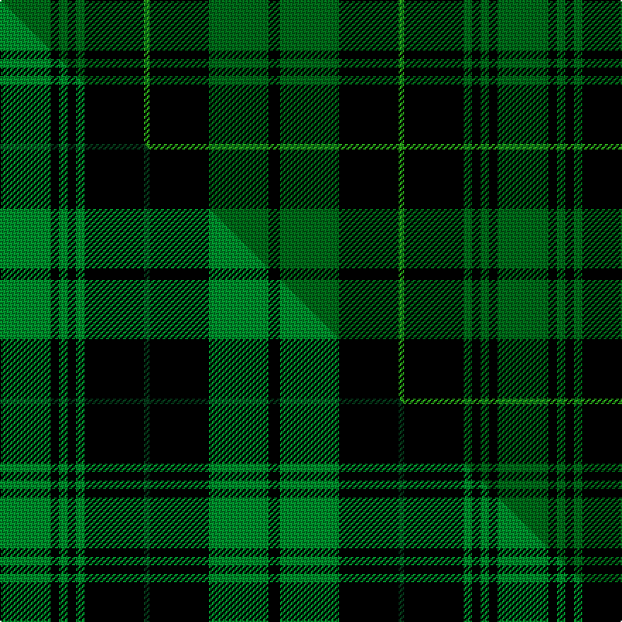

This page is one **sett** — a single exact thread-count. It belongs to the [tartan](/setts/dg18k3dg3k3dg3k21g2k21dg21k4/)
(the same proportion at any scale), whose colour order is pattern [GKGKGKGKGK](/stripes/gkgkgkgkgk/).

Part of the [Guildry of Stirling](/tartans/guildry-of-stirling/) tartan — the named design grouping this sett with its other cloths.

Sourced from tartans-authority.  It is a [10 stripe tartan](/stripes/stripes10/).

Original link http://www.tartansauthority.com/tartan-ferret/display/10897/

## Register references

External register numbers recorded for this tartan.

- Scottish Register of Tartans: [10897](https://www.tartanregister.gov.uk/tartanDetails?ref=10897)
- Scottish Tartans Authority (ITI): 10897

## Thread count
DG/36 K6 DG6 K6 DG6 K42 G4 K42 DG42 K/8

One full sett is **352 threads**.

## Palette

Palette (<a href="/colour/tartan-register/">Tartan Register</a>)
<table><thead><tr><th>Colour</th><th>Shade</th><th>Ref</th><th>OKLCh</th></tr></thead><tbody><tr><td>G</td><td><code style="background-color:#289C18;">#289C18</code> <small style="color:#888">#289C18</small></td><td><a href="/colour/tartan-register/#s-289c18" title="Green">G3</a></td><td><small style="color:#888">oklch(60.6% 0.191 141.6)</small></td></tr><tr><td>DG</td><td><code style="background-color:#006818;">#006818</code> <small style="color:#888">#006818</small></td><td><a href="/colour/tartan-register/#s-006818" title="Green">G11</a></td><td><small style="color:#888">oklch(45.0% 0.142 145.0)</small></td></tr><tr><td>K</td><td><code style="background-color:#000000;">#000000</code> <small style="color:#888">#000000</small></td><td><a href="/colour/tartan-register/#s-000000" title="Black">K2</a></td><td><small style="color:#888">oklch(0.0% 0.000 0.0)</small></td></tr></tbody></table>

# Sample pattern

## Compared to the master

This cloth is one sett of its design; the master sett (the exemplar the design is anchored on) is below for comparison.

Its **ΔTartan distance** from the master is **0.61** — the same measure the nearest-tartans table ranks by (0 is identical; a re-scale of the same cloth is near 0, a recolour or a different proportion further).

<figure class="master-compare" style="margin:0">

this sett
master sett ★

<figcaption style="color:#888;font-size:smaller">One weave of this sett against the <a href="/setts/g18k3g3k3g3k21dg2k21g21k4/">master sett ★</a>, split on the diagonal: a shared proportion runs seamlessly across it with only the shades shifting; a different proportion breaks on it.</figcaption>
</figure>

## Nearest variants

The nearest existing variants by ΔTartan distance, with this cloth at the top so the swatches line up against it.

ΔTartan

Threads

Variant

Sett

—

352

<a href="/variants/s10/dg18k3dg3k3dg3k21g2k21dg21k4~x2~dg1806142-g2408144/">Guildry of Stirling</a>

<a href="/ttd/edit/#slug=db5k9g7k3g7k3g7k25g3~x2&amp;base=dg18k3dg3k3dg3k21g2k21dg21k4~x2~dg1806142-g2408144" title="compare in the TTD">2.06</a>

260

<a href="/variants/s9/db5k9g7k3g7k3g7k25g3~x2/">Menez Du</a>

<a href="/ttd/edit/#slug=k8g4r1k2g16dy1k8g2k2g4~x4&amp;base=dg18k3dg3k3dg3k21g2k21dg21k4~x2~dg1806142-g2408144" title="compare in the TTD">2.37</a>

336

<a href="/variants/s10/k8g4r1k2g16dy1k8g2k2g4~x4/">Manitoba Cue Sports</a>

<a href="/ttd/edit/#slug=k8g4r1k2g16ly1k8g2k2g4~x4&amp;base=dg18k3dg3k3dg3k21g2k21dg21k4~x2~dg1806142-g2408144" title="compare in the TTD">2.37</a>

336

<a href="/variants/s10/k8g4r1k2g16ly1k8g2k2g4~x4/">Manitoba Cue (Corporate)</a>

<a href="/ttd/edit/#slug=dg10k3dg3k20dp3k5g3k20dg3k3dg10~x2~dg1806142-g2408144&amp;base=dg18k3dg3k3dg3k21g2k21dg21k4~x2~dg1806142-g2408144" title="compare in the TTD">2.84</a>

292

<a href="/variants/s11/dg10k3dg3k20dp3k5g3k20dg3k3dg10~x2~dg1806142-g2408144/">Pike (Personal)</a>

<a href="/ttd/edit/#slug=k4dg13k4g8k44g8k4dg13k4w3~x2~dg1806142-g2203152&amp;base=dg18k3dg3k3dg3k21g2k21dg21k4~x2~dg1806142-g2408144" title="compare in the TTD">2.89</a>

406

<a href="/variants/s10/k4dg13k4g8k44g8k4dg13k4w3~x2~dg1806142-g2203152/">Childers</a>

<a href="/ttd/edit/#slug=k8g28k8dg17k88dg17k8g28k8r6~g1903114-dg1405139&amp;base=dg18k3dg3k3dg3k21g2k21dg21k4~x2~dg1806142-g2408144" title="compare in the TTD">2.99</a>

418

<a href="/variants/s10/k8g28k8dg17k88dg17k8g28k8r6~g1903114-dg1405139/">Childers (Gurkha Rifles)</a>

## Neighbour map

Every grey dot is one of 13620 variants placed by the first two principal components of the ΔTartan feature space (42% of its variance). Red is this tartan; blue dots are its nearest — click one to open its page.

<svg viewBox="0 0 640 380" role="img" style="max-width:100%;height:auto;border:1px solid #e0e0e0;border-radius:4px;display:block" xmlns="http://www.w3.org/2000/svg"><image href="/nn/cloud.v1.png" width="640" height="380"/><a href="/variants/s9/db5k9g7k3g7k3g7k25g3~x2/"><circle cx="273.9" cy="193.2" r="4" fill="#3465a4"><title>Menez Du</title></circle></a><a href="/variants/s10/k8g4r1k2g16dy1k8g2k2g4~x4/"><circle cx="263.3" cy="145.9" r="4" fill="#3465a4"><title>Manitoba Cue Sports</title></circle></a><a href="/variants/s10/k8g4r1k2g16ly1k8g2k2g4~x4/"><circle cx="261.0" cy="145.4" r="4" fill="#3465a4"><title>Manitoba Cue (Corporate)</title></circle></a><a href="/variants/s11/dg10k3dg3k20dp3k5g3k20dg3k3dg10~x2~dg1806142-g2408144/"><circle cx="278.7" cy="182.1" r="4" fill="#3465a4"><title>Pike (Personal)</title></circle></a><a href="/variants/s10/k4dg13k4g8k44g8k4dg13k4w3~x2~dg1806142-g2203152/"><circle cx="269.6" cy="134.3" r="4" fill="#3465a4"><title>Childers</title></circle></a><a href="/variants/s10/k8g28k8dg17k88dg17k8g28k8r6~g1903114-dg1405139/"><circle cx="276.9" cy="138.0" r="4" fill="#3465a4"><title>Childers (Gurkha Rifles)</title></circle></a><circle cx="283.4" cy="185.4" r="5" fill="#c00000"/><text x="320" y="376" text-anchor="middle" font-size="11" fill="#999">ground</text><text x="11" y="190" text-anchor="middle" font-size="11" fill="#999" transform="rotate(-90 11 190)">complexity</text></svg>

ID: /variants/s10/dg18k3dg3k3dg3k21g2k21dg21k4~x2~dg1806142-g2408144/
