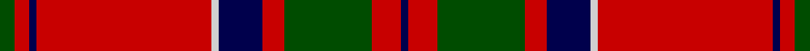

This page is one **sett** — a single exact thread-count. It belongs to the [tartan](/setts/dg2r2db1r24lb1db6r3dg12r4db1/)
(the same proportion at any scale), whose colour order is pattern [BRGRBWRBRG](/stripes/brgrbwrbrg/).

Part of the [MacDonell of Keppoch](/tartans/macdonell-of-keppoch/) tartan — the named design grouping this sett with its other cloths.

Sourced from weddslist.  It is a [10 stripe tartan](/stripes/stripes10/).

Original link http://www.weddslist.com/cgi-bin/tartans/pg.pl?source=rb

## Also known as

This cloth is also recorded under:

- MacDonell of Keppoch #2
- MacDonell of Keppoch #3

## Thread count
G/2 R2 DB1 R24 N1 DB6 R3 G12 R4 DB/1

One full sett is **109 threads**.

## Palette

Palette: <strong>Tartan Register</strong> <small style="color:#888">(2 of 4 colours)</small>
<table><thead><tr><th>Colour</th><th>Threads</th><th>Shade</th><th>Base</th><th>OKLCh</th></tr></thead><tbody><tr><td>G/</td><td style="text-align:right;font-variant-numeric:tabular-nums">2</td><td><code style="background-color:#004C00;">#004C00</code> <small style="color:#888">#004C00</small></td><td>G <code style="background-color:#006100;">#006100</code></td><td><small style="color:#888">oklch(36.1% 0.123 142.5)</small></td></tr><tr><td>R</td><td style="text-align:right;font-variant-numeric:tabular-nums">2</td><td><code style="background-color:#C80000;">#C80000</code> <small style="color:#888">#C80000</small></td><td>R <code style="background-color:#CC0000;">#CC0000</code></td><td><small style="color:#888">oklch(52.3% 0.215 29.2)</small></td></tr><tr><td>DB</td><td style="text-align:right;font-variant-numeric:tabular-nums">1</td><td><code style="background-color:#00004C;">#00004C</code> <small style="color:#888">#00004C</small></td><td>B <code style="background-color:#2A418A;">#2A418A</code></td><td><small style="color:#888">oklch(18.8% 0.130 264.1)</small></td></tr><tr><td>R</td><td style="text-align:right;font-variant-numeric:tabular-nums">24</td><td><code style="background-color:#C80000;">#C80000</code> <small style="color:#888">#C80000</small></td><td>R <code style="background-color:#CC0000;">#CC0000</code></td><td><small style="color:#888">oklch(52.3% 0.215 29.2)</small></td></tr><tr><td>N</td><td style="text-align:right;font-variant-numeric:tabular-nums">1</td><td><code style="background-color:#D0D0D0;">#D0D0D0</code> <small style="color:#888">#D0D0D0</small></td><td>W <code style="background-color:#F7F7F7;">#F7F7F7</code></td><td><small style="color:#888">oklch(85.8% 0.000 89.9)</small></td></tr><tr><td>DB</td><td style="text-align:right;font-variant-numeric:tabular-nums">6</td><td><code style="background-color:#00004C;">#00004C</code> <small style="color:#888">#00004C</small></td><td>B <code style="background-color:#2A418A;">#2A418A</code></td><td><small style="color:#888">oklch(18.8% 0.130 264.1)</small></td></tr><tr><td>R</td><td style="text-align:right;font-variant-numeric:tabular-nums">3</td><td><code style="background-color:#C80000;">#C80000</code> <small style="color:#888">#C80000</small></td><td>R <code style="background-color:#CC0000;">#CC0000</code></td><td><small style="color:#888">oklch(52.3% 0.215 29.2)</small></td></tr><tr><td>G</td><td style="text-align:right;font-variant-numeric:tabular-nums">12</td><td><code style="background-color:#004C00;">#004C00</code> <small style="color:#888">#004C00</small></td><td>G <code style="background-color:#006100;">#006100</code></td><td><small style="color:#888">oklch(36.1% 0.123 142.5)</small></td></tr><tr><td>R</td><td style="text-align:right;font-variant-numeric:tabular-nums">4</td><td><code style="background-color:#C80000;">#C80000</code> <small style="color:#888">#C80000</small></td><td>R <code style="background-color:#CC0000;">#CC0000</code></td><td><small style="color:#888">oklch(52.3% 0.215 29.2)</small></td></tr><tr><td>DB/</td><td style="text-align:right;font-variant-numeric:tabular-nums">1</td><td><code style="background-color:#00004C;">#00004C</code> <small style="color:#888">#00004C</small></td><td>B <code style="background-color:#2A418A;">#2A418A</code></td><td><small style="color:#888">oklch(18.8% 0.130 264.1)</small></td></tr></tbody></table>

## Compared to the master

This cloth is one sett of its design; the master sett (the exemplar the design is anchored on) is below for comparison.

<figure style="margin:0"><figcaption style="color:#888;font-size:smaller">this sett</figcaption></figure>
<figure style="margin:0"><figcaption style="color:#888;font-size:smaller"><a href="/setts/dg2r2db1r24b1db6r3dg12r4db1/">master sett →</a></figcaption></figure>

## Nearest tartans

The nearest existing variants by ΔTartan distance, with this tartan at the top so the swatches line up against it.

ΔTartan

Tartan

Sett

—

<a href="/ttd/edit/#slug=dg2r2db1r24lb1db6r3dg12r4db1">MacDonell of Keppoch</a> <a class="nn-out" href="/variants/s10/dg2r2db1r24lb1db6r3dg12r4db1/" title="open its dictionary page">↗</a>

0.67

<a href="/ttd/edit/#slug=r7w2r36db6dg3db3dg3db3dg12r4~x2&amp;base=dg2r2db1r24lb1db6r3dg12r4db1">Chisholm of Strathglass</a> <a class="nn-out" href="/variants/s10/r7w2r36db6dg3db3dg3db3dg12r4~x2/" title="open its dictionary page">↗</a>

0.71

<a href="/ttd/edit/#slug=r6w1r24db6g2db1g2db1g12r1~x2&amp;base=dg2r2db1r24lb1db6r3dg12r4db1">Chisholm</a> <a class="nn-out" href="/variants/s10/r6w1r24db6g2db1g2db1g12r1~x2/" title="open its dictionary page">↗</a>

0.76

<a href="/ttd/edit/#slug=r6lb1r24dp6dg2dp1dg2dp1dg12r1&amp;base=dg2r2db1r24lb1db6r3dg12r4db1">Chisholm D</a> <a class="nn-out" href="/variants/s10/r6lb1r24dp6dg2dp1dg2dp1dg12r1/" title="open its dictionary page">↗</a>

0.85

<a href="/ttd/edit/#slug=r4lb1db1r32lb2r2db12r2dg16r4lb1r4db2&amp;base=dg2r2db1r24lb1db6r3dg12r4db1">MacGillivray</a> <a class="nn-out" href="/variants/s13/r4lb1db1r32lb2r2db12r2dg16r4lb1r4db2/" title="open its dictionary page">↗</a>

0.87

<a href="/ttd/edit/#slug=dg4r3k1r28dg14r4dg4lb3dg4r4~x2&amp;base=dg2r2db1r24lb1db6r3dg12r4db1">Scott</a> <a class="nn-out" href="/variants/s10/dg4r3k1r28dg14r4dg4lb3dg4r4~x2/" title="open its dictionary page">↗</a>

0.88

<a href="/ttd/edit/#slug=r4g8k6ri8r6g2r2g2r24g1r3~x2&amp;base=dg2r2db1r24lb1db6r3dg12r4db1">MacDougal 3</a> <a class="nn-out" href="/variants/s11/r4g8k6ri8r6g2r2g2r24g1r3~x2/" title="open its dictionary page">↗</a>

0.89

<a href="/ttd/edit/#slug=r6db1r1dg28r4db8w1r32dg1r4dg2~x2&amp;base=dg2r2db1r24lb1db6r3dg12r4db1">MacDonell of Keppoch (artefact)</a> <a class="nn-out" href="/variants/s11/r6db1r1dg28r4db8w1r32dg1r4dg2~x2/" title="open its dictionary page">↗</a>

0.90

<a href="/ttd/edit/#slug=k6r4lb3r44k32r3k3lo3k2r3~x2&amp;base=dg2r2db1r24lb1db6r3dg12r4db1">Smeaton 1985 (Name)</a> <a class="nn-out" href="/variants/s10/k6r4lb3r44k32r3k3lo3k2r3~x2/" title="open its dictionary page">↗</a>

0.90

<a href="/ttd/edit/#slug=r4dg8w1dg8r4dg4r2dg4r24k2~x2&amp;base=dg2r2db1r24lb1db6r3dg12r4db1">Cumming/Comyn</a> <a class="nn-out" href="/variants/s10/r4dg8w1dg8r4dg4r2dg4r24k2~x2/" title="open its dictionary page">↗</a>

0.91

<a href="/ttd/edit/#slug=r12dg6k1dg2k1dg1k6r24lr2~x2&amp;base=dg2r2db1r24lb1db6r3dg12r4db1">Stuart of Bute</a> <a class="nn-out" href="/variants/s9/r12dg6k1dg2k1dg1k6r24lr2~x2/" title="open its dictionary page">↗</a>

## Neighbour map

Every grey dot is one of 14360 variants placed by the first two principal components of the ΔTartan feature space (44% of its variance). Red is this tartan; blue dots are its nearest — click one to open its page.

<svg viewBox="0 0 640 380" role="img" style="max-width:100%;height:auto;border:1px solid #e0e0e0;border-radius:4px;display:block" xmlns="http://www.w3.org/2000/svg"><image href="/nn/cloud.v1.png" width="640" height="380"/><a href="/variants/s10/r7w2r36db6dg3db3dg3db3dg12r4~x2/"><circle cx="371.6" cy="130.8" r="4" fill="#3465a4"><title>Chisholm of Strathglass</title></circle></a><a href="/variants/s10/r6w1r24db6g2db1g2db1g12r1~x2/"><circle cx="363.6" cy="123.3" r="4" fill="#3465a4"><title>Chisholm</title></circle></a><a href="/variants/s10/r6lb1r24dp6dg2dp1dg2dp1dg12r1/"><circle cx="372.0" cy="125.8" r="4" fill="#3465a4"><title>Chisholm D</title></circle></a><a href="/variants/s13/r4lb1db1r32lb2r2db12r2dg16r4lb1r4db2/"><circle cx="363.5" cy="87.7" r="4" fill="#3465a4"><title>MacGillivray</title></circle></a><a href="/variants/s10/dg4r3k1r28dg14r4dg4lb3dg4r4~x2/"><circle cx="382.4" cy="125.0" r="4" fill="#3465a4"><title>Scott</title></circle></a><a href="/variants/s11/r4g8k6ri8r6g2r2g2r24g1r3~x2/"><circle cx="358.4" cy="127.8" r="4" fill="#3465a4"><title>MacDougal 3</title></circle></a><a href="/variants/s11/r6db1r1dg28r4db8w1r32dg1r4dg2~x2/"><circle cx="373.8" cy="104.4" r="4" fill="#3465a4"><title>MacDonell of Keppoch (artefact)</title></circle></a><a href="/variants/s10/k6r4lb3r44k32r3k3lo3k2r3~x2/"><circle cx="358.3" cy="113.0" r="4" fill="#3465a4"><title>Smeaton 1985 (Name)</title></circle></a><a href="/variants/s10/r4dg8w1dg8r4dg4r2dg4r24k2~x2/"><circle cx="370.4" cy="134.2" r="4" fill="#3465a4"><title>Cumming/Comyn</title></circle></a><a href="/variants/s9/r12dg6k1dg2k1dg1k6r24lr2~x2/"><circle cx="412.8" cy="130.0" r="4" fill="#3465a4"><title>Stuart of Bute</title></circle></a><circle cx="373.4" cy="120.1" r="5" fill="#c00000"/></svg>

ID: /variants/s10/dg2r2db1r24lb1db6r3dg12r4db1/
