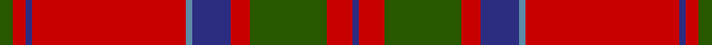

This page is one **sett** — a single exact thread-count. It belongs to the [tartan](/setts/dg2r2db1r24t1db6r3dg12r4db1/)
(the same proportion at any scale), whose colour order is pattern [BRGRBBRBRG](/stripes/brgrbbrbrg/).

Sourced from register-of-tartans.  It is a [10 stripe tartan](/stripes/stripes10/).

Original link https://www.tartanregister.gov.uk/tartanDetails.aspx?ref=2386

2 attestations — the source records this cloth was collapsed from (oldest owns this page)

<ul>
<li>01/01/1746 — MacDonell of Keppoch (register-of-tartans, <a href="https://www.tartanregister.gov.uk/tartanDetails.aspx?ref=2386">record</a>)</li>
<li>pre 1746 — MacDonell of Keppoch - 1800 (Clan) (tartans-authority, <a href="http://www.tartansauthority.com/tartan-ferret/display/511/">record</a>)</li>
</ul>

## Register references

External register numbers recorded for this tartan.

- Scottish Register of Tartans: [2386](https://www.tartanregister.gov.uk/tartanDetails.aspx?ref=2386)
- Scottish Tartans Authority (ITI): 511
- Scottish Tartans World Register: 511

## Thread count
G/4 R4 DB2 R48 B2 DB12 R6 G24 R8 DB/2

One full sett is **218 threads**.

## Palette

Palette: <strong>Tartan Register</strong>
<table><thead><tr><th>Colour</th><th>Threads</th><th>Shade</th><th>Base</th><th>OKLCh</th></tr></thead><tbody><tr><td>G/</td><td style="text-align:right;font-variant-numeric:tabular-nums">4</td><td><code style="background-color:#285800;">#285800</code> <small style="color:#888">#285800</small></td><td>G <code style="background-color:#006100;">#006100</code></td><td><small style="color:#888">oklch(41.0% 0.122 135.8)</small></td></tr><tr><td>R</td><td style="text-align:right;font-variant-numeric:tabular-nums">4</td><td><code style="background-color:#C80000;">#C80000</code> <small style="color:#888">#C80000</small></td><td>R <code style="background-color:#CC0000;">#CC0000</code></td><td><small style="color:#888">oklch(52.3% 0.215 29.2)</small></td></tr><tr><td>DB</td><td style="text-align:right;font-variant-numeric:tabular-nums">2</td><td><code style="background-color:#2C2C80;">#2C2C80</code> <small style="color:#888">#2C2C80</small></td><td>B <code style="background-color:#2A418A;">#2A418A</code></td><td><small style="color:#888">oklch(35.0% 0.138 276.6)</small></td></tr><tr><td>R</td><td style="text-align:right;font-variant-numeric:tabular-nums">48</td><td><code style="background-color:#C80000;">#C80000</code> <small style="color:#888">#C80000</small></td><td>R <code style="background-color:#CC0000;">#CC0000</code></td><td><small style="color:#888">oklch(52.3% 0.215 29.2)</small></td></tr><tr><td>B</td><td style="text-align:right;font-variant-numeric:tabular-nums">2</td><td><code style="background-color:#5C8CA8;">#5C8CA8</code> <small style="color:#888">#5C8CA8</small></td><td>B <code style="background-color:#2A418A;">#2A418A</code></td><td><small style="color:#888">oklch(61.7% 0.067 235.0)</small></td></tr><tr><td>DB</td><td style="text-align:right;font-variant-numeric:tabular-nums">12</td><td><code style="background-color:#2C2C80;">#2C2C80</code> <small style="color:#888">#2C2C80</small></td><td>B <code style="background-color:#2A418A;">#2A418A</code></td><td><small style="color:#888">oklch(35.0% 0.138 276.6)</small></td></tr><tr><td>R</td><td style="text-align:right;font-variant-numeric:tabular-nums">6</td><td><code style="background-color:#C80000;">#C80000</code> <small style="color:#888">#C80000</small></td><td>R <code style="background-color:#CC0000;">#CC0000</code></td><td><small style="color:#888">oklch(52.3% 0.215 29.2)</small></td></tr><tr><td>G</td><td style="text-align:right;font-variant-numeric:tabular-nums">24</td><td><code style="background-color:#285800;">#285800</code> <small style="color:#888">#285800</small></td><td>G <code style="background-color:#006100;">#006100</code></td><td><small style="color:#888">oklch(41.0% 0.122 135.8)</small></td></tr><tr><td>R</td><td style="text-align:right;font-variant-numeric:tabular-nums">8</td><td><code style="background-color:#C80000;">#C80000</code> <small style="color:#888">#C80000</small></td><td>R <code style="background-color:#CC0000;">#CC0000</code></td><td><small style="color:#888">oklch(52.3% 0.215 29.2)</small></td></tr><tr><td>DB/</td><td style="text-align:right;font-variant-numeric:tabular-nums">2</td><td><code style="background-color:#2C2C80;">#2C2C80</code> <small style="color:#888">#2C2C80</small></td><td>B <code style="background-color:#2A418A;">#2A418A</code></td><td><small style="color:#888">oklch(35.0% 0.138 276.6)</small></td></tr></tbody></table>

## Nearest tartans

The nearest existing variants by ΔTartan distance, with this tartan at the top so the swatches line up against it.

ΔTartan

Tartan

Sett

—

<a href="/ttd/edit/#slug=dg2r2db1r24t1db6r3dg12r4db1~x2">MacDonell of Keppoch</a> <a class="nn-out" href="/variants/s10/dg2r2db1r24t1db6r3dg12r4db1~x2/" title="open its dictionary page">↗</a>

0.46

<a href="/ttd/edit/#slug=r6lb1r24dp6dg2dp1dg2dp1dg12r1&amp;base=dg2r2db1r24t1db6r3dg12r4db1~x2">Chisholm D</a> <a class="nn-out" href="/variants/s10/r6lb1r24dp6dg2dp1dg2dp1dg12r1/" title="open its dictionary page">↗</a>

0.48

<a href="/ttd/edit/#slug=g2r2db1r24t1db6r3g12r4db1~x2&amp;base=dg2r2db1r24t1db6r3dg12r4db1~x2">MacDonell of Keppoch</a> <a class="nn-out" href="/variants/s10/g2r2db1r24t1db6r3g12r4db1~x2/" title="open its dictionary page">↗</a>

0.68

<a href="/ttd/edit/#slug=r7w2r36db6g3db3g3db3g12r4~x2&amp;base=dg2r2db1r24t1db6r3dg12r4db1~x2">Chisholm of Strathglass</a> <a class="nn-out" href="/variants/s10/r7w2r36db6g3db3g3db3g12r4~x2/" title="open its dictionary page">↗</a>

0.70

<a href="/ttd/edit/#slug=r7w2r36b6g3b3g3b3g12r4~x2&amp;base=dg2r2db1r24t1db6r3dg12r4db1~x2">Chisholm of Strathglass (Clan)</a> <a class="nn-out" href="/variants/s10/r7w2r36b6g3b3g3b3g12r4~x2/" title="open its dictionary page">↗</a>

0.71

<a href="/ttd/edit/#slug=r6w1r24db6g2db1g2db1g12r1~x2&amp;base=dg2r2db1r24t1db6r3dg12r4db1~x2">Chisholm</a> <a class="nn-out" href="/variants/s10/r6w1r24db6g2db1g2db1g12r1~x2/" title="open its dictionary page">↗</a>

0.75

<a href="/ttd/edit/#slug=r12w2r37db6g3db3r4db3g21r4~x2&amp;base=dg2r2db1r24t1db6r3dg12r4db1~x2">Chisholm, The</a> <a class="nn-out" href="/variants/s10/r12w2r37db6g3db3r4db3g21r4~x2/" title="open its dictionary page">↗</a>

0.76

<a href="/ttd/edit/#slug=r12w2r37b6g3b3r4b3g21r4~x2&amp;base=dg2r2db1r24t1db6r3dg12r4db1~x2">Chisholm, The (MacGregor-Hastie)</a> <a class="nn-out" href="/variants/s10/r12w2r37b6g3b3r4b3g21r4~x2/" title="open its dictionary page">↗</a>

0.77

<a href="/ttd/edit/#slug=dg2r2db1r24b1db6r3dg12r4db1~x2&amp;base=dg2r2db1r24t1db6r3dg12r4db1~x2">MacDonell of Keppoch</a> <a class="nn-out" href="/variants/s10/dg2r2db1r24b1db6r3dg12r4db1~x2/" title="open its dictionary page">↗</a>

0.77

<a href="/ttd/edit/#slug=dg2r2db1r24b1db6r3dg12r4db1&amp;base=dg2r2db1r24t1db6r3dg12r4db1~x2">MacDonell of Keppoch</a> <a class="nn-out" href="/variants/s10/dg2r2db1r24b1db6r3dg12r4db1/" title="open its dictionary page">↗</a>

0.85

<a href="/ttd/edit/#slug=r4t1db1r32t2r2db12r2g16r4t1r4db2~x2&amp;base=dg2r2db1r24t1db6r3dg12r4db1~x2">MacGillivray</a> <a class="nn-out" href="/variants/s13/r4t1db1r32t2r2db12r2g16r4t1r4db2~x2/" title="open its dictionary page">↗</a>

## Neighbour map

Every grey dot is one of 14360 variants placed by the first two principal components of the ΔTartan feature space (44% of its variance). Red is this tartan; blue dots are its nearest — click one to open its page.

<svg viewBox="0 0 640 380" role="img" style="max-width:100%;height:auto;border:1px solid #e0e0e0;border-radius:4px;display:block" xmlns="http://www.w3.org/2000/svg"><image href="/nn/cloud.v1.png" width="640" height="380"/><a href="/variants/s10/r6lb1r24dp6dg2dp1dg2dp1dg12r1/"><circle cx="372.0" cy="125.8" r="4" fill="#3465a4"><title>Chisholm D</title></circle></a><a href="/variants/s10/g2r2db1r24t1db6r3g12r4db1~x2/"><circle cx="394.5" cy="130.3" r="4" fill="#3465a4"><title>MacDonell of Keppoch</title></circle></a><a href="/variants/s10/r7w2r36db6g3db3g3db3g12r4~x2/"><circle cx="378.4" cy="135.4" r="4" fill="#3465a4"><title>Chisholm of Strathglass</title></circle></a><a href="/variants/s10/r7w2r36b6g3b3g3b3g12r4~x2/"><circle cx="379.3" cy="135.2" r="4" fill="#3465a4"><title>Chisholm of Strathglass (Clan)</title></circle></a><a href="/variants/s10/r6w1r24db6g2db1g2db1g12r1~x2/"><circle cx="363.6" cy="123.3" r="4" fill="#3465a4"><title>Chisholm</title></circle></a><a href="/variants/s10/r12w2r37db6g3db3r4db3g21r4~x2/"><circle cx="379.8" cy="142.0" r="4" fill="#3465a4"><title>Chisholm, The</title></circle></a><a href="/variants/s10/r12w2r37b6g3b3r4b3g21r4~x2/"><circle cx="378.2" cy="140.5" r="4" fill="#3465a4"><title>Chisholm, The (MacGregor-Hastie)</title></circle></a><a href="/variants/s10/dg2r2db1r24b1db6r3dg12r4db1~x2/"><circle cx="397.3" cy="136.4" r="4" fill="#3465a4"><title>MacDonell of Keppoch</title></circle></a><a href="/variants/s10/dg2r2db1r24b1db6r3dg12r4db1/"><circle cx="397.3" cy="136.4" r="4" fill="#3465a4"><title>MacDonell of Keppoch</title></circle></a><a href="/variants/s13/r4t1db1r32t2r2db12r2g16r4t1r4db2~x2/"><circle cx="394.4" cy="103.1" r="4" fill="#3465a4"><title>MacGillivray</title></circle></a><circle cx="399.3" cy="130.7" r="5" fill="#c00000"/></svg>

ID: /variants/s10/dg2r2db1r24t1db6r3dg12r4db1~x2/
