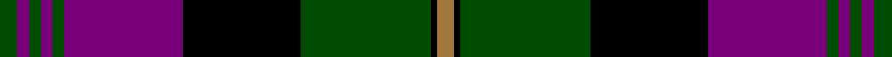

This page is one **sett** — a single exact thread-count. It belongs to the [tartan](/setts/dg3dp2dg2dp2dg2dp20k20dg22k1o3/)
(the same proportion at any scale), whose colour order is pattern [GBGBGBKGKR](/stripes/gbgbgbkgkr/).

Sourced from tartans-authority.  It is a [10 stripe tartan](/stripes/stripes10/).

Original link http://www.tartansauthority.com/tartan-ferret/display/4362/

## Register references

External register numbers recorded for this tartan.

- Scottish Tartans Authority (ITI): 4362

## Thread count
G/12 P8 G8 P8 G8 P80 K80 G88 K4 LT/12

One full sett is **592 threads**.

## Palette

Palette: <strong>Tartan Register</strong> <small style="color:#888">(3 of 4 colours)</small>
<table><thead><tr><th>Colour</th><th>Threads</th><th>Shade</th><th>Base</th><th>OKLCh</th></tr></thead><tbody><tr><td>G/</td><td style="text-align:right;font-variant-numeric:tabular-nums">12</td><td><code style="background-color:#004C00;">#004C00</code> <small style="color:#888">#004C00</small></td><td>G <code style="background-color:#006100;">#006100</code></td><td><small style="color:#888">oklch(36.1% 0.123 142.5)</small></td></tr><tr><td>P</td><td style="text-align:right;font-variant-numeric:tabular-nums">8</td><td><code style="background-color:#780078;">#780078</code> <small style="color:#888">#780078</small></td><td>B <code style="background-color:#2A418A;">#2A418A</code></td><td><small style="color:#888">oklch(40.2% 0.185 328.4)</small></td></tr><tr><td>G</td><td style="text-align:right;font-variant-numeric:tabular-nums">8</td><td><code style="background-color:#004C00;">#004C00</code> <small style="color:#888">#004C00</small></td><td>G <code style="background-color:#006100;">#006100</code></td><td><small style="color:#888">oklch(36.1% 0.123 142.5)</small></td></tr><tr><td>P</td><td style="text-align:right;font-variant-numeric:tabular-nums">8</td><td><code style="background-color:#780078;">#780078</code> <small style="color:#888">#780078</small></td><td>B <code style="background-color:#2A418A;">#2A418A</code></td><td><small style="color:#888">oklch(40.2% 0.185 328.4)</small></td></tr><tr><td>G</td><td style="text-align:right;font-variant-numeric:tabular-nums">8</td><td><code style="background-color:#004C00;">#004C00</code> <small style="color:#888">#004C00</small></td><td>G <code style="background-color:#006100;">#006100</code></td><td><small style="color:#888">oklch(36.1% 0.123 142.5)</small></td></tr><tr><td>P</td><td style="text-align:right;font-variant-numeric:tabular-nums">80</td><td><code style="background-color:#780078;">#780078</code> <small style="color:#888">#780078</small></td><td>B <code style="background-color:#2A418A;">#2A418A</code></td><td><small style="color:#888">oklch(40.2% 0.185 328.4)</small></td></tr><tr><td>K</td><td style="text-align:right;font-variant-numeric:tabular-nums">80</td><td><code style="background-color:#000000;">#000000</code> <small style="color:#888">#000000</small></td><td>K <code style="background-color:#000000;">#000000</code></td><td><small style="color:#888">oklch(0.0% 0.000 0.0)</small></td></tr><tr><td>G</td><td style="text-align:right;font-variant-numeric:tabular-nums">88</td><td><code style="background-color:#004C00;">#004C00</code> <small style="color:#888">#004C00</small></td><td>G <code style="background-color:#006100;">#006100</code></td><td><small style="color:#888">oklch(36.1% 0.123 142.5)</small></td></tr><tr><td>K</td><td style="text-align:right;font-variant-numeric:tabular-nums">4</td><td><code style="background-color:#000000;">#000000</code> <small style="color:#888">#000000</small></td><td>K <code style="background-color:#000000;">#000000</code></td><td><small style="color:#888">oklch(0.0% 0.000 0.0)</small></td></tr><tr><td>LT/</td><td style="text-align:right;font-variant-numeric:tabular-nums">12</td><td><code style="background-color:#A0783C;">#A0783C</code> <small style="color:#888">#A0783C</small></td><td>R <code style="background-color:#CC0000;">#CC0000</code></td><td><small style="color:#888">oklch(60.0% 0.092 75.5)</small></td></tr></tbody></table>

## Nearest tartans

The nearest existing variants by ΔTartan distance, with this tartan at the top so the swatches line up against it.

ΔTartan

Tartan

Sett

—

<a href="/ttd/edit/#slug=dg3dp2dg2dp2dg2dp20k20dg22k1o3~x4">Urbino (Fashion)</a> <a class="nn-out" href="/variants/s10/dg3dp2dg2dp2dg2dp20k20dg22k1o3~x4/" title="open its dictionary page">↗</a>

0.94

<a href="/ttd/edit/#slug=w6k1y28k24dp25y3dp3y3dp3y4~x2&amp;base=dg3dp2dg2dp2dg2dp20k20dg22k1o3~x4">Rennie (Personal)</a> <a class="nn-out" href="/variants/s10/w6k1y28k24dp25y3dp3y3dp3y4~x2/" title="open its dictionary page">↗</a>

1.02

<a href="/ttd/edit/#slug=n3r3k38n25ly3n6r7n3ly2~x2&amp;base=dg3dp2dg2dp2dg2dp20k20dg22k1o3~x4">Greater St Louis Area Firefighters Highland Guard</a> <a class="nn-out" href="/variants/s9/n3r3k38n25ly3n6r7n3ly2~x2/" title="open its dictionary page">↗</a>

1.06

<a href="/ttd/edit/#slug=w6k1g29k23dp27g3dp3g3dp3g4~x2&amp;base=dg3dp2dg2dp2dg2dp20k20dg22k1o3~x4">Rennie Family Tartan</a> <a class="nn-out" href="/variants/s10/w6k1g29k23dp27g3dp3g3dp3g4~x2/" title="open its dictionary page">↗</a>

1.13

<a href="/ttd/edit/#slug=db6r1db2r1db2k18r8g2~x2&amp;base=dg3dp2dg2dp2dg2dp20k20dg22k1o3~x4">Brown</a> <a class="nn-out" href="/variants/s8/db6r1db2r1db2k18r8g2~x2/" title="open its dictionary page">↗</a>

1.20

<a href="/ttd/edit/#slug=k8r1k3w5k5w3k5dr23r3~x2&amp;base=dg3dp2dg2dp2dg2dp20k20dg22k1o3~x4">Southdown Tartan</a> <a class="nn-out" href="/variants/s9/k8r1k3w5k5w3k5dr23r3~x2/" title="open its dictionary page">↗</a>

1.20

<a href="/variants/s18/dg3dp2dg2dp2dg2dp20k20dg22k1o3~x4/">Urbino</a>

1.21

<a href="/ttd/edit/#slug=n19r2n3r2n3k43r22g3~x2&amp;base=dg3dp2dg2dp2dg2dp20k20dg22k1o3~x4">Carson Red (Personal)</a> <a class="nn-out" href="/variants/s8/n19r2n3r2n3k43r22g3~x2/" title="open its dictionary page">↗</a>

1.22

<a href="/ttd/edit/#slug=r3k2db25k28g25k2r1db2~x2&amp;base=dg3dp2dg2dp2dg2dp20k20dg22k1o3~x4">Common Kilt</a> <a class="nn-out" href="/variants/s8/r3k2db25k28g25k2r1db2~x2/" title="open its dictionary page">↗</a>

1.23

<a href="/ttd/edit/#slug=r3g14k12db40k12g2k2g2k2g7r3~x2&amp;base=dg3dp2dg2dp2dg2dp20k20dg22k1o3~x4">Rangers F.C.</a> <a class="nn-out" href="/variants/s11/r3g14k12db40k12g2k2g2k2g7r3~x2/" title="open its dictionary page">↗</a>

1.24

<a href="/ttd/edit/#slug=db6r1db2r1db2k18r8dg2~x4&amp;base=dg3dp2dg2dp2dg2dp20k20dg22k1o3~x4">Brown</a> <a class="nn-out" href="/variants/s8/db6r1db2r1db2k18r8dg2~x4/" title="open its dictionary page">↗</a>

## Neighbour map

Every grey dot is one of 14360 variants placed by the first two principal components of the ΔTartan feature space (44% of its variance). Red is this tartan; blue dots are its nearest — click one to open its page.

<svg viewBox="0 0 640 380" role="img" style="max-width:100%;height:auto;border:1px solid #e0e0e0;border-radius:4px;display:block" xmlns="http://www.w3.org/2000/svg"><image href="/nn/cloud.v1.png" width="640" height="380"/><a href="/variants/s10/w6k1y28k24dp25y3dp3y3dp3y4~x2/"><circle cx="250.5" cy="140.5" r="4" fill="#3465a4"><title>Rennie (Personal)</title></circle></a><a href="/variants/s9/n3r3k38n25ly3n6r7n3ly2~x2/"><circle cx="270.5" cy="145.3" r="4" fill="#3465a4"><title>Greater St Louis Area Firefighters Highland Guard</title></circle></a><a href="/variants/s10/w6k1g29k23dp27g3dp3g3dp3g4~x2/"><circle cx="242.9" cy="133.4" r="4" fill="#3465a4"><title>Rennie Family Tartan</title></circle></a><a href="/variants/s8/db6r1db2r1db2k18r8g2~x2/"><circle cx="254.5" cy="153.7" r="4" fill="#3465a4"><title>Brown</title></circle></a><a href="/variants/s9/k8r1k3w5k5w3k5dr23r3~x2/"><circle cx="247.3" cy="142.5" r="4" fill="#3465a4"><title>Southdown Tartan</title></circle></a><a href="/variants/s18/dg3dp2dg2dp2dg2dp20k20dg22k1o3~x4/"><circle cx="228.5" cy="122.9" r="4" fill="#3465a4"><title>Urbino</title></circle></a><a href="/variants/s8/n19r2n3r2n3k43r22g3~x2/"><circle cx="284.3" cy="148.4" r="4" fill="#3465a4"><title>Carson Red (Personal)</title></circle></a><a href="/variants/s8/r3k2db25k28g25k2r1db2~x2/"><circle cx="224.6" cy="146.7" r="4" fill="#3465a4"><title>Common Kilt</title></circle></a><a href="/variants/s11/r3g14k12db40k12g2k2g2k2g7r3~x2/"><circle cx="221.4" cy="130.9" r="4" fill="#3465a4"><title>Rangers F.C.</title></circle></a><a href="/variants/s8/db6r1db2r1db2k18r8dg2~x4/"><circle cx="257.9" cy="155.1" r="4" fill="#3465a4"><title>Brown</title></circle></a><circle cx="239.3" cy="144.3" r="5" fill="#c00000"/></svg>

ID: /variants/s10/dg3dp2dg2dp2dg2dp20k20dg22k1o3~x4/
