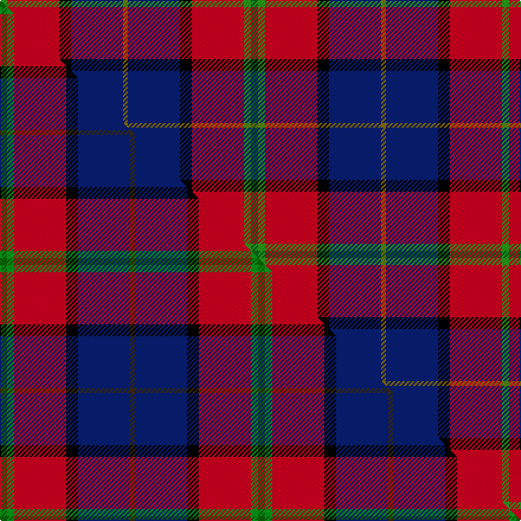

This page is one **sett** — a single exact thread-count. It belongs to the [tartan](/setts/dg3g3r22k5db22y2db22k5r22g3/)
(the same proportion at any scale), whose colour order is pattern [GGRKBGBKRG](/stripes/ggrkbgbkrg/).

Part of the [MacLeod Society of Scotland](/tartans/macleod-society-of-scotland/) tartan — the named design grouping this sett with its other cloths.

Sourced from house-of-tartan.  It is a [10 stripe tartan](/stripes/stripes10/).

Original link [http://www.house-of-tartan.scotland.net/house/TartanViewjs.asp?colr=Def&tnam=2375](http://www.house-of-tartan.scotland.net/house/TartanViewjs.asp?colr=Def&tnam=2375)

## Provenance

Earliest known date: 1991 Designed by Rosemary Flemming and Derek MacLeod to celebrate the centenary of the Clan MacLeod Society of Scotland. Trudi Mann of Wick, a TECA scholar, also played a part in the design which was accepted by the Chief as the Society sett. Thread count from Trudi Mann March 2004.

Dataset <small>— provenance for this record, inherited from the source manifest</small>

<dl class="dataset-prov">
<dt>source</dt><dd><a href="/sources/house-of-tartan/">House of Tartan</a></dd>
<dt>data captured from</dt><dd><a href="https://github.com/thetartan/tartan-database/blob/master/data/house-of-tartan/data.csv">https://github.com/thetartan/tartan-database/blob/master/data/house-of-tartan/data.csv</a></dd>
<dt>data date</dt><dd>2017-01-10 <small>(dataset default)</small></dd>
<dt>licence</dt><dd><a href="https://creativecommons.org/licenses/by-nc-nd/4.0/">CC BY-NC-ND 4.0</a></dd>
</dl>

Capture chain <small>— the hands this data passed through, oldest first; each capture carries its own licence</small>

<ol class="capture-chain">
<li><a href="http://www.house-of-tartan.scotland.net/">House of Tartan</a> <small>the weaver/retailer's database — the site is now offline; the URL is kept as the ultimate source's identity</small></li>
<li><a href="https://github.com/thetartan/tartan-database">thetartan/tartan-database</a> <small>2016-2017</small> · <a href="https://creativecommons.org/licenses/by-nc-nd/4.0/">CC BY-NC-ND 4.0</a> <small>Levko Kravets's frozen compilation — the capture we vendored, and where its CC licence text came from</small></li>
<li>this dictionary <small>captured 2026-06-10 · commit 5bf86c7566</small> <small>each re-capture is a git commit to data/sources</small></li>
</ol>

## Thread count
G/6 R44 K10 DB44 Y4 DB44 K10 R44 G6 DG/6

One full sett is **424 threads**.

## Palette
<table><thead><tr><th>Colour</th><th>Shade</th><th>OKLCh</th></tr></thead><tbody><tr><td>DB</td><td><code style="background-color:#082077;">#082077</code> <small style="color:#888">#082077</small></td><td><small style="color:#888">oklch(30.0% 0.149 265.1)</small></td></tr><tr><td>G</td><td><code style="background-color:#289C18;">#289C18</code> <small style="color:#888">#289C18</small></td><td><small style="color:#888">oklch(60.6% 0.191 141.6)</small></td></tr><tr><td>DG</td><td><code style="background-color:#006818;">#006818</code> <small style="color:#888">#006818</small></td><td><small style="color:#888">oklch(45.0% 0.142 145.0)</small></td></tr><tr><td>DT</td><td><code style="background-color:#023535;">#023535</code> <small style="color:#888">#023535</small></td><td><small style="color:#888">oklch(29.8% 0.050 194.8)</small></td></tr><tr><td>K</td><td><code style="background-color:#000000;">#000000</code> <small style="color:#888">#000000</small></td><td><small style="color:#888">oklch(0.0% 0.000 0.0)</small></td></tr><tr><td>R</td><td><code style="background-color:#D60020;">#D60020</code> <small style="color:#888">#D60020</small></td><td><small style="color:#888">oklch(55.2% 0.224 25.5)</small></td></tr><tr><td>Y</td><td><code style="background-color:#8B6E00;">#8B6E00</code> <small style="color:#888">#8B6E00</small></td><td><small style="color:#888">oklch(55.1% 0.113 90.4)</small></td></tr></tbody></table>

# Sample pattern

## Compared to the master

This cloth is one sett of its design; the master sett (the exemplar the design is anchored on) is below for comparison.

Its **ΔTartan distance** from the master is **2.56** — the same measure the nearest-tartans table ranks by (0 is identical; a re-scale of the same cloth is near 0, a recolour or a different proportion further).

<figure class="master-compare" style="margin:0">

this sett
master sett ★

<figcaption style="color:#888;font-size:smaller">One weave of this sett against the <a href="/setts/dg3g3r22k5db22dy2/">master sett ★</a>, split on the diagonal: a shared proportion runs seamlessly across it with only the shades shifting; a different proportion breaks on it.</figcaption>
</figure>

## Nearest tartan variants

The nearest existing variants by ΔTartan distance, with this cloth at the top so the swatches line up against it.

ΔTartan

Threads

Variant

Sett

—

424

<a href="/variants/s10/dg3g3r22k5db22y2db22k5r22g3~x2~dg1806142-g2408144/">MacLeod Society of Scotland Clan Tartan</a>

<a href="/ttd/edit/#slug=k4db12lb3db4g8lo2r24db4r4~x2&amp;base=dg3g3r22k5db22y2db22k5r22g3~x2~dg1806142-g2408144" title="compare in the TTD">2.27</a>

244

<a href="/variants/s9/k4db12lb3db4g8lo2r24db4r4~x2/">MacCreary (Personal)</a>

<a href="/ttd/edit/#slug=k3g1r1db6n2db1n1db1r10w1~x4&amp;base=dg3g3r22k5db22y2db22k5r22g3~x2~dg1806142-g2408144" title="compare in the TTD">2.30</a>

200

<a href="/variants/s10/k3g1r1db6n2db1n1db1r10w1~x4/">Crieff Primary School</a>

<a href="/ttd/edit/#slug=db4dy3db22n6w2k6w2r26k3r4~x2&amp;base=dg3g3r22k5db22y2db22k5r22g3~x2~dg1806142-g2408144" title="compare in the TTD">2.48</a>

296

<a href="/variants/s10/db4dy3db22n6w2k6w2r26k3r4~x2/">Asman, Dress (Name)</a>

<a href="/ttd/edit/#slug=k9r4k2r20n9r4db18r4w2~x2&amp;base=dg3g3r22k5db22y2db22k5r22g3~x2~dg1806142-g2408144" title="compare in the TTD">2.50</a>

266

<a href="/variants/s9/k9r4k2r20n9r4db18r4w2~x2/">Stephens Dress</a>

<a href="/ttd/edit/#slug=db4dy3db22n6w2k6w2r26k3r4~x2~db1406275&amp;base=dg3g3r22k5db22y2db22k5r22g3~x2~dg1806142-g2408144" title="compare in the TTD">2.50</a>

296

<a href="/variants/s10/db4dy3db22n6w2k6w2r26k3r4~x2~db1406275/">Asman Red (Personal)</a>

<a href="/ttd/edit/#slug=dg3g3r22k5db22dy2~x2~dg1806142-g2408144&amp;base=dg3g3r22k5db22y2db22k5r22g3~x2~dg1806142-g2408144" title="compare in the TTD">2.56</a>

218

<a href="/variants/s6/dg3g3r22k5db22dy2~x2~dg1806142-g2408144/">MacLeod Society of Scotland</a>

<a href="/ttd/edit/#slug=db3lb1k1r12b1g9r1lb1db3~x4&amp;base=dg3g3r22k5db22y2db22k5r22g3~x2~dg1806142-g2408144" title="compare in the TTD">2.57</a>

232

<a href="/variants/s9/db3lb1k1r12b1g9r1lb1db3~x4/">Moray of Abercairney</a>

<a href="/ttd/edit/#slug=dg3g3r22k5db22dy2w2~x2~dg1806142-g2408144&amp;base=dg3g3r22k5db22y2db22k5r22g3~x2~dg1806142-g2408144" title="compare in the TTD">2.67</a>

226

<a href="/variants/s7/dg3g3r22k5db22dy2w2~x2~dg1806142-g2408144/">MacLeod Soc. of Scotland, (Comm)</a>

<a href="/ttd/edit/#slug=k2db12r12db2r2lb2r2lb2r12db6r2dg12k2y1r1y1~x2&amp;base=dg3g3r22k5db22y2db22k5r22g3~x2~dg1806142-g2408144" title="compare in the TTD">2.68</a>

286

<a href="/variants/s16/k2db12r12db2r2lb2r2lb2r12db6r2dg12k2y1r1y1~x2/">Catalan Dance</a>

<a href="/ttd/edit/#slug=k7db4r31dt3y2dt27lb4~x2~db1406275-dt1204274&amp;base=dg3g3r22k5db22y2db22k5r22g3~x2~dg1806142-g2408144" title="compare in the TTD">2.75</a>

290

<a href="/variants/s7/k7dbi4r31db3y2db27lb4~x2~dbi1406275-db1204274/">Wishart Dress</a>

## Neighbour map

Every grey dot is one of 13621 variants placed by the first two principal components of the ΔTartan feature space (42% of its variance). Red is this tartan; blue dots are its nearest — click one to open its page.

<svg viewBox="0 0 640 380" role="img" style="max-width:100%;height:auto;border:1px solid #e0e0e0;border-radius:4px;display:block" xmlns="http://www.w3.org/2000/svg"><image href="/nn/cloud.v1.png" width="640" height="380"/><a href="/variants/s9/k4db12lb3db4g8lo2r24db4r4~x2/"><circle cx="161.5" cy="132.3" r="4" fill="#3465a4"><title>MacCreary (Personal)</title></circle></a><a href="/variants/s10/k3g1r1db6n2db1n1db1r10w1~x4/"><circle cx="148.4" cy="124.8" r="4" fill="#3465a4"><title>Crieff Primary School</title></circle></a><a href="/variants/s10/db4dy3db22n6w2k6w2r26k3r4~x2/"><circle cx="145.0" cy="113.4" r="4" fill="#3465a4"><title>Asman, Dress (Name)</title></circle></a><a href="/variants/s9/k9r4k2r20n9r4db18r4w2~x2/"><circle cx="163.9" cy="157.5" r="4" fill="#3465a4"><title>Stephens Dress</title></circle></a><a href="/variants/s10/db4dy3db22n6w2k6w2r26k3r4~x2~db1406275/"><circle cx="151.0" cy="114.4" r="4" fill="#3465a4"><title>Asman Red (Personal)</title></circle></a><a href="/variants/s6/dg3g3r22k5db22dy2~x2~dg1806142-g2408144/"><circle cx="164.5" cy="152.5" r="4" fill="#3465a4"><title>MacLeod Society of Scotland</title></circle></a><a href="/variants/s9/db3lb1k1r12b1g9r1lb1db3~x4/"><circle cx="164.7" cy="126.3" r="4" fill="#3465a4"><title>Moray of Abercairney</title></circle></a><a href="/variants/s7/dg3g3r22k5db22dy2w2~x2~dg1806142-g2408144/"><circle cx="130.5" cy="124.4" r="4" fill="#3465a4"><title>MacLeod Soc. of Scotland, (Comm)</title></circle></a><a href="/variants/s16/k2db12r12db2r2lb2r2lb2r12db6r2dg12k2y1r1y1~x2/"><circle cx="155.9" cy="109.4" r="4" fill="#3465a4"><title>Catalan Dance</title></circle></a><a href="/variants/s7/k7dbi4r31db3y2db27lb4~x2~dbi1406275-db1204274/"><circle cx="213.8" cy="112.8" r="4" fill="#3465a4"><title>Wishart Dress</title></circle></a><circle cx="158.3" cy="139.2" r="5" fill="#c00000"/><text x="320" y="376" text-anchor="middle" font-size="11" fill="#999">ground</text><text x="11" y="190" text-anchor="middle" font-size="11" fill="#999" transform="rotate(-90 11 190)">complexity</text></svg>

ID: /variants/s10/dg3g3r22k5db22y2db22k5r22g3~x2~dg1806142-g2408144/
