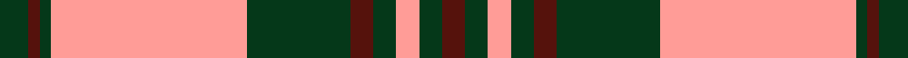

This page is one **sett** — a single exact thread-count. It belongs to the [tartan](/setts/dg5dr2dg2lr34dg18dr4dg4lr4dg4dr4/)
(the same proportion at any scale), whose colour order is pattern [BGYGBGYGBG](/stripes/bgygbgygbg/).

Sourced from tartans-authority.  It is a [10 stripe tartan](/stripes/stripes10/).

Original link http://www.tartansauthority.com/tartan-ferret/display/3747/

## Register references

External register numbers recorded for this tartan.

- Scottish Tartans Authority (ITI): 3747

## Thread count
DG/10 DR4 DG4 LR68 DG36 DR8 DG8 LR8 DG8 DR/8

One full sett is **306 threads**.

## Palette
<table><thead><tr><th>Colour</th><th>Shade</th><th>OKLCh</th></tr></thead><tbody><tr><td>DR</td><td><code style="background-color:#55120C;">#55120C</code> <small style="color:#888">#55120C</small></td><td><small style="color:#888">oklch(30.0% 0.099 29.3)</small></td></tr><tr><td>DG</td><td><code style="background-color:#053819;">#053819</code> <small style="color:#888">#053819</small></td><td><small style="color:#888">oklch(30.0% 0.075 151.3)</small></td></tr><tr><td>LR</td><td><code style="background-color:#FF9C97;">#FF9C97</code> <small style="color:#888">#FF9C97</small></td><td><small style="color:#888">oklch(79.3% 0.119 23.2)</small></td></tr></tbody></table>

# Sample pattern

ID: /variants/s10/dg5dr2dg2lr34dg18dr4dg4lr4dg4dr4~x2/
