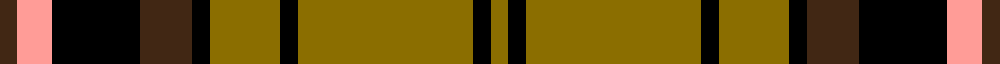

This page is one **sett** — a single exact thread-count. It belongs to the [tartan](/setts/do1lr2k5do3k1y4k1y10k1y1/)
(the same proportion at any scale), whose colour order is pattern [BYKBKGKGKG](/stripes/bykbkgkgkg/).

Sourced from register-of-tartans.  It is a [10 stripe tartan](/stripes/stripes10/).

Original link [https://www.tartanregister.gov.uk/tartanDetails.aspx?ref=5394](https://www.tartanregister.gov.uk/tartanDetails.aspx?ref=5394)

2 attestations — the source records this cloth was collapsed from (oldest owns this page)

<ul>
<li>01/01/1988 — Braemar, Camel (register-of-tartans, <a href="https://www.tartanregister.gov.uk/tartanDetails.aspx?ref=5394">record</a>)  <em>Sold in 1988 at Lady Knowe Mill, Moffat, as 'Braemar, Camel' and sold in 1989 at Spean Bridge Mill outlet as 'Campbell of Braemar'.</em></li>
<li>1988 — Braemar, Camel (Fashion) (tartans-authority, <a href="https://www.tartanregister.gov.uk/tartanDetails.aspx?ref=3726">record</a>)  <em>Sold in 1988 at Lady Knowe Mill, Moffat, as "Braemar, Camel" and sold in 1989 at Spean Bridge Mill outlet as "Campbell of Braemar". Sample in STA Johnston Collection.</em></li>
</ul>

Dataset <small>— provenance for this record, inherited from the source manifest</small>

<dl class="dataset-prov">
<dt>source</dt><dd><a href="/sources/register-of-tartans/">Scottish Register of Tartans</a></dd>
<dt>data captured from</dt><dd><a href="https://github.com/thetartan/tartan-database/blob/master/data/register-of-tartans/data.csv">https://github.com/thetartan/tartan-database/blob/master/data/register-of-tartans/data.csv</a></dd>
<dt>data date</dt><dd>1988 <small>(this record)</small></dd>
<dt>licence</dt><dd><a href="https://www.tartanregister.gov.uk/copyright">Crown copyright</a></dd>
</dl>

Capture chain <small>— the hands this data passed through, oldest first; each capture carries its own licence</small>

<ol class="capture-chain">
<li><a href="https://www.tartanregister.gov.uk/">Scottish Register of Tartans</a> · <a href="https://www.tartanregister.gov.uk/copyright">Crown copyright</a> <small>the living register — still published by National Records of Scotland</small></li>
<li><a href="https://github.com/thetartan/tartan-database">thetartan/tartan-database</a> <small>2016-2017</small> · <a href="https://creativecommons.org/licenses/by-nc-nd/4.0/">CC BY-NC-ND 4.0</a> <small>Levko Kravets's frozen compilation — the capture we vendored, and where its CC licence text came from</small></li>
<li>this dictionary <small>captured 2026-06-10 · commit 5bf86c7566</small> <small>each re-capture is a git commit to data/sources</small></li>
</ol>

## Register references

External register numbers recorded for this tartan.

- Scottish Register of Tartans: [5394](https://www.tartanregister.gov.uk/tartanDetails.aspx?ref=5394)
- Scottish Tartans Authority (ITI): 3726

## Thread count
DO/4 LR8 K20 DO12 K4 Y16 K4 Y40 K4 Y/4

One full sett is **224 threads**.

## Palette
<table><thead><tr><th>Colour</th><th>Shade</th><th>OKLCh</th></tr></thead><tbody><tr><td>K</td><td><code style="background-color:#000000;">#000000</code> <small style="color:#888">#000000</small></td><td><small style="color:#888">oklch(0.0% 0.000 0.0)</small></td></tr><tr><td>Y</td><td><code style="background-color:#8B6E00;">#8B6E00</code> <small style="color:#888">#8B6E00</small></td><td><small style="color:#888">oklch(55.1% 0.113 90.4)</small></td></tr><tr><td>DO</td><td><code style="background-color:#412714;">#412714</code> <small style="color:#888">#412714</small></td><td><small style="color:#888">oklch(30.1% 0.050 55.7)</small></td></tr><tr><td>LR</td><td><code style="background-color:#FF9C97;">#FF9C97</code> <small style="color:#888">#FF9C97</small></td><td><small style="color:#888">oklch(79.3% 0.119 23.2)</small></td></tr></tbody></table>

# Sample pattern

## Nearest tartan variants

The nearest existing variants by ΔTartan distance, with this cloth at the top so the swatches line up against it.

ΔTartan

Threads

Variant

Sett

—

224

<a href="/variants/s10/do1lr2k5do3k1y4k1y10k1y1~x4/">Braemar, Camel</a>

<a href="/ttd/edit/#slug=do1lr2k5do3k1ly4k1ly10k1ly1~x4&amp;base=do1lr2k5do3k1y4k1y10k1y1~x4" title="compare in the TTD">0.18</a>

224

<a href="/variants/s10/do1lr2k5do3k1ly4k1ly10k1ly1~x4/">Campbell 'Camel'</a>

<a href="/ttd/edit/#slug=k4ly15dg5k3dg7k3dg30r20dg3~x2&amp;base=do1lr2k5do3k1y4k1y10k1y1~x4" title="compare in the TTD">1.00</a>

346

<a href="/variants/s9/k4ly15dg5k3dg7k3dg30r20dg3~x2/">MacKillen</a>

<a href="/ttd/edit/#slug=o1w2k5o3k1oi5k1oi11k1oi1~x4~o2102055-oi2104058&amp;base=do1lr2k5do3k1y4k1y10k1y1~x4" title="compare in the TTD">1.63</a>

240

<a href="/variants/s10/o1w2k5o3k1oi5k1oi11k1oi1~x4~o2102055-oi2104058/">Braemar, or Blair Atholl</a>

<a href="/ttd/edit/#slug=k4ly17k2ly2g7k2ly2k22db4~x2&amp;base=do1lr2k5do3k1y4k1y10k1y1~x4" title="compare in the TTD">2.15</a>

232

<a href="/variants/s9/k4ly17k2ly2g7k2ly2k22db4~x2/">Bro-Leon</a>

<a href="/ttd/edit/#slug=db5r19k2g8r3g18k2g9k2~x2&amp;base=do1lr2k5do3k1y4k1y10k1y1~x4" title="compare in the TTD">2.21</a>

258

<a href="/variants/s9/db5r19k2g8r3g18k2g9k2~x2/">Hubbard (2016)</a>

<a href="/ttd/edit/#slug=do2lr2k6do3k2o14k1o1~x4&amp;base=do1lr2k5do3k1y4k1y10k1y1~x4" title="compare in the TTD">2.30</a>

236

<a href="/variants/s8/do2lr2k6do3k2o14k1o1~x4/">Braemar or Blair Atholl</a>

<a href="/ttd/edit/#slug=w3y3r2y13k3y4k22y4k3y16dp2w3~x2&amp;base=do1lr2k5do3k1y4k1y10k1y1~x4" title="compare in the TTD">2.33</a>

300

<a href="/variants/s12/w3y3r2y13k3y4k22y4k3y16dp2w3~x2/">Loch Sween</a>

<a href="/ttd/edit/#slug=r20k2r2k2r2k8g24db2g3~x2&amp;base=do1lr2k5do3k1y4k1y10k1y1~x4" title="compare in the TTD">2.45</a>

214

<a href="/variants/s9/r20k2r2k2r2k8g24db2g3~x2/">Mostyn</a>

<a href="/ttd/edit/#slug=g12dg1g1dg1g1k5r10k1r2~x2&amp;base=do1lr2k5do3k1y4k1y10k1y1~x4" title="compare in the TTD">2.45</a>

108

<a href="/variants/s9/g12dg1g1dg1g1k5r10k1r2~x2/">Lindsay #2</a>

<a href="/ttd/edit/#slug=r5k2dg1k2r5k2dg18ly3~x2&amp;base=do1lr2k5do3k1y4k1y10k1y1~x4" title="compare in the TTD">2.52</a>

136

<a href="/variants/s8/r5k2dg1k2r5k2dg18ly3~x2/">Midpac Tissue (non woven)</a>

## Neighbour map

Every grey dot is one of 13621 variants placed by the first two principal components of the ΔTartan feature space (42% of its variance). Red is this tartan; blue dots are its nearest — click one to open its page.

<svg viewBox="0 0 640 380" role="img" style="max-width:100%;height:auto;border:1px solid #e0e0e0;border-radius:4px;display:block" xmlns="http://www.w3.org/2000/svg"><image href="/nn/cloud.v1.png" width="640" height="380"/><a href="/variants/s10/do1lr2k5do3k1ly4k1ly10k1ly1~x4/"><circle cx="205.4" cy="157.3" r="4" fill="#3465a4"><title>Campbell 'Camel'</title></circle></a><a href="/variants/s9/k4ly15dg5k3dg7k3dg30r20dg3~x2/"><circle cx="212.6" cy="168.5" r="4" fill="#3465a4"><title>MacKillen</title></circle></a><a href="/variants/s10/o1w2k5o3k1oi5k1oi11k1oi1~x4~o2102055-oi2104058/"><circle cx="243.5" cy="149.7" r="4" fill="#3465a4"><title>Braemar, or Blair Atholl</title></circle></a><a href="/variants/s9/k4ly17k2ly2g7k2ly2k22db4~x2/"><circle cx="200.1" cy="152.8" r="4" fill="#3465a4"><title>Bro-Leon</title></circle></a><a href="/variants/s9/db5r19k2g8r3g18k2g9k2~x2/"><circle cx="233.5" cy="180.5" r="4" fill="#3465a4"><title>Hubbard (2016)</title></circle></a><a href="/variants/s8/do2lr2k6do3k2o14k1o1~x4/"><circle cx="231.2" cy="143.8" r="4" fill="#3465a4"><title>Braemar or Blair Atholl</title></circle></a><a href="/variants/s12/w3y3r2y13k3y4k22y4k3y16dp2w3~x2/"><circle cx="204.4" cy="129.3" r="4" fill="#3465a4"><title>Loch Sween</title></circle></a><a href="/variants/s9/r20k2r2k2r2k8g24db2g3~x2/"><circle cx="201.1" cy="144.5" r="4" fill="#3465a4"><title>Mostyn</title></circle></a><a href="/variants/s9/g12dg1g1dg1g1k5r10k1r2~x2/"><circle cx="194.1" cy="149.3" r="4" fill="#3465a4"><title>Lindsay #2</title></circle></a><a href="/variants/s8/r5k2dg1k2r5k2dg18ly3~x2/"><circle cx="250.9" cy="136.3" r="4" fill="#3465a4"><title>Midpac Tissue (non woven)</title></circle></a><circle cx="225.5" cy="160.3" r="5" fill="#c00000"/><text x="320" y="376" text-anchor="middle" font-size="11" fill="#999">ground</text><text x="11" y="190" text-anchor="middle" font-size="11" fill="#999" transform="rotate(-90 11 190)">complexity</text></svg>

ID: /variants/s10/do1lr2k5do3k1y4k1y10k1y1~x4/
