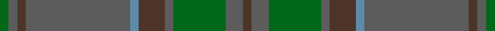

This page is one **sett** — a single exact thread-count. It belongs to the [tartan](/setts/do1n2g6n1do3t1n12do1n1g1/)
(the same proportion at any scale), whose colour order is pattern [BBGBBBBBBG](/stripes/bbgbbbbbbg/).

Part of the [Wicklow, County](/tartans/wicklow-county/) tartan — the named design grouping this sett with its other cloths.

Sourced from tartans-authority.  It is a [10 stripe tartan](/stripes/stripes10/).

Original link http://www.tartansauthority.com/tartan-ferret/display/2265/

## Register references

External register numbers recorded for this tartan.

- Scottish Tartans Authority (ITI): 2265

## Thread count
G/4 N4 T4 N48 B4 T12 N4 G24 N8 T/4

One full sett is **224 threads**.

## Palette

Palette: <strong>Tartan Register</strong> <small style="color:#888">(3 of 4 colours)</small>
<table><thead><tr><th>Colour</th><th>Threads</th><th>Shade</th><th>Base</th><th>OKLCh</th></tr></thead><tbody><tr><td>G/</td><td style="text-align:right;font-variant-numeric:tabular-nums">4</td><td><code style="background-color:#006818;">#006818</code> <small style="color:#888">#006818</small></td><td>G <code style="background-color:#006100;">#006100</code></td><td><small style="color:#888">oklch(45.0% 0.142 145.0)</small></td></tr><tr><td>N</td><td style="text-align:right;font-variant-numeric:tabular-nums">4</td><td><code style="background-color:#5C5C5C;">#5C5C5C</code> <small style="color:#888">#5C5C5C</small></td><td>B <code style="background-color:#2A418A;">#2A418A</code></td><td><small style="color:#888">oklch(47.5% 0.000 89.9)</small></td></tr><tr><td>T</td><td style="text-align:right;font-variant-numeric:tabular-nums">4</td><td><code style="background-color:#4C3428;">#4C3428</code> <small style="color:#888">#4C3428</small></td><td>B <code style="background-color:#2A418A;">#2A418A</code></td><td><small style="color:#888">oklch(34.9% 0.040 47.5)</small></td></tr><tr><td>N</td><td style="text-align:right;font-variant-numeric:tabular-nums">48</td><td><code style="background-color:#5C5C5C;">#5C5C5C</code> <small style="color:#888">#5C5C5C</small></td><td>B <code style="background-color:#2A418A;">#2A418A</code></td><td><small style="color:#888">oklch(47.5% 0.000 89.9)</small></td></tr><tr><td>B</td><td style="text-align:right;font-variant-numeric:tabular-nums">4</td><td><code style="background-color:#5C8CA8;">#5C8CA8</code> <small style="color:#888">#5C8CA8</small></td><td>B <code style="background-color:#2A418A;">#2A418A</code></td><td><small style="color:#888">oklch(61.7% 0.067 235.0)</small></td></tr><tr><td>T</td><td style="text-align:right;font-variant-numeric:tabular-nums">12</td><td><code style="background-color:#4C3428;">#4C3428</code> <small style="color:#888">#4C3428</small></td><td>B <code style="background-color:#2A418A;">#2A418A</code></td><td><small style="color:#888">oklch(34.9% 0.040 47.5)</small></td></tr><tr><td>N</td><td style="text-align:right;font-variant-numeric:tabular-nums">4</td><td><code style="background-color:#5C5C5C;">#5C5C5C</code> <small style="color:#888">#5C5C5C</small></td><td>B <code style="background-color:#2A418A;">#2A418A</code></td><td><small style="color:#888">oklch(47.5% 0.000 89.9)</small></td></tr><tr><td>G</td><td style="text-align:right;font-variant-numeric:tabular-nums">24</td><td><code style="background-color:#006818;">#006818</code> <small style="color:#888">#006818</small></td><td>G <code style="background-color:#006100;">#006100</code></td><td><small style="color:#888">oklch(45.0% 0.142 145.0)</small></td></tr><tr><td>N</td><td style="text-align:right;font-variant-numeric:tabular-nums">8</td><td><code style="background-color:#5C5C5C;">#5C5C5C</code> <small style="color:#888">#5C5C5C</small></td><td>B <code style="background-color:#2A418A;">#2A418A</code></td><td><small style="color:#888">oklch(47.5% 0.000 89.9)</small></td></tr><tr><td>T/</td><td style="text-align:right;font-variant-numeric:tabular-nums">4</td><td><code style="background-color:#4C3428;">#4C3428</code> <small style="color:#888">#4C3428</small></td><td>B <code style="background-color:#2A418A;">#2A418A</code></td><td><small style="color:#888">oklch(34.9% 0.040 47.5)</small></td></tr></tbody></table>

## Compared to the master

This cloth is one sett of its design; the master sett (the exemplar the design is anchored on) is below for comparison.

<figure style="margin:0"><figcaption style="color:#888;font-size:smaller">this sett</figcaption></figure>
<figure style="margin:0"><figcaption style="color:#888;font-size:smaller"><a href="/setts/n1do1n12t1do3n1g6n2do1n2g6n1do3t1n12do1n1g1/">master sett →</a></figcaption></figure>

## Nearest tartans

The nearest existing variants by ΔTartan distance, with this tartan at the top so the swatches line up against it.

ΔTartan

Tartan

Sett

—

<a href="/ttd/edit/#slug=do1n2g6n1do3t1n12do1n1g1~x4">Wicklow, County (District)</a> <a class="nn-out" href="/variants/s10/do1n2g6n1do3t1n12do1n1g1~x4/" title="open its dictionary page">↗</a>

1.22

<a href="/ttd/edit/#slug=n1do1n12t1do3n1g6n2do1n2g6n1do3t1n12do1n1g1~x4&amp;base=do1n2g6n1do3t1n12do1n1g1~x4">Wicklow, County</a> <a class="nn-out" href="/variants/s18/n1do1n12t1do3n1g6n2do1n2g6n1do3t1n12do1n1g1~x4/" title="open its dictionary page">↗</a>

1.29

<a href="/ttd/edit/#slug=dgi4db2dgi17dg2r4dg2dgi3dg11dgi2~x2&amp;base=do1n2g6n1do3t1n12do1n1g1~x4">Conlon</a> <a class="nn-out" href="/variants/s9/dgi4db2dgi17dg2r4dg2dgi3dg11dgi2~x2/" title="open its dictionary page">↗</a>

1.61

<a href="/ttd/edit/#slug=k2y7k1y9dy21o2dy1o1dy2~x2&amp;base=do1n2g6n1do3t1n12do1n1g1~x4">Historic Scotland Corporate Tartan</a> <a class="nn-out" href="/variants/s9/k2y7k1y9dy21o2dy1o1dy2~x2/" title="open its dictionary page">↗</a>

1.79

<a href="/ttd/edit/#slug=y28k2y28k2y2k2dy29k2r2k2~x2&amp;base=do1n2g6n1do3t1n12do1n1g1~x4">Ulster (Peat) (District</a> <a class="nn-out" href="/variants/s10/y28k2y28k2y2k2dy29k2r2k2~x2/" title="open its dictionary page">↗</a>

1.79

<a href="/ttd/edit/#slug=dg5k2dg28k10dy26db4dg4~x2&amp;base=do1n2g6n1do3t1n12do1n1g1~x4">John Telfar Dunbar Hunting</a> <a class="nn-out" href="/variants/s7/dg5k2dg28k10dy26db4dg4~x2/" title="open its dictionary page">↗</a>

1.86

<a href="/ttd/edit/#slug=g6t8o2t2ly2t16g18t4g4t3~x2&amp;base=do1n2g6n1do3t1n12do1n1g1~x4">Blue Ridge</a> <a class="nn-out" href="/variants/s10/g6t8o2t2ly2t16g18t4g4t3~x2/" title="open its dictionary page">↗</a>

1.86

<a href="/ttd/edit/#slug=g6t8o2t2ly2t16g18t4g4t3~x4&amp;base=do1n2g6n1do3t1n12do1n1g1~x4">Blue Ridge (District)</a> <a class="nn-out" href="/variants/s10/g6t8o2t2ly2t16g18t4g4t3~x4/" title="open its dictionary page">↗</a>

1.86

<a href="/ttd/edit/#slug=k3y3r3y28n28lb2n2~x2&amp;base=do1n2g6n1do3t1n12do1n1g1~x4">Isle of Cumbrae (Corporate)</a> <a class="nn-out" href="/variants/s7/k3y3r3y28n28lb2n2~x2/" title="open its dictionary page">↗</a>

1.86

<a href="/ttd/edit/#slug=dg1r1dgi22dy21dg12r11dgi22r1dg1~x2&amp;base=do1n2g6n1do3t1n12do1n1g1~x4">MacNaughton Htg</a> <a class="nn-out" href="/variants/s9/dg1r1dgi22dy21dg12r11dgi22r1dg1~x2/" title="open its dictionary page">↗</a>

1.90

<a href="/variants/s10/dp17dg5dp5dg17dp4dg17ki2k2ki2dg5~x2/">Hueg (Bavaria) Hunting (Personal)</a>

## Neighbour map

Every grey dot is one of 14360 variants placed by the first two principal components of the ΔTartan feature space (44% of its variance). Red is this tartan; blue dots are its nearest — click one to open its page.

<svg viewBox="0 0 640 380" role="img" style="max-width:100%;height:auto;border:1px solid #e0e0e0;border-radius:4px;display:block" xmlns="http://www.w3.org/2000/svg"><image href="/nn/cloud.v1.png" width="640" height="380"/><a href="/variants/s18/n1do1n12t1do3n1g6n2do1n2g6n1do3t1n12do1n1g1~x4/"><circle cx="454.9" cy="224.2" r="4" fill="#3465a4"><title>Wicklow, County</title></circle></a><a href="/variants/s9/dgi4db2dgi17dg2r4dg2dgi3dg11dgi2~x2/"><circle cx="444.6" cy="289.0" r="4" fill="#3465a4"><title>Conlon</title></circle></a><a href="/variants/s9/k2y7k1y9dy21o2dy1o1dy2~x2/"><circle cx="457.2" cy="212.8" r="4" fill="#3465a4"><title>Historic Scotland Corporate Tartan</title></circle></a><a href="/variants/s10/y28k2y28k2y2k2dy29k2r2k2~x2/"><circle cx="480.7" cy="219.8" r="4" fill="#3465a4"><title>Ulster (Peat) (District</title></circle></a><a href="/variants/s7/dg5k2dg28k10dy26db4dg4~x2/"><circle cx="392.5" cy="269.3" r="4" fill="#3465a4"><title>John Telfar Dunbar Hunting</title></circle></a><a href="/variants/s10/g6t8o2t2ly2t16g18t4g4t3~x2/"><circle cx="417.0" cy="273.4" r="4" fill="#3465a4"><title>Blue Ridge</title></circle></a><a href="/variants/s10/g6t8o2t2ly2t16g18t4g4t3~x4/"><circle cx="417.0" cy="273.4" r="4" fill="#3465a4"><title>Blue Ridge (District)</title></circle></a><a href="/variants/s7/k3y3r3y28n28lb2n2~x2/"><circle cx="396.2" cy="221.9" r="4" fill="#3465a4"><title>Isle of Cumbrae (Corporate)</title></circle></a><a href="/variants/s9/dg1r1dgi22dy21dg12r11dgi22r1dg1~x2/"><circle cx="402.1" cy="242.5" r="4" fill="#3465a4"><title>MacNaughton Htg</title></circle></a><a href="/variants/s10/dp17dg5dp5dg17dp4dg17ki2k2ki2dg5~x2/"><circle cx="470.5" cy="299.3" r="4" fill="#3465a4"><title>Hueg (Bavaria) Hunting (Personal)</title></circle></a><circle cx="455.8" cy="245.1" r="5" fill="#c00000"/></svg>

ID: /variants/s10/do1n2g6n1do3t1n12do1n1g1~x4/
