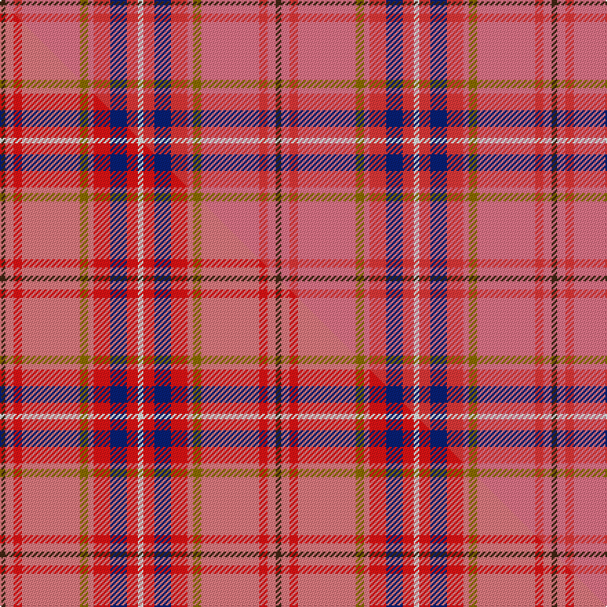

This page is one **sett** — a single exact thread-count. It belongs to the [tartan](/setts/do2ri3r3ri21y3ri2r6db6r4w2/)
(the same proportion at any scale), whose colour order is pattern [BRRRGRRBRW](/stripes/brrrgrrbrw/).

Part of the [Hello Kitty](/tartans/hello-kitty/) tartan — the named design grouping this sett with its other cloths.

Sourced from tartans-authority.  It is a [10 stripe tartan](/stripes/stripes10/).

Original link http://www.tartansauthority.com/tartan-ferret/display/6156/

## Register references

External register numbers recorded for this tartan.

- Scottish Tartans Authority (ITI): 6156

## Thread count
DO/4 Ri6 R6 Ri42 Y6 Ri4 R12 DB12 R8 W/4

One full sett is **200 threads**.

## Palette
<table><thead><tr><th>Colour</th><th>Shade</th><th>OKLCh</th></tr></thead><tbody><tr><td>DB</td><td><code style="background-color:#082077;">#082077</code> <small style="color:#888">#082077</small></td><td><small style="color:#888">oklch(30.0% 0.149 265.1)</small></td></tr><tr><td>DO</td><td><code style="background-color:#412714;">#412714</code> <small style="color:#888">#412714</small></td><td><small style="color:#888">oklch(30.1% 0.050 55.7)</small></td></tr><tr><td>W</td><td><code style="background-color:#F7F7F7;">#F7F7F7</code> <small style="color:#888">#F7F7F7</small></td><td><small style="color:#888">oklch(97.6% 0.000 89.9)</small></td></tr><tr><td>R</td><td><code style="background-color:#F87488;">#F87488</code> <small style="color:#888">#F87488</small></td><td><small style="color:#888">oklch(72.0% 0.162 12.7)</small></td></tr><tr><td>R</td><td><code style="background-color:#F83838;">#F83838</code> <small style="color:#888">#F83838</small></td><td><small style="color:#888">oklch(64.1% 0.227 26.5)</small></td></tr><tr><td>Y</td><td><code style="background-color:#8B6E00;">#8B6E00</code> <small style="color:#888">#8B6E00</small></td><td><small style="color:#888">oklch(55.1% 0.113 90.4)</small></td></tr></tbody></table>

# Sample pattern

## Compared to the master

This cloth is one sett of its design; the master sett (the exemplar the design is anchored on) is below for comparison.

Its **ΔTartan distance** from the master is **0.04** — the same measure the nearest-tartans table ranks by (0 is identical; a re-scale of the same cloth is near 0, a recolour or a different proportion further).

<figure class="master-compare" style="margin:0">

this sett
master sett ★

<figcaption style="color:#888;font-size:smaller">One weave of this sett against the <a href="/setts/do2lr3r3lr21y3lr2r6db6r4w2/">master sett ★</a>, split on the diagonal: a shared proportion runs seamlessly across it with only the shades shifting; a different proportion breaks on it.</figcaption>
</figure>

## Nearest tartan variants

The nearest existing variants by ΔTartan distance, with this cloth at the top so the swatches line up against it.

ΔTartan

Threads

Variant

Sett

—

200

<a href="/variants/s10/do2ri3r3ri21y3ri2r6db6r4w2~x2~ri2906009-r2609025/">Hello Kitty (Corporate)</a>

<a href="/ttd/edit/#slug=do2ri3r3ri21y3ri2r6db6r4w2~x2~ri2906019-r2510029&amp;base=do2ri3r3ri21y3ri2r6db6r4w2~x2~ri2906009-r2609025" title="compare in the TTD">0.06</a>

200

<a href="/variants/s10/do2lr3r3lr21y3lr2r6db6r4w2~x2~lr2906019-r2510029/">Hello Kitty</a>

<a href="/ttd/edit/#slug=r26b2r6n2r2n2o2n9w5dg2w4o2~x2&amp;base=do2ri3r3ri21y3ri2r6db6r4w2~x2~ri2906009-r2609025" title="compare in the TTD">2.31</a>

200

<a href="/variants/s12/r26b2r6n2r2n2o2n9w5dg2w4o2~x2/">Rathmore</a>

<a href="/ttd/edit/#slug=wi10w2ri3y2ri2w2ri2n14r22wi2r6ri2~x2~wi3600000-ri2109032&amp;base=do2ri3r3ri21y3ri2r6db6r4w2~x2~ri2906009-r2609025" title="compare in the TTD">2.72</a>

252

<a href="/variants/s12/wi10w2ri3y2ri2w2ri2n14r22wi2r6ri2~x2~wi3600000-ri2109032/">Shotts &amp; Dykehead (Corporate)</a>

<a href="/ttd/edit/#slug=r26lb2r6n2r2n2ly2n9w5ri2w4ly2~x2~r2109032-ri2406019&amp;base=do2ri3r3ri21y3ri2r6db6r4w2~x2~ri2906009-r2609025" title="compare in the TTD">2.76</a>

200

<a href="/variants/s12/r26lb2r6n2r2n2ly2n9w5ri2w4ly2~x2~r2109032-ri2406019/">Rathmore Family Tartan</a>

<a href="/ttd/edit/#slug=lg8lr2r3lr2dy2lr28r10lb1db3lb2~x2&amp;base=do2ri3r3ri21y3ri2r6db6r4w2~x2~ri2906009-r2609025" title="compare in the TTD">2.97</a>

224

<a href="/variants/s10/lg8lr2r3lr2dy2lr28r10lb1db3lb2~x2/">Confederate Memorial Commemmorative Tartan</a>

<a href="/ttd/edit/#slug=r24y2n3o2w10r4n3o3w2~x2&amp;base=do2ri3r3ri21y3ri2r6db6r4w2~x2~ri2906009-r2609025" title="compare in the TTD">3.02</a>

160

<a href="/variants/s9/r24y2n3o2w10r4n3o3w2~x2/">Manx Laxey, Red</a>

<a href="/ttd/edit/#slug=y6r30n2k3n30g3n2r25w6~x2&amp;base=do2ri3r3ri21y3ri2r6db6r4w2~x2~ri2906009-r2609025" title="compare in the TTD">3.19</a>

404

<a href="/variants/s9/y6r30n2k3n30g3n2r25w6~x2/">Virginia Military Institute, New Market</a>

<a href="/ttd/edit/#slug=r15dp3dy2do2dy3r3y3dy3b3r4b2~x2~dp1607335-dy1103057&amp;base=do2ri3r3ri21y3ri2r6db6r4w2~x2~ri2906009-r2609025" title="compare in the TTD">3.20</a>

138

<a href="/variants/s11/r15dp3dy2do2dy3r3y3dy3b3r4b2~x2~dp1607335-dy1103057/">Unidentified, chair covering</a>

<a href="/ttd/edit/#slug=dy6r30n2k3n30g3n2r25w6~x2&amp;base=do2ri3r3ri21y3ri2r6db6r4w2~x2~ri2906009-r2609025" title="compare in the TTD">3.27</a>

404

<a href="/variants/s9/dy6r30n2k3n30g3n2r25w6~x2/">Virginia Military Institute, New Market</a>

<a href="/ttd/edit/#slug=r3lo15g4db6w2r30db6ly3~x2&amp;base=do2ri3r3ri21y3ri2r6db6r4w2~x2~ri2906009-r2609025" title="compare in the TTD">3.43</a>

264

<a href="/variants/s8/r3lo15g4db6w2r30db6ly3~x2/">Round Table Sweden</a>

## Neighbour map

Every grey dot is one of 13620 variants placed by the first two principal components of the ΔTartan feature space (42% of its variance). Red is this tartan; blue dots are its nearest — click one to open its page.

<svg viewBox="0 0 640 380" role="img" style="max-width:100%;height:auto;border:1px solid #e0e0e0;border-radius:4px;display:block" xmlns="http://www.w3.org/2000/svg"><image href="/nn/cloud.v1.png" width="640" height="380"/><a href="/variants/s10/do2lr3r3lr21y3lr2r6db6r4w2~x2~lr2906019-r2510029/"><circle cx="262.0" cy="148.6" r="4" fill="#3465a4"><title>Hello Kitty</title></circle></a><a href="/variants/s12/r26b2r6n2r2n2o2n9w5dg2w4o2~x2/"><circle cx="277.5" cy="116.0" r="4" fill="#3465a4"><title>Rathmore</title></circle></a><a href="/variants/s12/wi10w2ri3y2ri2w2ri2n14r22wi2r6ri2~x2~wi3600000-ri2109032/"><circle cx="202.6" cy="139.5" r="4" fill="#3465a4"><title>Shotts &amp; Dykehead (Corporate)</title></circle></a><a href="/variants/s12/r26lb2r6n2r2n2ly2n9w5ri2w4ly2~x2~r2109032-ri2406019/"><circle cx="280.6" cy="119.7" r="4" fill="#3465a4"><title>Rathmore Family Tartan</title></circle></a><a href="/variants/s10/lg8lr2r3lr2dy2lr28r10lb1db3lb2~x2/"><circle cx="317.1" cy="104.4" r="4" fill="#3465a4"><title>Confederate Memorial Commemmorative Tartan</title></circle></a><a href="/variants/s9/r24y2n3o2w10r4n3o3w2~x2/"><circle cx="289.7" cy="147.4" r="4" fill="#3465a4"><title>Manx Laxey, Red</title></circle></a><a href="/variants/s9/y6r30n2k3n30g3n2r25w6~x2/"><circle cx="280.8" cy="134.8" r="4" fill="#3465a4"><title>Virginia Military Institute, New Market</title></circle></a><a href="/variants/s11/r15dp3dy2do2dy3r3y3dy3b3r4b2~x2~dp1607335-dy1103057/"><circle cx="264.5" cy="172.2" r="4" fill="#3465a4"><title>Unidentified, chair covering</title></circle></a><a href="/variants/s9/dy6r30n2k3n30g3n2r25w6~x2/"><circle cx="271.8" cy="131.4" r="4" fill="#3465a4"><title>Virginia Military Institute, New Market</title></circle></a><a href="/variants/s8/r3lo15g4db6w2r30db6ly3~x2/"><circle cx="239.5" cy="138.6" r="4" fill="#3465a4"><title>Round Table Sweden</title></circle></a><circle cx="263.0" cy="146.0" r="5" fill="#c00000"/><text x="320" y="376" text-anchor="middle" font-size="11" fill="#999">ground</text><text x="11" y="190" text-anchor="middle" font-size="11" fill="#999" transform="rotate(-90 11 190)">complexity</text></svg>

ID: /variants/s10/do2ri3r3ri21y3ri2r6db6r4w2~x2~ri2906009-r2609025/
