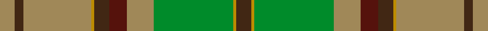

This page is one **sett** — a single exact thread-count. It belongs to the [tartan](/setts/do5lyi1g27ly9dr6do5lyi1ly23do3ly5/)
(the same proportion at any scale), whose colour order is pattern [BYYBBYGYBYGYBBYYBY](/stripes/byybbygybygybbyyby/).

Sourced from register-of-tartans.  It is a [18 stripe tartan](/stripes/stripes18/).

Original link https://www.tartanregister.gov.uk/tartanDetails.aspx?ref=3658

2 attestations — the source records this cloth was collapsed from (oldest owns this page)

<ul>
<li>01/02/2005 — Satisfashion Argyll (register-of-tartans, <a href="https://www.tartanregister.gov.uk/tartanDetails.aspx?ref=3658">record</a>)  <em>A soft and warm tartan for a Belgian clothing company called Argyll that trades with the UK and Scotland in particular, and which wishes to promote Scottish tartan.' Designed by Tommy Gemmell and woven by D C Dalgliesh of Selkirk. Woven sample.</em></li>
<li>2005 Feb. — Satisfashion Argyll (Corporate) (tartans-authority, <a href="http://www.tartansauthority.com/tartan-ferret/display/6516/">record</a>)  <em>"A soft and warm tartan for a Belgian clothing company called Argyll that trades with the UK and Scotland in particular, and which wishes to promote Scottish tartan." Designed by Tommy Gemmell and woven by D C Dalgliesh of Selkirk. Woven sample.</em></li>
</ul>

## Register references

External register numbers recorded for this tartan.

- Scottish Register of Tartans: [3658](https://www.tartanregister.gov.uk/tartanDetails.aspx?ref=3658)
- Scottish Tartans Authority (ITI): 6516

## Thread count
LY/10 DO6 LY46 LYi2 DO10 DR12 LY18 G54 LYi2 DO10 LYi2 G54 LY18 DR12 DO10 LYi2 LY46 DO/6

One full sett is **624 threads**.

## Palette
<table><thead><tr><th>Colour</th><th>Shade</th><th>OKLCh</th></tr></thead><tbody><tr><td>DR</td><td><code style="background-color:#55120C;">#55120C</code> <small style="color:#888">#55120C</small></td><td><small style="color:#888">oklch(30.0% 0.099 29.3)</small></td></tr><tr><td>DO</td><td><code style="background-color:#412714;">#412714</code> <small style="color:#888">#412714</small></td><td><small style="color:#888">oklch(30.1% 0.050 55.7)</small></td></tr><tr><td>LY</td><td><code style="background-color:#BC8C00;">#BC8C00</code> <small style="color:#888">#BC8C00</small></td><td><small style="color:#888">oklch(66.8% 0.137 84.1)</small></td></tr><tr><td>G</td><td><code style="background-color:#008B2A;">#008B2A</code> <small style="color:#888">#008B2A</small></td><td><small style="color:#888">oklch(55.4% 0.170 145.9)</small></td></tr><tr><td>LY</td><td><code style="background-color:#A08858;">#A08858</code> <small style="color:#888">#A08858</small></td><td><small style="color:#888">oklch(63.7% 0.071 84.0)</small></td></tr></tbody></table>

# Sample pattern

## Nearest tartan variants

The nearest existing variants by ΔTartan distance, with this cloth at the top so the swatches line up against it.

ΔTartan

Threads

Variant

Sett

—

624

<a href="/variants/s10/do5lyi1g27ly9dr6do5lyi1ly23do3ly5~x2~lyi2705081-ly2503076/">Satisfashion Argyll</a>

<a href="/ttd/edit/#slug=dgi6g2dr2dgi30lo2g4lo2dg2lo1dg20lo1g2dr4~x2~dgi1806142-g2408144&amp;base=do5lyi1g27ly9dr6do5lyi1ly23do3ly5~x2~lyi2705081-ly2503076" title="compare in the TTD">3.61</a>

292

<a href="/variants/s13/dgi6g2dr2dgi30lo2g4lo2dg2lo1dg20lo1g2dr4~x2~dgi1806142-g2408144/">All Irish Green Irish District Tartan</a>

<a href="/ttd/edit/#slug=y6lb2db2y30g2y2ly2gi4ly2g2ly1g18ly1lb2db2ly4~x2~g2203152-gi2408144&amp;base=do5lyi1g27ly9dr6do5lyi1ly23do3ly5~x2~lyi2705081-ly2503076" title="compare in the TTD">3.70</a>

308

<a href="/variants/s16/y6lb2db2y30g2y2ly2gi4ly2g2ly1g18ly1lb2db2ly4~x2~g2203152-gi2408144/">All Ireland Blue (Fashion)</a>

<a href="/ttd/edit/#slug=lb3dg15n12ly1n1ly1n1ly1n1ly1n1ly1n1ly3lyi3ly15lb3~x2~ly2706114-lyi3104101&amp;base=do5lyi1g27ly9dr6do5lyi1ly23do3ly5~x2~lyi2705081-ly2503076" title="compare in the TTD">3.95</a>

244

<a href="/variants/s17/lb3dg15n12ly1n1ly1n1ly1n1ly1n1ly1n1ly3lyi3ly15lb3~x2~ly2706114-lyi3104101/">Green Thistle</a>

<a href="/ttd/edit/#slug=dg3g1lo2dg3g1lo2dy21dg18dy2dg3dy2dg18dy21g1lo2~x2~dg1806142-g1903114&amp;base=do5lyi1g27ly9dr6do5lyi1ly23do3ly5~x2~lyi2705081-ly2503076" title="compare in the TTD">3.97</a>

390

<a href="/variants/s15/dg3g1lo2dg3g1lo2dy21dg18dy2dg3dy2dg18dy21g1lo2~x2~dg1806142-g1903114/">Prince David</a>

## Neighbour map

Every grey dot is one of 13620 variants placed by the first two principal components of the ΔTartan feature space (42% of its variance). Red is this tartan; blue dots are its nearest — click one to open its page.

<svg viewBox="0 0 640 380" role="img" style="max-width:100%;height:auto;border:1px solid #e0e0e0;border-radius:4px;display:block" xmlns="http://www.w3.org/2000/svg"><image href="/nn/cloud.v1.png" width="640" height="380"/><a href="/variants/s13/dgi6g2dr2dgi30lo2g4lo2dg2lo1dg20lo1g2dr4~x2~dgi1806142-g2408144/"><circle cx="352.1" cy="137.8" r="4" fill="#3465a4"><title>All Irish Green Irish District Tartan</title></circle></a><a href="/variants/s16/y6lb2db2y30g2y2ly2gi4ly2g2ly1g18ly1lb2db2ly4~x2~g2203152-gi2408144/"><circle cx="364.9" cy="121.3" r="4" fill="#3465a4"><title>All Ireland Blue (Fashion)</title></circle></a><a href="/variants/s17/lb3dg15n12ly1n1ly1n1ly1n1ly1n1ly1n1ly3lyi3ly15lb3~x2~ly2706114-lyi3104101/"><circle cx="244.4" cy="149.1" r="4" fill="#3465a4"><title>Green Thistle</title></circle></a><a href="/variants/s15/dg3g1lo2dg3g1lo2dy21dg18dy2dg3dy2dg18dy21g1lo2~x2~dg1806142-g1903114/"><circle cx="402.6" cy="175.5" r="4" fill="#3465a4"><title>Prince David</title></circle></a><circle cx="332.0" cy="157.1" r="5" fill="#c00000"/><text x="320" y="376" text-anchor="middle" font-size="11" fill="#999">ground</text><text x="11" y="190" text-anchor="middle" font-size="11" fill="#999" transform="rotate(-90 11 190)">complexity</text></svg>

ID: /variants/s10/do5lyi1g27ly9dr6do5lyi1ly23do3ly5~x2~lyi2705081-ly2503076/
