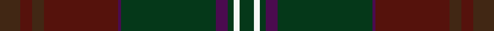

This is one **variant** — a specific cloth: this exact thread count and colourway, with its own
provenance below. It is one weaving of the [sett](/tartans/b/be/bell-john/) (the scale-free proportion — the
same cloth at any scale or shade), whose colour order is pattern [BBBBBGBGWG](/stripes/bbbbbgbgwg/).

Part of the [Bell, John](/tartans/b/be/bell-john/) tartan — the named design grouping this sett with its other cloths.

Sourced from weddslist.  It is a [10 stripe tartan](/stripes/stripes10/).

Original link [http://www.weddslist.com/cgi-bin/tartans/pg.pl?source=sts](http://www.weddslist.com/cgi-bin/tartans/pg.pl?source=sts)

Dataset <small>— provenance for this record, inherited from the source manifest</small>

<dl class="dataset-prov">
<dt>source</dt><dd><a href="/sources/weddslist/">Weddslist</a></dd>
<dt>data captured from</dt><dd><a href="https://github.com/thetartan/tartan-database/blob/master/data/weddslist/data.csv">https://github.com/thetartan/tartan-database/blob/master/data/weddslist/data.csv</a></dd>
<dt>data date</dt><dd>2016-11-17 <small>(dataset default)</small></dd>
<dt>licence</dt><dd><a href="https://creativecommons.org/licenses/by-nc-nd/4.0/">CC BY-NC-ND 4.0</a></dd>
</dl>

Capture chain <small>— the hands this data passed through, oldest first; each capture carries its own licence</small>

<ol class="capture-chain">
<li><a href="https://www.weddslist.com/tartans/">Weddslist</a> <small>the living privately compiled reference</small></li>
<li><a href="https://github.com/thetartan/tartan-database">thetartan/tartan-database</a> <small>2016-2017</small> · <a href="https://creativecommons.org/licenses/by-nc-nd/4.0/">CC BY-NC-ND 4.0</a> <small>Levko Kravets's frozen compilation — the capture we vendored, and where its CC licence text came from</small></li>
<li>this dictionary <small>captured 2026-06-10 · commit 5bf86c7566</small> <small>each re-capture is a git commit to data/sources</small></li>
</ol>

## Thread count
DO/14 DR8 DO8 DR50 DP2 DG64 DP8 DG4 W4 DG/10

One full sett is **320 threads**.

## Palette
<table><thead><tr><th>Colour</th><th>Shade</th><th>OKLCh</th></tr></thead><tbody><tr><td>DR</td><td><code style="background-color:#55120C;">#55120C</code> <small style="color:#888">#55120C</small></td><td><small style="color:#888">oklch(30.0% 0.099 29.3)</small></td></tr><tr><td>DO</td><td><code style="background-color:#412714;">#412714</code> <small style="color:#888">#412714</small></td><td><small style="color:#888">oklch(30.1% 0.050 55.7)</small></td></tr><tr><td>W</td><td><code style="background-color:#F7F7F7;">#F7F7F7</code> <small style="color:#888">#F7F7F7</small></td><td><small style="color:#888">oklch(97.6% 0.000 89.9)</small></td></tr><tr><td>DP</td><td><code style="background-color:#4B0B4F;">#4B0B4F</code> <small style="color:#888">#4B0B4F</small></td><td><small style="color:#888">oklch(30.1% 0.125 325.4)</small></td></tr><tr><td>DG</td><td><code style="background-color:#053819;">#053819</code> <small style="color:#888">#053819</small></td><td><small style="color:#888">oklch(30.0% 0.075 151.3)</small></td></tr></tbody></table>

# Sample pattern

## Nearest tartan variants

The nearest existing variants by ΔTartan distance, with this cloth at the top so the swatches line up against it.

ΔTartan

Threads

Variant

Sett

—

320

<a href="/variants/s10/do7dr4do4dr25dp1dg32dp4dg2w2dg5~x2/">Bell, John</a>

<a href="/ttd/edit/#slug=do6lg3do18dy2do2dy10g28dr2g4~x2~lg7504150-g4808117&amp;base=do7dr4do4dr25dp1dg32dp4dg2w2dg5~x2" title="compare in the TTD">3.70</a>

280

<a href="/variants/s9/do6lg3do18dy2do2dy10g28dr2g4~x2~lg7504150-g4808117/">Scottish Crofting Foundation</a>

<a href="/ttd/edit/#slug=dg3g1lo2dg3g1lo2dy21dg18dy2dg3dy2dg18dy21g1lo2~x2&amp;base=do7dr4do4dr25dp1dg32dp4dg2w2dg5~x2" title="compare in the TTD">3.80</a>

390

<a href="/variants/s15/dg3g1lo2dg3g1lo2dy21dg18dy2dg3dy2dg18dy21g1lo2~x2/">Prince David Royal Family Tartan</a>

## Neighbour map

Every grey dot is one of 13662 variants placed by the first two principal components of the ΔTartan feature space (42% of its variance). Red is this tartan; blue dots are its nearest — click one to open its page. The map is a flat projection of a many-dimensional space — [how to read it](/posts/neighbourhood-maps/).

<svg viewBox="0 0 640 380" role="img" style="max-width:100%;height:auto;border:1px solid #e0e0e0;border-radius:4px;display:block" xmlns="http://www.w3.org/2000/svg"><image href="/nn/cloud.v1.png" width="640" height="380"/><a href="/variants/s9/do6lg3do18dy2do2dy10g28dr2g4~x2~lg7504150-g4808117/"><circle cx="396.3" cy="225.2" r="4" fill="#3465a4"><title>Scottish Crofting Foundation</title></circle></a><a href="/variants/s15/dg3g1lo2dg3g1lo2dy21dg18dy2dg3dy2dg18dy21g1lo2~x2/"><circle cx="454.1" cy="195.0" r="4" fill="#3465a4"><title>Prince David Royal Family Tartan</title></circle></a><circle cx="448.9" cy="183.9" r="5" fill="#c00000"/><text x="320" y="376" text-anchor="middle" font-size="11" fill="#999">ground</text><text x="11" y="190" text-anchor="middle" font-size="11" fill="#999" transform="rotate(-90 11 190)">complexity</text></svg>

ID: /variants/s10/do7dr4do4dr25dp1dg32dp4dg2w2dg5~x2/
