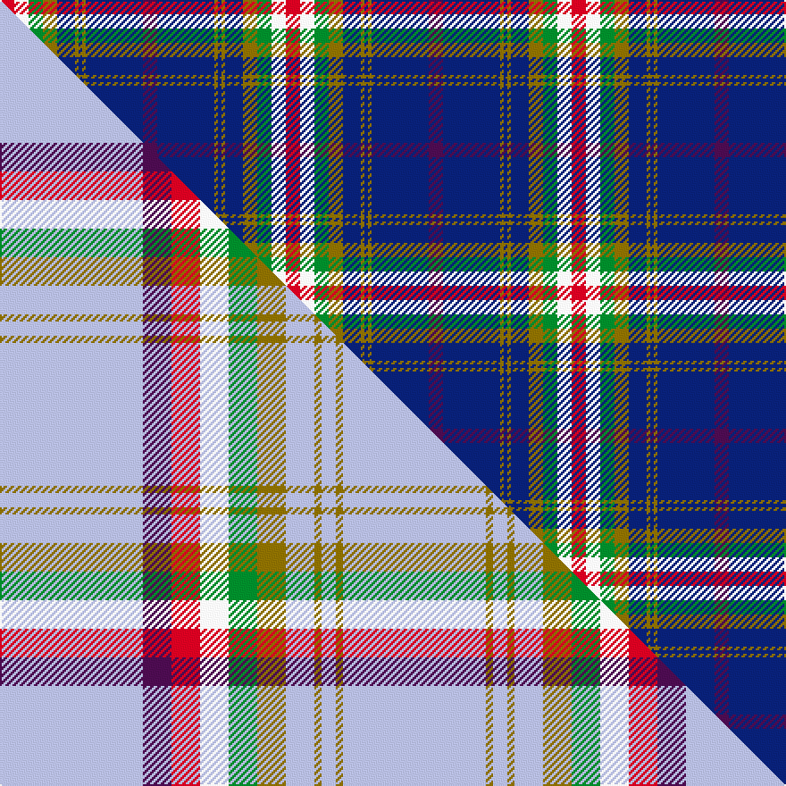

This is one **variant** — a specific cloth: this exact thread count and colourway, with its own
provenance below. It is one weaving of the [sett](/setts/dp4db16y1db1y1db5y4g4w4r4/) (the scale-free proportion — the
same cloth at any scale or shade), whose colour order is pattern [BBGBGBGGWR](/stripes/bbgbgbggwr/).

Part of the [Yukon](/tartans/y/yu/yukon/) tartan — the named design grouping this sett with its other cloths.

Sourced from house-of-tartan.  It is a [10 stripe tartan](/stripes/stripes10/).

Original link [http://www.house-of-tartan.scotland.net/house/TartanViewjs.asp?colr=Def&tnam=1906](http://www.house-of-tartan.scotland.net/house/TartanViewjs.asp?colr=Def&tnam=1906)

## Provenance

Earliest known date: 1984 Nothing

3 attestations — the source records this cloth was collapsed from (oldest owns this page)

<ul>
<li>1984 — Yukon #1906 District Tartan (house-of-tartan, <a href="http://www.house-of-tartan.scotland.net/house/TartanViewjs.asp?colr=Def&tnam=1906">record</a>) </li>
<li>pre 2003 — Yukon #2147 District Tartan (house-of-tartan, <a href="http://www.house-of-tartan.scotland.net/house/TartanViewjs.asp?colr=Def&tnam=2147">record</a>) </li>
<li>undated — Yukon (weddslist, <a href="http://www.weddslist.com/cgi-bin/tartans/pg.pl?source=sts">record</a>) </li>
</ul>

Dataset <small>— provenance for this record, inherited from the source manifest</small>

<dl class="dataset-prov">
<dt>source</dt><dd><a href="/sources/house-of-tartan/">House of Tartan</a></dd>
<dt>data captured from</dt><dd><a href="https://github.com/thetartan/tartan-database/blob/master/data/house-of-tartan/data.csv">https://github.com/thetartan/tartan-database/blob/master/data/house-of-tartan/data.csv</a></dd>
<dt>data date</dt><dd>1984 <small>(this record)</small></dd>
<dt>licence</dt><dd><a href="https://creativecommons.org/licenses/by-nc-nd/4.0/">CC BY-NC-ND 4.0</a></dd>
</dl>

Capture chain <small>— the hands this data passed through, oldest first; each capture carries its own licence</small>

<ol class="capture-chain">
<li><a href="http://www.house-of-tartan.scotland.net/">House of Tartan</a> <small>the weaver/retailer's database — the site is now offline; the URL is kept as the ultimate source's identity</small></li>
<li><a href="https://github.com/thetartan/tartan-database">thetartan/tartan-database</a> <small>2016-2017</small> · <a href="https://creativecommons.org/licenses/by-nc-nd/4.0/">CC BY-NC-ND 4.0</a> <small>Levko Kravets's frozen compilation — the capture we vendored, and where its CC licence text came from</small></li>
<li>this dictionary <small>captured 2026-06-10 · commit 5bf86c7566</small> <small>each re-capture is a git commit to data/sources</small></li>
</ol>

## Thread count
R/8 W8 G8 Y8 DB10 Y2 DB2 Y2 DB32 DP/8

One full sett is **160 threads**.

## Palette
<table><thead><tr><th>Colour</th><th>Shade</th><th>OKLCh</th></tr></thead><tbody><tr><td>DB</td><td><code style="background-color:#082077;">#082077</code> <small style="color:#888">#082077</small></td><td><small style="color:#888">oklch(30.0% 0.149 265.1)</small></td></tr><tr><td>G</td><td><code style="background-color:#008B2A;">#008B2A</code> <small style="color:#888">#008B2A</small></td><td><small style="color:#888">oklch(55.4% 0.170 145.9)</small></td></tr><tr><td>W</td><td><code style="background-color:#F7F7F7;">#F7F7F7</code> <small style="color:#888">#F7F7F7</small></td><td><small style="color:#888">oklch(97.6% 0.000 89.9)</small></td></tr><tr><td>DP</td><td><code style="background-color:#4B0B4F;">#4B0B4F</code> <small style="color:#888">#4B0B4F</small></td><td><small style="color:#888">oklch(30.1% 0.125 325.4)</small></td></tr><tr><td>R</td><td><code style="background-color:#D60020;">#D60020</code> <small style="color:#888">#D60020</small></td><td><small style="color:#888">oklch(55.2% 0.224 25.5)</small></td></tr><tr><td>Y</td><td><code style="background-color:#8B6E00;">#8B6E00</code> <small style="color:#888">#8B6E00</small></td><td><small style="color:#888">oklch(55.1% 0.113 90.4)</small></td></tr></tbody></table>

# Sample pattern

## Compared to the master

This cloth is one sett of its design; the master sett (the exemplar the design is anchored on) is below for comparison.

Its **ΔTartan distance** from the master is **1.17** — the same measure the nearest-tartans table ranks by (0 is identical; a re-scale of the same cloth is near 0, a recolour or a different proportion further).

<figure class="master-compare" style="margin:0">

this sett
master sett ★

<figcaption style="color:#888;font-size:smaller">One weave of this sett against the <a href="/setts/lb20dp4r4w4g4y4lb4y1lb2y1lb20/">master sett ★</a>, split on the diagonal: a shared proportion runs seamlessly across it with only the shades shifting; a different proportion breaks on it.</figcaption>
</figure>

## Nearest tartan variants

The nearest existing variants by ΔTartan distance, with this cloth at the top so the swatches line up against it.

ΔTartan

Threads

Variant

Sett

—

160

<a href="/variants/s10/dp4db16y1db1y1db5y4g4w4r4~x2/">Yukon #1906 District Tartan</a>

<a href="/ttd/edit/#slug=dp4db20y1db2y1db4y4g4w4r4~x2&amp;base=dp4db16y1db1y1db5y4g4w4r4~x2" title="compare in the TTD">0.17</a>

176

<a href="/variants/s10/dp4db20y1db2y1db4y4g4w4r4~x2/">Yukon District Tartan</a>

<a href="/ttd/edit/#slug=db45r4n20w3ly9dr4ly3dr9n11~x2&amp;base=dp4db16y1db1y1db5y4g4w4r4~x2" title="compare in the TTD">2.09</a>

320

<a href="/variants/s9/db45r4n20w3ly9dr4ly3dr9n11~x2/">United Arrows House Check</a>

<a href="/ttd/edit/#slug=db16w6r8db3y1g1b3db1g9~x2&amp;base=dp4db16y1db1y1db5y4g4w4r4~x2" title="compare in the TTD">2.26</a>

142

<a href="/variants/s9/db16w6r8db3y1g1b3db1g9~x2/">Ohio</a>

<a href="/ttd/edit/#slug=db6y2db22g7r2w11g11db3~x2&amp;base=dp4db16y1db1y1db5y4g4w4r4~x2" title="compare in the TTD">2.31</a>

238

<a href="/variants/s8/db6y2db22g7r2w11g11db3~x2/">Bahamas District Tartan</a>

<a href="/ttd/edit/#slug=dr5r2db24lb2db2lb2db6lb8dr6lb8ly4~x2&amp;base=dp4db16y1db1y1db5y4g4w4r4~x2" title="compare in the TTD">2.47</a>

258

<a href="/variants/s11/dr5r2db24lb2db2lb2db6lb8dr6lb8ly4~x2/">Tasmania (District)</a>

<a href="/ttd/edit/#slug=lb5y5db12g1db1r1db1w2~x4&amp;base=dp4db16y1db1y1db5y4g4w4r4~x2" title="compare in the TTD">2.48</a>

196

<a href="/variants/s8/lb5y5db12g1db1r1db1w2~x4/">Hodgkinson</a>

<a href="/ttd/edit/#slug=lb5y5db12g1db1r1db1w2~x2&amp;base=dp4db16y1db1y1db5y4g4w4r4~x2" title="compare in the TTD">2.48</a>

98

<a href="/variants/s8/lb5y5db12g1db1r1db1w2~x2/">Yorkshire C.C.C. Corporate Tartan</a>

<a href="/ttd/edit/#slug=db16w6r8db3y1g1lb3db1g9~x2&amp;base=dp4db16y1db1y1db5y4g4w4r4~x2" title="compare in the TTD">2.49</a>

142

<a href="/variants/s9/db16w6r8db3y1g1lb3db1g9~x2/">Ohio District Tartan</a>

<a href="/ttd/edit/#slug=y2g20db8r3db2r2db16w1lb2~x2&amp;base=dp4db16y1db1y1db5y4g4w4r4~x2" title="compare in the TTD">2.50</a>

216

<a href="/variants/s9/y2g20db8r3db2r2db16w1lb2~x2/">Scotland’s Golf Coast</a>

<a href="/ttd/edit/#slug=dbi30w2r3w2db14lr3g14dbi18r2dbi3~x2~dbi1605267-db0906265&amp;base=dp4db16y1db1y1db5y4g4w4r4~x2" title="compare in the TTD">2.58</a>

298

<a href="/variants/s10/dbi30w2r3w2db14lr3g14dbi18r2dbi3~x2~dbi1605267-db0906265/">Kansai St Andrews Society</a>

## Neighbour map

Every grey dot is one of 13621 variants placed by the first two principal components of the ΔTartan feature space (42% of its variance). Red is this tartan; blue dots are its nearest — click one to open its page. The map is a flat projection of a many-dimensional space — [how to read it](/posts/neighbourhood-maps/).

<svg viewBox="0 0 640 380" role="img" style="max-width:100%;height:auto;border:1px solid #e0e0e0;border-radius:4px;display:block" xmlns="http://www.w3.org/2000/svg"><image href="/nn/cloud.v1.png" width="640" height="380"/><a href="/variants/s10/dp4db20y1db2y1db4y4g4w4r4~x2/"><circle cx="256.9" cy="119.8" r="4" fill="#3465a4"><title>Yukon District Tartan</title></circle></a><a href="/variants/s9/db45r4n20w3ly9dr4ly3dr9n11~x2/"><circle cx="210.6" cy="144.3" r="4" fill="#3465a4"><title>United Arrows House Check</title></circle></a><a href="/variants/s9/db16w6r8db3y1g1b3db1g9~x2/"><circle cx="166.0" cy="146.8" r="4" fill="#3465a4"><title>Ohio</title></circle></a><a href="/variants/s8/db6y2db22g7r2w11g11db3~x2/"><circle cx="203.0" cy="185.7" r="4" fill="#3465a4"><title>Bahamas District Tartan</title></circle></a><a href="/variants/s11/dr5r2db24lb2db2lb2db6lb8dr6lb8ly4~x2/"><circle cx="214.8" cy="156.3" r="4" fill="#3465a4"><title>Tasmania (District)</title></circle></a><a href="/variants/s8/lb5y5db12g1db1r1db1w2~x4/"><circle cx="215.3" cy="150.2" r="4" fill="#3465a4"><title>Hodgkinson</title></circle></a><a href="/variants/s8/lb5y5db12g1db1r1db1w2~x2/"><circle cx="215.3" cy="150.2" r="4" fill="#3465a4"><title>Yorkshire C.C.C. Corporate Tartan</title></circle></a><a href="/variants/s9/db16w6r8db3y1g1lb3db1g9~x2/"><circle cx="162.8" cy="145.7" r="4" fill="#3465a4"><title>Ohio District Tartan</title></circle></a><a href="/variants/s9/y2g20db8r3db2r2db16w1lb2~x2/"><circle cx="245.6" cy="133.3" r="4" fill="#3465a4"><title>Scotland’s Golf Coast</title></circle></a><a href="/variants/s10/dbi30w2r3w2db14lr3g14dbi18r2dbi3~x2~dbi1605267-db0906265/"><circle cx="280.8" cy="145.4" r="4" fill="#3465a4"><title>Kansai St Andrews Society</title></circle></a><circle cx="215.1" cy="138.9" r="5" fill="#c00000"/><text x="320" y="376" text-anchor="middle" font-size="11" fill="#999">ground</text><text x="11" y="190" text-anchor="middle" font-size="11" fill="#999" transform="rotate(-90 11 190)">complexity</text></svg>

ID: /variants/s10/dp4db16y1db1y1db5y4g4w4r4~x2/
