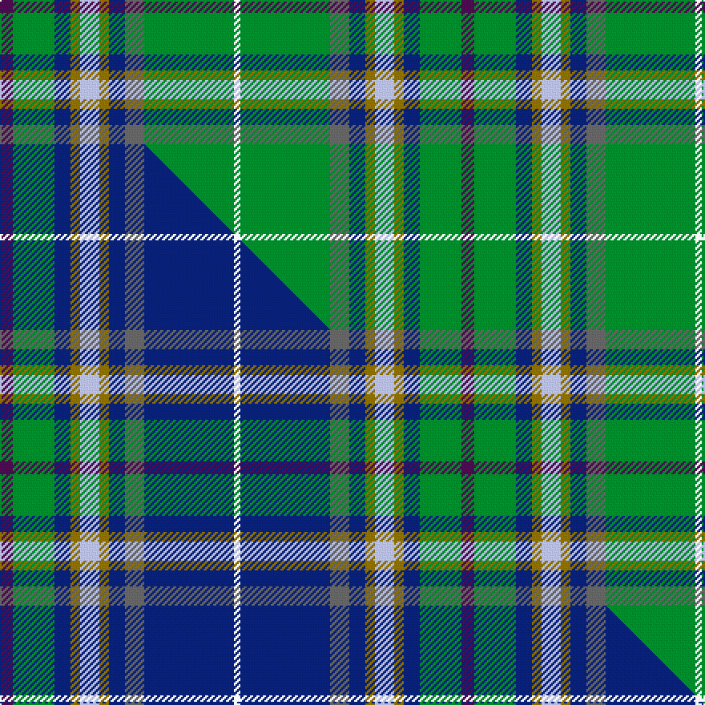

This is one **variant** — a specific cloth: this exact thread count and colourway, with its own
provenance below. It is one weaving of the [sett](/setts/dp4g13db5y3lb6y3db5n6g28w2/) (the scale-free proportion — the
same cloth at any scale or shade), whose colour order is pattern [BGBGWGBBGW](/stripes/bgbgwgbbgw/).

Part of the [Highland](/tartans/h/hi/highland-2/) tartan — the named design grouping this sett with its other cloths.

Sourced from tartans-authority.  It is a [10 stripe tartan](/stripes/stripes10/).

Original link [https://www.tartanregister.gov.uk/tartanDetails.aspx?ref=5187](https://www.tartanregister.gov.uk/tartanDetails.aspx?ref=5187)

Dataset <small>— provenance for this record, inherited from the source manifest</small>

<dl class="dataset-prov">
<dt>source</dt><dd><a href="/sources/tartans-authority/">Scottish Tartans Authority</a></dd>
<dt>data captured from</dt><dd><a href="https://github.com/thetartan/tartan-database/blob/master/data/tartans-authority/data.csv">https://github.com/thetartan/tartan-database/blob/master/data/tartans-authority/data.csv</a></dd>
<dt>data date</dt><dd>1993 <small>(this record)</small></dd>
<dt>licence</dt><dd><a href="https://creativecommons.org/licenses/by-nc-nd/4.0/">CC BY-NC-ND 4.0</a></dd>
</dl>

Capture chain <small>— the hands this data passed through, oldest first; each capture carries its own licence</small>

<ol class="capture-chain">
<li><a href="https://www.tartansauthority.com/">Scottish Tartans Authority</a> <small>the heritage body's archive — its tartan-ferret record browser is retired (links repaired to the SRT, above)</small></li>
<li><a href="https://github.com/thetartan/tartan-database">thetartan/tartan-database</a> <small>2016-2017</small> · <a href="https://creativecommons.org/licenses/by-nc-nd/4.0/">CC BY-NC-ND 4.0</a> <small>Levko Kravets's frozen compilation — the capture we vendored, and where its CC licence text came from</small></li>
<li>this dictionary <small>captured 2026-06-10 · commit 5bf86c7566</small> <small>each re-capture is a git commit to data/sources</small></li>
</ol>

## Register references

External register numbers recorded for this tartan.

- Scottish Tartans Authority (ITI): 5187

## Thread count
DP/8 G26 DB10 Y6 LB12 Y6 DB10 N12 G56 W/4

One full sett is **288 threads**.

## Palette
<table><thead><tr><th>Colour</th><th>Shade</th><th>OKLCh</th></tr></thead><tbody><tr><td>LB</td><td><code style="background-color:#B5BBDE;">#B5BBDE</code> <small style="color:#888">#B5BBDE</small></td><td><small style="color:#888">oklch(79.9% 0.050 277.6)</small></td></tr><tr><td>DB</td><td><code style="background-color:#082077;">#082077</code> <small style="color:#888">#082077</small></td><td><small style="color:#888">oklch(30.0% 0.149 265.1)</small></td></tr><tr><td>G</td><td><code style="background-color:#008B2A;">#008B2A</code> <small style="color:#888">#008B2A</small></td><td><small style="color:#888">oklch(55.4% 0.170 145.9)</small></td></tr><tr><td>N</td><td><code style="background-color:#636363;">#636363</code> <small style="color:#888">#636363</small></td><td><small style="color:#888">oklch(50.0% 0.000 89.9)</small></td></tr><tr><td>DP</td><td><code style="background-color:#4B0B4F;">#4B0B4F</code> <small style="color:#888">#4B0B4F</small></td><td><small style="color:#888">oklch(30.1% 0.125 325.4)</small></td></tr><tr><td>W</td><td><code style="background-color:#F7F7F7;">#F7F7F7</code> <small style="color:#888">#F7F7F7</small></td><td><small style="color:#888">oklch(97.6% 0.000 89.9)</small></td></tr><tr><td>Y</td><td><code style="background-color:#8B6E00;">#8B6E00</code> <small style="color:#888">#8B6E00</small></td><td><small style="color:#888">oklch(55.1% 0.113 90.4)</small></td></tr></tbody></table>

# Sample pattern

## Compared to the master

This cloth is one sett of its design; the master sett (the exemplar the design is anchored on) is below for comparison.

Its **ΔTartan distance** from the master is **1.20** — the same measure the nearest-tartans table ranks by (0 is identical; a re-scale of the same cloth is near 0, a recolour or a different proportion further).

<figure class="master-compare" style="margin:0">

this sett
master sett ★

<figcaption style="color:#888;font-size:smaller">One weave of this sett against the <a href="/setts/dp4g13db5y3lb6y3db5n6db28w2/">master sett ★</a>, split on the diagonal: a shared proportion runs seamlessly across it with only the shades shifting; a different proportion breaks on it.</figcaption>
</figure>

## Nearest tartan variants

The nearest existing variants by ΔTartan distance, with this cloth at the top so the swatches line up against it.

ΔTartan

Threads

Variant

Sett

—

288

<a href="/variants/s10/dp4g13db5y3lb6y3db5n6g28w2~x2/">Highland, Green (Corporate)</a>

<a href="/ttd/edit/#slug=dp4g13db5y3lb6y3db5n6db28w2~x2&amp;base=dp4g13db5y3lb6y3db5n6g28w2~x2" title="compare in the TTD">1.20</a>

288

<a href="/variants/s10/dp4g13db5y3lb6y3db5n6db28w2~x2/">Highland, Blue (Corporate)</a>

<a href="/ttd/edit/#slug=w1db16ly1r3ly1dg6g2dg6w1~x2~dg1806142-g2408144&amp;base=dp4g13db5y3lb6y3db5n6g28w2~x2" title="compare in the TTD">2.35</a>

144

<a href="/variants/s9/w1db16ly1r3ly1dg6g2dg6w1~x2~dg1806142-g2408144/">Kleto, Susan (Personal)</a>

<a href="/ttd/edit/#slug=g13db5y3lb6y3db5n6g28w2g28n6db5y3lb6y3db5g13dp4~x2&amp;base=dp4g13db5y3lb6y3db5n6g28w2~x2" title="compare in the TTD">2.75</a>

542

<a href="/variants/s18/g13db5y3lb6y3db5n6g28w2g28n6db5y3lb6y3db5g13dp4~x2/">Highland Green</a>

<a href="/ttd/edit/#slug=db2dr1db10w1dy4g8ly1g2~x4&amp;base=dp4g13db5y3lb6y3db5n6g28w2~x2" title="compare in the TTD">2.90</a>

216

<a href="/variants/s8/db2dr1db10w1dy4g8ly1g2~x4/">Ayrshire (District)</a>

<a href="/ttd/edit/#slug=dr4db15w2n15g30dr2g4~x2&amp;base=dp4g13db5y3lb6y3db5n6g28w2~x2" title="compare in the TTD">3.16</a>

272

<a href="/variants/s7/dr4db15w2n15g30dr2g4~x2/">Sinclair Green (Personal)</a>

<a href="/ttd/edit/#slug=lb2g3lb2g12y5g12w1dg16y3w3g3dg2dp2w1~x2&amp;base=dp4g13db5y3lb6y3db5n6g28w2~x2" title="compare in the TTD">3.33</a>

262

<a href="/variants/s14/lb2g3lb2g12y5g12w1dg16y3w3g3dg2dp2w1~x2/">Malone, Keagan Allen (Personal)</a>

<a href="/ttd/edit/#slug=n18y1n2y1n2db6w4dy1g6~x2&amp;base=dp4g13db5y3lb6y3db5n6g28w2~x2" title="compare in the TTD">3.46</a>

116

<a href="/variants/s9/n18y1n2y1n2db6w4dy1g6~x2/">Nickel Lodge Centennial Corporate Tartan</a>

<a href="/ttd/edit/#slug=g55dbi7dr24g12db4dy3db4~x2~dbi1406275-db1404245&amp;base=dp4g13db5y3lb6y3db5n6g28w2~x2" title="compare in the TTD">3.49</a>

318

<a href="/variants/s7/g55dbi7dr24g12db4dy3db4~x2~dbi1406275-db1404245/">Crieff &amp; Strathearn #1</a>

<a href="/ttd/edit/#slug=g10r3g30n10w2db15r4~x2&amp;base=dp4g13db5y3lb6y3db5n6g28w2~x2" title="compare in the TTD">3.50</a>

268

<a href="/variants/s7/g10r3g30n10w2db15r4~x2/">Sinclair</a>

<a href="/ttd/edit/#slug=w2g5lb10g20ri1dy2r2dy1~x2~ri2109032-r1807033&amp;base=dp4g13db5y3lb6y3db5n6g28w2~x2" title="compare in the TTD">3.51</a>

166

<a href="/variants/s8/w2g5lb10g20ri1dy2r2dy1~x2~ri2109032-r1807033/">Muskoka (District)</a>

## Neighbour map

Every grey dot is one of 13621 variants placed by the first two principal components of the ΔTartan feature space (42% of its variance). Red is this tartan; blue dots are its nearest — click one to open its page. The map is a flat projection of a many-dimensional space — [how to read it](/posts/neighbourhood-maps/).

<svg viewBox="0 0 640 380" role="img" style="max-width:100%;height:auto;border:1px solid #e0e0e0;border-radius:4px;display:block" xmlns="http://www.w3.org/2000/svg"><image href="/nn/cloud.v1.png" width="640" height="380"/><a href="/variants/s10/dp4g13db5y3lb6y3db5n6db28w2~x2/"><circle cx="237.0" cy="148.4" r="4" fill="#3465a4"><title>Highland, Blue (Corporate)</title></circle></a><a href="/variants/s9/w1db16ly1r3ly1dg6g2dg6w1~x2~dg1806142-g2408144/"><circle cx="213.8" cy="138.7" r="4" fill="#3465a4"><title>Kleto, Susan (Personal)</title></circle></a><a href="/variants/s18/g13db5y3lb6y3db5n6g28w2g28n6db5y3lb6y3db5g13dp4~x2/"><circle cx="285.6" cy="142.7" r="4" fill="#3465a4"><title>Highland Green</title></circle></a><a href="/variants/s8/db2dr1db10w1dy4g8ly1g2~x4/"><circle cx="209.6" cy="191.3" r="4" fill="#3465a4"><title>Ayrshire (District)</title></circle></a><a href="/variants/s7/dr4db15w2n15g30dr2g4~x2/"><circle cx="294.0" cy="204.5" r="4" fill="#3465a4"><title>Sinclair Green (Personal)</title></circle></a><a href="/variants/s14/lb2g3lb2g12y5g12w1dg16y3w3g3dg2dp2w1~x2/"><circle cx="228.0" cy="153.1" r="4" fill="#3465a4"><title>Malone, Keagan Allen (Personal)</title></circle></a><a href="/variants/s9/n18y1n2y1n2db6w4dy1g6~x2/"><circle cx="310.8" cy="153.0" r="4" fill="#3465a4"><title>Nickel Lodge Centennial Corporate Tartan</title></circle></a><a href="/variants/s7/g55dbi7dr24g12db4dy3db4~x2~dbi1406275-db1404245/"><circle cx="404.5" cy="183.7" r="4" fill="#3465a4"><title>Crieff &amp; Strathearn #1</title></circle></a><a href="/variants/s7/g10r3g30n10w2db15r4~x2/"><circle cx="289.7" cy="189.5" r="4" fill="#3465a4"><title>Sinclair</title></circle></a><a href="/variants/s8/w2g5lb10g20ri1dy2r2dy1~x2~ri2109032-r1807033/"><circle cx="316.1" cy="137.1" r="4" fill="#3465a4"><title>Muskoka (District)</title></circle></a><circle cx="276.2" cy="159.7" r="5" fill="#c00000"/><text x="320" y="376" text-anchor="middle" font-size="11" fill="#999">ground</text><text x="11" y="190" text-anchor="middle" font-size="11" fill="#999" transform="rotate(-90 11 190)">complexity</text></svg>

ID: /variants/s10/dp4g13db5y3lb6y3db5n6g28w2~x2/
