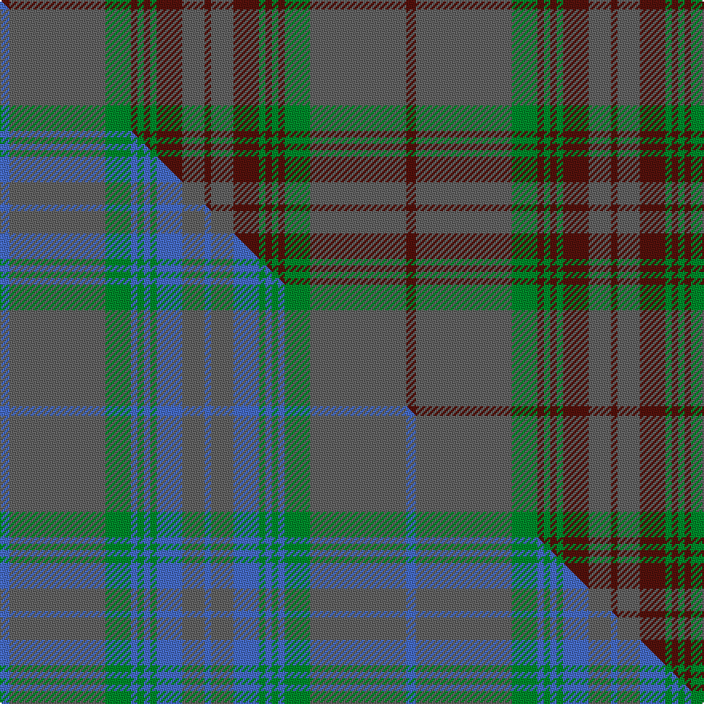

This is one **variant** — a specific cloth: this exact thread count and colourway, with its own
provenance below. It is one weaving of the [sett](/tartans/g/gr/gray-2/) (the scale-free proportion — the
same cloth at any scale or shade), whose colour order is pattern [BBBGBGBGBB](/stripes/bbbgbgbgbb/).

Part of the [Gray](/tartans/g/gr/gray-2/) tartan — the named design grouping this sett with its other cloths.

Sourced from house-of-tartan.  It is a [10 stripe tartan](/stripes/stripes10/).

Original link [http://www.house-of-tartan.scotland.net/house/TartanViewjs.asp?colr=Def&tnam=2130](http://www.house-of-tartan.scotland.net/house/TartanViewjs.asp?colr=Def&tnam=2130)

## Provenance

Earliest known date: 1986 From a sample woven by Peter Anderson Ltd, Galashiels. The Gray family can be Septs of either Clan Stewart or Clan Sutherland. A rebel son of the Stewarts changed his name to MacGlashan (anglicised to Gray). In the north the Grays of Sutherland possessed lands at Skibo, Sordell and Ardinish.

Dataset <small>— provenance for this record, inherited from the source manifest</small>

<dl class="dataset-prov">
<dt>source</dt><dd><a href="/sources/house-of-tartan/">House of Tartan</a></dd>
<dt>data captured from</dt><dd><a href="https://github.com/thetartan/tartan-database/blob/master/data/house-of-tartan/data.csv">https://github.com/thetartan/tartan-database/blob/master/data/house-of-tartan/data.csv</a></dd>
<dt>data date</dt><dd>1986 <small>(this record)</small></dd>
<dt>licence</dt><dd><a href="https://creativecommons.org/licenses/by-nc-nd/4.0/">CC BY-NC-ND 4.0</a></dd>
</dl>

Capture chain <small>— the hands this data passed through, oldest first; each capture carries its own licence</small>

<ol class="capture-chain">
<li><a href="http://www.house-of-tartan.scotland.net/">House of Tartan</a> <small>the weaver/retailer's database — the site is now offline; the URL is kept as the ultimate source's identity</small></li>
<li><a href="https://github.com/thetartan/tartan-database">thetartan/tartan-database</a> <small>2016-2017</small> · <a href="https://creativecommons.org/licenses/by-nc-nd/4.0/">CC BY-NC-ND 4.0</a> <small>Levko Kravets's frozen compilation — the capture we vendored, and where its CC licence text came from</small></li>
<li>this dictionary <small>captured 2026-06-10 · commit 5bf86c7566</small> <small>each re-capture is a git commit to data/sources</small></li>
</ol>

## Thread count
DR/6 N60 G16 DR4 G4 DR4 G4 DR16 N14 DR/4

One full sett is **254 threads**.

## Palette
<table><thead><tr><th>Colour</th><th>Shade</th><th>OKLCh</th></tr></thead><tbody><tr><td>DR</td><td><code style="background-color:#55120C;">#55120C</code> <small style="color:#888">#55120C</small></td><td><small style="color:#888">oklch(30.0% 0.099 29.3)</small></td></tr><tr><td>G</td><td><code style="background-color:#008B2A;">#008B2A</code> <small style="color:#888">#008B2A</small></td><td><small style="color:#888">oklch(55.4% 0.170 145.9)</small></td></tr><tr><td>N</td><td><code style="background-color:#636363;">#636363</code> <small style="color:#888">#636363</small></td><td><small style="color:#888">oklch(50.0% 0.000 89.9)</small></td></tr></tbody></table>

# Sample pattern

## Compared to the master

This cloth is one sett of its design; the master sett (the exemplar the design is anchored on) is below for comparison.

Its **ΔTartan distance** from the master is **4.84** — the same measure the nearest-tartans table ranks by (0 is identical; a re-scale of the same cloth is near 0, a recolour or a different proportion further).

<figure class="master-compare" style="margin:0">

this sett
master sett ★

<figcaption style="color:#888;font-size:smaller">One weave of this sett against the <a href="/setts/b3n30g8b2g2b2g2b8n7b2/">master sett ★</a>, split on the diagonal: a shared proportion runs seamlessly across it with only the shades shifting; a different proportion breaks on it.</figcaption>
</figure>

## Nearest tartan variants

The nearest existing variants by ΔTartan distance, with this cloth at the top so the swatches line up against it.

ΔTartan

Threads

Variant

Sett

—

254

<a href="/variants/s10/dr3n30g8dr2g2dr2g2dr8n7dr2~x2/">Gray Family Tartan</a>

<a href="/ttd/edit/#slug=r3n33g10r3g3r3g3r8n10r3~x2&amp;base=dr3n30g8dr2g2dr2g2dr8n7dr2~x2" title="compare in the TTD">0.36</a>

304

<a href="/variants/s10/r3n33g10r3g3r3g3r8n10r3~x2/">Gray (Name)</a>

<a href="/ttd/edit/#slug=do1n2g6n1do3lb1n12do1n1g1~x4&amp;base=dr3n30g8dr2g2dr2g2dr8n7dr2~x2" title="compare in the TTD">2.36</a>

224

<a href="/variants/s10/do1n2g6n1do3lb1n12do1n1g1~x4/">Wicklow, County (District)</a>

<a href="/ttd/edit/#slug=n1do1n12lb1do3n1g6n2do1n2g6n1do3lb1n12do1n1g1~x4&amp;base=dr3n30g8dr2g2dr2g2dr8n7dr2~x2" title="compare in the TTD">3.48</a>

440

<a href="/variants/s18/n1do1n12lb1do3n1g6n2do1n2g6n1do3lb1n12do1n1g1~x4/">Wicklow, County</a>

<a href="/ttd/edit/#slug=dy8n29dy8ly3dy8n8ly3~x2~dy3908078-ly8117093&amp;base=dr3n30g8dr2g2dr2g2dr8n7dr2~x2" title="compare in the TTD">3.52</a>

246

<a href="/variants/s7/dy8n29dy8ly3dy8n8ly3~x2~dy3908078-ly8117093/">Lister (Name)</a>

<a href="/ttd/edit/#slug=dr48dg13dr2dg7dr2dg7dr2dg11dr50t11dr2t7dr2t7~x2&amp;base=dr3n30g8dr2g2dr2g2dr8n7dr2~x2" title="compare in the TTD">3.60</a>

574

<a href="/variants/s14/dr48dg13dr2dg7dr2dg7dr2dg11dr50t11dr2t7dr2t7~x2/">Unidentified Plaid</a>

<a href="/ttd/edit/#slug=do2n4dg12n3do6t2n24do2n2dg2~x2&amp;base=dr3n30g8dr2g2dr2g2dr8n7dr2~x2" title="compare in the TTD">3.68</a>

228

<a href="/variants/s10/do2n4dg12n3do6t2n24do2n2dg2~x2/">Wicklow Irish County Tartan</a>

## Neighbour map

Every grey dot is one of 13662 variants placed by the first two principal components of the ΔTartan feature space (42% of its variance). Red is this tartan; blue dots are its nearest — click one to open its page. The map is a flat projection of a many-dimensional space — [how to read it](/posts/neighbourhood-maps/).

<svg viewBox="0 0 640 380" role="img" style="max-width:100%;height:auto;border:1px solid #e0e0e0;border-radius:4px;display:block" xmlns="http://www.w3.org/2000/svg"><image href="/nn/cloud.v1.png" width="640" height="380"/><a href="/variants/s10/r3n33g10r3g3r3g3r8n10r3~x2/"><circle cx="421.9" cy="213.4" r="4" fill="#3465a4"><title>Gray (Name)</title></circle></a><a href="/variants/s10/do1n2g6n1do3lb1n12do1n1g1~x4/"><circle cx="438.7" cy="218.7" r="4" fill="#3465a4"><title>Wicklow, County (District)</title></circle></a><a href="/variants/s18/n1do1n12lb1do3n1g6n2do1n2g6n1do3lb1n12do1n1g1~x4/"><circle cx="436.4" cy="199.1" r="4" fill="#3465a4"><title>Wicklow, County</title></circle></a><a href="/variants/s7/dy8n29dy8ly3dy8n8ly3~x2~dy3908078-ly8117093/"><circle cx="471.5" cy="277.9" r="4" fill="#3465a4"><title>Lister (Name)</title></circle></a><a href="/variants/s14/dr48dg13dr2dg7dr2dg7dr2dg11dr50t11dr2t7dr2t7~x2/"><circle cx="521.6" cy="174.4" r="4" fill="#3465a4"><title>Unidentified Plaid</title></circle></a><a href="/variants/s10/do2n4dg12n3do6t2n24do2n2dg2~x2/"><circle cx="485.1" cy="233.7" r="4" fill="#3465a4"><title>Wicklow Irish County Tartan</title></circle></a><circle cx="476.4" cy="215.9" r="5" fill="#c00000"/><text x="320" y="376" text-anchor="middle" font-size="11" fill="#999">ground</text><text x="11" y="190" text-anchor="middle" font-size="11" fill="#999" transform="rotate(-90 11 190)">complexity</text></svg>

ID: /variants/s10/dr3n30g8dr2g2dr2g2dr8n7dr2~x2/
