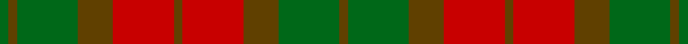

This page is one **sett** — a single exact thread-count. It belongs to the [tartan](/setts/dy1r7dy4g7dy1g1/)
(the same proportion at any scale), whose colour order is pattern [GGGGRGRGGG](/stripes/ggggrgrggg/).

Part of the [Dewar](/tartans/dewar/) tartan — the named design grouping this sett with its other cloths.

Sourced from register-of-tartans.  It is a [10 stripe tartan](/stripes/stripes10/).

Original link https://www.tartanregister.gov.uk/tartanDetails.aspx?ref=924

## Also known as

This cloth is also recorded under:

- MacNab #2
- MacNab, Variant

## Register references

External register numbers recorded for this tartan.

- Scottish Register of Tartans: [924](https://www.tartanregister.gov.uk/tartanDetails.aspx?ref=924)
- Scottish Tartans Authority (ITI): 3400
- Scottish Tartans World Register: 2757

## Thread count
G/4 T4 G28 T16 R28 T4 R28 T16 G28 T/4

One full sett is **312 threads**.

## Palette

Palette: <strong>Tartan Register</strong>
<table><thead><tr><th>Colour</th><th>Threads</th><th>Shade</th><th>Base</th><th>OKLCh</th></tr></thead><tbody><tr><td>G/</td><td style="text-align:right;font-variant-numeric:tabular-nums">4</td><td><code style="background-color:#006818;">#006818</code> <small style="color:#888">#006818</small></td><td>G <code style="background-color:#006100;">#006100</code></td><td><small style="color:#888">oklch(45.0% 0.142 145.0)</small></td></tr><tr><td>T</td><td style="text-align:right;font-variant-numeric:tabular-nums">4</td><td><code style="background-color:#604000;">#604000</code> <small style="color:#888">#604000</small></td><td>G <code style="background-color:#006100;">#006100</code></td><td><small style="color:#888">oklch(39.8% 0.083 76.8)</small></td></tr><tr><td>G</td><td style="text-align:right;font-variant-numeric:tabular-nums">28</td><td><code style="background-color:#006818;">#006818</code> <small style="color:#888">#006818</small></td><td>G <code style="background-color:#006100;">#006100</code></td><td><small style="color:#888">oklch(45.0% 0.142 145.0)</small></td></tr><tr><td>T</td><td style="text-align:right;font-variant-numeric:tabular-nums">16</td><td><code style="background-color:#604000;">#604000</code> <small style="color:#888">#604000</small></td><td>G <code style="background-color:#006100;">#006100</code></td><td><small style="color:#888">oklch(39.8% 0.083 76.8)</small></td></tr><tr><td>R</td><td style="text-align:right;font-variant-numeric:tabular-nums">28</td><td><code style="background-color:#C80000;">#C80000</code> <small style="color:#888">#C80000</small></td><td>R <code style="background-color:#CC0000;">#CC0000</code></td><td><small style="color:#888">oklch(52.3% 0.215 29.2)</small></td></tr><tr><td>T</td><td style="text-align:right;font-variant-numeric:tabular-nums">4</td><td><code style="background-color:#604000;">#604000</code> <small style="color:#888">#604000</small></td><td>G <code style="background-color:#006100;">#006100</code></td><td><small style="color:#888">oklch(39.8% 0.083 76.8)</small></td></tr><tr><td>R</td><td style="text-align:right;font-variant-numeric:tabular-nums">28</td><td><code style="background-color:#C80000;">#C80000</code> <small style="color:#888">#C80000</small></td><td>R <code style="background-color:#CC0000;">#CC0000</code></td><td><small style="color:#888">oklch(52.3% 0.215 29.2)</small></td></tr><tr><td>T</td><td style="text-align:right;font-variant-numeric:tabular-nums">16</td><td><code style="background-color:#604000;">#604000</code> <small style="color:#888">#604000</small></td><td>G <code style="background-color:#006100;">#006100</code></td><td><small style="color:#888">oklch(39.8% 0.083 76.8)</small></td></tr><tr><td>G</td><td style="text-align:right;font-variant-numeric:tabular-nums">28</td><td><code style="background-color:#006818;">#006818</code> <small style="color:#888">#006818</small></td><td>G <code style="background-color:#006100;">#006100</code></td><td><small style="color:#888">oklch(45.0% 0.142 145.0)</small></td></tr><tr><td>T/</td><td style="text-align:right;font-variant-numeric:tabular-nums">4</td><td><code style="background-color:#604000;">#604000</code> <small style="color:#888">#604000</small></td><td>G <code style="background-color:#006100;">#006100</code></td><td><small style="color:#888">oklch(39.8% 0.083 76.8)</small></td></tr></tbody></table>

## Compared to the master

This cloth is one sett of its design; the master sett (the exemplar the design is anchored on) is below for comparison.

<figure style="margin:0"><figcaption style="color:#888;font-size:smaller">this sett</figcaption></figure>
<figure style="margin:0"><figcaption style="color:#888;font-size:smaller"><a href="/setts/dg1ri1dg7ri4r7ri1/">master sett →</a></figcaption></figure>

## Nearest tartans

The nearest existing variants by ΔTartan distance, with this tartan at the top so the swatches line up against it.

ΔTartan

Tartan

Sett

—

<a href="/ttd/edit/#slug=dy1r7dy4g7dy1g1~x4">Dewar</a> <a class="nn-out" href="/variants/s10/dy1r7dy4g7dy1g1~x4/" title="open its dictionary page">↗</a>

1.01

<a href="/ttd/edit/#slug=dg2r1dg8r5y5r1y2~x4&amp;base=dy1r7dy4g7dy1g1~x4">Glen Esk (1993)</a> <a class="nn-out" href="/variants/s7/dg2r1dg8r5y5r1y2~x4/" title="open its dictionary page">↗</a>

1.25

<a href="/ttd/edit/#slug=lo3do2o14lo8do14dg16o13do2lo3~x2&amp;base=dy1r7dy4g7dy1g1~x4">Monaghan, County (District)</a> <a class="nn-out" href="/variants/s9/lo3do2o14lo8do14dg16o13do2lo3~x2/" title="open its dictionary page">↗</a>

1.27

<a href="/ttd/edit/#slug=o9do4o4do4o24dy19do19dy4~x2&amp;base=dy1r7dy4g7dy1g1~x4">Chindecella Gorse (Kemete Heil)</a> <a class="nn-out" href="/variants/s8/o9do4o4do4o24dy19do19dy4~x2/" title="open its dictionary page">↗</a>

1.34

<a href="/ttd/edit/#slug=g8ri1g1ri1g1ri6r8ri1r8ri6g7ri1g1~x2&amp;base=dy1r7dy4g7dy1g1~x4">MacNab 3</a> <a class="nn-out" href="/variants/s13/g8ri1g1ri1g1ri6r8ri1r8ri6g7ri1g1~x2/" title="open its dictionary page">↗</a>

1.35

<a href="/ttd/edit/#slug=r3dy16g10r3g3lb2g3r3~x2&amp;base=dy1r7dy4g7dy1g1~x4">Scott Htg (Clan)</a> <a class="nn-out" href="/variants/s8/r3dy16g10r3g3lb2g3r3~x2/" title="open its dictionary page">↗</a>

1.41

<a href="/variants/s11/dyi6m2dyi2m4dyi13dy12o13m4o2m2o6~x2/">Glenmorangie #2</a>

1.42

<a href="/ttd/edit/#slug=dg8r1dg1r1dg1r6ri8r1ri8r6dg7r1dg1&amp;base=dy1r7dy4g7dy1g1~x4">MacNab</a> <a class="nn-out" href="/variants/s13/dg8r1dg1r1dg1r6ri8r1ri8r6dg7r1dg1/" title="open its dictionary page">↗</a>

1.45

<a href="/ttd/edit/#slug=lo25r8lo8r8lo8r46dy46ri8dy46r46lo46r8lo8&amp;base=dy1r7dy4g7dy1g1~x4">Poulter SG 101 (Fashion)</a> <a class="nn-out" href="/variants/s13/lo25r8lo8r8lo8r46dy46ri8dy46r46lo46r8lo8/" title="open its dictionary page">↗</a>

1.49

<a href="/ttd/edit/#slug=dg8dr1dg1dr1dg1dr6r8dr1r8dr6dg7dr1dg1~x2&amp;base=dy1r7dy4g7dy1g1~x4">MacNab</a> <a class="nn-out" href="/variants/s13/dg8dr1dg1dr1dg1dr6r8dr1r8dr6dg7dr1dg1~x2/" title="open its dictionary page">↗</a>

1.49

<a href="/ttd/edit/#slug=dg8dr1dg1dr1dg1dr6r8dr1r8dr6dg7dr1dg1&amp;base=dy1r7dy4g7dy1g1~x4">MacNab</a> <a class="nn-out" href="/variants/s13/dg8dr1dg1dr1dg1dr6r8dr1r8dr6dg7dr1dg1/" title="open its dictionary page">↗</a>

## Neighbour map

Every grey dot is one of 14360 variants placed by the first two principal components of the ΔTartan feature space (44% of its variance). Red is this tartan; blue dots are its nearest — click one to open its page.

<svg viewBox="0 0 640 380" role="img" style="max-width:100%;height:auto;border:1px solid #e0e0e0;border-radius:4px;display:block" xmlns="http://www.w3.org/2000/svg"><image href="/nn/cloud.v1.png" width="640" height="380"/><a href="/variants/s7/dg2r1dg8r5y5r1y2~x4/"><circle cx="270.7" cy="258.6" r="4" fill="#3465a4"><title>Glen Esk (1993)</title></circle></a><a href="/variants/s9/lo3do2o14lo8do14dg16o13do2lo3~x2/"><circle cx="201.7" cy="232.2" r="4" fill="#3465a4"><title>Monaghan, County (District)</title></circle></a><a href="/variants/s8/o9do4o4do4o24dy19do19dy4~x2/"><circle cx="281.2" cy="274.7" r="4" fill="#3465a4"><title>Chindecella Gorse (Kemete Heil)</title></circle></a><a href="/variants/s13/g8ri1g1ri1g1ri6r8ri1r8ri6g7ri1g1~x2/"><circle cx="239.3" cy="208.8" r="4" fill="#3465a4"><title>MacNab 3</title></circle></a><a href="/variants/s8/r3dy16g10r3g3lb2g3r3~x2/"><circle cx="247.7" cy="227.3" r="4" fill="#3465a4"><title>Scott Htg (Clan)</title></circle></a><a href="/variants/s11/dyi6m2dyi2m4dyi13dy12o13m4o2m2o6~x2/"><circle cx="181.7" cy="226.0" r="4" fill="#3465a4"><title>Glenmorangie #2</title></circle></a><a href="/variants/s13/dg8r1dg1r1dg1r6ri8r1ri8r6dg7r1dg1/"><circle cx="257.7" cy="216.6" r="4" fill="#3465a4"><title>MacNab</title></circle></a><a href="/variants/s13/lo25r8lo8r8lo8r46dy46ri8dy46r46lo46r8lo8/"><circle cx="237.1" cy="228.0" r="4" fill="#3465a4"><title>Poulter SG 101 (Fashion)</title></circle></a><a href="/variants/s13/dg8dr1dg1dr1dg1dr6r8dr1r8dr6dg7dr1dg1~x2/"><circle cx="284.5" cy="239.4" r="4" fill="#3465a4"><title>MacNab</title></circle></a><a href="/variants/s13/dg8dr1dg1dr1dg1dr6r8dr1r8dr6dg7dr1dg1/"><circle cx="284.5" cy="239.4" r="4" fill="#3465a4"><title>MacNab</title></circle></a><circle cx="252.5" cy="255.1" r="5" fill="#c00000"/></svg>

ID: /variants/s10/dy1r7dy4g7dy1g1~x4/
