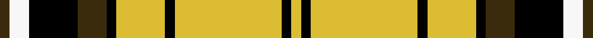

This is one **variant** — a specific cloth: this exact thread count and colourway, with its own
provenance below. It is one weaving of the [sett](/tartans/b/br/braemar-or-blair-atholl/) (the scale-free proportion — the
same cloth at any scale or shade), whose colour order is pattern [GWKGKYKYKY](/stripes/gwkgkykyky/).

Part of the [Braemar or Blair Atholl](/tartans/b/br/braemar-or-blair-atholl/) tartan — the named design grouping this sett with its other cloths.

Sourced from house-of-tartan.  It is a [10 stripe tartan](/stripes/stripes10/).

Original link [http://www.house-of-tartan.scotland.net/house/TartanViewjs.asp?colr=Def&tnam=1741](http://www.house-of-tartan.scotland.net/house/TartanViewjs.asp?colr=Def&tnam=1741)

## Provenance

Earliest known date: 1984 Nothing

Dataset <small>— provenance for this record, inherited from the source manifest</small>

<dl class="dataset-prov">
<dt>source</dt><dd><a href="/sources/house-of-tartan/">House of Tartan</a></dd>
<dt>data captured from</dt><dd><a href="https://github.com/thetartan/tartan-database/blob/master/data/house-of-tartan/data.csv">https://github.com/thetartan/tartan-database/blob/master/data/house-of-tartan/data.csv</a></dd>
<dt>data date</dt><dd>1984 <small>(this record)</small></dd>
<dt>licence</dt><dd><a href="https://creativecommons.org/licenses/by-nc-nd/4.0/">CC BY-NC-ND 4.0</a></dd>
</dl>

Capture chain <small>— the hands this data passed through, oldest first; each capture carries its own licence</small>

<ol class="capture-chain">
<li><a href="http://www.house-of-tartan.scotland.net/">House of Tartan</a> <small>the weaver/retailer's database — the site is now offline; the URL is kept as the ultimate source's identity</small></li>
<li><a href="https://github.com/thetartan/tartan-database">thetartan/tartan-database</a> <small>2016-2017</small> · <a href="https://creativecommons.org/licenses/by-nc-nd/4.0/">CC BY-NC-ND 4.0</a> <small>Levko Kravets's frozen compilation — the capture we vendored, and where its CC licence text came from</small></li>
<li>this dictionary <small>captured 2026-06-10 · commit 5bf86c7566</small> <small>each re-capture is a git commit to data/sources</small></li>
</ol>

## Thread count
DY/4 W8 K20 DY12 K4 LY20 K4 LY44 K4 LY/4

One full sett is **240 threads**.

## Palette
<table><thead><tr><th>Colour</th><th>Shade</th><th>OKLCh</th></tr></thead><tbody><tr><td>K</td><td><code style="background-color:#000000;">#000000</code> <small style="color:#888">#000000</small></td><td><small style="color:#888">oklch(0.0% 0.000 0.0)</small></td></tr><tr><td>W</td><td><code style="background-color:#F7F7F7;">#F7F7F7</code> <small style="color:#888">#F7F7F7</small></td><td><small style="color:#888">oklch(97.6% 0.000 89.9)</small></td></tr><tr><td>LY</td><td><code style="background-color:#DCBC32;">#DCBC32</code> <small style="color:#888">#DCBC32</small></td><td><small style="color:#888">oklch(80.0% 0.150 95.2)</small></td></tr><tr><td>DY</td><td><code style="background-color:#3A2B0D;">#3A2B0D</code> <small style="color:#888">#3A2B0D</small></td><td><small style="color:#888">oklch(30.0% 0.049 82.0)</small></td></tr></tbody></table>

# Sample pattern

[Sample sheet (PDF)](swatch.pdf) — the woven sample, thread count and palette on one printable A4, rendered on demand (the same sheet the TTD print page downloads).

## Nearest tartan variants

The nearest existing variants by ΔTartan distance, with this cloth at the top so the swatches line up against it.

ΔTartan

Threads

Variant

Sett

—

240

<a href="/variants/s10/dy1w2k5dy3k1ly5k1ly11k1ly1~x4/">Braemar or Blair Atholl Trade Tartan</a>

<a href="/ttd/edit/#slug=do1lr2k5do3k1ly4k1ly10k1ly1~x4&amp;base=dy1w2k5dy3k1ly5k1ly11k1ly1~x4" title="compare in the TTD">1.11</a>

224

<a href="/variants/s10/do1lr2k5do3k1ly4k1ly10k1ly1~x4/">Campbell 'Camel'</a>

<a href="/ttd/edit/#slug=ly15n1ly2lo2ly2n1ly3k8n10ly3~x4&amp;base=dy1w2k5dy3k1ly5k1ly11k1ly1~x4" title="compare in the TTD">1.65</a>

304

<a href="/variants/s10/ly15n1ly2lo2ly2n1ly3k8n10ly3~x4/">Annan Trade Tartan</a>

<a href="/ttd/edit/#slug=w3ly3r2ly13k3ly4k22ly4k3ly16b2w3~x2&amp;base=dy1w2k5dy3k1ly5k1ly11k1ly1~x4" title="compare in the TTD">2.34</a>

300

<a href="/variants/s12/w3ly3r2ly13k3ly4k22ly4k3ly16b2w3~x2/">Loch Sween</a>

<a href="/ttd/edit/#slug=k1ly12r1ly2k4r1k4ly2k1~x4&amp;base=dy1w2k5dy3k1ly5k1ly11k1ly1~x4" title="compare in the TTD">2.67</a>

216

<a href="/variants/s9/k1ly12r1ly2k4r1k4ly2k1~x4/">MacLeod Snuffbox - 1829 (Artefact)</a>

<a href="/ttd/edit/#slug=db5r19k2g8r3g18k2g9k2~x2&amp;base=dy1w2k5dy3k1ly5k1ly11k1ly1~x4" title="compare in the TTD">2.86</a>

258

<a href="/variants/s9/db5r19k2g8r3g18k2g9k2~x2/">Hubbard (2016)</a>

<a href="/ttd/edit/#slug=k10w10k10ly32k2w2k2w2dr5~x2&amp;base=dy1w2k5dy3k1ly5k1ly11k1ly1~x4" title="compare in the TTD">3.04</a>

270

<a href="/variants/s9/k10w10k10ly32k2w2k2w2dr5~x2/">Burberry (Counterfeit #4)</a>

<a href="/ttd/edit/#slug=r4ly24k13ly2k4ly3k1ly3lb2~x2&amp;base=dy1w2k5dy3k1ly5k1ly11k1ly1~x4" title="compare in the TTD">3.07</a>

212

<a href="/variants/s9/r4ly24k13ly2k4ly3k1ly3lb2~x2/">Cardiff City Football Club (Corp)</a>

<a href="/ttd/edit/#slug=k5ly25k10r3k10ly25w5~x2&amp;base=dy1w2k5dy3k1ly5k1ly11k1ly1~x4" title="compare in the TTD">3.09</a>

312

<a href="/variants/s7/k5ly25k10r3k10ly25w5~x2/">Richmond de Ellel (Personal)</a>

<a href="/ttd/edit/#slug=r16k3r16g44k3g8k3ly20k4~x2&amp;base=dy1w2k5dy3k1ly5k1ly11k1ly1~x4" title="compare in the TTD">3.09</a>

428

<a href="/variants/s9/r16k3r16g44k3g8k3ly20k4~x2/">MacMillan Society of Glasgow</a>

<a href="/ttd/edit/#slug=dg36ly8k9ly24dg4ly12dg4ly24k9ly8dg36dr4&amp;base=dy1w2k5dy3k1ly5k1ly11k1ly1~x4" title="compare in the TTD">3.11</a>

316

<a href="/variants/s12/dg36ly8k9ly24dg4ly12dg4ly24k9ly8dg36dr4/">Harmer</a>

## Neighbour map

Every grey dot is one of 13662 variants placed by the first two principal components of the ΔTartan feature space (42% of its variance). Red is this tartan; blue dots are its nearest — click one to open its page. The map is a flat projection of a many-dimensional space — [how to read it](/posts/neighbourhood-maps/).

<svg viewBox="0 0 640 380" role="img" style="max-width:100%;height:auto;border:1px solid #e0e0e0;border-radius:4px;display:block" xmlns="http://www.w3.org/2000/svg"><image href="/nn/cloud.v1.png" width="640" height="380"/><a href="/variants/s10/do1lr2k5do3k1ly4k1ly10k1ly1~x4/"><circle cx="205.5" cy="156.1" r="4" fill="#3465a4"><title>Campbell 'Camel'</title></circle></a><a href="/variants/s10/ly15n1ly2lo2ly2n1ly3k8n10ly3~x4/"><circle cx="239.5" cy="147.1" r="4" fill="#3465a4"><title>Annan Trade Tartan</title></circle></a><a href="/variants/s12/w3ly3r2ly13k3ly4k22ly4k3ly16b2w3~x2/"><circle cx="198.7" cy="131.6" r="4" fill="#3465a4"><title>Loch Sween</title></circle></a><a href="/variants/s9/k1ly12r1ly2k4r1k4ly2k1~x4/"><circle cx="275.1" cy="149.7" r="4" fill="#3465a4"><title>MacLeod Snuffbox - 1829 (Artefact)</title></circle></a><a href="/variants/s9/db5r19k2g8r3g18k2g9k2~x2/"><circle cx="233.5" cy="179.5" r="4" fill="#3465a4"><title>Hubbard (2016)</title></circle></a><a href="/variants/s9/k10w10k10ly32k2w2k2w2dr5~x2/"><circle cx="186.3" cy="136.1" r="4" fill="#3465a4"><title>Burberry (Counterfeit #4)</title></circle></a><a href="/variants/s9/r4ly24k13ly2k4ly3k1ly3lb2~x2/"><circle cx="287.8" cy="114.8" r="4" fill="#3465a4"><title>Cardiff City Football Club (Corp)</title></circle></a><a href="/variants/s7/k5ly25k10r3k10ly25w5~x2/"><circle cx="241.2" cy="188.8" r="4" fill="#3465a4"><title>Richmond de Ellel (Personal)</title></circle></a><a href="/variants/s9/r16k3r16g44k3g8k3ly20k4~x2/"><circle cx="200.4" cy="151.7" r="4" fill="#3465a4"><title>MacMillan Society of Glasgow</title></circle></a><a href="/variants/s12/dg36ly8k9ly24dg4ly12dg4ly24k9ly8dg36dr4/"><circle cx="190.1" cy="179.3" r="4" fill="#3465a4"><title>Harmer</title></circle></a><circle cx="221.9" cy="147.7" r="5" fill="#c00000"/><text x="320" y="376" text-anchor="middle" font-size="11" fill="#999">ground</text><text x="11" y="190" text-anchor="middle" font-size="11" fill="#999" transform="rotate(-90 11 190)">complexity</text></svg>

ID: /variants/s10/dy1w2k5dy3k1ly5k1ly11k1ly1~x4/
