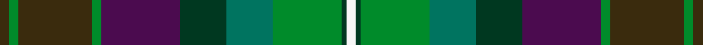
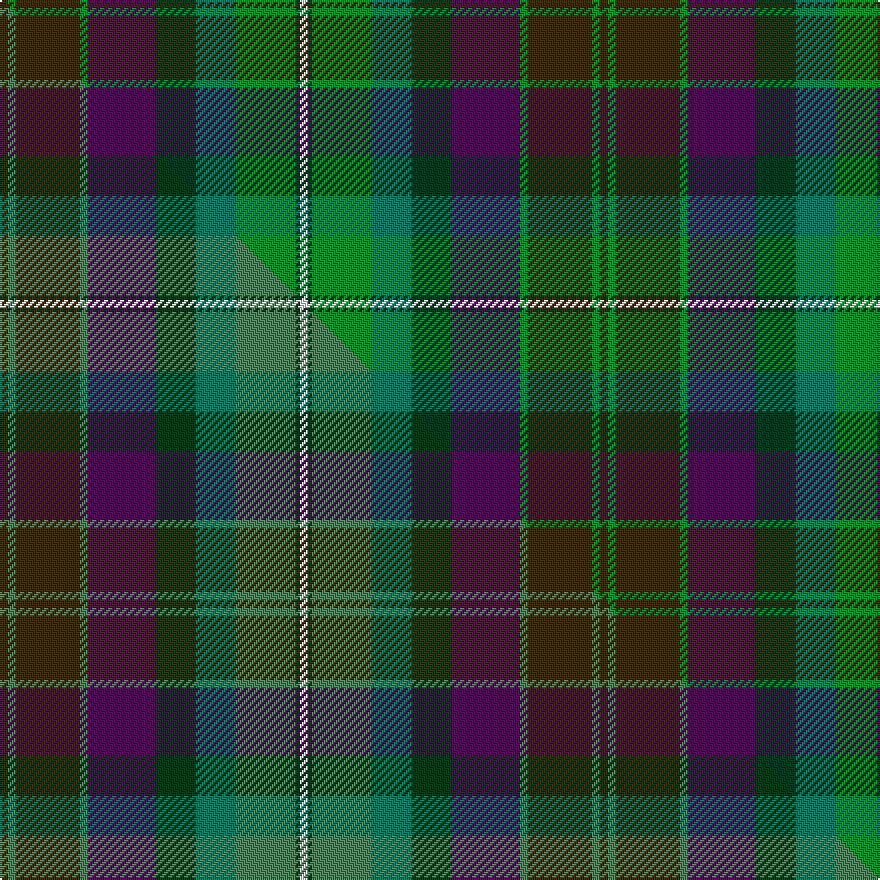

This page is one **sett** — a single exact thread-count. It belongs to the [tartan](/setts/dy2g2dy16g2dp17dg10gi10g15dg1w2/)
(the same proportion at any scale), whose colour order is pattern [GGGGBGGGGW](/stripes/ggggbggggw/).

Part of the [Grewar](/tartans/grewar/) tartan — the named design grouping this sett with its other cloths.

Sourced from tartans-authority.  It is a [10 stripe tartan](/stripes/stripes10/).

Original link http://www.tartansauthority.com/tartan-ferret/display/7675/

## Register references

External register numbers recorded for this tartan.

- Scottish Tartans Authority (ITI): 7675

## Thread count
DY/4 G4 DY32 G4 DP34 DG20 Gi20 G30 DG2 W/4

One full sett is **300 threads**.

## Palette
<table><thead><tr><th>Colour</th><th>Shade</th><th>OKLCh</th></tr></thead><tbody><tr><td>DG</td><td><code style="background-color:#003820;">#003820</code> <small style="color:#888">#003820</small></td><td><small style="color:#888">oklch(30.0% 0.070 158.3)</small></td></tr><tr><td>G</td><td><code style="background-color:#008B2A;">#008B2A</code> <small style="color:#888">#008B2A</small></td><td><small style="color:#888">oklch(55.4% 0.170 145.9)</small></td></tr><tr><td>G</td><td><code style="background-color:#007460;">#007460</code> <small style="color:#888">#007460</small></td><td><small style="color:#888">oklch(49.9% 0.094 175.1)</small></td></tr><tr><td>W</td><td><code style="background-color:#F7F7F7;">#F7F7F7</code> <small style="color:#888">#F7F7F7</small></td><td><small style="color:#888">oklch(97.6% 0.000 89.9)</small></td></tr><tr><td>DY</td><td><code style="background-color:#3A2B0D;">#3A2B0D</code> <small style="color:#888">#3A2B0D</small></td><td><small style="color:#888">oklch(30.0% 0.049 82.0)</small></td></tr><tr><td>DP</td><td><code style="background-color:#4B0B4F;">#4B0B4F</code> <small style="color:#888">#4B0B4F</small></td><td><small style="color:#888">oklch(30.1% 0.125 325.4)</small></td></tr></tbody></table>

# Sample pattern

## Compared to the master

This cloth is one sett of its design; the master sett (the exemplar the design is anchored on) is below for comparison.

Its **ΔTartan distance** from the master is **0.06** — the same measure the nearest-tartans table ranks by (0 is identical; a re-scale of the same cloth is near 0, a recolour or a different proportion further).

<figure class="master-compare" style="margin:0">

this sett
master sett ★

<figcaption style="color:#888;font-size:smaller">One weave of this sett against the <a href="/setts/dy2gi2dy16gi2dp17dg10g10gi15dg1w2/">master sett ★</a>, split on the diagonal: a shared proportion runs seamlessly across it with only the shades shifting; a different proportion breaks on it.</figcaption>
</figure>

## Nearest tartan variants

The nearest existing variants by ΔTartan distance, with this cloth at the top so the swatches line up against it.

ΔTartan

Threads

Variant

Sett

—

300

<a href="/variants/s10/dy2g2dy16g2dp17dg10gi10g15dg1w2~x2~gi2004173/">Grewar (Name)</a>

<a href="/ttd/edit/#slug=dy2gi2dy16gi2dp17dg10g10gi15dg1w2~x2~gi2203152-g2004173&amp;base=dy2g2dy16g2dp17dg10gi10g15dg1w2~x2~gi2004173" title="compare in the TTD">0.05</a>

300

<a href="/variants/s10/dy2gi2dy16gi2dp17dg10g10gi15dg1w2~x2~gi2203152-g2004173/">Grewar</a>

<a href="/ttd/edit/#slug=g3n3dp2db14g16dp18n2dp3n14db4y3lo1n2~x2&amp;base=dy2g2dy16g2dp17dg10gi10g15dg1w2~x2~gi2004173" title="compare in the TTD">2.93</a>

330

<a href="/variants/s13/g3n3dp2db14g16dp18n2dp3n14db4y3lo1n2~x2/">ENABLE Scotland</a>

<a href="/ttd/edit/#slug=g3dp3n2db14g16dp18n2dp3n14db4y3lo1n2~x2&amp;base=dy2g2dy16g2dp17dg10gi10g15dg1w2~x2~gi2004173" title="compare in the TTD">3.01</a>

330

<a href="/variants/s13/g3dp3n2db14g16dp18n2dp3n14db4y3lo1n2~x2/">ENABLE Scotland</a>

<a href="/ttd/edit/#slug=ly3dg30g20lo6g3lo3g3db20r2~x2~dg1806142-g1903114&amp;base=dy2g2dy16g2dp17dg10gi10g15dg1w2~x2~gi2004173" title="compare in the TTD">3.36</a>

350

<a href="/variants/s9/ly3dg30g20lo6g3lo3g3db20r2~x2~dg1806142-g1903114/">Glens of Corbie</a>

<a href="/ttd/edit/#slug=db4dbi4dg16g16db4dbi4y1~x4~db0804274-dbi1605267&amp;base=dy2g2dy16g2dp17dg10gi10g15dg1w2~x2~gi2004173" title="compare in the TTD">3.57</a>

372

<a href="/variants/s7/db4dbi4dg16g16db4dbi4y1~x4~db0804274-dbi1605267/">Unidentified Waistcoat</a>

<a href="/ttd/edit/#slug=dy22y22dr2lb6dr2lo2dr16dg5dy8lb2~x2&amp;base=dy2g2dy16g2dp17dg10gi10g15dg1w2~x2~gi2004173" title="compare in the TTD">3.62</a>

300

<a href="/variants/s10/dy22y22dr2lb6dr2lo2dr16dg5dy8lb2~x2/">Bruce of Kinnaird (Vivienne Westwood Design)</a>

<a href="/ttd/edit/#slug=db23ly2dr3dbi7dr3ly2g15dr21ly5~x2~db1404245-dbi1406275&amp;base=dy2g2dy16g2dp17dg10gi10g15dg1w2~x2~gi2004173" title="compare in the TTD">3.62</a>

268

<a href="/variants/s9/db23ly2dr3dbi7dr3ly2g15dr21ly5~x2~db1404245-dbi1406275/">Land's End Maroon</a>

<a href="/ttd/edit/#slug=db4n4dg16g16db4n4y1~x4~db0805267-n1604274&amp;base=dy2g2dy16g2dp17dg10gi10g15dg1w2~x2~gi2004173" title="compare in the TTD">3.63</a>

372

<a href="/variants/s7/db4dbi4dg16g16db4dbi4y1~x4~db0805267-dbi1604274/">Unidentified, Waistcoat</a>

<a href="/ttd/edit/#slug=dbi16db7dy4db2dy16db2g24db8lb11~x2~dbi1406275-db1004274&amp;base=dy2g2dy16g2dp17dg10gi10g15dg1w2~x2~gi2004173" title="compare in the TTD">3.66</a>

306

<a href="/variants/s9/dbi16db7dy4db2dy16db2g24db8lb11~x2~dbi1406275-db1004274/">Wicklow County, Crest Range</a>

<a href="/ttd/edit/#slug=dpi4dp4dpi2dp14dg6g3dg6dgi2g4dgi2g15n3~x2~dpi1607327-dp1105325-g2408144-dgi1806142&amp;base=dy2g2dy16g2dp17dg10gi10g15dg1w2~x2~gi2004173" title="compare in the TTD">3.88</a>

246

<a href="/variants/s12/dpi4dp4dpi2dp14dg6g3dg6dgi2g4dgi2g15n3~x2~dpi1607327-dp1105325-g2408144-dgi1806142/">Kinloch Anderson Heather (Corporate)</a>

## Neighbour map

Every grey dot is one of 13620 variants placed by the first two principal components of the ΔTartan feature space (42% of its variance). Red is this tartan; blue dots are its nearest — click one to open its page.

<svg viewBox="0 0 640 380" role="img" style="max-width:100%;height:auto;border:1px solid #e0e0e0;border-radius:4px;display:block" xmlns="http://www.w3.org/2000/svg"><image href="/nn/cloud.v1.png" width="640" height="380"/><a href="/variants/s10/dy2gi2dy16gi2dp17dg10g10gi15dg1w2~x2~gi2203152-g2004173/"><circle cx="191.6" cy="193.7" r="4" fill="#3465a4"><title>Grewar</title></circle></a><a href="/variants/s13/g3n3dp2db14g16dp18n2dp3n14db4y3lo1n2~x2/"><circle cx="202.0" cy="167.3" r="4" fill="#3465a4"><title>ENABLE Scotland</title></circle></a><a href="/variants/s13/g3dp3n2db14g16dp18n2dp3n14db4y3lo1n2~x2/"><circle cx="204.9" cy="166.5" r="4" fill="#3465a4"><title>ENABLE Scotland</title></circle></a><a href="/variants/s9/ly3dg30g20lo6g3lo3g3db20r2~x2~dg1806142-g1903114/"><circle cx="197.6" cy="167.3" r="4" fill="#3465a4"><title>Glens of Corbie</title></circle></a><a href="/variants/s7/db4dbi4dg16g16db4dbi4y1~x4~db0804274-dbi1605267/"><circle cx="243.2" cy="218.9" r="4" fill="#3465a4"><title>Unidentified Waistcoat</title></circle></a><a href="/variants/s10/dy22y22dr2lb6dr2lo2dr16dg5dy8lb2~x2/"><circle cx="211.8" cy="189.6" r="4" fill="#3465a4"><title>Bruce of Kinnaird (Vivienne Westwood Design)</title></circle></a><a href="/variants/s9/db23ly2dr3dbi7dr3ly2g15dr21ly5~x2~db1404245-dbi1406275/"><circle cx="204.1" cy="203.3" r="4" fill="#3465a4"><title>Land's End Maroon</title></circle></a><a href="/variants/s7/db4dbi4dg16g16db4dbi4y1~x4~db0805267-dbi1604274/"><circle cx="239.9" cy="217.9" r="4" fill="#3465a4"><title>Unidentified, Waistcoat</title></circle></a><a href="/variants/s9/dbi16db7dy4db2dy16db2g24db8lb11~x2~dbi1406275-db1004274/"><circle cx="152.1" cy="219.0" r="4" fill="#3465a4"><title>Wicklow County, Crest Range</title></circle></a><a href="/variants/s12/dpi4dp4dpi2dp14dg6g3dg6dgi2g4dgi2g15n3~x2~dpi1607327-dp1105325-g2408144-dgi1806142/"><circle cx="151.2" cy="199.5" r="4" fill="#3465a4"><title>Kinloch Anderson Heather (Corporate)</title></circle></a><circle cx="171.6" cy="188.1" r="5" fill="#c00000"/><text x="320" y="376" text-anchor="middle" font-size="11" fill="#999">ground</text><text x="11" y="190" text-anchor="middle" font-size="11" fill="#999" transform="rotate(-90 11 190)">complexity</text></svg>

ID: /variants/s10/dy2g2dy16g2dp17dg10gi10g15dg1w2~x2~gi2004173/
