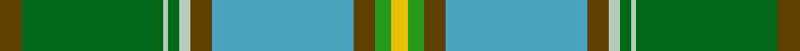

This page is one **sett** — a single exact thread-count. It belongs to the [tartan](/setts/dy4gi26lb1gi2lb2dy4lg26dy4g3ly3/)
(the same proportion at any scale), whose colour order is pattern [GGWGWGYGGY](/stripes/ggwgwgyggy/).

Part of the [Carter](/tartans/carter/) tartan — the named design grouping this sett with its other cloths.

Sourced from tartans-authority.  It is a [10 stripe tartan](/stripes/stripes10/).

Original link http://www.tartansauthority.com/tartan-ferret/display/10259/

## Register references

External register numbers recorded for this tartan.

- Scottish Register of Tartans: [10259](https://www.tartanregister.gov.uk/tartanDetails?ref=10259)
- Scottish Tartans Authority (ITI): 10259

## Thread count
T/8 Ga52 N2 Ga4 N4 T8 B52 T8 G6 Y/6

One full sett is **286 threads**.

## Palette

Palette: <strong>Tartan Register</strong> <small style="color:#888">(5 of 6 colours)</small>
<table><thead><tr><th>Colour</th><th>Threads</th><th>Shade</th><th>Base</th><th>OKLCh</th></tr></thead><tbody><tr><td>T/</td><td style="text-align:right;font-variant-numeric:tabular-nums">8</td><td><code style="background-color:#604000;">#604000</code> <small style="color:#888">#604000</small></td><td>G <code style="background-color:#006100;">#006100</code></td><td><small style="color:#888">oklch(39.8% 0.083 76.8)</small></td></tr><tr><td>Ga</td><td style="text-align:right;font-variant-numeric:tabular-nums">52</td><td><code style="background-color:#006818;">#006818</code> <small style="color:#888">#006818</small></td><td>G <code style="background-color:#006100;">#006100</code></td><td><small style="color:#888">oklch(45.0% 0.142 145.0)</small></td></tr><tr><td>N</td><td style="text-align:right;font-variant-numeric:tabular-nums">2</td><td><code style="background-color:#B4CCBC;">#B4CCBC</code> <small style="color:#888">#B4CCBC</small></td><td>W <code style="background-color:#F7F7F7;">#F7F7F7</code></td><td><small style="color:#888">oklch(82.3% 0.034 156.4)</small></td></tr><tr><td>Ga</td><td style="text-align:right;font-variant-numeric:tabular-nums">4</td><td><code style="background-color:#006818;">#006818</code> <small style="color:#888">#006818</small></td><td>G <code style="background-color:#006100;">#006100</code></td><td><small style="color:#888">oklch(45.0% 0.142 145.0)</small></td></tr><tr><td>N</td><td style="text-align:right;font-variant-numeric:tabular-nums">4</td><td><code style="background-color:#B4CCBC;">#B4CCBC</code> <small style="color:#888">#B4CCBC</small></td><td>W <code style="background-color:#F7F7F7;">#F7F7F7</code></td><td><small style="color:#888">oklch(82.3% 0.034 156.4)</small></td></tr><tr><td>T</td><td style="text-align:right;font-variant-numeric:tabular-nums">8</td><td><code style="background-color:#604000;">#604000</code> <small style="color:#888">#604000</small></td><td>G <code style="background-color:#006100;">#006100</code></td><td><small style="color:#888">oklch(39.8% 0.083 76.8)</small></td></tr><tr><td>B</td><td style="text-align:right;font-variant-numeric:tabular-nums">52</td><td><code style="background-color:#48A4C0;">#48A4C0</code> <small style="color:#888">#48A4C0</small></td><td>Y <code style="background-color:#F2BF00;">#F2BF00</code></td><td><small style="color:#888">oklch(67.5% 0.096 221.0)</small></td></tr><tr><td>T</td><td style="text-align:right;font-variant-numeric:tabular-nums">8</td><td><code style="background-color:#604000;">#604000</code> <small style="color:#888">#604000</small></td><td>G <code style="background-color:#006100;">#006100</code></td><td><small style="color:#888">oklch(39.8% 0.083 76.8)</small></td></tr><tr><td>G</td><td style="text-align:right;font-variant-numeric:tabular-nums">6</td><td><code style="background-color:#289C18;">#289C18</code> <small style="color:#888">#289C18</small></td><td>G <code style="background-color:#006100;">#006100</code></td><td><small style="color:#888">oklch(60.6% 0.191 141.6)</small></td></tr><tr><td>Y/</td><td style="text-align:right;font-variant-numeric:tabular-nums">6</td><td><code style="background-color:#E8C000;">#E8C000</code> <small style="color:#888">#E8C000</small></td><td>Y <code style="background-color:#F2BF00;">#F2BF00</code></td><td><small style="color:#888">oklch(81.9% 0.168 93.7)</small></td></tr></tbody></table>

## Compared to the master

This cloth is one sett of its design; the master sett (the exemplar the design is anchored on) is below for comparison.

<figure style="margin:0"><figcaption style="color:#888;font-size:smaller">this sett</figcaption></figure>
<figure style="margin:0"><figcaption style="color:#888;font-size:smaller"><a href="/setts/do4yi26lyi1yi2lyi2do4lg26do4y3ly3/">master sett →</a></figcaption></figure>

## Nearest tartans

The nearest existing variants by ΔTartan distance, with this tartan at the top so the swatches line up against it.

ΔTartan

Tartan

Sett

—

<a href="/ttd/edit/#slug=dy4gi26lb1gi2lb2dy4lg26dy4g3ly3~x2">Carter (Savannah) (Personal)</a> <a class="nn-out" href="/variants/s10/dy4gi26lb1gi2lb2dy4lg26dy4g3ly3~x2/" title="open its dictionary page">↗</a>

1.01

<a href="/ttd/edit/#slug=lb4k1b33lb4loi15g4loi3b4loi15lo2g30k2~x2&amp;base=dy4gi26lb1gi2lb2dy4lg26dy4g3ly3~x2">State Seal of Idaho (Fashion)</a> <a class="nn-out" href="/variants/s12/lb4k1b33lb4loi15g4loi3b4loi15lo2g30k2~x2/" title="open its dictionary page">↗</a>

1.07

<a href="/ttd/edit/#slug=do4yi26lyi1yi2lyi2do4lg26do4y3ly3~x2&amp;base=dy4gi26lb1gi2lb2dy4lg26dy4g3ly3~x2">Carter (Savannah)</a> <a class="nn-out" href="/variants/s10/do4yi26lyi1yi2lyi2do4lg26do4y3ly3~x2/" title="open its dictionary page">↗</a>

1.19

<a href="/ttd/edit/#slug=db16w3db1ly4g24r1g3r4g3r1t8~x2&amp;base=dy4gi26lb1gi2lb2dy4lg26dy4g3ly3~x2">Currie</a> <a class="nn-out" href="/variants/s11/db16w3db1ly4g24r1g3r4g3r1t8~x2/" title="open its dictionary page">↗</a>

1.25

<a href="/ttd/edit/#slug=dt6w1lo24g6n3g1n3g1n12r1~x2&amp;base=dy4gi26lb1gi2lb2dy4lg26dy4g3ly3~x2">Chisholm Colonial</a> <a class="nn-out" href="/variants/s10/dt6w1lo24g6n3g1n3g1n12r1~x2/" title="open its dictionary page">↗</a>

1.27

<a href="/ttd/edit/#slug=t5g5k4o31gi3o3gi62o3gi3o31k4g5t5r3~x2&amp;base=dy4gi26lb1gi2lb2dy4lg26dy4g3ly3~x2">Sheffield, City of</a> <a class="nn-out" href="/variants/s14/t5g5k4o31gi3o3gi62o3gi3o31k4g5t5r3~x2/" title="open its dictionary page">↗</a>

1.31

<a href="/ttd/edit/#slug=gi4r3gi24k1w7k1g24ly3~x2&amp;base=dy4gi26lb1gi2lb2dy4lg26dy4g3ly3~x2">Layton, Mervin</a> <a class="nn-out" href="/variants/s8/gi4r3gi24k1w7k1g24ly3~x2/" title="open its dictionary page">↗</a>

1.36

<a href="/ttd/edit/#slug=g22r3w1g2r3t16k3ly2~x4&amp;base=dy4gi26lb1gi2lb2dy4lg26dy4g3ly3~x2">Stirling University (Corporate)</a> <a class="nn-out" href="/variants/s8/g22r3w1g2r3t16k3ly2~x4/" title="open its dictionary page">↗</a>

1.37

<a href="/ttd/edit/#slug=gi18g6dy3w1dy3w1t6db6~x2&amp;base=dy4gi26lb1gi2lb2dy4lg26dy4g3ly3~x2">Iroquois Falls Centenary (Commem.)</a> <a class="nn-out" href="/variants/s8/gi18g6dy3w1dy3w1t6db6~x2/" title="open its dictionary page">↗</a>

1.42

<a href="/variants/s8/g22r3k1g2r3t16ki3ly2~x4/">Stirling, University of Corporate Univ Tartan</a>

1.43

<a href="/ttd/edit/#slug=lo4k1g28k6dy18lb4b41k1lb3~x2&amp;base=dy4gi26lb1gi2lb2dy4lg26dy4g3ly3~x2">State Seal of Pennsylvania (Fashion)</a> <a class="nn-out" href="/variants/s9/lo4k1g28k6dy18lb4b41k1lb3~x2/" title="open its dictionary page">↗</a>

## Neighbour map

Every grey dot is one of 14360 variants placed by the first two principal components of the ΔTartan feature space (44% of its variance). Red is this tartan; blue dots are its nearest — click one to open its page.

<svg viewBox="0 0 640 380" role="img" style="max-width:100%;height:auto;border:1px solid #e0e0e0;border-radius:4px;display:block" xmlns="http://www.w3.org/2000/svg"><image href="/nn/cloud.v1.png" width="640" height="380"/><a href="/variants/s12/lb4k1b33lb4loi15g4loi3b4loi15lo2g30k2~x2/"><circle cx="205.6" cy="104.0" r="4" fill="#3465a4"><title>State Seal of Idaho (Fashion)</title></circle></a><a href="/variants/s10/do4yi26lyi1yi2lyi2do4lg26do4y3ly3~x2/"><circle cx="235.8" cy="110.1" r="4" fill="#3465a4"><title>Carter (Savannah)</title></circle></a><a href="/variants/s11/db16w3db1ly4g24r1g3r4g3r1t8~x2/"><circle cx="217.0" cy="104.3" r="4" fill="#3465a4"><title>Currie</title></circle></a><a href="/variants/s10/dt6w1lo24g6n3g1n3g1n12r1~x2/"><circle cx="264.8" cy="127.6" r="4" fill="#3465a4"><title>Chisholm Colonial</title></circle></a><a href="/variants/s14/t5g5k4o31gi3o3gi62o3gi3o31k4g5t5r3~x2/"><circle cx="273.9" cy="109.5" r="4" fill="#3465a4"><title>Sheffield, City of</title></circle></a><a href="/variants/s8/gi4r3gi24k1w7k1g24ly3~x2/"><circle cx="218.5" cy="121.0" r="4" fill="#3465a4"><title>Layton, Mervin</title></circle></a><a href="/variants/s8/g22r3w1g2r3t16k3ly2~x4/"><circle cx="249.9" cy="124.2" r="4" fill="#3465a4"><title>Stirling University (Corporate)</title></circle></a><a href="/variants/s8/gi18g6dy3w1dy3w1t6db6~x2/"><circle cx="189.1" cy="154.9" r="4" fill="#3465a4"><title>Iroquois Falls Centenary (Commem.)</title></circle></a><a href="/variants/s8/g22r3k1g2r3t16ki3ly2~x4/"><circle cx="249.9" cy="125.0" r="4" fill="#3465a4"><title>Stirling, University of Corporate Univ Tartan</title></circle></a><a href="/variants/s9/lo4k1g28k6dy18lb4b41k1lb3~x2/"><circle cx="226.4" cy="101.9" r="4" fill="#3465a4"><title>State Seal of Pennsylvania (Fashion)</title></circle></a><circle cx="228.0" cy="112.9" r="5" fill="#c00000"/></svg>

ID: /variants/s10/dy4gi26lb1gi2lb2dy4lg26dy4g3ly3~x2/
