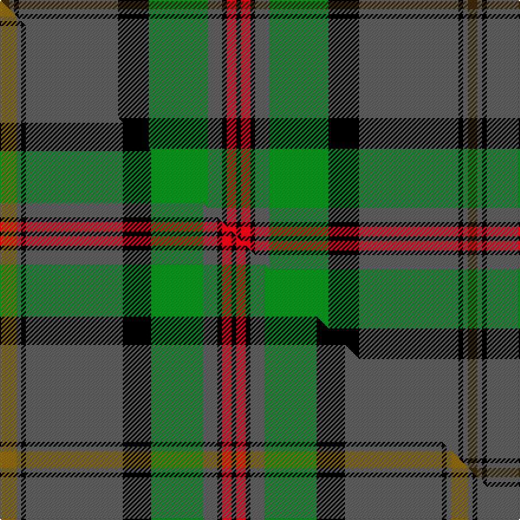

This is one **variant** — a specific cloth: this exact thread count and colourway, with its own
provenance below. It is one weaving of the [sett](/tartans/d/di/dinwiddie/) (the scale-free proportion — the
same cloth at any scale or shade), whose colour order is pattern [GBKBKGBKRK](/stripes/gbkbkgbkrk/).

Part of the [Dinwiddie](/tartans/d/di/dinwiddie/) tartan — the named design grouping this sett with its other cloths.

Sourced from house-of-tartan.  It is a [10 stripe tartan](/stripes/stripes10/).

Original link [http://www.house-of-tartan.scotland.net/house/TartanViewjs.asp?colr=Def&tnam=3212](http://www.house-of-tartan.scotland.net/house/TartanViewjs.asp?colr=Def&tnam=3212)

## Provenance

Earliest known date: 2001 The registered tartan of the Dinwiddie Clan. Dinwiddies are normally associated with the Maxwells, but Lord Lyon stated, in 1988, that Dinwiddies were a sept of no other clan.

Dataset <small>— provenance for this record, inherited from the source manifest</small>

<dl class="dataset-prov">
<dt>source</dt><dd><a href="/sources/house-of-tartan/">House of Tartan</a></dd>
<dt>data captured from</dt><dd><a href="https://github.com/thetartan/tartan-database/blob/master/data/house-of-tartan/data.csv">https://github.com/thetartan/tartan-database/blob/master/data/house-of-tartan/data.csv</a></dd>
<dt>data date</dt><dd>2001 <small>(this record)</small></dd>
<dt>licence</dt><dd><a href="https://creativecommons.org/licenses/by-nc-nd/4.0/">CC BY-NC-ND 4.0</a></dd>
</dl>

Capture chain <small>— the hands this data passed through, oldest first; each capture carries its own licence</small>

<ol class="capture-chain">
<li><a href="http://www.house-of-tartan.scotland.net/">House of Tartan</a> <small>the weaver/retailer's database — the site is now offline; the URL is kept as the ultimate source's identity</small></li>
<li><a href="https://github.com/thetartan/tartan-database">thetartan/tartan-database</a> <small>2016-2017</small> · <a href="https://creativecommons.org/licenses/by-nc-nd/4.0/">CC BY-NC-ND 4.0</a> <small>Levko Kravets's frozen compilation — the capture we vendored, and where its CC licence text came from</small></li>
<li>this dictionary <small>captured 2026-06-10 · commit 5bf86c7566</small> <small>each re-capture is a git commit to data/sources</small></li>
</ol>

## Thread count
DY/8 N4 K4 N84 K26 G50 N12 K4 R8 K/4

One full sett is **396 threads**.

## Palette
<table><thead><tr><th>Colour</th><th>Shade</th><th>OKLCh</th></tr></thead><tbody><tr><td>G</td><td><code style="background-color:#008B2A;">#008B2A</code> <small style="color:#888">#008B2A</small></td><td><small style="color:#888">oklch(55.4% 0.170 145.9)</small></td></tr><tr><td>K</td><td><code style="background-color:#000000;">#000000</code> <small style="color:#888">#000000</small></td><td><small style="color:#888">oklch(0.0% 0.000 0.0)</small></td></tr><tr><td>N</td><td><code style="background-color:#636363;">#636363</code> <small style="color:#888">#636363</small></td><td><small style="color:#888">oklch(50.0% 0.000 89.9)</small></td></tr><tr><td>R</td><td><code style="background-color:#D60020;">#D60020</code> <small style="color:#888">#D60020</small></td><td><small style="color:#888">oklch(55.2% 0.224 25.5)</small></td></tr><tr><td>DY</td><td><code style="background-color:#3A2B0D;">#3A2B0D</code> <small style="color:#888">#3A2B0D</small></td><td><small style="color:#888">oklch(30.0% 0.049 82.0)</small></td></tr></tbody></table>

# Sample pattern

## Compared to the master

This cloth is one sett of its design; the master sett (the exemplar the design is anchored on) is below for comparison.

Its **ΔTartan distance** from the master is **0.19** — the same measure the nearest-tartans table ranks by (0 is identical; a re-scale of the same cloth is near 0, a recolour or a different proportion further).

<figure class="master-compare" style="margin:0">

this sett
master sett ★

<figcaption style="color:#888;font-size:smaller">One weave of this sett against the <a href="/setts/y7n2k2n41k12g22n6k2r4k2/">master sett ★</a>, split on the diagonal: a shared proportion runs seamlessly across it with only the shades shifting; a different proportion breaks on it.</figcaption>
</figure>

## Nearest tartan variants

The nearest existing variants by ΔTartan distance, with this cloth at the top so the swatches line up against it.

ΔTartan

Threads

Variant

Sett

—

396

<a href="/variants/s10/dy4n2k2n42k13g25n6k2r4k2~x2/">Dinwiddie Clan Tartan</a>

<a href="/ttd/edit/#slug=y7n2k2n41k12g22n6k2r4k2~x2&amp;base=dy4n2k2n42k13g25n6k2r4k2~x2" title="compare in the TTD">0.19</a>

382

<a href="/variants/s10/y7n2k2n41k12g22n6k2r4k2~x2/">Dinwiddie</a>

<a href="/ttd/edit/#slug=dy12n2k2n42k13g25n6k2r4k10~x2&amp;base=dy4n2k2n42k13g25n6k2r4k2~x2" title="compare in the TTD">0.28</a>

428

<a href="/variants/s10/dy12n2k2n42k13g25n6k2r4k10~x2/">Dinwoodie (Name)</a>

<a href="/ttd/edit/#slug=dg3w2dg39k3g3k3dg3k20g10r2~x2~dg3704180-g5810144&amp;base=dy4n2k2n42k13g25n6k2r4k2~x2" title="compare in the TTD">2.12</a>

342

<a href="/variants/s10/dg3w2dg39k3g3k3dg3k20g10r2~x2~dg3704180-g5810144/">Zorra Caledonian Society</a>

<a href="/ttd/edit/#slug=g28k1g1k6w1k6dp1k1dp4r3dp14~x4&amp;base=dy4n2k2n42k13g25n6k2r4k2~x2" title="compare in the TTD">2.27</a>

360

<a href="/variants/s11/g28k1g1k6w1k6dp1k1dp4r3dp14~x4/">New Hampshire</a>

<a href="/ttd/edit/#slug=y3k18w2k4g12n33k4n5g3~x2&amp;base=dy4n2k2n42k13g25n6k2r4k2~x2" title="compare in the TTD">2.33</a>

324

<a href="/variants/s9/y3k18w2k4g12n33k4n5g3~x2/">Smoke Showing (UFES)</a>

<a href="/ttd/edit/#slug=k3w1g29n8m2n2m2n2m8g7k2~x2&amp;base=dy4n2k2n42k13g25n6k2r4k2~x2" title="compare in the TTD">2.37</a>

254

<a href="/variants/s11/k3w1g29n8m2n2m2n2m8g7k2~x2/">Gray Htg (Name)</a>

<a href="/ttd/edit/#slug=g45w2r3k15r3db15r3db15~x2&amp;base=dy4n2k2n42k13g25n6k2r4k2~x2" title="compare in the TTD">2.55</a>

284

<a href="/variants/s8/g45w2r3k15r3db15r3db15~x2/">MacNeil 3</a>

<a href="/ttd/edit/#slug=r4db15k18g3k2g2k2g44y4~x2&amp;base=dy4n2k2n42k13g25n6k2r4k2~x2" title="compare in the TTD">2.55</a>

360

<a href="/variants/s9/r4db15k18g3k2g2k2g44y4~x2/">Sarafilovic (Corporate)</a>

<a href="/ttd/edit/#slug=g34r4g4r2g4r2g3r4g17k17r2db17r4db4y3~x2&amp;base=dy4n2k2n42k13g25n6k2r4k2~x2" title="compare in the TTD">2.57</a>

410

<a href="/variants/s15/g34r4g4r2g4r2g3r4g17k17r2db17r4db4y3~x2/">Cochrane (1984) Clan Tartan</a>

<a href="/ttd/edit/#slug=dp4lb2dp2lb8k3dp8dg3dp4dg24g2~x2~dg4514144-g6019141&amp;base=dy4n2k2n42k13g25n6k2r4k2~x2" title="compare in the TTD">2.59</a>

228

<a href="/variants/s10/dp4lb2dp2lb8k3dp8dg3dp4dg24g2~x2~dg4514144-g6019141/">Jones Htg (Name)</a>

## Neighbour map

Every grey dot is one of 13662 variants placed by the first two principal components of the ΔTartan feature space (42% of its variance). Red is this tartan; blue dots are its nearest — click one to open its page. The map is a flat projection of a many-dimensional space — [how to read it](/posts/neighbourhood-maps/).

<svg viewBox="0 0 640 380" role="img" style="max-width:100%;height:auto;border:1px solid #e0e0e0;border-radius:4px;display:block" xmlns="http://www.w3.org/2000/svg"><image href="/nn/cloud.v1.png" width="640" height="380"/><a href="/variants/s10/y7n2k2n41k12g22n6k2r4k2~x2/"><circle cx="244.8" cy="115.3" r="4" fill="#3465a4"><title>Dinwiddie</title></circle></a><a href="/variants/s10/dy12n2k2n42k13g25n6k2r4k10~x2/"><circle cx="195.0" cy="123.0" r="4" fill="#3465a4"><title>Dinwoodie (Name)</title></circle></a><a href="/variants/s10/dg3w2dg39k3g3k3dg3k20g10r2~x2~dg3704180-g5810144/"><circle cx="258.1" cy="107.1" r="4" fill="#3465a4"><title>Zorra Caledonian Society</title></circle></a><a href="/variants/s11/g28k1g1k6w1k6dp1k1dp4r3dp14~x4/"><circle cx="216.2" cy="86.1" r="4" fill="#3465a4"><title>New Hampshire</title></circle></a><a href="/variants/s9/y3k18w2k4g12n33k4n5g3~x2/"><circle cx="201.6" cy="131.3" r="4" fill="#3465a4"><title>Smoke Showing (UFES)</title></circle></a><a href="/variants/s11/k3w1g29n8m2n2m2n2m8g7k2~x2/"><circle cx="284.9" cy="92.5" r="4" fill="#3465a4"><title>Gray Htg (Name)</title></circle></a><a href="/variants/s8/g45w2r3k15r3db15r3db15~x2/"><circle cx="203.1" cy="123.7" r="4" fill="#3465a4"><title>MacNeil 3</title></circle></a><a href="/variants/s9/r4db15k18g3k2g2k2g44y4~x2/"><circle cx="243.4" cy="108.2" r="4" fill="#3465a4"><title>Sarafilovic (Corporate)</title></circle></a><a href="/variants/s15/g34r4g4r2g4r2g3r4g17k17r2db17r4db4y3~x2/"><circle cx="211.6" cy="107.1" r="4" fill="#3465a4"><title>Cochrane (1984) Clan Tartan</title></circle></a><a href="/variants/s10/dp4lb2dp2lb8k3dp8dg3dp4dg24g2~x2~dg4514144-g6019141/"><circle cx="206.0" cy="146.1" r="4" fill="#3465a4"><title>Jones Htg (Name)</title></circle></a><circle cx="248.0" cy="110.6" r="5" fill="#c00000"/><text x="320" y="376" text-anchor="middle" font-size="11" fill="#999">ground</text><text x="11" y="190" text-anchor="middle" font-size="11" fill="#999" transform="rotate(-90 11 190)">complexity</text></svg>

ID: /variants/s10/dy4n2k2n42k13g25n6k2r4k2~x2/
