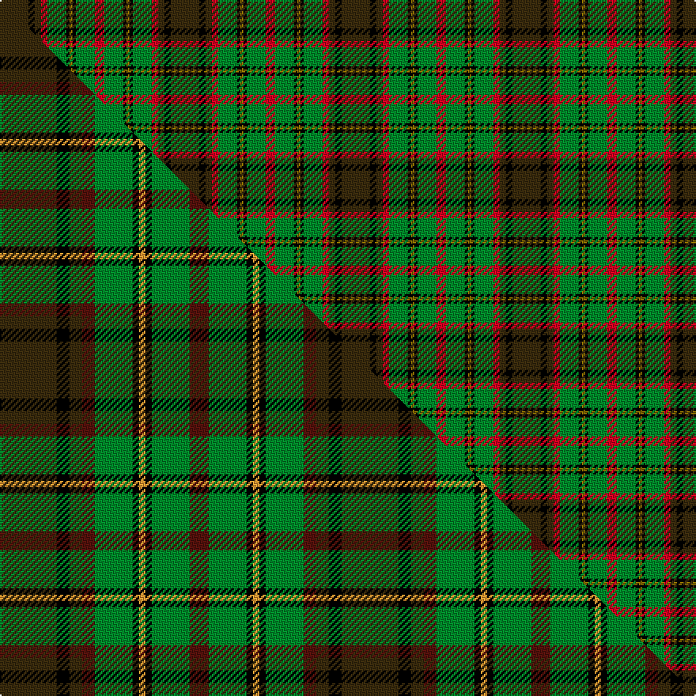

This is one **variant** — a specific cloth: this exact thread count and colourway, with its own
provenance below. It is one weaving of the [sett](/tartans/m/ma/macaart-3/) (the scale-free proportion — the
same cloth at any scale or shade), whose colour order is pattern [GKGRGKGKGR](/stripes/gkgrgkgkgr/).

Part of the [MacAart](/tartans/m/ma/macaart-3/) tartan — the named design grouping this sett with its other cloths.

Sourced from house-of-tartan.  It is a [10 stripe tartan](/stripes/stripes10/).

Original link [http://www.house-of-tartan.scotland.net/house/TartanViewjs.asp?colr=Def&tnam=1477](http://www.house-of-tartan.scotland.net/house/TartanViewjs.asp?colr=Def&tnam=1477)

## Provenance

Earliest known date: pre 2003 Restricted

Dataset <small>— provenance for this record, inherited from the source manifest</small>

<dl class="dataset-prov">
<dt>source</dt><dd><a href="/sources/house-of-tartan/">House of Tartan</a></dd>
<dt>data captured from</dt><dd><a href="https://github.com/thetartan/tartan-database/blob/master/data/house-of-tartan/data.csv">https://github.com/thetartan/tartan-database/blob/master/data/house-of-tartan/data.csv</a></dd>
<dt>data date</dt><dd>pre 2003 <small>(this record)</small></dd>
<dt>licence</dt><dd><a href="https://creativecommons.org/licenses/by-nc-nd/4.0/">CC BY-NC-ND 4.0</a></dd>
</dl>

Capture chain <small>— the hands this data passed through, oldest first; each capture carries its own licence</small>

<ol class="capture-chain">
<li><a href="http://www.house-of-tartan.scotland.net/">House of Tartan</a> <small>the weaver/retailer's database — the site is now offline; the URL is kept as the ultimate source's identity</small></li>
<li><a href="https://github.com/thetartan/tartan-database">thetartan/tartan-database</a> <small>2016-2017</small> · <a href="https://creativecommons.org/licenses/by-nc-nd/4.0/">CC BY-NC-ND 4.0</a> <small>Levko Kravets's frozen compilation — the capture we vendored, and where its CC licence text came from</small></li>
<li>this dictionary <small>captured 2026-06-10 · commit 5bf86c7566</small> <small>each re-capture is a git commit to data/sources</small></li>
</ol>

## Thread count
DY/18 K4 DY4 R4 G12 K2 Y2 K2 G12 R/6

One full sett is **108 threads**.

## Palette
<table><thead><tr><th>Colour</th><th>Shade</th><th>OKLCh</th></tr></thead><tbody><tr><td>G</td><td><code style="background-color:#008B2A;">#008B2A</code> <small style="color:#888">#008B2A</small></td><td><small style="color:#888">oklch(55.4% 0.170 145.9)</small></td></tr><tr><td>K</td><td><code style="background-color:#000000;">#000000</code> <small style="color:#888">#000000</small></td><td><small style="color:#888">oklch(0.0% 0.000 0.0)</small></td></tr><tr><td>R</td><td><code style="background-color:#D60020;">#D60020</code> <small style="color:#888">#D60020</small></td><td><small style="color:#888">oklch(55.2% 0.224 25.5)</small></td></tr><tr><td>DY</td><td><code style="background-color:#3A2B0D;">#3A2B0D</code> <small style="color:#888">#3A2B0D</small></td><td><small style="color:#888">oklch(30.0% 0.049 82.0)</small></td></tr><tr><td>Y</td><td><code style="background-color:#8B6E00;">#8B6E00</code> <small style="color:#888">#8B6E00</small></td><td><small style="color:#888">oklch(55.1% 0.113 90.4)</small></td></tr></tbody></table>

# Sample pattern

[Sample sheet (PDF)](swatch.pdf) — the woven sample, thread count and palette on one printable A4, rendered on demand (the same sheet the TTD print page downloads).

## Compared to the master

This cloth is one sett of its design; the master sett (the exemplar the design is anchored on) is below for comparison.

Its **ΔTartan distance** from the master is **0.36** — the same measure the nearest-tartans table ranks by (0 is identical; a re-scale of the same cloth is near 0, a recolour or a different proportion further).

<figure class="master-compare" style="margin:0">

this sett
master sett ★

<figcaption style="color:#888;font-size:smaller">One weave of this sett against the <a href="/setts/dy9k2dy2dr2g6k1lo1k1g6dr3/">master sett ★</a>, split on the diagonal: a shared proportion runs seamlessly across it with only the shades shifting; a different proportion breaks on it.</figcaption>
</figure>

## Nearest tartan variants

The nearest existing variants by ΔTartan distance, with this cloth at the top so the swatches line up against it.

ΔTartan

Threads

Variant

Sett

—

108

<a href="/variants/s10/dy9k2dy2r2g6k1y1k1g6r3~x2/">MacAart Family Tartan</a>

<a href="/ttd/edit/#slug=dy9k2dy2dr2g6k1lo1k1g6dr3~x4&amp;base=dy9k2dy2r2g6k1y1k1g6r3~x2" title="compare in the TTD">0.36</a>

216

<a href="/variants/s10/dy9k2dy2dr2g6k1lo1k1g6dr3~x4/">MacAart (Personal)</a>

<a href="/ttd/edit/#slug=dr3g6k1lo1k1g6dr2dy2k2dy9k2~x4&amp;base=dy9k2dy2r2g6k1y1k1g6r3~x2" title="compare in the TTD">1.76</a>

260

<a href="/variants/s11/dr3g6k1lo1k1g6dr2dy2k2dy9k2~x4/">MacAart (Personal)</a>

<a href="/ttd/edit/#slug=k3r9k5do9o3do9k5g24k2o3~x2&amp;base=dy9k2dy2r2g6k1y1k1g6r3~x2" title="compare in the TTD">1.80</a>

276

<a href="/variants/s10/k3r9k5do9o3do9k5g24k2o3~x2/">Cavan</a>

<a href="/ttd/edit/#slug=k3r9k4dy9y3dy9k4g26k2y3~x2&amp;base=dy9k2dy2r2g6k1y1k1g6r3~x2" title="compare in the TTD">1.89</a>

276

<a href="/variants/s10/k3r9k4dy9y3dy9k4g26k2y3~x2/">Cavan, County</a>

<a href="/ttd/edit/#slug=db4dr11db1g8dr2g4k1lo2~x4&amp;base=dy9k2dy2r2g6k1y1k1g6r3~x2" title="compare in the TTD">1.97</a>

240

<a href="/variants/s8/db4dr11db1g8dr2g4k1lo2~x4/">Craik of Assington (Personal)</a>

<a href="/ttd/edit/#slug=o30k4o3k4o3g20dt20y4~x2&amp;base=dy9k2dy2r2g6k1y1k1g6r3~x2" title="compare in the TTD">2.20</a>

284

<a href="/variants/s8/o30k4o3k4o3g20dt20y4~x2/">Sikh (Corporate)</a>

<a href="/ttd/edit/#slug=k3r7k4o7ri3o7k4g3k3g19k2g2k2ri3~x2~r3715030-ri5021030&amp;base=dy9k2dy2r2g6k1y1k1g6r3~x2" title="compare in the TTD">2.23</a>

264

<a href="/variants/s14/k3r7k4o7ri3o7k4g3k3g19k2g2k2ri3~x2~r3715030-ri5021030/">Anderson 10</a>

<a href="/ttd/edit/#slug=k3dr7k4dy7r3dy7k4g3k3g19k2g2k2r3~x2&amp;base=dy9k2dy2r2g6k1y1k1g6r3~x2" title="compare in the TTD">2.32</a>

264

<a href="/variants/s14/k3dr7k4dy7r3dy7k4g3k3g19k2g2k2r3~x2/">Anderson (Coulson Bonner #1)</a>

<a href="/ttd/edit/#slug=dt20g20o3k4o3k4o30k4o3k4o3g20dt20y4~x2&amp;base=dy9k2dy2r2g6k1y1k1g6r3~x2" title="compare in the TTD">2.45</a>

520

<a href="/variants/s14/dt20g20o3k4o3k4o30k4o3k4o3g20dt20y4~x2/">Sikh Clan/Family Tartan</a>

<a href="/ttd/edit/#slug=o9k2o2r2g6k1y1k1g6r3~x2&amp;base=dy9k2dy2r2g6k1y1k1g6r3~x2" title="compare in the TTD">2.48</a>

108

<a href="/variants/s10/o9k2o2r2g6k1y1k1g6r3~x2/">MacAart</a>

## Neighbour map

Every grey dot is one of 13662 variants placed by the first two principal components of the ΔTartan feature space (42% of its variance). Red is this tartan; blue dots are its nearest — click one to open its page. The map is a flat projection of a many-dimensional space — [how to read it](/posts/neighbourhood-maps/).

<svg viewBox="0 0 640 380" role="img" style="max-width:100%;height:auto;border:1px solid #e0e0e0;border-radius:4px;display:block" xmlns="http://www.w3.org/2000/svg"><image href="/nn/cloud.v1.png" width="640" height="380"/><a href="/variants/s10/dy9k2dy2dr2g6k1lo1k1g6dr3~x4/"><circle cx="152.3" cy="183.5" r="4" fill="#3465a4"><title>MacAart (Personal)</title></circle></a><a href="/variants/s11/dr3g6k1lo1k1g6dr2dy2k2dy9k2~x4/"><circle cx="129.1" cy="176.1" r="4" fill="#3465a4"><title>MacAart (Personal)</title></circle></a><a href="/variants/s10/k3r9k5do9o3do9k5g24k2o3~x2/"><circle cx="115.6" cy="154.0" r="4" fill="#3465a4"><title>Cavan</title></circle></a><a href="/variants/s10/k3r9k4dy9y3dy9k4g26k2y3~x2/"><circle cx="137.7" cy="146.3" r="4" fill="#3465a4"><title>Cavan, County</title></circle></a><a href="/variants/s8/db4dr11db1g8dr2g4k1lo2~x4/"><circle cx="183.2" cy="178.5" r="4" fill="#3465a4"><title>Craik of Assington (Personal)</title></circle></a><a href="/variants/s8/o30k4o3k4o3g20dt20y4~x2/"><circle cx="188.5" cy="176.5" r="4" fill="#3465a4"><title>Sikh (Corporate)</title></circle></a><a href="/variants/s14/k3r7k4o7ri3o7k4g3k3g19k2g2k2ri3~x2~r3715030-ri5021030/"><circle cx="101.8" cy="145.7" r="4" fill="#3465a4"><title>Anderson 10</title></circle></a><a href="/variants/s14/k3dr7k4dy7r3dy7k4g3k3g19k2g2k2r3~x2/"><circle cx="106.3" cy="148.7" r="4" fill="#3465a4"><title>Anderson (Coulson Bonner #1)</title></circle></a><a href="/variants/s14/dt20g20o3k4o3k4o30k4o3k4o3g20dt20y4~x2/"><circle cx="124.3" cy="156.8" r="4" fill="#3465a4"><title>Sikh Clan/Family Tartan</title></circle></a><a href="/variants/s10/o9k2o2r2g6k1y1k1g6r3~x2/"><circle cx="147.4" cy="177.4" r="4" fill="#3465a4"><title>MacAart</title></circle></a><circle cx="141.5" cy="177.4" r="5" fill="#c00000"/><text x="320" y="376" text-anchor="middle" font-size="11" fill="#999">ground</text><text x="11" y="190" text-anchor="middle" font-size="11" fill="#999" transform="rotate(-90 11 190)">complexity</text></svg>

ID: /variants/s10/dy9k2dy2r2g6k1y1k1g6r3~x2/
