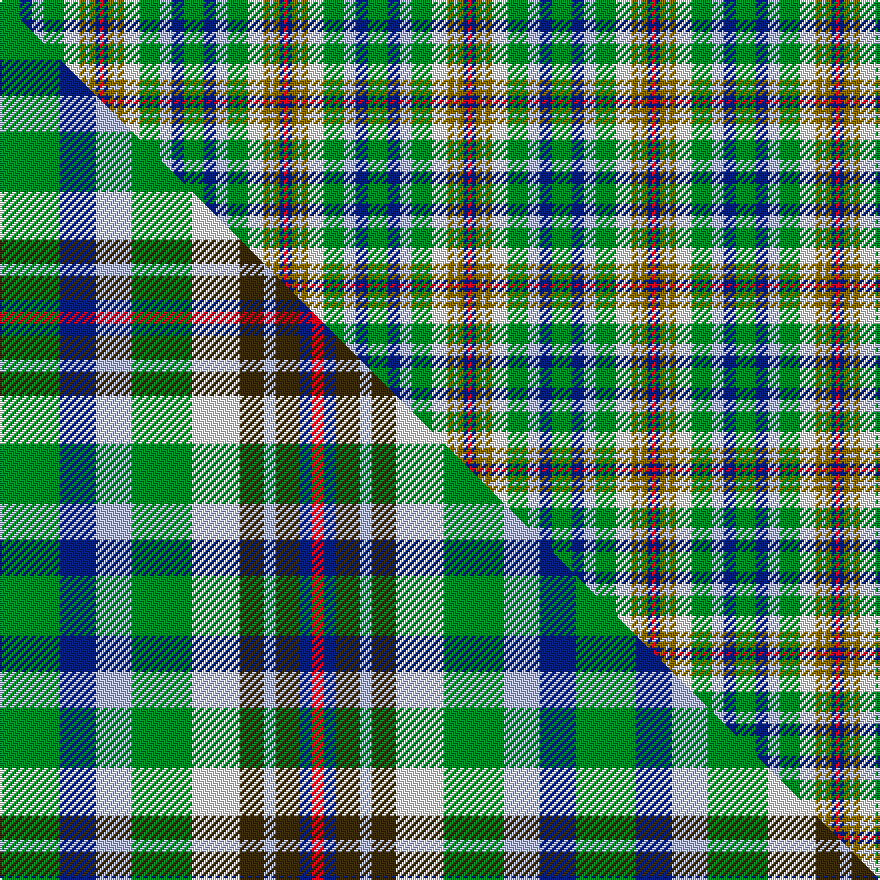

This is one **variant** — a specific cloth: this exact thread count and colourway, with its own
provenance below. It is one weaving of the [sett](/tartans/n/no/northern-college/) (the scale-free proportion — the
same cloth at any scale or shade), whose colour order is pattern [GBWGWGWGBR](/stripes/gbwgwgwgbr/).

Part of the [Northern College](/tartans/n/no/northern-college/) tartan — the named design grouping this sett with its other cloths.

Sourced from house-of-tartan.  It is a [10 stripe tartan](/stripes/stripes10/).

Original link [http://www.house-of-tartan.scotland.net/house/TartanViewjs.asp?colr=Def&tnam=690](http://www.house-of-tartan.scotland.net/house/TartanViewjs.asp?colr=Def&tnam=690)

## Provenance

Earliest known date: 1983 Northern College, Ontario, Canada

2 attestations — the source records this cloth was collapsed from (oldest owns this page)

<ul>
<li>1983 — Northern College Corporate Tartan (house-of-tartan, <a href="http://www.house-of-tartan.scotland.net/house/TartanViewjs.asp?colr=Def&tnam=690">record</a>) </li>
<li>undated — Northern College (weddslist, <a href="http://www.weddslist.com/cgi-bin/tartans/pg.pl?source=sts">record</a>) </li>
</ul>

Dataset <small>— provenance for this record, inherited from the source manifest</small>

<dl class="dataset-prov">
<dt>source</dt><dd><a href="/sources/house-of-tartan/">House of Tartan</a></dd>
<dt>data captured from</dt><dd><a href="https://github.com/thetartan/tartan-database/blob/master/data/house-of-tartan/data.csv">https://github.com/thetartan/tartan-database/blob/master/data/house-of-tartan/data.csv</a></dd>
<dt>data date</dt><dd>1983 <small>(this record)</small></dd>
<dt>licence</dt><dd><a href="https://creativecommons.org/licenses/by-nc-nd/4.0/">CC BY-NC-ND 4.0</a></dd>
</dl>

Capture chain <small>— the hands this data passed through, oldest first; each capture carries its own licence</small>

<ol class="capture-chain">
<li><a href="http://www.house-of-tartan.scotland.net/">House of Tartan</a> <small>the weaver/retailer's database — the site is now offline; the URL is kept as the ultimate source's identity</small></li>
<li><a href="https://github.com/thetartan/tartan-database">thetartan/tartan-database</a> <small>2016-2017</small> · <a href="https://creativecommons.org/licenses/by-nc-nd/4.0/">CC BY-NC-ND 4.0</a> <small>Levko Kravets's frozen compilation — the capture we vendored, and where its CC licence text came from</small></li>
<li>this dictionary <small>captured 2026-06-10 · commit 5bf86c7566</small> <small>each re-capture is a git commit to data/sources</small></li>
</ol>

## Thread count
G/10 DB6 LB6 G10 W8 Y3 LB2 Y3 DB2 R/2

One full sett is **92 threads**.

## Palette
<table><thead><tr><th>Colour</th><th>Shade</th><th>OKLCh</th></tr></thead><tbody><tr><td>LB</td><td><code style="background-color:#B5BBDE;">#B5BBDE</code> <small style="color:#888">#B5BBDE</small></td><td><small style="color:#888">oklch(79.9% 0.050 277.6)</small></td></tr><tr><td>DB</td><td><code style="background-color:#082077;">#082077</code> <small style="color:#888">#082077</small></td><td><small style="color:#888">oklch(30.0% 0.149 265.1)</small></td></tr><tr><td>G</td><td><code style="background-color:#008B2A;">#008B2A</code> <small style="color:#888">#008B2A</small></td><td><small style="color:#888">oklch(55.4% 0.170 145.9)</small></td></tr><tr><td>W</td><td><code style="background-color:#F7F7F7;">#F7F7F7</code> <small style="color:#888">#F7F7F7</small></td><td><small style="color:#888">oklch(97.6% 0.000 89.9)</small></td></tr><tr><td>R</td><td><code style="background-color:#D60020;">#D60020</code> <small style="color:#888">#D60020</small></td><td><small style="color:#888">oklch(55.2% 0.224 25.5)</small></td></tr><tr><td>Y</td><td><code style="background-color:#8B6E00;">#8B6E00</code> <small style="color:#888">#8B6E00</small></td><td><small style="color:#888">oklch(55.1% 0.113 90.4)</small></td></tr></tbody></table>

# Sample pattern

## Compared to the master

This cloth is one sett of its design; the master sett (the exemplar the design is anchored on) is below for comparison.

Its **ΔTartan distance** from the master is **0.12** — the same measure the nearest-tartans table ranks by (0 is identical; a re-scale of the same cloth is near 0, a recolour or a different proportion further).

<figure class="master-compare" style="margin:0">

this sett
master sett ★

<figcaption style="color:#888;font-size:smaller">One weave of this sett against the <a href="/setts/g5db3lb3g5w4dy2lb1dy2db1r1/">master sett ★</a>, split on the diagonal: a shared proportion runs seamlessly across it with only the shades shifting; a different proportion breaks on it.</figcaption>
</figure>

## Nearest tartan variants

The nearest existing variants by ΔTartan distance, with this cloth at the top so the swatches line up against it.

ΔTartan

Threads

Variant

Sett

—

92

<a href="/variants/s10/g10db6lb6g10w8y3lb2y3db2r2/">Northern College Corporate Tartan</a>

<a href="/ttd/edit/#slug=g5db3lb3g5w4dy2lb1dy2db1r1~x6&amp;base=g10db6lb6g10w8y3lb2y3db2r2" title="compare in the TTD">0.12</a>

288

<a href="/variants/s10/g5db3lb3g5w4dy2lb1dy2db1r1~x6/">Northern College (Corporate)</a>

<a href="/ttd/edit/#slug=g5db3lb3g5w4dy2lb1dy2db1r1~x6~g2203152&amp;base=g10db6lb6g10w8y3lb2y3db2r2" title="compare in the TTD">0.17</a>

288

<a href="/variants/s10/g5db3lb3g5w4dy2lb1dy2db1r1~x6~g2203152/">Northern College (Ontario)</a>

<a href="/ttd/edit/#slug=dg2n13dg12w3lb10w3lb12g13r2~x2&amp;base=g10db6lb6g10w8y3lb2y3db2r2" title="compare in the TTD">1.86</a>

272

<a href="/variants/s9/dg2n13dg12w3lb10w3lb12g13r2~x2/">Mounth The.. Corporate Tartan</a>

<a href="/ttd/edit/#slug=w5g4lb1g4r4lb1dg4dy1~x6&amp;base=g10db6lb6g10w8y3lb2y3db2r2" title="compare in the TTD">2.30</a>

252

<a href="/variants/s8/w5g4lb1g4r4lb1dg4dy1~x6/">Devon Rural Skills Trust</a>

<a href="/ttd/edit/#slug=w5g4b1g4r4b1dg4y1~x2~g2104115-dg1304144&amp;base=g10db6lb6g10w8y3lb2y3db2r2" title="compare in the TTD">2.83</a>

84

<a href="/variants/s8/w5g4b1g4r4b1dg4y1~x2~g2104115-dg1304144/">Devon Rural Skills Trust</a>

<a href="/ttd/edit/#slug=w5g2w5db5r2db5g11y2g11db5r2~x4&amp;base=g10db6lb6g10w8y3lb2y3db2r2" title="compare in the TTD">2.86</a>

412

<a href="/variants/s11/w5g2w5db5r2db5g11y2g11db5r2~x4/">Kremlin Zoria</a>

<a href="/ttd/edit/#slug=g4w2r2lb3db3do2db2do2g2do2g3do2g8do6w8lb2~x2&amp;base=g10db6lb6g10w8y3lb2y3db2r2" title="compare in the TTD">3.05</a>

200

<a href="/variants/s16/g4w2r2lb3db3do2db2do2g2do2g3do2g8do6w8lb2~x2/">Missouri Dress (Proposed) (District)</a>

<a href="/ttd/edit/#slug=y1db4o1g5dr2g1w1~x2~o1905046-dr1205000&amp;base=g10db6lb6g10w8y3lb2y3db2r2" title="compare in the TTD">3.07</a>

56

<a href="/variants/s7/y1db4o1g5dr2g1w1~x2~o1905046-dr1205000/">Deeside District</a>

<a href="/ttd/edit/#slug=lb3g1lb1g5r2do4lb3g2w1lb1y1g1do2r2y1~x4&amp;base=g10db6lb6g10w8y3lb2y3db2r2" title="compare in the TTD">3.10</a>

224

<a href="/variants/s15/lb3g1lb1g5r2do4lb3g2w1lb1y1g1do2r2y1~x4/">Highlands of Haliburton (District)</a>

<a href="/ttd/edit/#slug=g8r1g4do2w4lb3w1lb3w4~x8&amp;base=g10db6lb6g10w8y3lb2y3db2r2" title="compare in the TTD">3.12</a>

384

<a href="/variants/s9/g8r1g4do2w4lb3w1lb3w4~x8/">Gaelic College of St.Anns</a>

## Neighbour map

Every grey dot is one of 13656 variants placed by the first two principal components of the ΔTartan feature space (42% of its variance). Red is this tartan; blue dots are its nearest — click one to open its page. The map is a flat projection of a many-dimensional space — [how to read it](/posts/neighbourhood-maps/).

<svg viewBox="0 0 640 380" role="img" style="max-width:100%;height:auto;border:1px solid #e0e0e0;border-radius:4px;display:block" xmlns="http://www.w3.org/2000/svg"><image href="/nn/cloud.v1.png" width="640" height="380"/><a href="/variants/s10/g5db3lb3g5w4dy2lb1dy2db1r1~x6/"><circle cx="70.1" cy="223.2" r="4" fill="#3465a4"><title>Northern College (Corporate)</title></circle></a><a href="/variants/s10/g5db3lb3g5w4dy2lb1dy2db1r1~x6~g2203152/"><circle cx="78.6" cy="223.5" r="4" fill="#3465a4"><title>Northern College (Ontario)</title></circle></a><a href="/variants/s9/dg2n13dg12w3lb10w3lb12g13r2~x2/"><circle cx="86.2" cy="216.9" r="4" fill="#3465a4"><title>Mounth The.. Corporate Tartan</title></circle></a><a href="/variants/s8/w5g4lb1g4r4lb1dg4dy1~x6/"><circle cx="62.0" cy="234.1" r="4" fill="#3465a4"><title>Devon Rural Skills Trust</title></circle></a><a href="/variants/s8/w5g4b1g4r4b1dg4y1~x2~g2104115-dg1304144/"><circle cx="74.9" cy="234.9" r="4" fill="#3465a4"><title>Devon Rural Skills Trust</title></circle></a><a href="/variants/s11/w5g2w5db5r2db5g11y2g11db5r2~x4/"><circle cx="139.6" cy="220.0" r="4" fill="#3465a4"><title>Kremlin Zoria</title></circle></a><a href="/variants/s16/g4w2r2lb3db3do2db2do2g2do2g3do2g8do6w8lb2~x2/"><circle cx="50.5" cy="209.9" r="4" fill="#3465a4"><title>Missouri Dress (Proposed) (District)</title></circle></a><a href="/variants/s7/y1db4o1g5dr2g1w1~x2~o1905046-dr1205000/"><circle cx="133.5" cy="221.7" r="4" fill="#3465a4"><title>Deeside District</title></circle></a><a href="/variants/s15/lb3g1lb1g5r2do4lb3g2w1lb1y1g1do2r2y1~x4/"><circle cx="69.8" cy="207.3" r="4" fill="#3465a4"><title>Highlands of Haliburton (District)</title></circle></a><a href="/variants/s9/g8r1g4do2w4lb3w1lb3w4~x8/"><circle cx="152.2" cy="222.3" r="4" fill="#3465a4"><title>Gaelic College of St.Anns</title></circle></a><circle cx="90.9" cy="221.8" r="5" fill="#c00000"/><text x="320" y="376" text-anchor="middle" font-size="11" fill="#999">ground</text><text x="11" y="190" text-anchor="middle" font-size="11" fill="#999" transform="rotate(-90 11 190)">complexity</text></svg>

ID: /variants/s10/g10db6lb6g10w8y3lb2y3db2r2/
