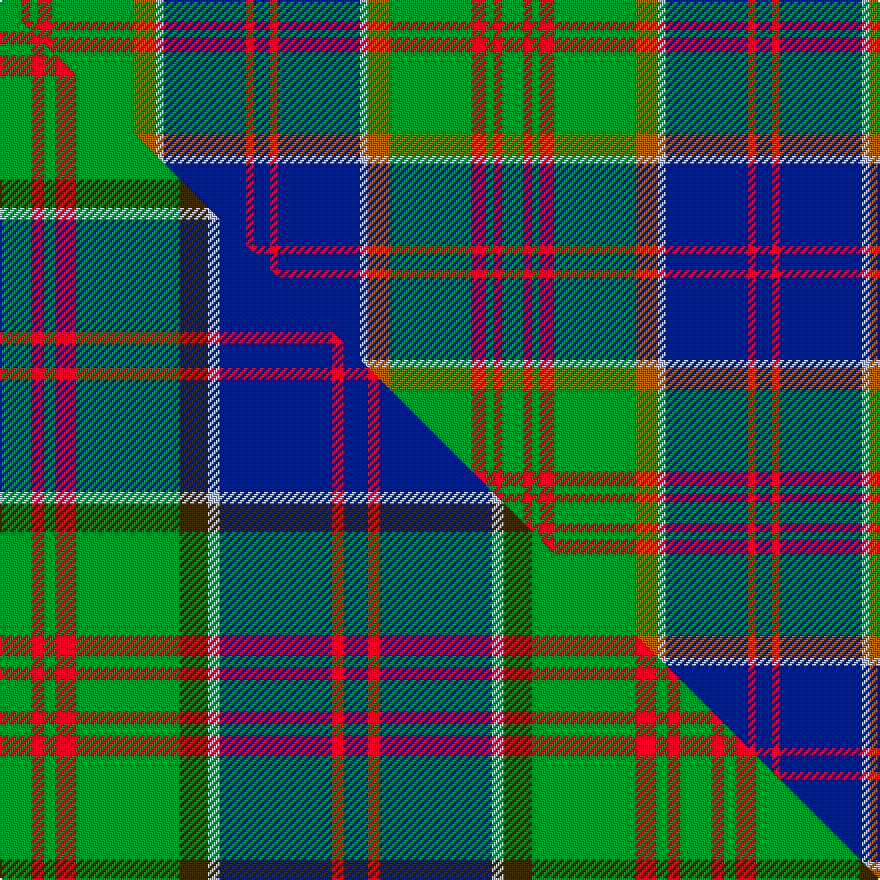

This is one **variant** — a specific cloth: this exact thread count and colourway, with its own
provenance below. It is one weaving of the [sett](/setts/g11r4g4r7g41o11lb4db41r4db8/) (the scale-free proportion — the
same cloth at any scale or shade), whose colour order is pattern [BRBWRGRGRG](/stripes/brbwrgrgrg/).

Part of the [Stewart of Appin Hunting](/tartans/stewart-of-appin-hunting/) tartan — the named design grouping this sett with its other cloths.

Sourced from weddslist.  It is a [10 stripe tartan](/stripes/stripes10/).

Original link [http://www.weddslist.com/cgi-bin/tartans/pg.pl?source=sts](http://www.weddslist.com/cgi-bin/tartans/pg.pl?source=sts)

Dataset <small>— provenance for this record, inherited from the source manifest</small>

<dl class="dataset-prov">
<dt>source</dt><dd><a href="/sources/weddslist/">Weddslist</a></dd>
<dt>data captured from</dt><dd><a href="https://github.com/thetartan/tartan-database/blob/master/data/weddslist/data.csv">https://github.com/thetartan/tartan-database/blob/master/data/weddslist/data.csv</a></dd>
<dt>data date</dt><dd>2016-11-17 <small>(dataset default)</small></dd>
<dt>licence</dt><dd><a href="https://creativecommons.org/licenses/by-nc-nd/4.0/">CC BY-NC-ND 4.0</a></dd>
</dl>

Capture chain <small>— the hands this data passed through, oldest first; each capture carries its own licence</small>

<ol class="capture-chain">
<li><a href="https://www.weddslist.com/tartans/">Weddslist</a> <small>the living privately compiled reference</small></li>
<li><a href="https://github.com/thetartan/tartan-database">thetartan/tartan-database</a> <small>2016-2017</small> · <a href="https://creativecommons.org/licenses/by-nc-nd/4.0/">CC BY-NC-ND 4.0</a> <small>Levko Kravets's frozen compilation — the capture we vendored, and where its CC licence text came from</small></li>
<li>this dictionary <small>captured 2026-06-10 · commit 5bf86c7566</small> <small>each re-capture is a git commit to data/sources</small></li>
</ol>

## Thread count
G/11 R4 G4 R7 G41 O11 LB4 DB41 R4 DB/8

One full sett is **251 threads**.

## Palette
<table><thead><tr><th>Colour</th><th>Shade</th><th>OKLCh</th></tr></thead><tbody><tr><td>DB</td><td><code style="background-color:#082077;">#082077</code> <small style="color:#888">#082077</small></td><td><small style="color:#888">oklch(30.0% 0.149 265.1)</small></td></tr><tr><td>LB</td><td><code style="background-color:#B5BBDE;">#B5BBDE</code> <small style="color:#888">#B5BBDE</small></td><td><small style="color:#888">oklch(79.9% 0.050 277.6)</small></td></tr><tr><td>G</td><td><code style="background-color:#008B2A;">#008B2A</code> <small style="color:#888">#008B2A</small></td><td><small style="color:#888">oklch(55.4% 0.170 145.9)</small></td></tr><tr><td>O</td><td><code style="background-color:#A65C11;">#A65C11</code> <small style="color:#888">#A65C11</small></td><td><small style="color:#888">oklch(55.0% 0.125 58.3)</small></td></tr><tr><td>R</td><td><code style="background-color:#D60020;">#D60020</code> <small style="color:#888">#D60020</small></td><td><small style="color:#888">oklch(55.2% 0.224 25.5)</small></td></tr></tbody></table>

# Sample pattern

## Compared to the master

This cloth is one sett of its design; the master sett (the exemplar the design is anchored on) is below for comparison.

Its **ΔTartan distance** from the master is **0.45** — the same measure the nearest-tartans table ranks by (0 is identical; a re-scale of the same cloth is near 0, a recolour or a different proportion further).

<figure class="master-compare" style="margin:0">

this sett
master sett ★

<figcaption style="color:#888;font-size:smaller">One weave of this sett against the <a href="/setts/g8r3g3r5g26dy7lb3db28r3db6/">master sett ★</a>, split on the diagonal: a shared proportion runs seamlessly across it with only the shades shifting; a different proportion breaks on it.</figcaption>
</figure>

## Nearest tartan variants

The nearest existing variants by ΔTartan distance, with this cloth at the top so the swatches line up against it.

ΔTartan

Threads

Variant

Sett

—

251

<a href="/variants/s10/g11r4g4r7g41o11lb4db41r4db8/">Stewart of Appin, Ancient hunting</a>

<a href="/ttd/edit/#slug=g11r4g4r7g41dy11lb4db41r4db8&amp;base=g11r4g4r7g41o11lb4db41r4db8" title="compare in the TTD">0.30</a>

251

<a href="/variants/s10/g11r4g4r7g41dy11lb4db41r4db8/">Stewart of Appin Hunting Clan Tartan</a>

<a href="/ttd/edit/#slug=g8r3g3r5g26dy7lb3db28r3db6~x2&amp;base=g11r4g4r7g41o11lb4db41r4db8" title="compare in the TTD">0.45</a>

340

<a href="/variants/s10/g8r3g3r5g26dy7lb3db28r3db6~x2/">Stewart of Appin Hunting</a>

<a href="/ttd/edit/#slug=g11r4g4r7g41db11lb4db41r4db8&amp;base=g11r4g4r7g41o11lb4db41r4db8" title="compare in the TTD">1.10</a>

251

<a href="/variants/s10/g11r4g4r7g41db11lb4db41r4db8/">Stuart/Stewart of Appin #2</a>

<a href="/ttd/edit/#slug=g8r3g3r5g26db7lb3db28r3db6~x2&amp;base=g11r4g4r7g41o11lb4db41r4db8" title="compare in the TTD">1.24</a>

340

<a href="/variants/s10/g8r3g3r5g26db7lb3db28r3db6~x2/">Stewart of Appin Htg (error)</a>

<a href="/ttd/edit/#slug=g5dt2g17ly2db5ly2o5db17g2ly4~x2&amp;base=g11r4g4r7g41o11lb4db41r4db8" title="compare in the TTD">1.66</a>

226

<a href="/variants/s10/g5dt2g17ly2db5ly2o5db17g2ly4~x2/">Antrim Irish County Tartan</a>

<a href="/ttd/edit/#slug=b16w3b2dy4g24r2g4r5g4r2lb8~x2&amp;base=g11r4g4r7g41o11lb4db41r4db8" title="compare in the TTD">1.66</a>

248

<a href="/variants/s11/b16w3b2dy4g24r2g4r5g4r2lb8~x2/">Currie of Arran (Clan/family)</a>

<a href="/ttd/edit/#slug=b16w3b2dy4g24r2g4r5g4r2t8~x2&amp;base=g11r4g4r7g41o11lb4db41r4db8" title="compare in the TTD">1.66</a>

248

<a href="/variants/s11/b16w3b2dy4g24r2g4r5g4r2t8~x2/">Currie of Arran</a>

<a href="/ttd/edit/#slug=db18w1db4w1lo4g1lo2g12r2g4~x2~w4000000-lo2804072&amp;base=g11r4g4r7g41o11lb4db41r4db8" title="compare in the TTD">1.68</a>

152

<a href="/variants/s10/db18w1db4w1lo4g1lo2g12r2g4~x2~w4000000-lo2804072/">Michigan, State of (District)</a>

<a href="/ttd/edit/#slug=db18w1db4w1lo4g1lo2g12r2g4~x2~w4000000-r1707033&amp;base=g11r4g4r7g41o11lb4db41r4db8" title="compare in the TTD">1.68</a>

152

<a href="/variants/s10/db18w1db4w1lo4g1lo2g12r2g4~x2~w4000000-r1707033/">Michigan State District Tartan</a>

<a href="/ttd/edit/#slug=dy5w3dy30db6g3db3g3db3g15r3~x2&amp;base=g11r4g4r7g41o11lb4db41r4db8" title="compare in the TTD">1.94</a>

280

<a href="/variants/s10/dy5w3dy30db6g3db3g3db3g15r3~x2/">Chisholm Hunting #2</a>

## Neighbour map

Every grey dot is one of 13621 variants placed by the first two principal components of the ΔTartan feature space (42% of its variance). Red is this tartan; blue dots are its nearest — click one to open its page.

<svg viewBox="0 0 640 380" role="img" style="max-width:100%;height:auto;border:1px solid #e0e0e0;border-radius:4px;display:block" xmlns="http://www.w3.org/2000/svg"><image href="/nn/cloud.v1.png" width="640" height="380"/><a href="/variants/s10/g11r4g4r7g41dy11lb4db41r4db8/"><circle cx="217.2" cy="171.2" r="4" fill="#3465a4"><title>Stewart of Appin Hunting Clan Tartan</title></circle></a><a href="/variants/s10/g8r3g3r5g26dy7lb3db28r3db6~x2/"><circle cx="184.4" cy="153.1" r="4" fill="#3465a4"><title>Stewart of Appin Hunting</title></circle></a><a href="/variants/s10/g11r4g4r7g41db11lb4db41r4db8/"><circle cx="258.5" cy="182.6" r="4" fill="#3465a4"><title>Stuart/Stewart of Appin #2</title></circle></a><a href="/variants/s10/g8r3g3r5g26db7lb3db28r3db6~x2/"><circle cx="250.1" cy="189.0" r="4" fill="#3465a4"><title>Stewart of Appin Htg (error)</title></circle></a><a href="/variants/s10/g5dt2g17ly2db5ly2o5db17g2ly4~x2/"><circle cx="188.6" cy="190.0" r="4" fill="#3465a4"><title>Antrim Irish County Tartan</title></circle></a><a href="/variants/s11/b16w3b2dy4g24r2g4r5g4r2lb8~x2/"><circle cx="200.3" cy="155.6" r="4" fill="#3465a4"><title>Currie of Arran (Clan/family)</title></circle></a><a href="/variants/s11/b16w3b2dy4g24r2g4r5g4r2t8~x2/"><circle cx="216.1" cy="162.3" r="4" fill="#3465a4"><title>Currie of Arran</title></circle></a><a href="/variants/s10/db18w1db4w1lo4g1lo2g12r2g4~x2~w4000000-lo2804072/"><circle cx="238.9" cy="142.1" r="4" fill="#3465a4"><title>Michigan, State of (District)</title></circle></a><a href="/variants/s10/db18w1db4w1lo4g1lo2g12r2g4~x2~w4000000-r1707033/"><circle cx="232.0" cy="139.6" r="4" fill="#3465a4"><title>Michigan State District Tartan</title></circle></a><a href="/variants/s10/dy5w3dy30db6g3db3g3db3g15r3~x2/"><circle cx="251.8" cy="167.1" r="4" fill="#3465a4"><title>Chisholm Hunting #2</title></circle></a><circle cx="217.6" cy="171.0" r="5" fill="#c00000"/><text x="320" y="376" text-anchor="middle" font-size="11" fill="#999">ground</text><text x="11" y="190" text-anchor="middle" font-size="11" fill="#999" transform="rotate(-90 11 190)">complexity</text></svg>

ID: /variants/s10/g11r4g4r7g41o11lb4db41r4db8/
