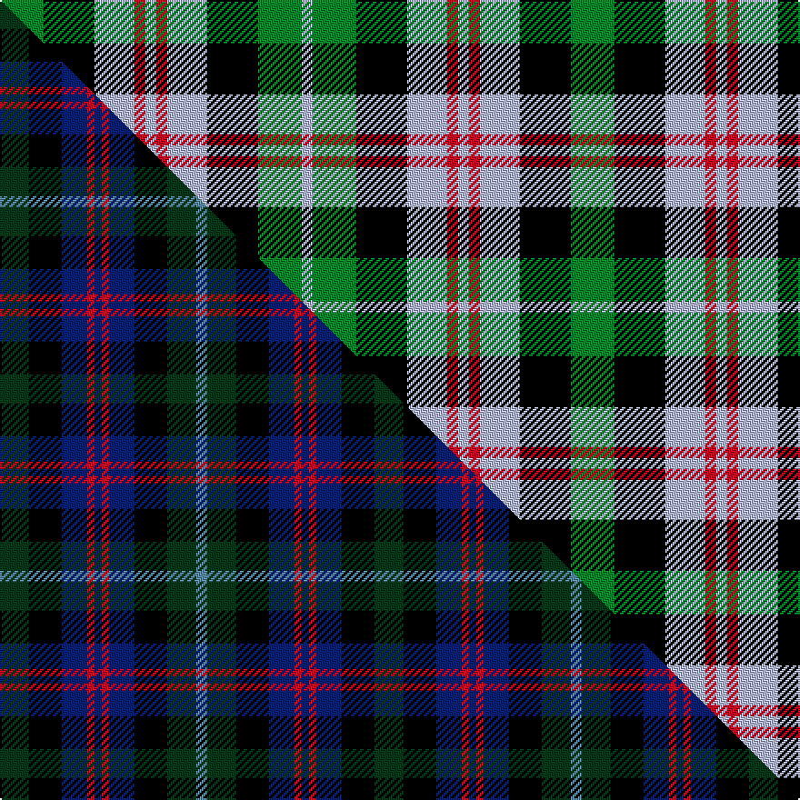

This is one **variant** — a specific cloth: this exact thread count and colourway, with its own
provenance below. It is one weaving of the [sett](/tartans/w/we/wellington/) (the scale-free proportion — the
same cloth at any scale or shade), whose colour order is pattern [GKWRWRWKGW](/stripes/gkwrwrwkgw/).

Part of the [Wellington](/tartans/w/we/wellington/) tartan — the named design grouping this sett with its other cloths.

Sourced from register-of-tartans.  It is a [10 stripe tartan](/stripes/stripes10/).

Original link [https://www.tartanregister.gov.uk/tartanDetails.aspx?ref=4841](https://www.tartanregister.gov.uk/tartanDetails.aspx?ref=4841)

Dataset <small>— provenance for this record, inherited from the source manifest</small>

<dl class="dataset-prov">
<dt>source</dt><dd><a href="/sources/register-of-tartans/">Scottish Register of Tartans</a></dd>
<dt>data captured from</dt><dd><a href="https://github.com/thetartan/tartan-database/blob/master/data/register-of-tartans/data.csv">https://github.com/thetartan/tartan-database/blob/master/data/register-of-tartans/data.csv</a></dd>
<dt>data date</dt><dd>1819 <small>(this record)</small></dd>
<dt>licence</dt><dd><a href="https://www.tartanregister.gov.uk/copyright">Crown copyright</a></dd>
</dl>

Capture chain <small>— the hands this data passed through, oldest first; each capture carries its own licence</small>

<ol class="capture-chain">
<li><a href="https://www.tartanregister.gov.uk/">Scottish Register of Tartans</a> · <a href="https://www.tartanregister.gov.uk/copyright">Crown copyright</a> <small>the living register — still published by National Records of Scotland</small></li>
<li><a href="https://github.com/thetartan/tartan-database">thetartan/tartan-database</a> <small>2016-2017</small> · <a href="https://creativecommons.org/licenses/by-nc-nd/4.0/">CC BY-NC-ND 4.0</a> <small>Levko Kravets's frozen compilation — the capture we vendored, and where its CC licence text came from</small></li>
<li>this dictionary <small>captured 2026-06-10 · commit 5bf86c7566</small> <small>each re-capture is a git commit to data/sources</small></li>
</ol>

## Register references

External register numbers recorded for this tartan.

- Scottish Register of Tartans: [4841](https://www.tartanregister.gov.uk/tartanDetails.aspx?ref=4841)
- Scottish Tartans Authority (ITI): 3087

## Thread count
G/24 K28 LB22 R6 LB6 R6 LB22 K28 G24 LB/6

One full sett is **314 threads**.

## Palette
<table><thead><tr><th>Colour</th><th>Shade</th><th>OKLCh</th></tr></thead><tbody><tr><td>LB</td><td><code style="background-color:#B5BBDE;">#B5BBDE</code> <small style="color:#888">#B5BBDE</small></td><td><small style="color:#888">oklch(79.9% 0.050 277.6)</small></td></tr><tr><td>G</td><td><code style="background-color:#008B2A;">#008B2A</code> <small style="color:#888">#008B2A</small></td><td><small style="color:#888">oklch(55.4% 0.170 145.9)</small></td></tr><tr><td>K</td><td><code style="background-color:#000000;">#000000</code> <small style="color:#888">#000000</small></td><td><small style="color:#888">oklch(0.0% 0.000 0.0)</small></td></tr><tr><td>R</td><td><code style="background-color:#D60020;">#D60020</code> <small style="color:#888">#D60020</small></td><td><small style="color:#888">oklch(55.2% 0.224 25.5)</small></td></tr></tbody></table>

# Sample pattern

## Compared to the master

This cloth is one sett of its design; the master sett (the exemplar the design is anchored on) is below for comparison.

Its **ΔTartan distance** from the master is **1.07** — the same measure the nearest-tartans table ranks by (0 is identical; a re-scale of the same cloth is near 0, a recolour or a different proportion further).

<figure class="master-compare" style="margin:0">

this sett
master sett ★

<figcaption style="color:#888;font-size:smaller">One weave of this sett against the <a href="/setts/dg8k9db7r2db2r2db7k9dg8t3/">master sett ★</a>, split on the diagonal: a shared proportion runs seamlessly across it with only the shades shifting; a different proportion breaks on it.</figcaption>
</figure>

## Nearest tartan variants

The nearest existing variants by ΔTartan distance, with this cloth at the top so the swatches line up against it.

ΔTartan

Threads

Variant

Sett

—

314

<a href="/variants/s10/g12k14lb11r3lb3r3lb11k14g12lb3~x2/">Wellington (Wilson) #2</a>

<a href="/ttd/edit/#slug=w8k4w8k2w3k8dg8r2dg8k4~x2&amp;base=g12k14lb11r3lb3r3lb11k14g12lb3~x2" title="compare in the TTD">1.29</a>

196

<a href="/variants/s10/w8k4w8k2w3k8dg8r2dg8k4~x2/">Ferguson Dress variation</a>

<a href="/ttd/edit/#slug=g12k14lb11k3lb3k3lb11k14g12lb3~x2&amp;base=g12k14lb11r3lb3r3lb11k14g12lb3~x2" title="compare in the TTD">2.10</a>

314

<a href="/variants/s10/g12k14lb11k3lb3k3lb11k14g12lb3~x2/">Wilson's No.166</a>

<a href="/ttd/edit/#slug=db7r3db9r2k10g9r3g2r2g7~x2&amp;base=g12k14lb11r3lb3r3lb11k14g12lb3~x2" title="compare in the TTD">2.12</a>

188

<a href="/variants/s10/db7r3db9r2k10g9r3g2r2g7~x2/">Cameron (altered by weaver)</a>

<a href="/ttd/edit/#slug=w2db10k10g11db2w2~x2~db1406275&amp;base=g12k14lb11r3lb3r3lb11k14g12lb3~x2" title="compare in the TTD">2.53</a>

140

<a href="/variants/s6/w2db10k10g11db2w2~x2~db1406275/">Norwich No.026</a>

<a href="/ttd/edit/#slug=t10k3t10k14r2g14r5~x2&amp;base=g12k14lb11r3lb3r3lb11k14g12lb3~x2" title="compare in the TTD">2.60</a>

202

<a href="/variants/s7/t10k3t10k14r2g14r5~x2/">Fletcher of Dunans</a>

<a href="/ttd/edit/#slug=lb3g12k14lb11r3lb3~x2&amp;base=g12k14lb11r3lb3r3lb11k14g12lb3~x2" title="compare in the TTD">2.60</a>

172

<a href="/variants/s6/lb3g12k14lb11r3lb3~x2/">Wellington or Waterloo</a>

<a href="/ttd/edit/#slug=db8r2db2r4db10r2k11g10r4g2r2g8~x2&amp;base=g12k14lb11r3lb3r3lb11k14g12lb3~x2" title="compare in the TTD">2.62</a>

228

<a href="/variants/s12/db8r2db2r4db10r2k11g10r4g2r2g8~x2/">MacDonald #6</a>

<a href="/ttd/edit/#slug=lb3g6k6lb4r1lb1~x2&amp;base=g12k14lb11r3lb3r3lb11k14g12lb3~x2" title="compare in the TTD">2.69</a>

76

<a href="/variants/s6/lb3g6k6lb4r1lb1~x2/">Wellington or Waterloo Commemorative Tartan</a>

<a href="/ttd/edit/#slug=k4b9k13g6b3g9w4~x2&amp;base=g12k14lb11r3lb3r3lb11k14g12lb3~x2" title="compare in the TTD">2.69</a>

176

<a href="/variants/s7/k4b9k13g6b3g9w4~x2/">Ramsay, Red</a>

<a href="/ttd/edit/#slug=r3t10k10g10r3g10k10t2k2t2k2t5k2~x4&amp;base=g12k14lb11r3lb3r3lb11k14g12lb3~x2" title="compare in the TTD">2.70</a>

548

<a href="/variants/s13/r3t10k10g10r3g10k10t2k2t2k2t5k2~x4/">Blairgowrie High School (SA)</a>

## Neighbour map

Every grey dot is one of 13656 variants placed by the first two principal components of the ΔTartan feature space (42% of its variance). Red is this tartan; blue dots are its nearest — click one to open its page. The map is a flat projection of a many-dimensional space — [how to read it](/posts/neighbourhood-maps/).

<svg viewBox="0 0 640 380" role="img" style="max-width:100%;height:auto;border:1px solid #e0e0e0;border-radius:4px;display:block" xmlns="http://www.w3.org/2000/svg"><image href="/nn/cloud.v1.png" width="640" height="380"/><a href="/variants/s10/w8k4w8k2w3k8dg8r2dg8k4~x2/"><circle cx="60.5" cy="240.2" r="4" fill="#3465a4"><title>Ferguson Dress variation</title></circle></a><a href="/variants/s10/g12k14lb11k3lb3k3lb11k14g12lb3~x2/"><circle cx="119.1" cy="242.5" r="4" fill="#3465a4"><title>Wilson's No.166</title></circle></a><a href="/variants/s10/db7r3db9r2k10g9r3g2r2g7~x2/"><circle cx="85.9" cy="225.5" r="4" fill="#3465a4"><title>Cameron (altered by weaver)</title></circle></a><a href="/variants/s6/w2db10k10g11db2w2~x2~db1406275/"><circle cx="96.3" cy="223.3" r="4" fill="#3465a4"><title>Norwich No.026</title></circle></a><a href="/variants/s7/t10k3t10k14r2g14r5~x2/"><circle cx="100.1" cy="229.6" r="4" fill="#3465a4"><title>Fletcher of Dunans</title></circle></a><a href="/variants/s6/lb3g12k14lb11r3lb3~x2/"><circle cx="104.2" cy="240.4" r="4" fill="#3465a4"><title>Wellington or Waterloo</title></circle></a><a href="/variants/s12/db8r2db2r4db10r2k11g10r4g2r2g8~x2/"><circle cx="83.7" cy="207.4" r="4" fill="#3465a4"><title>MacDonald #6</title></circle></a><a href="/variants/s6/lb3g6k6lb4r1lb1~x2/"><circle cx="115.9" cy="235.4" r="4" fill="#3465a4"><title>Wellington or Waterloo Commemorative Tartan</title></circle></a><a href="/variants/s7/k4b9k13g6b3g9w4~x2/"><circle cx="77.5" cy="254.9" r="4" fill="#3465a4"><title>Ramsay, Red</title></circle></a><a href="/variants/s13/r3t10k10g10r3g10k10t2k2t2k2t5k2~x4/"><circle cx="93.2" cy="204.0" r="4" fill="#3465a4"><title>Blairgowrie High School (SA)</title></circle></a><circle cx="69.3" cy="230.4" r="5" fill="#c00000"/><text x="320" y="376" text-anchor="middle" font-size="11" fill="#999">ground</text><text x="11" y="190" text-anchor="middle" font-size="11" fill="#999" transform="rotate(-90 11 190)">complexity</text></svg>

ID: /variants/s10/g12k14lb11r3lb3r3lb11k14g12lb3~x2/
