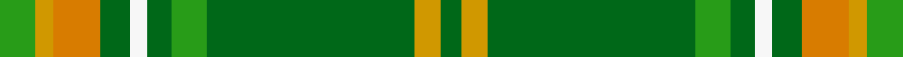
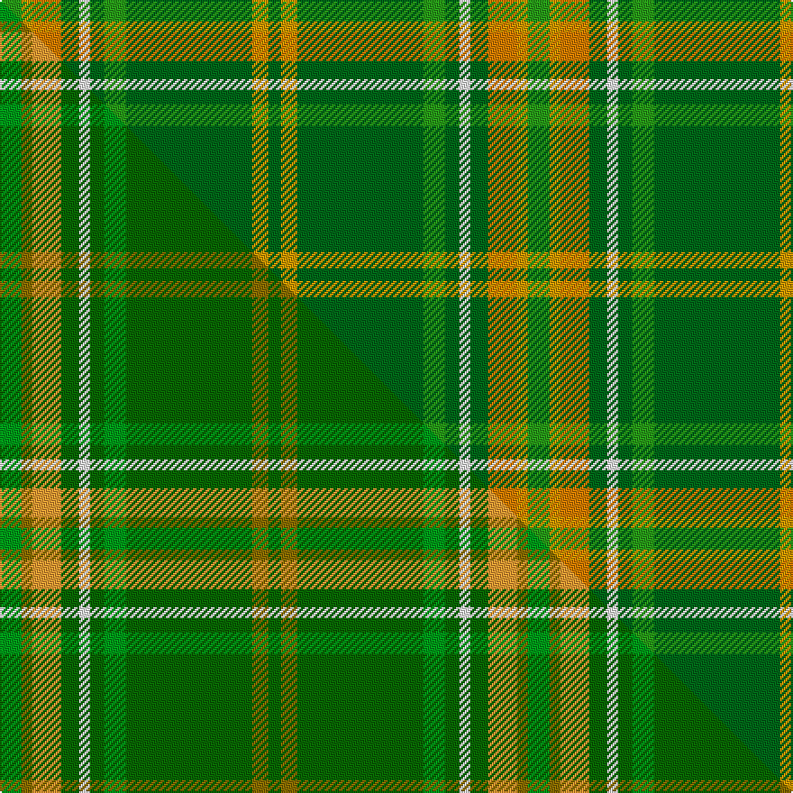

This page is one **sett** — a single exact thread-count. It belongs to the [tartan](/setts/g12loi6lo16dg10w6dg8g12dg70loi9dg7/)
(the same proportion at any scale), whose colour order is pattern [GYGGGWGYYG](/stripes/gygggwgyyg/).

Part of the [Rams Timeless](/tartans/rams-timeless/) tartan — the named design grouping this sett with its other cloths.

Sourced from tartans-authority.  It is a [10 stripe tartan](/stripes/stripes10/).

Original link http://www.tartansauthority.com/tartan-ferret/display/10859/

## Register references

External register numbers recorded for this tartan.

- Scottish Register of Tartans: [10859](https://www.tartanregister.gov.uk/tartanDetails?ref=10859)
- Scottish Tartans Authority (ITI): 10859

## Thread count
G/12 LOi6 LO16 DG10 W6 DG8 G12 DG70 LOi9 DG/7

One full sett is **293 threads**.

## Palette
<table><thead><tr><th>Colour</th><th>Shade</th><th>OKLCh</th></tr></thead><tbody><tr><td>LO</td><td><code style="background-color:#D09800;">#D09800</code> <small style="color:#888">#D09800</small></td><td><small style="color:#888">oklch(71.4% 0.147 82.1)</small></td></tr><tr><td>G</td><td><code style="background-color:#289C18;">#289C18</code> <small style="color:#888">#289C18</small></td><td><small style="color:#888">oklch(60.6% 0.191 141.6)</small></td></tr><tr><td>DG</td><td><code style="background-color:#006818;">#006818</code> <small style="color:#888">#006818</small></td><td><small style="color:#888">oklch(45.0% 0.142 145.0)</small></td></tr><tr><td>LO</td><td><code style="background-color:#D87C00;">#D87C00</code> <small style="color:#888">#D87C00</small></td><td><small style="color:#888">oklch(67.3% 0.155 61.8)</small></td></tr><tr><td>W</td><td><code style="background-color:#F7F7F7;">#F7F7F7</code> <small style="color:#888">#F7F7F7</small></td><td><small style="color:#888">oklch(97.6% 0.000 89.9)</small></td></tr></tbody></table>

# Sample pattern

## Compared to the master

This cloth is one sett of its design; the master sett (the exemplar the design is anchored on) is below for comparison.

Its **ΔTartan distance** from the master is **0.17** — the same measure the nearest-tartans table ranks by (0 is identical; a re-scale of the same cloth is near 0, a recolour or a different proportion further).

<figure class="master-compare" style="margin:0">

this sett
master sett ★

<figcaption style="color:#888;font-size:smaller">One weave of this sett against the <a href="/setts/g12y6lo16dg10w6dg8g12dg70y9dg7/">master sett ★</a>, split on the diagonal: a shared proportion runs seamlessly across it with only the shades shifting; a different proportion breaks on it.</figcaption>
</figure>

## Nearest tartan variants

The nearest existing variants by ΔTartan distance, with this cloth at the top so the swatches line up against it.

ΔTartan

Threads

Variant

Sett

—

293

<a href="/variants/s10/g12loi6lo16dg10w6dg8g12dg70loi9dg7~g2408144-loi2906085-lo2706066-dg1806142/">Rams Timeless</a>

<a href="/ttd/edit/#slug=g12y6lo16dg10w6dg8g12dg70y9dg7~g2408144-dg1806142&amp;base=g12loi6lo16dg10w6dg8g12dg70loi9dg7~g2408144-loi2906085-lo2706066-dg1806142" title="compare in the TTD">0.00</a>

293

<a href="/variants/s10/g12y6lo16dg10w6dg8g12dg70y9dg7~g2408144-dg1806142/">Rams Timeless</a>

## Neighbour map

Every grey dot is one of 13620 variants placed by the first two principal components of the ΔTartan feature space (42% of its variance). Red is this tartan; blue dots are its nearest — click one to open its page.

<svg viewBox="0 0 640 380" role="img" style="max-width:100%;height:auto;border:1px solid #e0e0e0;border-radius:4px;display:block" xmlns="http://www.w3.org/2000/svg"><image href="/nn/cloud.v1.png" width="640" height="380"/><a href="/variants/s10/g12y6lo16dg10w6dg8g12dg70y9dg7~g2408144-dg1806142/"><circle cx="391.6" cy="191.0" r="4" fill="#3465a4"><title>Rams Timeless</title></circle></a><circle cx="392.3" cy="190.8" r="5" fill="#c00000"/><text x="320" y="376" text-anchor="middle" font-size="11" fill="#999">ground</text><text x="11" y="190" text-anchor="middle" font-size="11" fill="#999" transform="rotate(-90 11 190)">complexity</text></svg>

ID: /variants/s10/g12loi6lo16dg10w6dg8g12dg70loi9dg7~g2408144-loi2906085-lo2706066-dg1806142/
