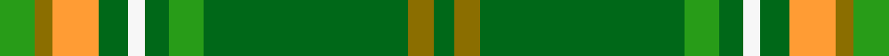

This is one **variant** — a specific cloth: this exact thread count and colourway, with its own
provenance below. It is one weaving of the [sett](/tartans/r/ra/rams-timeless/) (the scale-free proportion — the
same cloth at any scale or shade), whose colour order is pattern [GGGGGWGYGG](/stripes/gggggwgygg/).

Part of the [Rams Timeless](/tartans/r/ra/rams-timeless/) tartan — the named design grouping this sett with its other cloths.

Sourced from register-of-tartans.  It is a [10 stripe tartan](/stripes/stripes10/).

Original link [https://www.tartanregister.gov.uk/tartanDetails.aspx?ref=10859](https://www.tartanregister.gov.uk/tartanDetails.aspx?ref=10859)

Dataset <small>— provenance for this record, inherited from the source manifest</small>

<dl class="dataset-prov">
<dt>source</dt><dd><a href="/sources/register-of-tartans/">Scottish Register of Tartans</a></dd>
<dt>data captured from</dt><dd><a href="https://github.com/thetartan/tartan-database/blob/master/data/register-of-tartans/data.csv">https://github.com/thetartan/tartan-database/blob/master/data/register-of-tartans/data.csv</a></dd>
<dt>data date</dt><dd>08/03/2013 <small>(this record)</small></dd>
<dt>licence</dt><dd><a href="https://www.tartanregister.gov.uk/copyright">Crown copyright</a></dd>
</dl>

Capture chain <small>— the hands this data passed through, oldest first; each capture carries its own licence</small>

<ol class="capture-chain">
<li><a href="https://www.tartanregister.gov.uk/">Scottish Register of Tartans</a> · <a href="https://www.tartanregister.gov.uk/copyright">Crown copyright</a> <small>the living register — still published by National Records of Scotland</small></li>
<li><a href="https://github.com/thetartan/tartan-database">thetartan/tartan-database</a> <small>2016-2017</small> · <a href="https://creativecommons.org/licenses/by-nc-nd/4.0/">CC BY-NC-ND 4.0</a> <small>Levko Kravets's frozen compilation — the capture we vendored, and where its CC licence text came from</small></li>
<li>this dictionary <small>captured 2026-06-10 · commit 5bf86c7566</small> <small>each re-capture is a git commit to data/sources</small></li>
</ol>

## Register references

External register numbers recorded for this tartan.

- Scottish Register of Tartans: [10859](https://www.tartanregister.gov.uk/tartanDetails.aspx?ref=10859)

## Thread count
G/12 Y6 LO16 DG10 W6 DG8 G12 DG70 Y9 DG/7

One full sett is **293 threads**.

## Palette
<table><thead><tr><th>Colour</th><th>Shade</th><th>OKLCh</th></tr></thead><tbody><tr><td>DG</td><td><code style="background-color:#006818;">#006818</code> <small style="color:#888">#006818</small></td><td><small style="color:#888">oklch(45.0% 0.142 145.0)</small></td></tr><tr><td>G</td><td><code style="background-color:#289C18;">#289C18</code> <small style="color:#888">#289C18</small></td><td><small style="color:#888">oklch(60.6% 0.191 141.6)</small></td></tr><tr><td>Y</td><td><code style="background-color:#8B6E00;">#8B6E00</code> <small style="color:#888">#8B6E00</small></td><td><small style="color:#888">oklch(55.1% 0.113 90.4)</small></td></tr><tr><td>LO</td><td><code style="background-color:#FF9C34;">#FF9C34</code> <small style="color:#888">#FF9C34</small></td><td><small style="color:#888">oklch(77.9% 0.161 61.8)</small></td></tr><tr><td>W</td><td><code style="background-color:#F7F7F7;">#F7F7F7</code> <small style="color:#888">#F7F7F7</small></td><td><small style="color:#888">oklch(97.6% 0.000 89.9)</small></td></tr></tbody></table>

# Sample pattern

[Sample sheet (PDF)](swatch.pdf) — the woven sample, thread count and palette on one printable A4, rendered on demand (the same sheet the TTD print page downloads).

## Nearest tartan variants

The nearest existing variants by ΔTartan distance, with this cloth at the top so the swatches line up against it.

ΔTartan

Threads

Variant

Sett

—

293

<a href="/variants/s10/g12y6lo16dg10w6dg8g12dg70y9dg7~g6019141-dg4514144/">Rams Timeless</a>

<a href="/ttd/edit/#slug=g12loi6lo16dg10w6dg8g12dg70loi9dg7~g6019141-loi7115081-lo6715063-dg4514144&amp;base=g12y6lo16dg10w6dg8g12dg70y9dg7~g6019141-dg4514144" title="compare in the TTD">0.06</a>

293

<a href="/variants/s10/g12loi6lo16dg10w6dg8g12dg70loi9dg7~g6019141-loi7115081-lo6715063-dg4514144/">Rams Timeless</a>

<a href="/ttd/edit/#slug=dt37g27w2dt4r6dt4w2g27dt37y2~x2&amp;base=g12y6lo16dg10w6dg8g12dg70y9dg7~g6019141-dg4514144" title="compare in the TTD">2.21</a>

514

<a href="/variants/s10/dt37g27w2dt4r6dt4w2g27dt37y2~x2/">Highlands of Durham</a>

<a href="/ttd/edit/#slug=w2g4dg16g2dp2g25dg8g2dg2g25dp2g2dp6g2w2~x2~g6019141-dg4514144&amp;base=g12y6lo16dg10w6dg8g12dg70y9dg7~g6019141-dg4514144" title="compare in the TTD">2.97</a>

400

<a href="/variants/s15/w2g4dg16g2dp2g25dg8g2dg2g25dp2g2dp6g2w2~x2~g6019141-dg4514144/">Beechgrove Garden, The</a>

<a href="/ttd/edit/#slug=g20y2n5w4g2n2g2n2t6~x2~w98&amp;base=g12y6lo16dg10w6dg8g12dg70y9dg7~g6019141-dg4514144" title="compare in the TTD">3.02</a>

128

<a href="/variants/s9/g20y2n5w4g2n2g2n2t6~x2~w98/">Boucherville</a>

<a href="/ttd/edit/#slug=g20y2n5w4g2n2g2n2t6~x2&amp;base=g12y6lo16dg10w6dg8g12dg70y9dg7~g6019141-dg4514144" title="compare in the TTD">3.09</a>

128

<a href="/variants/s9/g20y2n5w4g2n2g2n2t6~x2/">Boucherville (District)</a>

<a href="/ttd/edit/#slug=dp2y25dg8y2dg2y25dp2y2dp6y2w2y4dg16y2~x2~y6212135-dg3710150&amp;base=g12y6lo16dg10w6dg8g12dg70y9dg7~g6019141-dg4514144" title="compare in the TTD">3.36</a>

392

<a href="/variants/s14/dp2y25dg8y2dg2y25dp2y2dp6y2w2y4dg16y2~x2~y6212135-dg3710150/">Beechgrove Garden, The</a>

<a href="/ttd/edit/#slug=g14y7g14dg50g64w6g7&amp;base=g12y6lo16dg10w6dg8g12dg70y9dg7~g6019141-dg4514144" title="compare in the TTD">3.50</a>

303

<a href="/variants/s7/g14y7g14dg50g64w6g7/">Freedom of Derry</a>

<a href="/ttd/edit/#slug=g55dbi7dr24g12db4dy3db4~x2~dbi3514276-db3409246&amp;base=g12y6lo16dg10w6dg8g12dg70y9dg7~g6019141-dg4514144" title="compare in the TTD">3.51</a>

318

<a href="/variants/s7/g55dbi7dr24g12db4dy3db4~x2~dbi3514276-db3409246/">Crieff &amp; Strathearn #1</a>

<a href="/ttd/edit/#slug=y5g3y3g53dr7db5dr13w4~x2&amp;base=g12y6lo16dg10w6dg8g12dg70y9dg7~g6019141-dg4514144" title="compare in the TTD">3.58</a>

354

<a href="/variants/s8/y5g3y3g53dr7db5dr13w4~x2/">Hall (P.I.E.) (Personal)</a>

<a href="/ttd/edit/#slug=dt16g4dt3g3lo2g24dr2~x2&amp;base=g12y6lo16dg10w6dg8g12dg70y9dg7~g6019141-dg4514144" title="compare in the TTD">3.70</a>

180

<a href="/variants/s7/dt16g4dt3g3lo2g24dr2~x2/">St. Andrews Links (Corporate)</a>

## Neighbour map

Every grey dot is one of 13662 variants placed by the first two principal components of the ΔTartan feature space (42% of its variance). Red is this tartan; blue dots are its nearest — click one to open its page. The map is a flat projection of a many-dimensional space — [how to read it](/posts/neighbourhood-maps/).

<svg viewBox="0 0 640 380" role="img" style="max-width:100%;height:auto;border:1px solid #e0e0e0;border-radius:4px;display:block" xmlns="http://www.w3.org/2000/svg"><image href="/nn/cloud.v1.png" width="640" height="380"/><a href="/variants/s10/g12loi6lo16dg10w6dg8g12dg70loi9dg7~g6019141-loi7115081-lo6715063-dg4514144/"><circle cx="392.4" cy="191.0" r="4" fill="#3465a4"><title>Rams Timeless</title></circle></a><a href="/variants/s10/dt37g27w2dt4r6dt4w2g27dt37y2~x2/"><circle cx="339.5" cy="163.9" r="4" fill="#3465a4"><title>Highlands of Durham</title></circle></a><a href="/variants/s15/w2g4dg16g2dp2g25dg8g2dg2g25dp2g2dp6g2w2~x2~g6019141-dg4514144/"><circle cx="395.7" cy="184.1" r="4" fill="#3465a4"><title>Beechgrove Garden, The</title></circle></a><a href="/variants/s9/g20y2n5w4g2n2g2n2t6~x2~w98/"><circle cx="350.0" cy="212.7" r="4" fill="#3465a4"><title>Boucherville</title></circle></a><a href="/variants/s9/g20y2n5w4g2n2g2n2t6~x2/"><circle cx="354.7" cy="214.3" r="4" fill="#3465a4"><title>Boucherville (District)</title></circle></a><a href="/variants/s14/dp2y25dg8y2dg2y25dp2y2dp6y2w2y4dg16y2~x2~y6212135-dg3710150/"><circle cx="404.1" cy="182.1" r="4" fill="#3465a4"><title>Beechgrove Garden, The</title></circle></a><a href="/variants/s7/g14y7g14dg50g64w6g7/"><circle cx="406.4" cy="233.2" r="4" fill="#3465a4"><title>Freedom of Derry</title></circle></a><a href="/variants/s7/g55dbi7dr24g12db4dy3db4~x2~dbi3514276-db3409246/"><circle cx="404.4" cy="183.6" r="4" fill="#3465a4"><title>Crieff &amp; Strathearn #1</title></circle></a><a href="/variants/s8/y5g3y3g53dr7db5dr13w4~x2/"><circle cx="379.0" cy="157.1" r="4" fill="#3465a4"><title>Hall (P.I.E.) (Personal)</title></circle></a><a href="/variants/s7/dt16g4dt3g3lo2g24dr2~x2/"><circle cx="400.5" cy="221.9" r="4" fill="#3465a4"><title>St. Andrews Links (Corporate)</title></circle></a><circle cx="391.6" cy="191.1" r="5" fill="#c00000"/><text x="320" y="376" text-anchor="middle" font-size="11" fill="#999">ground</text><text x="11" y="190" text-anchor="middle" font-size="11" fill="#999" transform="rotate(-90 11 190)">complexity</text></svg>

ID: /variants/s10/g12y6lo16dg10w6dg8g12dg70y9dg7~g6019141-dg4514144/
