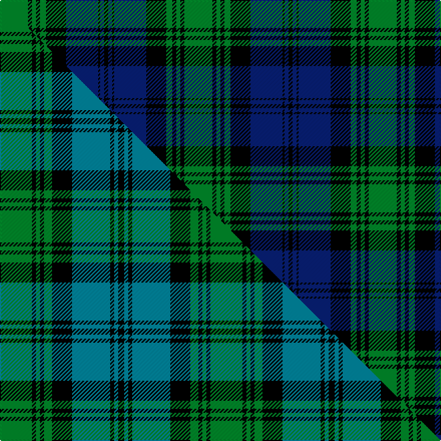

This is one **variant** — a specific cloth: this exact thread count and colourway, with its own
provenance below. It is one weaving of the [sett](/setts/g14k2g2k2g3k10db16k1db2k2/) (the scale-free proportion — the
same cloth at any scale or shade), whose colour order is pattern [GKGKGKBKBK](/stripes/gkgkgkbkbk/).

Part of the [Kerr Hunting](/tartans/kerr-hunting/) tartan — the named design grouping this sett with its other cloths.

Sourced from house-of-tartan.  It is a [10 stripe tartan](/stripes/stripes10/).

Original link [http://www.house-of-tartan.scotland.net/house/TartanViewjs.asp?colr=Def&tnam=782](http://www.house-of-tartan.scotland.net/house/TartanViewjs.asp?colr=Def&tnam=782)

## Provenance

Earliest known date: pre 2003 Nothing

2 attestations — the source records this cloth was collapsed from (oldest owns this page)

<ul>
<li>pre 2003 — Kerr Hunting Clan Tartan (house-of-tartan, <a href="http://www.house-of-tartan.scotland.net/house/TartanViewjs.asp?colr=Def&tnam=782">record</a>) </li>
<li>undated — Kerr, hunting (weddslist, <a href="http://www.weddslist.com/cgi-bin/tartans/pg.pl?source=sts">record</a>) </li>
</ul>

Dataset <small>— provenance for this record, inherited from the source manifest</small>

<dl class="dataset-prov">
<dt>source</dt><dd><a href="/sources/house-of-tartan/">House of Tartan</a></dd>
<dt>data captured from</dt><dd><a href="https://github.com/thetartan/tartan-database/blob/master/data/house-of-tartan/data.csv">https://github.com/thetartan/tartan-database/blob/master/data/house-of-tartan/data.csv</a></dd>
<dt>data date</dt><dd>pre 2003 <small>(this record)</small></dd>
<dt>licence</dt><dd><a href="https://creativecommons.org/licenses/by-nc-nd/4.0/">CC BY-NC-ND 4.0</a></dd>
</dl>

Capture chain <small>— the hands this data passed through, oldest first; each capture carries its own licence</small>

<ol class="capture-chain">
<li><a href="http://www.house-of-tartan.scotland.net/">House of Tartan</a> <small>the weaver/retailer's database — the site is now offline; the URL is kept as the ultimate source's identity</small></li>
<li><a href="https://github.com/thetartan/tartan-database">thetartan/tartan-database</a> <small>2016-2017</small> · <a href="https://creativecommons.org/licenses/by-nc-nd/4.0/">CC BY-NC-ND 4.0</a> <small>Levko Kravets's frozen compilation — the capture we vendored, and where its CC licence text came from</small></li>
<li>this dictionary <small>captured 2026-06-10 · commit 5bf86c7566</small> <small>each re-capture is a git commit to data/sources</small></li>
</ol>

## Thread count
G/28 K4 G4 K4 G6 K20 DB32 K2 DB4 K/4

One full sett is **184 threads**.

## Palette
<table><thead><tr><th>Colour</th><th>Shade</th><th>OKLCh</th></tr></thead><tbody><tr><td>DB</td><td><code style="background-color:#082077;">#082077</code> <small style="color:#888">#082077</small></td><td><small style="color:#888">oklch(30.0% 0.149 265.1)</small></td></tr><tr><td>G</td><td><code style="background-color:#008B2A;">#008B2A</code> <small style="color:#888">#008B2A</small></td><td><small style="color:#888">oklch(55.4% 0.170 145.9)</small></td></tr><tr><td>K</td><td><code style="background-color:#000000;">#000000</code> <small style="color:#888">#000000</small></td><td><small style="color:#888">oklch(0.0% 0.000 0.0)</small></td></tr></tbody></table>

# Sample pattern

## Compared to the master

This cloth is one sett of its design; the master sett (the exemplar the design is anchored on) is below for comparison.

Its **ΔTartan distance** from the master is **0.54** — the same measure the nearest-tartans table ranks by (0 is identical; a re-scale of the same cloth is near 0, a recolour or a different proportion further).

<figure class="master-compare" style="margin:0">

this sett
master sett ★

<figcaption style="color:#888;font-size:smaller">One weave of this sett against the <a href="/setts/g16k2g2k2g4k10t19k2t2k3/">master sett ★</a>, split on the diagonal: a shared proportion runs seamlessly across it with only the shades shifting; a different proportion breaks on it.</figcaption>
</figure>

## Nearest tartan variants

The nearest existing variants by ΔTartan distance, with this cloth at the top so the swatches line up against it.

ΔTartan

Threads

Variant

Sett

—

184

<a href="/variants/s10/g14k2g2k2g3k10db16k1db2k2~x2/">Kerr Hunting Clan Tartan</a>

<a href="/ttd/edit/#slug=g20k1g2k1g3k14db28k1db2k4~x2&amp;base=g14k2g2k2g3k10db16k1db2k2~x2" title="compare in the TTD">0.50</a>

256

<a href="/variants/s10/g20k1g2k1g3k14db28k1db2k4~x2/">Kerr Hunting</a>

<a href="/ttd/edit/#slug=k1r1g6k1g1k1g1k6db9k1db1~x2&amp;base=g14k2g2k2g3k10db16k1db2k2~x2" title="compare in the TTD">0.87</a>

112

<a href="/variants/s11/k1r1g6k1g1k1g1k6db9k1db1~x2/">Louise of Lorne</a>

<a href="/ttd/edit/#slug=db11k1db1k1db1k8g8k1g8k8db8k1db1~x4&amp;base=g14k2g2k2g3k10db16k1db2k2~x2" title="compare in the TTD">2.15</a>

416

<a href="/variants/s13/db11k1db1k1db1k8g8k1g8k8db8k1db1~x4/">Grant Hunting or Black Watch</a>

<a href="/ttd/edit/#slug=db11k1db1k1db1k8g8k1g8k8db8k1db1&amp;base=g14k2g2k2g3k10db16k1db2k2~x2" title="compare in the TTD">2.15</a>

104

<a href="/variants/s13/db11k1db1k1db1k8g8k1g8k8db8k1db1/">Campbell</a>

<a href="/ttd/edit/#slug=db11k1db1k1db1k8g8k1g8k8db8k1db1~x2&amp;base=g14k2g2k2g3k10db16k1db2k2~x2" title="compare in the TTD">2.15</a>

208

<a href="/variants/s13/db11k1db1k1db1k8g8k1g8k8db8k1db1~x2/">Black Watch, A&amp;S Highlanders</a>

<a href="/ttd/edit/#slug=db2g1db16r1k12g16r1g2~x2&amp;base=g14k2g2k2g3k10db16k1db2k2~x2" title="compare in the TTD">2.20</a>

196

<a href="/variants/s8/db2g1db16r1k12g16r1g2~x2/">Lochaber District</a>

<a href="/ttd/edit/#slug=lr6g34db4g4k32g4db34g4db2g5&amp;base=g14k2g2k2g3k10db16k1db2k2~x2" title="compare in the TTD">2.23</a>

247

<a href="/variants/s10/lr6g34db4g4k32g4db34g4db2g5/">Sardar Chadha (Personal)</a>

<a href="/ttd/edit/#slug=db56k6db6k6db6k44g44y4g5y8&amp;base=g14k2g2k2g3k10db16k1db2k2~x2" title="compare in the TTD">2.25</a>

306

<a href="/variants/s10/db56k6db6k6db6k44g44y4g5y8/">Gordon #2</a>

<a href="/ttd/edit/#slug=k2db3k2db18k11db2k11g25dp2~x2&amp;base=g14k2g2k2g3k10db16k1db2k2~x2" title="compare in the TTD">2.27</a>

296

<a href="/variants/s9/k2db3k2db18k11db2k11g25dp2~x2/">Aitchison Family (Kinghorn) (Personal)</a>

<a href="/ttd/edit/#slug=k2db3g16lb1k13lb1db18k2db2~x2&amp;base=g14k2g2k2g3k10db16k1db2k2~x2" title="compare in the TTD">2.29</a>

224

<a href="/variants/s9/k2db3g16lb1k13lb1db18k2db2~x2/">Hebridean Old.. District Tartan</a>

## Neighbour map

Every grey dot is one of 13621 variants placed by the first two principal components of the ΔTartan feature space (42% of its variance). Red is this tartan; blue dots are its nearest — click one to open its page.

<svg viewBox="0 0 640 380" role="img" style="max-width:100%;height:auto;border:1px solid #e0e0e0;border-radius:4px;display:block" xmlns="http://www.w3.org/2000/svg"><image href="/nn/cloud.v1.png" width="640" height="380"/><a href="/variants/s10/g20k1g2k1g3k14db28k1db2k4~x2/"><circle cx="244.9" cy="129.2" r="4" fill="#3465a4"><title>Kerr Hunting</title></circle></a><a href="/variants/s11/k1r1g6k1g1k1g1k6db9k1db1~x2/"><circle cx="155.2" cy="160.3" r="4" fill="#3465a4"><title>Louise of Lorne</title></circle></a><a href="/variants/s13/db11k1db1k1db1k8g8k1g8k8db8k1db1~x4/"><circle cx="186.0" cy="177.5" r="4" fill="#3465a4"><title>Grant Hunting or Black Watch</title></circle></a><a href="/variants/s13/db11k1db1k1db1k8g8k1g8k8db8k1db1/"><circle cx="186.0" cy="177.5" r="4" fill="#3465a4"><title>Campbell</title></circle></a><a href="/variants/s13/db11k1db1k1db1k8g8k1g8k8db8k1db1~x2/"><circle cx="186.0" cy="177.5" r="4" fill="#3465a4"><title>Black Watch, A&amp;S Highlanders</title></circle></a><a href="/variants/s8/db2g1db16r1k12g16r1g2~x2/"><circle cx="189.3" cy="155.1" r="4" fill="#3465a4"><title>Lochaber District</title></circle></a><a href="/variants/s10/lr6g34db4g4k32g4db34g4db2g5/"><circle cx="188.7" cy="143.5" r="4" fill="#3465a4"><title>Sardar Chadha (Personal)</title></circle></a><a href="/variants/s10/db56k6db6k6db6k44g44y4g5y8/"><circle cx="179.6" cy="150.9" r="4" fill="#3465a4"><title>Gordon #2</title></circle></a><a href="/variants/s9/k2db3k2db18k11db2k11g25dp2~x2/"><circle cx="167.2" cy="167.6" r="4" fill="#3465a4"><title>Aitchison Family (Kinghorn) (Personal)</title></circle></a><a href="/variants/s9/k2db3g16lb1k13lb1db18k2db2~x2/"><circle cx="202.1" cy="147.4" r="4" fill="#3465a4"><title>Hebridean Old.. District Tartan</title></circle></a><circle cx="198.1" cy="163.4" r="5" fill="#c00000"/><text x="320" y="376" text-anchor="middle" font-size="11" fill="#999">ground</text><text x="11" y="190" text-anchor="middle" font-size="11" fill="#999" transform="rotate(-90 11 190)">complexity</text></svg>

ID: /variants/s10/g14k2g2k2g3k10db16k1db2k2~x2/
