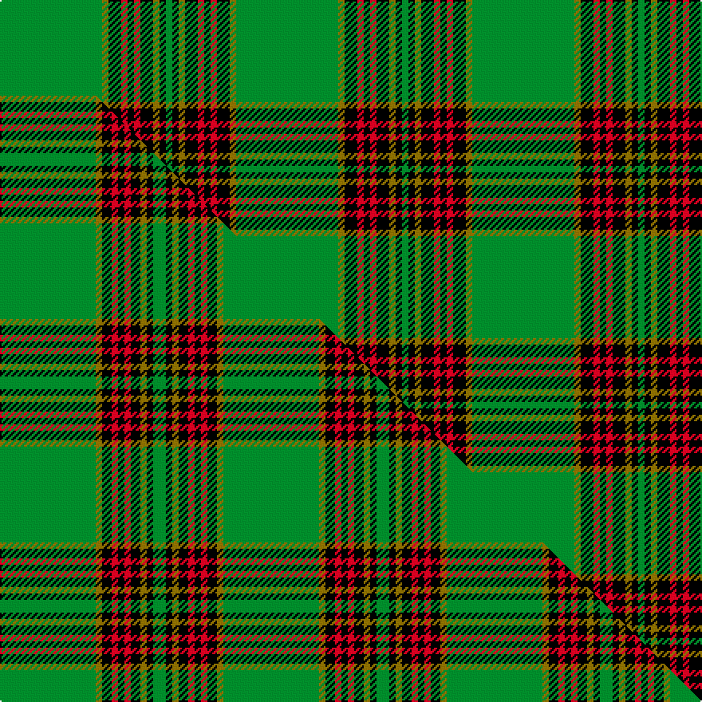

This page is one **sett** — a single exact thread-count. It belongs to the [tartan](/setts/g16y1k2r1k1r1k2y1k1g1/)
(the same proportion at any scale), whose colour order is pattern [GGKRKRKGKG](/stripes/ggkrkrkgkg/).

Part of the [Forde](/tartans/forde/) tartan — the named design grouping this sett with its other cloths.

Sourced from weddslist.  It is a [10 stripe tartan](/stripes/stripes10/).

Original link http://www.weddslist.com/cgi-bin/tartans/pg.pl?source=sts

## Thread count
G/64 Y4 K8 R4 K4 R4 K8 Y4 K4 G/4

One full sett is **148 threads**.

## Palette
<table><thead><tr><th>Colour</th><th>Shade</th><th>OKLCh</th></tr></thead><tbody><tr><td>G</td><td><code style="background-color:#008B2A;">#008B2A</code> <small style="color:#888">#008B2A</small></td><td><small style="color:#888">oklch(55.4% 0.170 145.9)</small></td></tr><tr><td>K</td><td><code style="background-color:#000000;">#000000</code> <small style="color:#888">#000000</small></td><td><small style="color:#888">oklch(0.0% 0.000 0.0)</small></td></tr><tr><td>Y</td><td><code style="background-color:#8B6E00;">#8B6E00</code> <small style="color:#888">#8B6E00</small></td><td><small style="color:#888">oklch(55.1% 0.113 90.4)</small></td></tr><tr><td>R</td><td><code style="background-color:#D60020;">#D60020</code> <small style="color:#888">#D60020</small></td><td><small style="color:#888">oklch(55.2% 0.224 25.5)</small></td></tr></tbody></table>

# Sample pattern

## Compared to the master

This cloth is one sett of its design; the master sett (the exemplar the design is anchored on) is below for comparison.

Its **ΔTartan distance** from the master is **0.24** — the same measure the nearest-tartans table ranks by (0 is identical; a re-scale of the same cloth is near 0, a recolour or a different proportion further).

<figure class="master-compare" style="margin:0">

this sett
master sett ★

<figcaption style="color:#888;font-size:smaller">One weave of this sett against the <a href="/setts/g30y2k3r2k2r2k3y2k2g4/">master sett ★</a>, split on the diagonal: a shared proportion runs seamlessly across it with only the shades shifting; a different proportion breaks on it.</figcaption>
</figure>

## Nearest tartan variants

The nearest existing variants by ΔTartan distance, with this cloth at the top so the swatches line up against it.

ΔTartan

Threads

Variant

Sett

—

148

<a href="/variants/s10/g16y1k2r1k1r1k2y1k1g1~x4/">Forde</a>

<a href="/ttd/edit/#slug=g16dy1k2r1k1r1k2dy1k1g1~x4&amp;base=g16y1k2r1k1r1k2y1k1g1~x4" title="compare in the TTD">0.04</a>

148

<a href="/variants/s10/g16dy1k2r1k1r1k2dy1k1g1~x4/">Forde Irish Family Tartan</a>

<a href="/ttd/edit/#slug=g30y2k3r2k2r2k3y2k2g4~x2&amp;base=g16y1k2r1k1r1k2y1k1g1~x4" title="compare in the TTD">0.24</a>

140

<a href="/variants/s10/g30y2k3r2k2r2k3y2k2g4~x2/">Forde</a>

<a href="/ttd/edit/#slug=g30dy2k3r2k2r2k3dy2k2g4~x2&amp;base=g16y1k2r1k1r1k2y1k1g1~x4" title="compare in the TTD">0.27</a>

140

<a href="/variants/s10/g30dy2k3r2k2r2k3dy2k2g4~x2/">Forde (Name)</a>

<a href="/ttd/edit/#slug=k3g32k2g4y4g2y4g4k6w3~x2&amp;base=g16y1k2r1k1r1k2y1k1g1~x4" title="compare in the TTD">1.97</a>

244

<a href="/variants/s10/k3g32k2g4y4g2y4g4k6w3~x2/">University of Alberta (Corporate)</a>

<a href="/ttd/edit/#slug=g44k2g2k2g3k12db10r3~x2&amp;base=g16y1k2r1k1r1k2y1k1g1~x4" title="compare in the TTD">2.30</a>

218

<a href="/variants/s8/g44k2g2k2g3k12db10r3~x2/">Celtic (New) Corporate Sport Tartan</a>

<a href="/ttd/edit/#slug=dg48lo3k6w4dg3k15lo3dg4~x2~dg1605139&amp;base=g16y1k2r1k1r1k2y1k1g1~x4" title="compare in the TTD">2.46</a>

240

<a href="/variants/s8/dg48lo3k6w4dg3k15lo3dg4~x2~dg1605139/">Birmingham Irish Pipes &amp; Drums</a>

<a href="/ttd/edit/#slug=g16k8g1k1lb1g1lb1lo1g1k1n1g4k1~x4&amp;base=g16y1k2r1k1r1k2y1k1g1~x4" title="compare in the TTD">2.57</a>

236

<a href="/variants/s13/g16k8g1k1lb1g1lb1lo1g1k1n1g4k1~x4/">Savoy</a>

<a href="/ttd/edit/#slug=g60w3k12n5g9n6k4w10&amp;base=g16y1k2r1k1r1k2y1k1g1~x4" title="compare in the TTD">2.68</a>

148

<a href="/variants/s8/g60w3k12n5g9n6k4w10/">New York Jets</a>

<a href="/ttd/edit/#slug=dg42k10r2k2w2k2dg10w6k2w3dg2~x2&amp;base=g16y1k2r1k1r1k2y1k1g1~x4" title="compare in the TTD">2.79</a>

244

<a href="/variants/s11/dg42k10r2k2w2k2dg10w6k2w3dg2~x2/">Laggen Dress</a>

<a href="/ttd/edit/#slug=lb3k1g12k1g1k2g1k6g12k1lo1~x4&amp;base=g16y1k2r1k1r1k2y1k1g1~x4" title="compare in the TTD">2.82</a>

312

<a href="/variants/s11/lb3k1g12k1g1k2g1k6g12k1lo1~x4/">MacCandlish Hunting Green</a>

## Neighbour map

Every grey dot is one of 13620 variants placed by the first two principal components of the ΔTartan feature space (42% of its variance). Red is this tartan; blue dots are its nearest — click one to open its page.

<svg viewBox="0 0 640 380" role="img" style="max-width:100%;height:auto;border:1px solid #e0e0e0;border-radius:4px;display:block" xmlns="http://www.w3.org/2000/svg"><image href="/nn/cloud.v1.png" width="640" height="380"/><a href="/variants/s10/g16dy1k2r1k1r1k2dy1k1g1~x4/"><circle cx="327.1" cy="106.6" r="4" fill="#3465a4"><title>Forde Irish Family Tartan</title></circle></a><a href="/variants/s10/g30y2k3r2k2r2k3y2k2g4~x2/"><circle cx="341.9" cy="113.0" r="4" fill="#3465a4"><title>Forde</title></circle></a><a href="/variants/s10/g30dy2k3r2k2r2k3dy2k2g4~x2/"><circle cx="340.7" cy="112.2" r="4" fill="#3465a4"><title>Forde (Name)</title></circle></a><a href="/variants/s10/k3g32k2g4y4g2y4g4k6w3~x2/"><circle cx="336.6" cy="126.4" r="4" fill="#3465a4"><title>University of Alberta (Corporate)</title></circle></a><a href="/variants/s8/g44k2g2k2g3k12db10r3~x2/"><circle cx="334.3" cy="119.3" r="4" fill="#3465a4"><title>Celtic (New) Corporate Sport Tartan</title></circle></a><a href="/variants/s8/dg48lo3k6w4dg3k15lo3dg4~x2~dg1605139/"><circle cx="337.0" cy="129.4" r="4" fill="#3465a4"><title>Birmingham Irish Pipes &amp; Drums</title></circle></a><a href="/variants/s13/g16k8g1k1lb1g1lb1lo1g1k1n1g4k1~x4/"><circle cx="281.9" cy="92.4" r="4" fill="#3465a4"><title>Savoy</title></circle></a><a href="/variants/s8/g60w3k12n5g9n6k4w10/"><circle cx="325.8" cy="130.0" r="4" fill="#3465a4"><title>New York Jets</title></circle></a><a href="/variants/s11/dg42k10r2k2w2k2dg10w6k2w3dg2~x2/"><circle cx="335.9" cy="92.7" r="4" fill="#3465a4"><title>Laggen Dress</title></circle></a><a href="/variants/s11/lb3k1g12k1g1k2g1k6g12k1lo1~x4/"><circle cx="295.6" cy="141.6" r="4" fill="#3465a4"><title>MacCandlish Hunting Green</title></circle></a><circle cx="327.5" cy="107.1" r="5" fill="#c00000"/><text x="320" y="376" text-anchor="middle" font-size="11" fill="#999">ground</text><text x="11" y="190" text-anchor="middle" font-size="11" fill="#999" transform="rotate(-90 11 190)">complexity</text></svg>

ID: /variants/s10/g16y1k2r1k1r1k2y1k1g1~x4/
