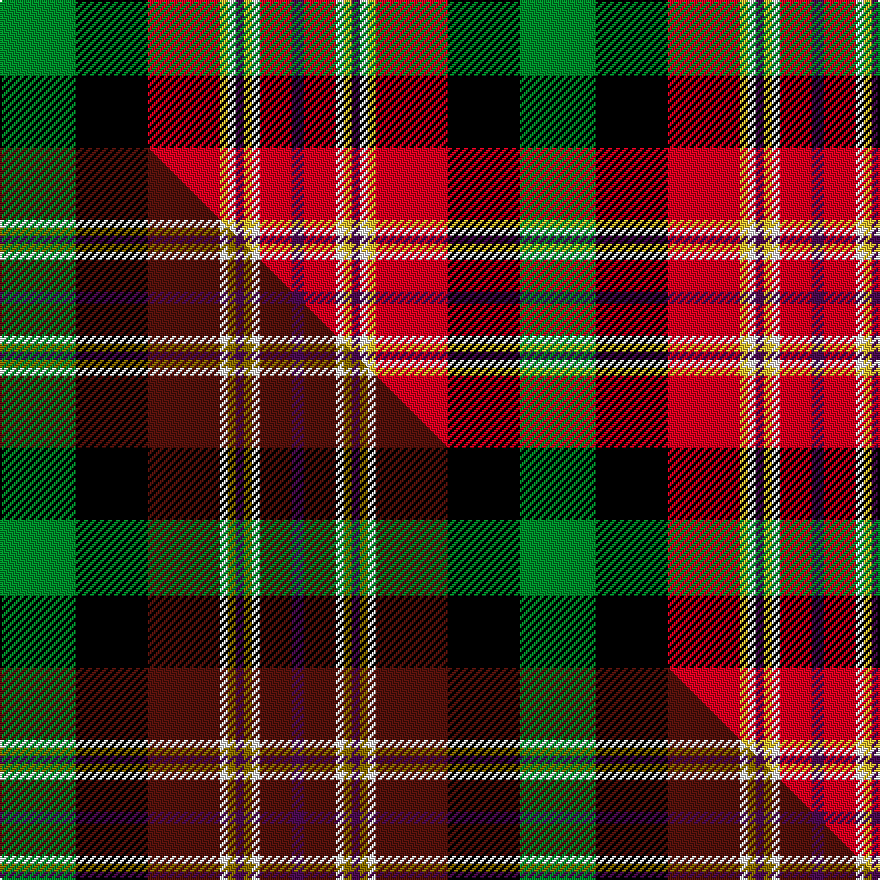

This is one **variant** — a specific cloth: this exact thread count and colourway, with its own
provenance below. It is one weaving of the [sett](/setts/g19k18r18ly2w2dp2ly2w2r8dp3/) (the scale-free proportion — the
same cloth at any scale or shade), whose colour order is pattern [BRWYBWYRKG](/stripes/brwybwyrkg/).

Part of the [McMuldroch](/tartans/mcmuldroch/) tartan — the named design grouping this sett with its other cloths.

Sourced from tartans-authority.  It is a [10 stripe tartan](/stripes/stripes10/).

Original link [https://www.tartanregister.gov.uk/tartanDetails.aspx?ref=11079](https://www.tartanregister.gov.uk/tartanDetails.aspx?ref=11079)

Dataset <small>— provenance for this record, inherited from the source manifest</small>

<dl class="dataset-prov">
<dt>source</dt><dd><a href="/sources/tartans-authority/">Scottish Tartans Authority</a></dd>
<dt>data captured from</dt><dd><a href="https://github.com/thetartan/tartan-database/blob/master/data/tartans-authority/data.csv">https://github.com/thetartan/tartan-database/blob/master/data/tartans-authority/data.csv</a></dd>
<dt>data date</dt><dd>2014 <small>(this record)</small></dd>
<dt>licence</dt><dd><a href="https://creativecommons.org/licenses/by-nc-nd/4.0/">CC BY-NC-ND 4.0</a></dd>
</dl>

Capture chain <small>— the hands this data passed through, oldest first; each capture carries its own licence</small>

<ol class="capture-chain">
<li><a href="https://www.tartansauthority.com/">Scottish Tartans Authority</a> <small>the heritage body's archive — its tartan-ferret record browser is retired (links repaired to the SRT, above)</small></li>
<li><a href="https://github.com/thetartan/tartan-database">thetartan/tartan-database</a> <small>2016-2017</small> · <a href="https://creativecommons.org/licenses/by-nc-nd/4.0/">CC BY-NC-ND 4.0</a> <small>Levko Kravets's frozen compilation — the capture we vendored, and where its CC licence text came from</small></li>
<li>this dictionary <small>captured 2026-06-10 · commit 5bf86c7566</small> <small>each re-capture is a git commit to data/sources</small></li>
</ol>

## Register references

External register numbers recorded for this tartan.

- Scottish Register of Tartans: [11079](https://www.tartanregister.gov.uk/tartanDetails?ref=11079)
- Scottish Tartans Authority (ITI): 11079

## Thread count
G/38 K36 R36 LY4 W4 DP4 LY4 W4 R16 DP/6

One full sett is **260 threads**.

## Palette
<table><thead><tr><th>Colour</th><th>Shade</th><th>OKLCh</th></tr></thead><tbody><tr><td>R</td><td><code style="background-color:#D60020;">#D60020</code> <small style="color:#888">#D60020</small></td><td><small style="color:#888">oklch(55.2% 0.224 25.5)</small></td></tr><tr><td>G</td><td><code style="background-color:#008B2A;">#008B2A</code> <small style="color:#888">#008B2A</small></td><td><small style="color:#888">oklch(55.4% 0.170 145.9)</small></td></tr><tr><td>K</td><td><code style="background-color:#000000;">#000000</code> <small style="color:#888">#000000</small></td><td><small style="color:#888">oklch(0.0% 0.000 0.0)</small></td></tr><tr><td>DP</td><td><code style="background-color:#4B0B4F;">#4B0B4F</code> <small style="color:#888">#4B0B4F</small></td><td><small style="color:#888">oklch(30.1% 0.125 325.4)</small></td></tr><tr><td>W</td><td><code style="background-color:#F7F7F7;">#F7F7F7</code> <small style="color:#888">#F7F7F7</small></td><td><small style="color:#888">oklch(97.6% 0.000 89.9)</small></td></tr><tr><td>LY</td><td><code style="background-color:#DCBC32;">#DCBC32</code> <small style="color:#888">#DCBC32</small></td><td><small style="color:#888">oklch(80.0% 0.150 95.2)</small></td></tr></tbody></table>

# Sample pattern

## Compared to the master

This cloth is one sett of its design; the master sett (the exemplar the design is anchored on) is below for comparison.

Its **ΔTartan distance** from the master is **0.67** — the same measure the nearest-tartans table ranks by (0 is identical; a re-scale of the same cloth is near 0, a recolour or a different proportion further).

<figure class="master-compare" style="margin:0">

this sett
master sett ★

<figcaption style="color:#888;font-size:smaller">One weave of this sett against the <a href="/setts/g19k18dr18w2y2dp2y2w2dr8dp3/">master sett ★</a>, split on the diagonal: a shared proportion runs seamlessly across it with only the shades shifting; a different proportion breaks on it.</figcaption>
</figure>

## Nearest tartan variants

The nearest existing variants by ΔTartan distance, with this cloth at the top so the swatches line up against it.

ΔTartan

Threads

Variant

Sett

—

260

<a href="/variants/s10/g19k18r18ly2w2dp2ly2w2r8dp3~x2/">McMuldroch (2014)</a>

<a href="/ttd/edit/#slug=g19k18dr18w2y2dp2y2w2dr8dp3~x2&amp;base=g19k18r18ly2w2dp2ly2w2r8dp3~x2" title="compare in the TTD">0.67</a>

260

<a href="/variants/s10/g19k18dr18w2y2dp2y2w2dr8dp3~x2/">McMuldroch (2014)</a>

<a href="/ttd/edit/#slug=r20lb14k17y2k3w3k3g24r14k4r4w2~x2&amp;base=g19k18r18ly2w2dp2ly2w2r8dp3~x2" title="compare in the TTD">1.47</a>

396

<a href="/variants/s12/r20lb14k17y2k3w3k3g24r14k4r4w2~x2/">Stuart/Stewart #2</a>

<a href="/ttd/edit/#slug=db4w1k3y1g1w1k1g8r12w1r2k1~x2&amp;base=g19k18r18ly2w2dp2ly2w2r8dp3~x2" title="compare in the TTD">1.90</a>

134

<a href="/variants/s12/db4w1k3y1g1w1k1g8r12w1r2k1~x2/">MacLean</a>

<a href="/ttd/edit/#slug=g8k1ly1r1w1db8k1r4k1r4k1r4k1~x2~db1406275&amp;base=g19k18r18ly2w2dp2ly2w2r8dp3~x2" title="compare in the TTD">2.05</a>

126

<a href="/variants/s13/g8k1ly1r1w1db8k1r4k1r4k1r4k1~x2~db1406275/">Norwich No.158</a>

<a href="/ttd/edit/#slug=r14lb4k6y1k2w2k2g12r6k2r2w1~x2&amp;base=g19k18r18ly2w2dp2ly2w2r8dp3~x2" title="compare in the TTD">2.05</a>

186

<a href="/variants/s12/r14lb4k6y1k2w2k2g12r6k2r2w1~x2/">Stewart Prince Charles Edward Clan Tartan</a>

<a href="/ttd/edit/#slug=db8k8y2k3w3k3g24r16db3r4k2~x2&amp;base=g19k18r18ly2w2dp2ly2w2r8dp3~x2" title="compare in the TTD">2.07</a>

284

<a href="/variants/s11/db8k8y2k3w3k3g24r16db3r4k2~x2/">MacLean</a>

<a href="/ttd/edit/#slug=lb1dg8k1lb2k1y2k1lb2k1r8w1lb1~x4&amp;base=g19k18r18ly2w2dp2ly2w2r8dp3~x2" title="compare in the TTD">2.09</a>

224

<a href="/variants/s12/lb1dg8k1lb2k1y2k1lb2k1r8w1lb1~x4/">MacWhirter</a>

<a href="/ttd/edit/#slug=db8k1r4k1r4k1r4k1g8k1y1r1w1~x2&amp;base=g19k18r18ly2w2dp2ly2w2r8dp3~x2" title="compare in the TTD">2.14</a>

126

<a href="/variants/s13/db8k1r4k1r4k1r4k1g8k1y1r1w1~x2/">Unidentified No 158 Silk Fragment</a>

<a href="/ttd/edit/#slug=r25lb9k2lb9k19y3k3w5k3y3g22r16g3r3g3~x2&amp;base=g19k18r18ly2w2dp2ly2w2r8dp3~x2" title="compare in the TTD">2.17</a>

456

<a href="/variants/s15/r25lb9k2lb9k19y3k3w5k3y3g22r16g3r3g3~x2/">Wilson's No 181, (Stewart)</a>

<a href="/ttd/edit/#slug=y1g6k1db1k1db1k6r12g1r1k1w1~x4&amp;base=g19k18r18ly2w2dp2ly2w2r8dp3~x2" title="compare in the TTD">2.30</a>

256

<a href="/variants/s12/y1g6k1db1k1db1k6r12g1r1k1w1~x4/">Boyd Clan Tartan</a>

## Neighbour map

Every grey dot is one of 13621 variants placed by the first two principal components of the ΔTartan feature space (42% of its variance). Red is this tartan; blue dots are its nearest — click one to open its page.

<svg viewBox="0 0 640 380" role="img" style="max-width:100%;height:auto;border:1px solid #e0e0e0;border-radius:4px;display:block" xmlns="http://www.w3.org/2000/svg"><image href="/nn/cloud.v1.png" width="640" height="380"/><a href="/variants/s10/g19k18dr18w2y2dp2y2w2dr8dp3~x2/"><circle cx="99.6" cy="141.0" r="4" fill="#3465a4"><title>McMuldroch (2014)</title></circle></a><a href="/variants/s12/r20lb14k17y2k3w3k3g24r14k4r4w2~x2/"><circle cx="79.4" cy="123.7" r="4" fill="#3465a4"><title>Stuart/Stewart #2</title></circle></a><a href="/variants/s12/db4w1k3y1g1w1k1g8r12w1r2k1~x2/"><circle cx="120.5" cy="105.3" r="4" fill="#3465a4"><title>MacLean</title></circle></a><a href="/variants/s13/g8k1ly1r1w1db8k1r4k1r4k1r4k1~x2~db1406275/"><circle cx="89.7" cy="132.1" r="4" fill="#3465a4"><title>Norwich No.158</title></circle></a><a href="/variants/s12/r14lb4k6y1k2w2k2g12r6k2r2w1~x2/"><circle cx="120.4" cy="109.5" r="4" fill="#3465a4"><title>Stewart Prince Charles Edward Clan Tartan</title></circle></a><a href="/variants/s11/db8k8y2k3w3k3g24r16db3r4k2~x2/"><circle cx="82.4" cy="122.8" r="4" fill="#3465a4"><title>MacLean</title></circle></a><a href="/variants/s12/lb1dg8k1lb2k1y2k1lb2k1r8w1lb1~x4/"><circle cx="60.1" cy="128.8" r="4" fill="#3465a4"><title>MacWhirter</title></circle></a><a href="/variants/s13/db8k1r4k1r4k1r4k1g8k1y1r1w1~x2/"><circle cx="88.9" cy="132.3" r="4" fill="#3465a4"><title>Unidentified No 158 Silk Fragment</title></circle></a><a href="/variants/s15/r25lb9k2lb9k19y3k3w5k3y3g22r16g3r3g3~x2/"><circle cx="80.3" cy="111.7" r="4" fill="#3465a4"><title>Wilson's No 181, (Stewart)</title></circle></a><a href="/variants/s12/y1g6k1db1k1db1k6r12g1r1k1w1~x4/"><circle cx="131.8" cy="95.7" r="4" fill="#3465a4"><title>Boyd Clan Tartan</title></circle></a><circle cx="86.0" cy="131.8" r="5" fill="#c00000"/><text x="320" y="376" text-anchor="middle" font-size="11" fill="#999">ground</text><text x="11" y="190" text-anchor="middle" font-size="11" fill="#999" transform="rotate(-90 11 190)">complexity</text></svg>

ID: /variants/s10/g19k18r18ly2w2dp2ly2w2r8dp3~x2/
