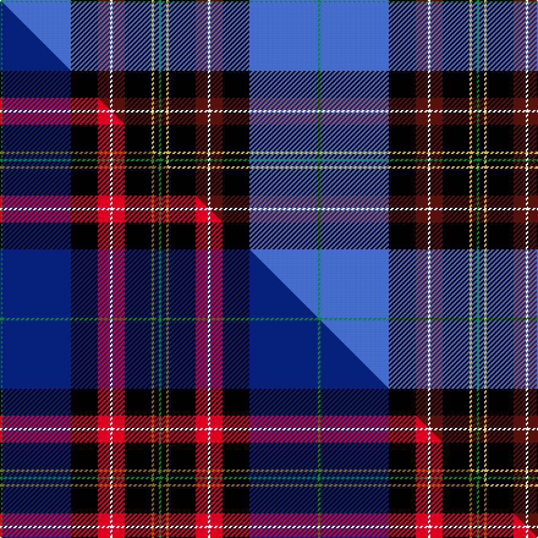

This is one **variant** — a specific cloth: this exact thread count and colourway, with its own
provenance below. It is one weaving of the [sett](/setts/g1b28k11dr5w1dr5k11ly1k2g1/) (the scale-free proportion — the
same cloth at any scale or shade), whose colour order is pattern [GBKBWBKYKG](/stripes/gbkbwbkykg/).

Part of the [Scragg Moran](/tartans/scragg-moran/) tartan — the named design grouping this sett with its other cloths.

Sourced from tartans-authority.  It is a [10 stripe tartan](/stripes/stripes10/).

Original link [https://www.tartanregister.gov.uk/tartanDetails.aspx?ref=10381](https://www.tartanregister.gov.uk/tartanDetails.aspx?ref=10381)

Dataset <small>— provenance for this record, inherited from the source manifest</small>

<dl class="dataset-prov">
<dt>source</dt><dd><a href="/sources/tartans-authority/">Scottish Tartans Authority</a></dd>
<dt>data captured from</dt><dd><a href="https://github.com/thetartan/tartan-database/blob/master/data/tartans-authority/data.csv">https://github.com/thetartan/tartan-database/blob/master/data/tartans-authority/data.csv</a></dd>
<dt>data date</dt><dd>9th March 2011 <small>(this record)</small></dd>
<dt>licence</dt><dd><a href="https://creativecommons.org/licenses/by-nc-nd/4.0/">CC BY-NC-ND 4.0</a></dd>
</dl>

Capture chain <small>— the hands this data passed through, oldest first; each capture carries its own licence</small>

<ol class="capture-chain">
<li><a href="https://www.tartansauthority.com/">Scottish Tartans Authority</a> <small>the heritage body's archive — its tartan-ferret record browser is retired (links repaired to the SRT, above)</small></li>
<li><a href="https://github.com/thetartan/tartan-database">thetartan/tartan-database</a> <small>2016-2017</small> · <a href="https://creativecommons.org/licenses/by-nc-nd/4.0/">CC BY-NC-ND 4.0</a> <small>Levko Kravets's frozen compilation — the capture we vendored, and where its CC licence text came from</small></li>
<li>this dictionary <small>captured 2026-06-10 · commit 5bf86c7566</small> <small>each re-capture is a git commit to data/sources</small></li>
</ol>

## Register references

External register numbers recorded for this tartan.

- Scottish Register of Tartans: [10381](https://www.tartanregister.gov.uk/tartanDetails?ref=10381)
- Scottish Tartans Authority (ITI): 10381

## Thread count
G/2 B56 K22 DR10 W2 DR10 K22 LY2 K4 G/2

One full sett is **260 threads**.

## Palette
<table><thead><tr><th>Colour</th><th>Shade</th><th>OKLCh</th></tr></thead><tbody><tr><td>B</td><td><code style="background-color:#466CC8;">#466CC8</code> <small style="color:#888">#466CC8</small></td><td><small style="color:#888">oklch(55.1% 0.149 265.0)</small></td></tr><tr><td>DR</td><td><code style="background-color:#55120C;">#55120C</code> <small style="color:#888">#55120C</small></td><td><small style="color:#888">oklch(30.0% 0.099 29.3)</small></td></tr><tr><td>G</td><td><code style="background-color:#008B2A;">#008B2A</code> <small style="color:#888">#008B2A</small></td><td><small style="color:#888">oklch(55.4% 0.170 145.9)</small></td></tr><tr><td>K</td><td><code style="background-color:#000000;">#000000</code> <small style="color:#888">#000000</small></td><td><small style="color:#888">oklch(0.0% 0.000 0.0)</small></td></tr><tr><td>LY</td><td><code style="background-color:#DCBC32;">#DCBC32</code> <small style="color:#888">#DCBC32</small></td><td><small style="color:#888">oklch(80.0% 0.150 95.2)</small></td></tr><tr><td>W</td><td><code style="background-color:#F7F7F7;">#F7F7F7</code> <small style="color:#888">#F7F7F7</small></td><td><small style="color:#888">oklch(97.6% 0.000 89.9)</small></td></tr></tbody></table>

# Sample pattern

## Compared to the master

This cloth is one sett of its design; the master sett (the exemplar the design is anchored on) is below for comparison.

Its **ΔTartan distance** from the master is **0.20** — the same measure the nearest-tartans table ranks by (0 is identical; a re-scale of the same cloth is near 0, a recolour or a different proportion further).

<figure class="master-compare" style="margin:0">

this sett
master sett ★

<figcaption style="color:#888;font-size:smaller">One weave of this sett against the <a href="/setts/g1db28k11r5w1r5k11y1k2g1/">master sett ★</a>, split on the diagonal: a shared proportion runs seamlessly across it with only the shades shifting; a different proportion breaks on it.</figcaption>
</figure>

## Nearest tartan variants

The nearest existing variants by ΔTartan distance, with this cloth at the top so the swatches line up against it.

ΔTartan

Threads

Variant

Sett

—

260

<a href="/variants/s10/g1b28k11dr5w1dr5k11ly1k2g1~x2/">Scragg, Moran (Personal)</a>

<a href="/ttd/edit/#slug=g1db28k11r5w1r5k11y1k2g1~x2&amp;base=g1b28k11dr5w1dr5k11ly1k2g1~x2" title="compare in the TTD">0.20</a>

260

<a href="/variants/s10/g1db28k11r5w1r5k11y1k2g1~x2/">Scragg Moran (Personal)</a>

<a href="/ttd/edit/#slug=dp3g3w1k25db25k2db2g1r3w2~x2&amp;base=g1b28k11dr5w1dr5k11ly1k2g1~x2" title="compare in the TTD">1.71</a>

258

<a href="/variants/s10/dp3g3w1k25db25k2db2g1r3w2~x2/">Heart of Oak</a>

<a href="/ttd/edit/#slug=w6n8dt4n2dt31k16dr1k2dr4r3~x2~n2002277-dt1203265&amp;base=g1b28k11dr5w1dr5k11ly1k2g1~x2" title="compare in the TTD">1.73</a>

290

<a href="/variants/s10/w6n8dt4n2dt31k16dr1k2dr4r3~x2~n2002277-dt1203265/">Bell Rock Lighthouse 200th Anniversary, The</a>

<a href="/ttd/edit/#slug=b16y3b8db12b1db6k32r1w2~x2&amp;base=g1b28k11dr5w1dr5k11ly1k2g1~x2" title="compare in the TTD">1.83</a>

288

<a href="/variants/s9/b16y3b8db12b1db6k32r1w2~x2/">Wrens</a>

<a href="/ttd/edit/#slug=k3db28w2y2db1g4k8w3r4y10k2~x2&amp;base=g1b28k11dr5w1dr5k11ly1k2g1~x2" title="compare in the TTD">1.95</a>

258

<a href="/variants/s11/k3db28w2y2db1g4k8w3r4y10k2~x2/">Colours of Hope</a>

<a href="/ttd/edit/#slug=w5lb7db4lb2db25k13r1k2r4ri3~x2~r1807033-ri2109032&amp;base=g1b28k11dr5w1dr5k11ly1k2g1~x2" title="compare in the TTD">2.00</a>

248

<a href="/variants/s10/w5lb7db4lb2db25k13r1k2r4ri3~x2~r1807033-ri2109032/">Bell Rock Lighthouse 200th Aniversar</a>

<a href="/ttd/edit/#slug=db4w1k2db25k12t1k2r16k2lo1~x2&amp;base=g1b28k11dr5w1dr5k11ly1k2g1~x2" title="compare in the TTD">2.02</a>

254

<a href="/variants/s10/db4w1k2db25k12t1k2r16k2lo1~x2/">Sidey Dress Tartan (Name)</a>

<a href="/ttd/edit/#slug=db4w1k2db25k12b1k2g16k2r1~x2&amp;base=g1b28k11dr5w1dr5k11ly1k2g1~x2" title="compare in the TTD">2.05</a>

254

<a href="/variants/s10/db4w1k2db25k12b1k2g16k2r1~x2/">Sidey Family (Dundee) (Personal)</a>

<a href="/ttd/edit/#slug=db4w1k2db25k12b1k2r16k2lo1~x2&amp;base=g1b28k11dr5w1dr5k11ly1k2g1~x2" title="compare in the TTD">2.05</a>

254

<a href="/variants/s10/db4w1k2db25k12b1k2r16k2lo1~x2/">Sidey (Dundee) Dress (Personal)</a>

<a href="/ttd/edit/#slug=db4w1k2db25k12t1k2g16k2r1~x2&amp;base=g1b28k11dr5w1dr5k11ly1k2g1~x2" title="compare in the TTD">2.09</a>

254

<a href="/variants/s10/db4w1k2db25k12t1k2g16k2r1~x2/">Sidey Family Tartan (Name)</a>

## Neighbour map

Every grey dot is one of 13621 variants placed by the first two principal components of the ΔTartan feature space (42% of its variance). Red is this tartan; blue dots are its nearest — click one to open its page.

<svg viewBox="0 0 640 380" role="img" style="max-width:100%;height:auto;border:1px solid #e0e0e0;border-radius:4px;display:block" xmlns="http://www.w3.org/2000/svg"><image href="/nn/cloud.v1.png" width="640" height="380"/><a href="/variants/s10/g1db28k11r5w1r5k11y1k2g1~x2/"><circle cx="206.4" cy="78.6" r="4" fill="#3465a4"><title>Scragg Moran (Personal)</title></circle></a><a href="/variants/s10/dp3g3w1k25db25k2db2g1r3w2~x2/"><circle cx="202.4" cy="79.0" r="4" fill="#3465a4"><title>Heart of Oak</title></circle></a><a href="/variants/s10/w6n8dt4n2dt31k16dr1k2dr4r3~x2~n2002277-dt1203265/"><circle cx="203.5" cy="83.9" r="4" fill="#3465a4"><title>Bell Rock Lighthouse 200th Anniversary, The</title></circle></a><a href="/variants/s9/b16y3b8db12b1db6k32r1w2~x2/"><circle cx="175.1" cy="89.9" r="4" fill="#3465a4"><title>Wrens</title></circle></a><a href="/variants/s11/k3db28w2y2db1g4k8w3r4y10k2~x2/"><circle cx="165.8" cy="71.6" r="4" fill="#3465a4"><title>Colours of Hope</title></circle></a><a href="/variants/s10/w5lb7db4lb2db25k13r1k2r4ri3~x2~r1807033-ri2109032/"><circle cx="157.0" cy="87.3" r="4" fill="#3465a4"><title>Bell Rock Lighthouse 200th Aniversar</title></circle></a><a href="/variants/s10/db4w1k2db25k12t1k2r16k2lo1~x2/"><circle cx="198.1" cy="79.4" r="4" fill="#3465a4"><title>Sidey Dress Tartan (Name)</title></circle></a><a href="/variants/s10/db4w1k2db25k12b1k2g16k2r1~x2/"><circle cx="198.1" cy="89.7" r="4" fill="#3465a4"><title>Sidey Family (Dundee) (Personal)</title></circle></a><a href="/variants/s10/db4w1k2db25k12b1k2r16k2lo1~x2/"><circle cx="198.4" cy="79.4" r="4" fill="#3465a4"><title>Sidey (Dundee) Dress (Personal)</title></circle></a><a href="/variants/s10/db4w1k2db25k12t1k2g16k2r1~x2/"><circle cx="198.0" cy="89.8" r="4" fill="#3465a4"><title>Sidey Family Tartan (Name)</title></circle></a><circle cx="195.8" cy="78.8" r="5" fill="#c00000"/><text x="320" y="376" text-anchor="middle" font-size="11" fill="#999">ground</text><text x="11" y="190" text-anchor="middle" font-size="11" fill="#999" transform="rotate(-90 11 190)">complexity</text></svg>

ID: /variants/s10/g1b28k11dr5w1dr5k11ly1k2g1~x2/
