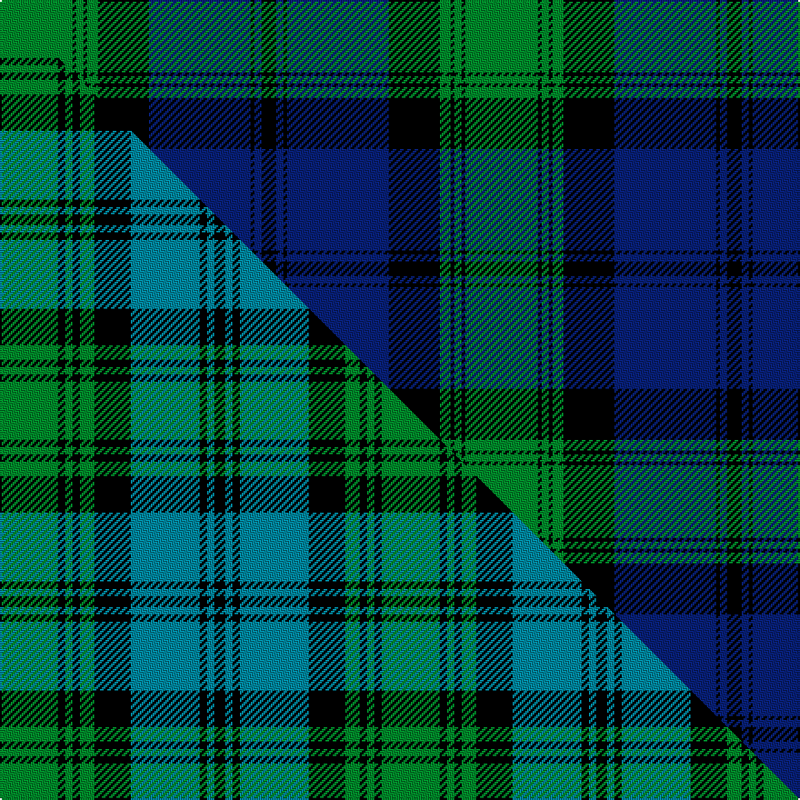

This is one **variant** — a specific cloth: this exact thread count and colourway, with its own
provenance below. It is one weaving of the [sett](/setts/g20k1g2k1g3k14db28k1db2k4/) (the scale-free proportion — the
same cloth at any scale or shade), whose colour order is pattern [GKGKGKBKBK](/stripes/gkgkgkbkbk/).

Part of the [Kerr Hunting](/tartans/k/ke/kerr-hunting/) tartan — the named design grouping this sett with its other cloths.

Sourced from weddslist.  It is a [10 stripe tartan](/stripes/stripes10/).

Original link [http://www.weddslist.com/cgi-bin/tartans/pg.pl?source=rb](http://www.weddslist.com/cgi-bin/tartans/pg.pl?source=rb)

3 attestations — the source records this cloth was collapsed from (oldest owns this page)

<ul>
<li>undated — Kerr Hunting (weddslist, <a href="http://www.weddslist.com/cgi-bin/tartans/pg.pl?source=rb">record</a>) </li>
<li>undated — Kerr Hunting (weddslist, <a href="http://www.weddslist.com/cgi-bin/tartans/pg.pl?source=tinsel">record</a>) </li>
<li>undated — Kerr Hunting (weddslist, <a href="http://www.weddslist.com/cgi-bin/tartans/pg.pl?source=x">record</a>) </li>
</ul>

Dataset <small>— provenance for this record, inherited from the source manifest</small>

<dl class="dataset-prov">
<dt>source</dt><dd><a href="/sources/weddslist/">Weddslist</a></dd>
<dt>data captured from</dt><dd><a href="https://github.com/thetartan/tartan-database/blob/master/data/weddslist/data.csv">https://github.com/thetartan/tartan-database/blob/master/data/weddslist/data.csv</a></dd>
<dt>data date</dt><dd>2016-11-17 <small>(dataset default)</small></dd>
<dt>licence</dt><dd><a href="https://creativecommons.org/licenses/by-nc-nd/4.0/">CC BY-NC-ND 4.0</a></dd>
</dl>

Capture chain <small>— the hands this data passed through, oldest first; each capture carries its own licence</small>

<ol class="capture-chain">
<li><a href="https://www.weddslist.com/tartans/">Weddslist</a> <small>the living privately compiled reference</small></li>
<li><a href="https://github.com/thetartan/tartan-database">thetartan/tartan-database</a> <small>2016-2017</small> · <a href="https://creativecommons.org/licenses/by-nc-nd/4.0/">CC BY-NC-ND 4.0</a> <small>Levko Kravets's frozen compilation — the capture we vendored, and where its CC licence text came from</small></li>
<li>this dictionary <small>captured 2026-06-10 · commit 5bf86c7566</small> <small>each re-capture is a git commit to data/sources</small></li>
</ol>

## Thread count
G/40 K2 G4 K2 G6 K28 DB56 K2 DB4 K/8

One full sett is **256 threads**.

## Palette
<table><thead><tr><th>Colour</th><th>Shade</th><th>OKLCh</th></tr></thead><tbody><tr><td>DB</td><td><code style="background-color:#082077;">#082077</code> <small style="color:#888">#082077</small></td><td><small style="color:#888">oklch(30.0% 0.149 265.1)</small></td></tr><tr><td>G</td><td><code style="background-color:#008B2A;">#008B2A</code> <small style="color:#888">#008B2A</small></td><td><small style="color:#888">oklch(55.4% 0.170 145.9)</small></td></tr><tr><td>K</td><td><code style="background-color:#000000;">#000000</code> <small style="color:#888">#000000</small></td><td><small style="color:#888">oklch(0.0% 0.000 0.0)</small></td></tr></tbody></table>

# Sample pattern

## Compared to the master

This cloth is one sett of its design; the master sett (the exemplar the design is anchored on) is below for comparison.

Its **ΔTartan distance** from the master is **0.71** — the same measure the nearest-tartans table ranks by (0 is identical; a re-scale of the same cloth is near 0, a recolour or a different proportion further).

<figure class="master-compare" style="margin:0">

this sett
master sett ★

<figcaption style="color:#888;font-size:smaller">One weave of this sett against the <a href="/setts/g16k2g2k2g4k10t19k2t2k3/">master sett ★</a>, split on the diagonal: a shared proportion runs seamlessly across it with only the shades shifting; a different proportion breaks on it.</figcaption>
</figure>

## Nearest tartan variants

The nearest existing variants by ΔTartan distance, with this cloth at the top so the swatches line up against it.

ΔTartan

Threads

Variant

Sett

—

256

<a href="/variants/s10/g20k1g2k1g3k14db28k1db2k4~x2/">Kerr Hunting</a>

<a href="/ttd/edit/#slug=g14k2g2k2g3k10db16k1db2k2~x2&amp;base=g20k1g2k1g3k14db28k1db2k4~x2" title="compare in the TTD">0.50</a>

184

<a href="/variants/s10/g14k2g2k2g3k10db16k1db2k2~x2/">Kerr Hunting Clan Tartan</a>

<a href="/ttd/edit/#slug=db10k1db3k1db20k25g40k3~x2&amp;base=g20k1g2k1g3k14db28k1db2k4~x2" title="compare in the TTD">2.02</a>

386

<a href="/variants/s8/db10k1db3k1db20k25g40k3~x2/">Black Watch RHR</a>

<a href="/ttd/edit/#slug=db2k3g5k9db21k2db5k2g20w1~x2&amp;base=g20k1g2k1g3k14db28k1db2k4~x2" title="compare in the TTD">2.37</a>

274

<a href="/variants/s10/db2k3g5k9db21k2db5k2g20w1~x2/">Pitceathly Chamberlain (Personal)</a>

<a href="/ttd/edit/#slug=db2k3g5k7db20k2db5k2g20w1~x2&amp;base=g20k1g2k1g3k14db28k1db2k4~x2" title="compare in the TTD">2.42</a>

262

<a href="/variants/s10/db2k3g5k7db20k2db5k2g20w1~x2/">Pitceathly Chamberlain Tartan</a>

<a href="/ttd/edit/#slug=g19k1g4k1g3k10db20y1k7y1db20k10y3g1~x2&amp;base=g20k1g2k1g3k14db28k1db2k4~x2" title="compare in the TTD">2.45</a>

364

<a href="/variants/s14/g19k1g4k1g3k10db20y1k7y1db20k10y3g1~x2/">Hope-Vere/Weir #2</a>

<a href="/ttd/edit/#slug=k4db2g24r1g2r1g2k20db24k1db2k4~x2&amp;base=g20k1g2k1g3k14db28k1db2k4~x2" title="compare in the TTD">2.50</a>

332

<a href="/variants/s12/k4db2g24r1g2r1g2k20db24k1db2k4~x2/">Jedforest</a>

<a href="/ttd/edit/#slug=g20k1g2k1g3k14dr28k1dr2k4~x2&amp;base=g20k1g2k1g3k14db28k1db2k4~x2" title="compare in the TTD">2.54</a>

256

<a href="/variants/s10/g20k1g2k1g3k14dr28k1dr2k4~x2/">Kerr (Clan)</a>

<a href="/ttd/edit/#slug=r3k2db25k28g25k2r1db2~x2&amp;base=g20k1g2k1g3k14db28k1db2k4~x2" title="compare in the TTD">2.57</a>

342

<a href="/variants/s8/r3k2db25k28g25k2r1db2~x2/">Common Kilt Tartan</a>

<a href="/ttd/edit/#slug=k3db3k3db22g26k2db1y3~x2&amp;base=g20k1g2k1g3k14db28k1db2k4~x2" title="compare in the TTD">2.60</a>

240

<a href="/variants/s8/k3db3k3db22g26k2db1y3~x2/">Johnstone Clan Tartan</a>

<a href="/ttd/edit/#slug=k2db3g16lb1k13lb1db18k2db2~x2&amp;base=g20k1g2k1g3k14db28k1db2k4~x2" title="compare in the TTD">2.63</a>

224

<a href="/variants/s9/k2db3g16lb1k13lb1db18k2db2~x2/">Hebridean Old.. District Tartan</a>

## Neighbour map

Every grey dot is one of 13621 variants placed by the first two principal components of the ΔTartan feature space (42% of its variance). Red is this tartan; blue dots are its nearest — click one to open its page. The map is a flat projection of a many-dimensional space — [how to read it](/posts/neighbourhood-maps/).

<svg viewBox="0 0 640 380" role="img" style="max-width:100%;height:auto;border:1px solid #e0e0e0;border-radius:4px;display:block" xmlns="http://www.w3.org/2000/svg"><image href="/nn/cloud.v1.png" width="640" height="380"/><a href="/variants/s10/g14k2g2k2g3k10db16k1db2k2~x2/"><circle cx="198.1" cy="163.4" r="4" fill="#3465a4"><title>Kerr Hunting Clan Tartan</title></circle></a><a href="/variants/s8/db10k1db3k1db20k25g40k3~x2/"><circle cx="244.7" cy="135.3" r="4" fill="#3465a4"><title>Black Watch RHR</title></circle></a><a href="/variants/s10/db2k3g5k9db21k2db5k2g20w1~x2/"><circle cx="207.8" cy="138.4" r="4" fill="#3465a4"><title>Pitceathly Chamberlain (Personal)</title></circle></a><a href="/variants/s10/db2k3g5k7db20k2db5k2g20w1~x2/"><circle cx="210.1" cy="139.8" r="4" fill="#3465a4"><title>Pitceathly Chamberlain Tartan</title></circle></a><a href="/variants/s14/g19k1g4k1g3k10db20y1k7y1db20k10y3g1~x2/"><circle cx="191.9" cy="128.4" r="4" fill="#3465a4"><title>Hope-Vere/Weir #2</title></circle></a><a href="/variants/s12/k4db2g24r1g2r1g2k20db24k1db2k4~x2/"><circle cx="185.7" cy="107.7" r="4" fill="#3465a4"><title>Jedforest</title></circle></a><a href="/variants/s10/g20k1g2k1g3k14dr28k1dr2k4~x2/"><circle cx="252.6" cy="126.6" r="4" fill="#3465a4"><title>Kerr (Clan)</title></circle></a><a href="/variants/s8/r3k2db25k28g25k2r1db2~x2/"><circle cx="199.7" cy="129.2" r="4" fill="#3465a4"><title>Common Kilt Tartan</title></circle></a><a href="/variants/s8/k3db3k3db22g26k2db1y3~x2/"><circle cx="252.4" cy="133.4" r="4" fill="#3465a4"><title>Johnstone Clan Tartan</title></circle></a><a href="/variants/s9/k2db3g16lb1k13lb1db18k2db2~x2/"><circle cx="202.1" cy="147.4" r="4" fill="#3465a4"><title>Hebridean Old.. District Tartan</title></circle></a><circle cx="244.9" cy="129.2" r="5" fill="#c00000"/><text x="320" y="376" text-anchor="middle" font-size="11" fill="#999">ground</text><text x="11" y="190" text-anchor="middle" font-size="11" fill="#999" transform="rotate(-90 11 190)">complexity</text></svg>

ID: /variants/s10/g20k1g2k1g3k14db28k1db2k4~x2/
